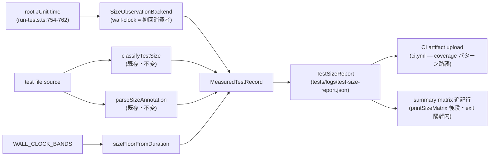

# Domain Entities — dynamic-size-observation(#699)

> 上流: `../../../inception/requirements-analysis/requirements.md`(FR-1〜FR-6)。units-generation / application-design は refactor scope でスキップのため、既存コード構造(codekb: architecture.md / code-structure.md)をデファクト応用設計として参照する。
> スタイル: functional-domain-modeling-ts(project.md DECIDED — class-free、type+コンパニオン、判別ユニオン)。ただし本ユニットは `tests/lib/` のテストインフラであり、ブランド型のセレモニーは正しさを変える箇所(なし)に限り導入しない(ddd-when-to-wrap-primitives)。

## 1. 既存エンティティ(不変 — #696 実装、変更禁止)

| 型 | 定義 | 本ユニットでの扱い |
|---|---|---|
| `TestSize` | `"small" \| "medium" \| "large"`(`tests/lib/test-size.ts:23`) | そのまま消費 |
| `SIZE_ORDER` | 順序 map(`test-size.ts:28`) | 帯比較に消費 |
| `SizeClassification` | `{ size, signals }`(`test-size.ts:42-45`) | **安定契約**(FR-2)。形状変更禁止 |
| `parseSizeAnnotation` の `SizeAnnotation` | `{ declared, invalidValue? }`(`test-size.ts:64-70`) | そのまま消費 |

## 2. 新規エンティティ(`tests/lib/test-size.ts` に追加 — 質問 Q2 の決定)

### 2.1 `WALL_CLOCK_BANDS`(帯定義 — canonical 1定義)

```ts
// Size ↔ wall-clock bands (#699 / election Q3: codex-3 measured rule).
// small < 1s; large >= 30s; medium in between. Single source of truth —
// consumed by both drift detection and the runner summary (FR-4).
export const WALL_CLOCK_BANDS = {
  smallMaxSeconds: 1,
  largeMinSeconds: 30,
} as const;
```

- 消費者: `sizeFloorFromDuration`(唯一の読者)。drift 検出(FR-2)と summary(FR-3)は floor 関数経由で同一定義を消費する。

### 2.2 `sizeFloorFromDuration`(純関数)

```ts
// The SMALLEST size a file with this wall-clock can be (dynamic axis of the
// derived size). Mirrors the static SIGNAL_PATTERNS floor semantics.
export function sizeFloorFromDuration(durationSeconds: number): TestSize;
```

- 判定: `>= 30s → "large"`、`>= 1s → "medium"`、それ未満 → `"small"`。
- 静的側の「シグナル → 最小 size」意味論(`test-size.ts:30-34` コメント)と同型の floor 意味論。in-process seam としてテスト可能(NFR-5)。

### 2.3 `MeasuredTestRecord`(per-file 実測レコード)

```ts
export interface MeasuredTestRecord {
  readonly file: string;            // repo-relative test file path
  readonly scope: string;           // runner tier: smoke|unit|integration|e2e
  readonly declaredSize: TestSize | null;  // `// size:` annotation (null = none)
  readonly staticSize: TestSize;    // classifyTestSize(source).size
  readonly staticSignals: readonly string[]; // classifyTestSize(source).signals
  readonly durationSeconds: number; // root JUnit `time` (run-tests.ts:754-762)
  readonly dynamicFloor: TestSize;  // sizeFloorFromDuration(durationSeconds)
  readonly drift: WallClockDrift;   // see 2.4
}
```

- ライフサイクル: runner の tier 集約中に生成(`.meta` 削除前 — 質問 Q3)、レポート書き出しと matrix 表示に消費され、プロセス終了で消える(永続化は JSON レポートのみ)。

### 2.4 `WallClockDrift`(判別ユニオン)

```ts
export type WallClockDrift =
  | { readonly kind: "none" }
  | {
      readonly kind: "wall-clock";
      readonly declared: TestSize;   // effective declaration (annotation ?? staticSize)
      readonly measured: TestSize;   // dynamicFloor
    };
```

- 生成規則は business-rules.md BR-2。無効状態(measured ≤ declared の "wall-clock" レコード)はスマートコンストラクタ `detectWallClockDrift` が構築させない(parse-dont-validate)。

### 2.5 `TestSizeReport`(集約ルート — JSON レポートの形)

```ts
export interface TestSizeReport {
  readonly schemaVersion: 1;
  readonly records: readonly MeasuredTestRecord[];
  readonly summary: {
    readonly totalFiles: number;
    readonly driftCount: number;    // records where drift.kind !== "none"
  };
}
```

- first-class collection: drift 集計・件数導出は `TestSizeReport` のコンパニオン(`buildTestSizeReport(records)`)に置き、呼び出し側(runner)で map/filter を散らかさない(tell-dont-ask)。
- 前方互換: 将来の strace/eBPF バックエンド(FR-6 後続)はレコードにオプショナル `dynamicSignals?: readonly string[]` を追加する。`schemaVersion` はその際に上げる。

### 2.6 `SizeObservationBackend`(seam — 質問 Q4 / FR-6)

```ts
// Observation backend seam (#699 / election Q4) — session lifecycle form
// (revised per PR #732 codex-3 review: the seam must own the observation
// window, not identity-wrap an already-measured value).
export interface SizeObservation {
  readonly durationSeconds: number;
}
export interface SizeObservationSession {
  begin(file: string): void; // runner calls right before spawning the file
  finish(file: string, junitDurationSeconds: number | null): SizeObservation | null;
}
export interface SizeObservationBackend {
  readonly name: string;            // e.g. "wall-clock"
  openSession(): SizeObservationSession;
}
// Failure-isolation helpers — the runner NEVER calls a session directly:
export function beginObservation(session, file, note): void;            // try/catch → note only
export function finishObservation(session, file, junitDurationSeconds, note): number | null;
```

- wall-clock バックエンド(初回消費者)の実質責務: `begin` で per-file の開始時刻を自前記録し、`finish` は JUnit 実測(有限値)を優先しつつ、欠落/非有限時は**自前計測へフォールバック**する — 観測ウィンドウの所有者であり identity wrapper ではない。将来の strace/eBPF は同じ begin/finish ライフサイクルで測定ウィンドウを所有できる。
- **失敗隔離は seam の一部**: runner は `beginObservation`/`finishObservation` ヘルパー経由でのみ session に触れる。backend の throw はヘルパー内で吸収され note(stderr)化 — 収集点は summary の try/catch wrap の外にあるため、この隔離が advisory 失敗の runner exit への漏出を塞ぐ唯一の防壁であり、隔離挙動自体を in-process テストで pin する(BR-6/NFR-1)。
- レコード生成経路(business-logic-model.md §3)は必ずこの seam 経由で `durationSeconds` を得る — 消費者ゼロの拡張点にしない(選挙付帯条件)。

## 3. 関係図



テキストフォールバック: JUnit 実測 → wall-clock backend(seam)→ MeasuredTestRecord ← 静的分類/注釈(既存)。帯定義 → floor 関数 → レコードの drift 判定。レコード群 → TestSizeReport → (a) JSON 書き出し → CI artifact、(b) summary matrix の drift 行。

## 4. 配置と依存方向

- 新規型・純関数: すべて `tests/lib/test-size.ts`(質問 Q2)。依存は既存の `TestSize`/`SIZE_ORDER` のみ — 新規外部依存なし。
- runner 統合(レコード収集・レポート書き出し・matrix 追記): `tests/run-tests.ts`。`test-size.ts` へ一方向依存(既存方向、`run-tests.ts:25` の import に追加 export が乗るだけ)。
- 循環依存なし: `test-size.ts` は runner を知らない(純関数+型のみ)。
