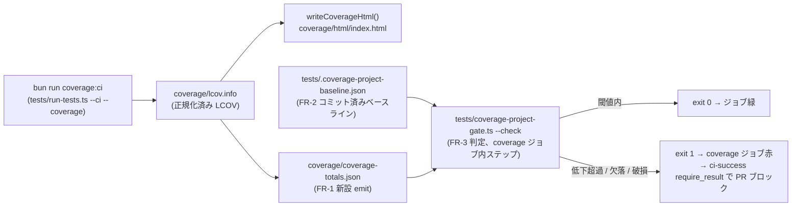

# Business Logic Model — u734-coverage-project-gate

> 上流: `../../../inception/requirements-analysis/requirements.md`(FR-1〜8 / NFR-1〜4)。設計4問は選挙確定(`functional-design-questions.md`)。
> refactor スコープのため unit-of-work / application-design は不在(設計どおり)。既存コード構造(codekb `code-structure.md` の「Coverage CI 経路」節)をデファクト設計として扱う。

## 1. 全体フロー(データフロー)



テキストフォールバック: coverage:ci が lcov.info を生成 → 既存 HTML と**同一のパース結果**から新設 JSON(coverage-totals.json)を emit → 判定ステップがその JSON とコミット済みベースラインを実読し、0.02 百分点許容で比較 → 低下超過・欠落・破損はすべて exit 1(fail-closed)→ 既存 `ci-success` の `require_result("coverage", ...)` が拾って PR をブロック。

## 2. emit ロジック(FR-1、tests/run-tests.ts 内)

現状 `writeCoverageHtml(lcov)`(tests/run-tests.ts:573-640)が LCOV 文字列を行パースして `rows`(SF/LF/LH)を組み立て、`totalLines` / `totalHits` を集計している(:597-599)。

**変更設計**: この LCOV パース+集計を小関数(例 `collectCoverageTotals(lcov): { rows, totalHits, totalLines }`)へ抽出し、
- `writeCoverageHtml` は抽出結果を受けて HTML を書く(挙動不変)
- 新設 `writeCoverageTotals` が**同じ抽出結果**から `coverage/coverage-totals.json` を書く

これにより FR-1 の単一情報源要件(JSON と HTML の乖離ゼロ)が「同一関数の戻り値を両者が消費する」構造で機構的に保証される。二重パース・二重集計は書かない。

出力スキーマ(選挙 Q1=A): `{ "schemaVersion": 1, "hits": <int>, "lines": <int> }`。%は書かない(消費側導出 — NFR-2)。

## 3. 判定アルゴリズム(FR-3、tests/coverage-project-gate.ts --check)

入力: `coverage/coverage-totals.json`(current)と `tests/.coverage-project-baseline.json`(base)。

1. **パース(parse, don't validate)**: 両ファイルを読み、`schemaVersion === 1`・`hits`/`lines` が非負整数・`hits <= lines` を満たさなければ即 exit 1(理由を stderr へ)。ファイル不在・JSON 破損も同様(FR-4)。
2. **空母集団ガード**: `current.lines === 0` または `base.lines === 0` は「検証不能」として exit 1(fail-closed — 0 除算を成功側に丸めない)。
3. **比較(整数厳密)**: 判定式「current% >= base% − 0.02」を浮動小数点なしで評価する。

   current% − base% >= −0.02 は、%(= 100·hits/lines)の定義から両辺に 100·cl·bl(> 0)を掛けて

   `10000·ch·bl − 10000·bh·cl >= −2·cl·bl`

   と同値(ch/cl = current の hits/lines、bh/bl = base の hits/lines)。この整数式を **BigInt** で評価する(積が 2^53 を超えない証明責任を負わない)。丸めによる判定反転が構造的に起きない(NFR-2)。
4. 成功時は現在%・ベースライン%・差分を stdout に1行サマリ(人間可読)、exit 0。失敗時は原因種別(DROP_EXCEEDED / MISSING_CURRENT / MISSING_BASELINE / MALFORMED / EMPTY_POPULATION)と実測値を stderr に出して exit 1。

判定ロジックは export された純関数(例 `evaluateGate(current, base): Verdict`)として実装し、CLI はそれの薄いラッパとする — NFR-1 の in-process seam(bun --coverage の spawn 盲点対策)。

## 4. ベースライン更新ロジック(FR-5、tests/coverage-project-gate.ts --update)

1. `coverage/coverage-totals.json` を読む(不在なら「先に `bun run coverage:ci` を実行せよ」と案内して exit 1 — 古い値の再コミットを防ぐ)。
2. その hits/lines をそのまま `tests/.coverage-project-baseline.json` へ書く(スキーマ同形)。
3. 差分はコミットに含めて通常 PR レビューへ(自動 bump なし — CI からは `--update` を呼ばない。呼ぶ配線を追加しないことが FR-5 の合否基準)。

## 5. CI 配線(FR-3、.github/workflows/ci.yml)

`coverage` ジョブ(ci.yml:60-)の「Generate coverage reports」ステップ(`bun run coverage:ci`)直後に1ステップ追加:

```yaml
      - name: Project coverage gate
        run: bun tests/coverage-project-gate.ts --check
```

- 既存の artifact upload / Codecov upload ステップは不変。
- `ci-success` / `require_result` / needs 配線は不変(選挙 Q3=A: ジョブ内ステップ失敗 → `coverage.result != success` → 既存配線で PR ブロック)。
- `codecov.yml` からは `coverage.status.project` セクションのみ削除(FR-6。`patch`/`ignore`/`fixes` はバイト不変)。

## 6. エラーハンドリング(統合境界)

| 境界 | 失敗モード | 挙動 |
|---|---|---|
| coverage-totals.json 読み | 不在・破損・スキーマ不一致 | exit 1(MISSING_CURRENT / MALFORMED) |
| baseline 読み | 不在・破損・スキーマ不一致 | exit 1(MISSING_BASELINE / MALFORMED) |
| 母集団 | lines === 0 | exit 1(EMPTY_POPULATION) |
| 比較 | 低下 > 0.02pp | exit 1(DROP_EXCEEDED、実測値付き) |

サイレント成功への縮退経路は存在しない(すべての異常が exit 1 に合流 — fail-closed)。

## 7. テストシーム(NFR-1 対応の構造)

- `evaluateGate` 純関数 → in-process 単体テスト(閾値境界: ちょうど −0.02pp は緑、それを超えたら赤、の両側)。
- CLI 全体 → `spawnSync` プロセス境界テスト。環境変数(既存 ratchet の `AMADEUS_COVERAGE_RATCHET` と同型の入力パス差し替え — 例 `AMADEUS_COVERAGE_TOTALS` / `AMADEUS_COVERAGE_PROJECT_BASELINE`)で temp tree の注入ファイルを読ませ、(a) 低下注入 → exit 1 (b) JSON 欠落 → exit 1 (c) ベースライン欠落 → exit 1 (d) 閾値内 → exit 0 を実測する。
- 差し替え env は「テスト専用モード分岐」ではなく入力パスの注入点(construction ガードレールのテストシーム原則に適合 — 既存 ratchet の前例と同型)。

## Review

**Verdict: READY**

Reviewer: amadeus-architecture-reviewer-agent、日付: 2026-07-10、iteration: 1

実測による裏取り(すべて file:line で確認、乖離なし):
- `tests/run-tests.ts:573-638`(`writeCoverageHtml`)— LCOV パースから `rows`/`totalHits`/`totalLines` を組み立てる箇所を確認。設計が主張する「同一算出結果を HTML と JSON が共有する」抽出(`collectCoverageTotals`)は、既存関数の構造にそのまま適合する自然なリファクタで、隠れた副作用(`coverageHtmlEscape` や HTML 生成ロジックとの結合)はない。行番号の主張「573-640」は実際の関数終端(638、`combineCoverageReports` が641で開始)よりわずかに広いが、抽出対象範囲の特定は正確で実装を誤らせる差ではない(minor)。
- `.github/workflows/ci.yml` の `coverage` ジョブ(60行台〜)— 「Generate coverage reports」ステップ直後への1ステップ追加、既存の artifact upload / Codecov upload ステップ不変という設計の主張どおりの構造を確認。`ci-success` ジョブ(202行〜)の `require_result` が `check`/`coverage`/`codecov-status` の3ジョブを対象にしており、新設ステップの失敗が `coverage` ジョブの `result` を通じて既存配線でそのまま PR ブロックに波及することを確認(設計・requirements の主張と一致)。
- `tests/gen-coverage-registry.ts` — `main()`(1280行)の `--check` 分岐、`AMADEUS_COVERAGE_RATCHET` 環境変数によるベースラインパス差し替え(66行のコメント、105行の解決箇所)、および `tests/unit/gen-coverage-registry.test.ts` での同パターンの実使用を確認。設計が「既存 ratchet と同型の CLI 契約・env 注入パターン」と主張する内容は実装済み前例と一致する。
- `codecov.yml` — `coverage.status.project`(target/threshold/if_not_found/informational を持つブロック)と `coverage.status.patch` が並存し、`ignore`(`tests/**/*` を含む8パターン)・`fixes` はセクションとして独立していることを確認。FR-6 の「project セクションのみ削除、patch/ignore/fixes はバイト不変」は構造的に実行可能。
- `.gitignore:27` に `coverage/` が存在し、`coverage/coverage-totals.json` を「コミット対象外の生成物」とする domain-entities.md の分類は正しい。
- BigInt 厳密比較式の代数的検証: `current% >= base% - 0.02`(% = 100·hits/lines)を整数変形すると `10000·ch·bl - 10000·bh·cl >= -2·cl·bl` になることを、hits/lines がそれぞれ 0〜1000 の範囲で `hits <= lines` を満たす組み合わせを乱数で20万件生成し、`Fraction` による厳密有理数比較と照合して全件一致を確認した。設計の主張どおり数式は正しい。

内部整合性: 3成果物(business-logic-model / business-rules / domain-entities)間でファイルパス・スキーマ・関数名(`evaluateGate`、`collectCoverageTotals`、`--check`/`--update`)・失敗理由コード(DROP_EXCEEDED/MISSING_CURRENT/MISSING_BASELINE/MALFORMED/EMPTY_POPULATION)が一致しており、相互参照は破綻していない。選挙4問(Q1〜Q4、全問 A)はそれぞれ domain-entities のスキーマ・パス、business-logic-model の CLI 実装位置、business-rules のドキュメント方針に過不足なく写像されている。

NFR-1 のテスト可能性: `evaluateGate` を純関数として export し in-process 境界値テストの対象にする設計、および `spawnSync` + env 注入によるプロセス境界テストの二層構成は、既存 `gen-coverage-registry.ts` の前例と同型で実装可能。「落ちる実証」(低下注入/JSON欠落/ベースライン欠落/閾値内)の4ケースが明示され、閾値境界(ちょうど−0.02pp / それを超える最小ケース)の両側テストも business-rules R18 に明記されている。

Mermaid 構文: §1 の `flowchart LR` と domain-entities.md §2 の `erDiagram` はいずれも構文上有効(ノードラベル内の `\n` 使用、リレーション表記も正しい)。両方にテキストフォールバックが併記されていることを確認した。

構築ガードレール適合性: 後方互換シム・フォールバック分岐は見当たらない。統合境界(JSON読み・baseline読み・母集団ゼロ)のエラーハンドリングは fail-closed で網羅されている。テストシームは env 注入によるパス差し替えであり、本番コードにテスト専用モード分岐を持ち込んでいない。検証用フィールド(実行結果を消費しないもの)も見当たらない。

指摘事項: なし(blocker/major 該当なし)。

軽微な所見(non-blocking、参考情報):
1. (minor, §2) `writeCoverageHtml` の行範囲主張「573-640」は実際の関数終端(638)よりやや広い。抽出対象の特定には影響しないため実装時の修正で足りる。
2. (minor, §5) CI ステップ挿入位置は「『Generate coverage reports』ステップ直後」と記述されているが、Codecov アップロードステップとの前後関係(判定ステップを Codecov アップロードの前後どちらに置くか)は明示されていない。判定失敗時に Codecov アップロードが実行されるかどうかは軽微な運用上の差(アップロード自体は `if: always()` ではないため通常フローでは影響小)であり、コード生成時に自然に解決可能な粒度。
