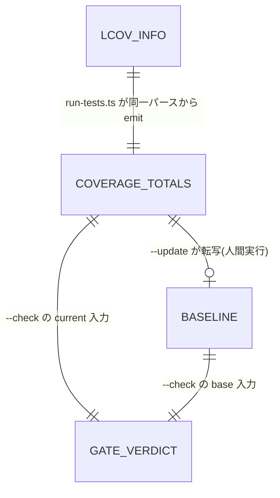

# Domain Entities — u734-coverage-project-gate

> 上流: `../../../inception/requirements-analysis/requirements.md`。エンティティ・関係・ライフサイクルを定義する。判定規則は `business-rules.md`、処理系列は `business-logic-model.md`。

## 1. エンティティ一覧

### CoverageTotals(現在値 — CI 実行ごとの生成物)

- **所在**: `coverage/coverage-totals.json`(選挙 Q1=A。coverage ディレクトリ配下 = コミット対象外の生成物)
- **スキーマ**: `{ "schemaVersion": 1, "hits": <非負整数>, "lines": <非負整数> }`(不変条件: `hits <= lines`)
- **生成者**: `tests/run-tests.ts`(coverage 実行時、HTML と同一のパース結果から — 単一情報源)
- **消費者**: `tests/coverage-project-gate.ts`(--check の current 側、--update の入力)
- **ライフサイクル**: coverage 実行ごとに上書き生成。永続しない。

### CoverageProjectBaseline(基準値 — コミット済み)

- **所在**: `tests/.coverage-project-baseline.json`(選挙 Q2=A。既存 `tests/.coverage-ratchet.json` と同じ tests/ 直下ドットファイル慣行)
- **スキーマ**: CoverageTotals と同形 `{ "schemaVersion": 1, "hits": <非負整数>, "lines": <非負整数> }`
- **生成者**: `tests/coverage-project-gate.ts --update`(人間が実行し PR でコミット — business-rules R10/R11)
- **消費者**: `tests/coverage-project-gate.ts --check`(base 側)
- **ライフサイクル**: git 履歴で管理。更新は向上 PR 内のレビュー付きコミットのみ。

### GateVerdict(判定結果 — メモリ内)

- **形**: `evaluateGate(current, base)` の戻り値。判別ユニオン(project.md の functional-domain-modeling-ts スタイル):
  - `{ kind: "pass", currentPct, basePct, deltaPp }`
  - `{ kind: "fail", reason: "DROP_EXCEEDED" | "MISSING_CURRENT" | "MISSING_BASELINE" | "MALFORMED" | "EMPTY_POPULATION", detail }`
- **消費者**: CLI ラッパ(exit code とメッセージへ写像)、および単体テスト(in-process seam)。
- **備考**: pct/delta は**表示用の導出値**。合否判定そのものは整数厳密比較で確定し、表示値から再判定しない(判定と表示の分離 — NFR-2)。

### 既存エンティティとの関係(変更しないもの)

- `coverage/lcov.info` — CoverageTotals の唯一の由来(正規化済み LCOV)。本 intent で形式変更なし。
- `tests/.coverage-ratchet.json` — **別物**。gen-coverage-registry.ts が所有する「クラス別 covered-unit 件数」の床。選挙 Q2 で統合を否決(責務が異なる)。本 intent で不変。
- `codecov.yml` — `coverage.status.project` セクションのみ削除(FR-6)。

## 2. 関係図

テキストフォールバック: lcov.info(生成)→ CoverageTotals(生成、単一情報源)。CoverageTotals は (a) --check の current 入力、(b) --update 経由で Baseline へ転写(人間実行のみ)。--check は CoverageTotals × Baseline から GateVerdict を導出し、exit code に写像する。

## 3. スキーマの進化規則

- `schemaVersion` は両ファイル共通で 1 から開始。フィールド追加・意味変更時にインクリメントし、読取側はバージョン不一致を MALFORMED として fail-closed に扱う(サイレントなフォールバック読取をしない — team.md Forbidden の互換シム禁止と整合)。
- % をスキーマに含めない(整数のみ)。%は常に消費時導出(NFR-2 の丸め安全)。
