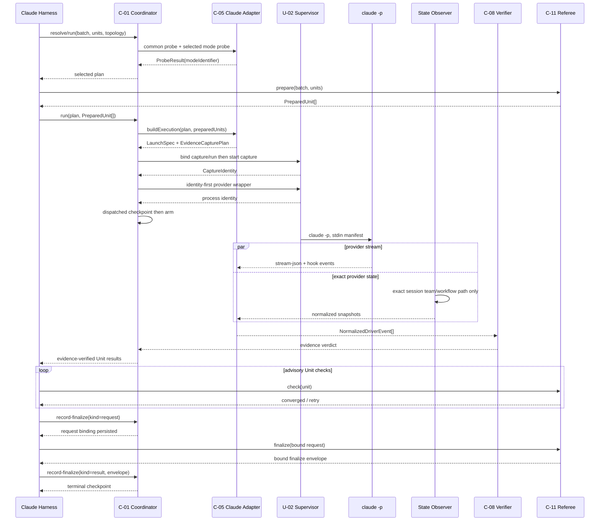

# Claude Native Driver ビジネスロジックモデル

## 目的と上流境界

U-03はC-05 `ClaudeDriverAdapter`とClaude harness projectionだけを所有し、`claude-agent-teams`と`claude-ultracode`を共通C-01 lifecycleへ接続する。selector、attempt store、process supervisor、native verifier、referee、mergeを再実装しない。

| 上流成果物 | U-03で使用する契約 |
|---|---|
| `unit-of-work.md` | U-03の1 provider/2 mode、Claude slot single-writer、fake/live完了条件 |
| `unit-of-work-story-map.md` | Agent Teams、Ultra Code、unknown topology、legacy、resumeの5 slice |
| `requirements.md` | FR-11/FR-12のnative proof、FR-15のreferee、FR-19の機密性、FR-23のlive proof |
| `components.md` | C-05 adapter、C-08の二系統evidence、post-dispatch fail-closed |
| `component-methods.md` | `DriverAdapter`、`ProbeResult`、`LaunchSpec`、`NormalizedDriverEvent` v1 |
| `services.md` | batch 1 process、team/task/workflow source、probe順、cleanup/resume |

2026-07-13の公式Claude Code文書とlocal `claude 2.1.205`から、次をsurface profileの根拠とする。

- [Agent Teams](https://code.claude.com/docs/en/agent-teams): experimental env、in-process mode、session-derived team、team config/task path、Task/Teammate hooks。
- [Dynamic Workflows](https://code.claude.com/docs/en/workflows): v2.1.154以降、`--effort ultracode`はv2.1.203以降、`claude -p`で承認promptを出さずworkflow実行、workflow agent/runtime state。
- [CLI reference](https://code.claude.com/docs/en/cli-reference): `--teammate-mode`、`--effort ultracode`、`--session-id`、stream-json。
- [Hooks reference](https://code.claude.com/docs/en/hooks): `TaskCreated`、`TaskCompleted`、`TeammateIdle`、`SubagentStart`、`SubagentStop`のallowlist field。

versionは診断であり成功根拠ではない。localでは`--teammate-mode in-process --version`、`--effort ultracode --version`、`claude auth status`の非機密JSONを確認しただけで、native live実行はCode Generation entry/exit gateへ残す。

## C-05 moduleとproduction registration

Iteration 1 reviewで、上流U-01の`RegistrationSlot.available.adapter`が単数である一方、Claude providerは2 driverを所有するため、そのままではproduction registryを構築できないことが判明した。Functional Designの実装契約は、単数slotをdriver-keyed `DriverAdapterSet`へ訂正する。この狭いgeneric contract correctionはU-01/U-02 Code Generationにも適用し、provider別mappingやdriver literalは変更しない。

```text
RegistrationSlot =
  available(adapterSet: DriverAdapterSet)
  | unavailable(diagnosticCode)

DriverAdapterSet.build(provider, declaredDrivers, adapters)
  - adapter.driverをkeyに重複0件
  - keys == declaredDrivers
  - Claude: exactly 2
  - Codex/Kiro: exactly 1
  - forDriver(driver): exactly 1 adapter
```

`ClaudeDriverAdapter`は1つのprovider module/class familyであり、singleton processやsingleton cacheではない。共通`DriverAdapter.driver`が単一driver IDを要求するため、factoryは次の2つのimmutable mode-bound viewを返し、Claudeの`DriverAdapterSet`へ2件とも格納する。

```text
createClaudeAdapterFamily(resolveScope)
  ├─ view(driver=claude-agent-teams, mode=agent-teams)
  └─ view(driver=claude-ultracode, mode=dynamic-workflow)
             │
             └─ shared commonProbe Promise (resolveScope内だけ)
```

production composition rootはClaude providerのfail-closed slotだけを、この2件を持つavailable `DriverAdapterSet`へ置換する。Codex/Kiroは同じgeneric型のunavailable slotのままで、static importと4 native driverのclosed mappingは変更しない。C-01は`probing` attemptごとにfresh resolve scopeを作り、Claude setの2 viewを同じscopeへ束縛する。scope破棄後にprobe結果を再利用しない。

この形は「C-05が2 modeを扱う」と「`DriverAdapter.driver`は1値」を両立し、2つの独立adapter実装へbusiness logicを複製しない。単一adapterの`driver`を実行中に変更することは禁止する。共通部分はCLI/auth/env/schema profile、差分はmode probe、launch args、provider-state parser、evidence policyだけである。

## End-to-end workflow



テキスト代替: Claude harnessはC-01をdriver lifecycleの公開入口にし、C-11をrefereeの公開入口にする。C-01とC-11は互いをimport/callしない。harness conductorだけがprepare、advisory check、record-finalize request、finalize、record-finalize resultをversioned JSONで媒介する。adapterがpureなlaunch/capture planとevidence変換を提供し、U-02 supervisorがcaptureとprovider processを安全に起動する。

## Probeアルゴリズム

### Resolve scope

1. C-01が`probing` checkpointをmaterializeした後、Claude adapter familyをresolve scopeへ生成する。
2. 最初に評価されたClaude viewが`commonProbe`を開始し、2つ目は同じPromiseをawaitする。
3. scope keyはin-memory object identityであり、batch番号やproject pathをglobal keyにしない。resumeはfresh scopeとなる。
4. common failureは両modeへ同じ主reasonを返すが、各`ProbeResult.driver/modeIdentifier`は混同しない。

### Common probe

| 順 | Check | 手段 | Timeout | 成功条件 |
|---:|---|---|---:|---|
| 1 | CLI | `claude --version` | 5秒 | executable、parse可能version、exit 0 |
| 2 | Auth | `claude auth status` | 10秒 | JSON statusがlogged-in。token/valueは読取後破棄 |
| 3 | Stream | temp dirの非破壊`claude -p` handshake | 30秒内 | `system/init`とterminal eventがallowlist schema、session相関 |
| 4 | Hook capture | attempt専用ephemeral settings | 同上 | sentinel hookがowned evidence dirへ最小eventを1件書く |

handshakeはapplication code、git、team、workflowを作らず、toolsを無効化した固定応答だけを要求する。APIを呼べないauth/modeではavailableを返さない。raw output、result text、model responseは保存しない。

### Mode probe

Agent Teamsはexperimental env、`--teammate-mode in-process`、session ID flagの受理、expected team/task rootの安全なpath構築、Task/Teammate hook schema profileを検査する。実teamはprobeで作らない。

Ultra Codeは`--effort ultracode` flag受理、workflows無効設定がないこと、`system/init.capabilities`とlive-discovered profileの一致、SubagentStart/Stop captureを検査する。`xhigh`受理だけではavailableにしない。公式に安定fieldがないrun/task pathはcredentialed discovery fixtureが確定するまで`native-evidence-unavailable`である。

### Probe failureの意味

- 明示`claude-agent-teams`/`claude-ultracode`: hard error、prepare/worktree/provider process 0件。
- `auto`: dispatch前だけU-01の固定候補列へ進む。coordinatedでTeams unavailableならUltra、さらにunavailableならTask floor。
- dispatch後: probeを再解釈せずfailed-resumable。別mode/floorへfallbackしない。

## LaunchSpec構築

### 共通input

adapterは次の安全なmanifestをcanonical JSONとしてstdin bytesへ変換する。生prompt、credential、convergence command全文をevidenceへ複製しない。

```text
ClaudeBatchManifestV1
  executionId / attemptId / attemptNonceHash / planDigest
  waveIndex / waveDigest / sessionId
  units[] = unitSlug / assignmentToken / worktreePath / dependencySlugs
  convergenceCommand (provider入力だけ。永続eventには入れない)
  protectedSpecPath (provider入力だけ。baselineはC-11が所有)
```

`assignmentToken`は`sha256(executionId, attemptId, waveDigest, unitSlug)`の短縮base32であり、Unit slugと組み合わせてtask/workflow labelに使う。これはsecretでなく、別attemptの自己申告や残存stateを排除する相関tokenである。

stdinはwrapperがprovider spawn後に1回だけwriteし、EOFを送る。argvへpromptを置かず、shell commandを組み立てない。

### 共通argvとsettings

```text
claude -p
  --output-format stream-json
  --verbose
  --include-hook-events
  --session-id <execution-derived UUID>
  --settings <attempt-owned ephemeral settings path>
  --permission-mode dontAsk
```

ephemeral settingsはU-03のevidence hookだけを追加し、既存project/user settingsを上書きしない。fileはmode、hook command、evidence directoryの非機密pathだけを持ち、0600で作る。`claude -p`はinvalid settingsを対話表示せず無視し得るため、probeのsentinel hook成立を必須にする。

envは固定allowlistで構築する。

- runtime: `PATH`、`HOME`、`SHELL`、`TMPDIR`、locale。
- correlation: evidence dir、attempt nonce hash、session ID、mode ID。raw nonceは渡さない。
- Agent Teams: `CLAUDE_CODE_EXPERIMENTAL_AGENT_TEAMS=1`。
- auth: `claude auth status`が示したtransportに必要な既存keyだけ。OAuth/keychainではHOME以外のcredential値を複製しない。API/Bedrock/Vertex/Foundryは既知transport別allowlistを使用し、未知transportはprobe failure。

全env値はchildへin-memoryで渡すだけで、log、error、checkpointへserializeしない。

### Adapter execution/capture contract

Iteration 1 reviewで、上流`buildLaunch`と`normalize(rawStream)`だけではcleanup前provider-state observerをU-02 supervisorへ接続できないことが判明した。共通adapter interfaceを、hidden I/Oを増やさない次のpure plan + explicit lifecycleへ精緻化する。

```text
DriverAdapter
  buildExecution(input): AdapterExecutionPlan
  normalize(inputs: EvidenceInputs, context): NormalizedDriverEvent stream

AdapterExecutionPlan
  launch: LaunchSpec
  capture: EvidenceCapturePlan
  planDigest: sha256(launch redacted shape + capture)

EvidenceCapturePlan
  schemaVersion / provider / mode / profile
  captureId / expected session-run identity
  stateBinding:
    fixed-path(exact provider-state locations)
    | stream-bound(expected session root, run-created path, location resolver)
  hook record directory
  atomic snapshot target
  startBeforeProviderArm = true
  stopAfterProviderGroupTerminal = true
```

U-02 `ProcessSupervisor`は`EvidenceCaptureSupervisor` portを所有し、次の順序を強制する。

1. `AdapterExecutionPlan.planDigest`、capture ID、state/hook/snapshot path digestを`prepared` checkpointへaudit-firstで束縛する。
2. capture observerを開始し、owner process identity、capture ID、plan digestを持つ`CaptureIdentity`を返させる。Agent Teamsはfixed path observerを直ちに開始する。Ultraは`awaiting-binding` observerを開始し、provider streamのallowlisted workflow-created eventからrun IDを得るまでpathを読まない。observerはC-05 parser/profileを使うが、起動順と停止保証はU-02が所有する。
3. `CaptureIdentity`をcheckpointへ保存した後にprovider wrapper identity handshakeを行う。providerのone-time armはcapture startedのfenced checkpointがなければ受理しない。
4. Ultraのworkflow-created eventをC-05のclosed binding parserへ渡し、run ID、session ID、resolved exact state pathを持つ`CaptureBinding`を作る。U-02はprofile ruleとrealpath confinementを再検証し、binding digestをaudit-first checkpointへ保存してからそのexact pathのpollingを有効にする。binding前にdirectory scanやstate readをしない。
5. provider stdoutを`processStream`、observer snapshotを`providerStateStream`、exact hook directoryのrecordを`hookRecordStream`として別channelへ保つ。private mutable closureや`buildExecution`中のpollingは禁止する。
6. provider group terminalを確認した後にcaptureへstopを送り、`stopAndWait`でlast valid atomic snapshotとhook record集合を確定する。observer停止不能、binding/snapshot欠落、hook読取未完了はsuccessにしない。
7. adapter `normalize`へ3 channelとterminal identityを渡し、C-08検証後にscratch cleanupを行う。streamとprovider-stateを同じraw eventから二重生成しない。

coordinator crash時はcaptureが同一owner processとともに停止し、U-02が旧provider groupをterminate/waitする。snapshotが確定していなければ旧attemptをsuccessにせず、新attemptはfresh capture planから始める。

### Session prefix allocation

Agent Teamsのteam/task pathはsession UUID先頭8文字だけで決まり、task directoryはsession終了後も残り得る。dispatch前に次のbounded deterministic allocatorでprefixを予約する。

1. `counter=0..255`についてUUIDv5を`executionId + attemptId + waveDigest + counter`から導出し、expected team directoryとtask directoryを直接計算する。
2. system tempのuser-scoped `amadeus-claude-prefix-<first8>.lock`をatomic `mkdir`で予約する。root directoryは列挙せず、lock owner recordをU-02 process identity/lease/fencingへ束縛する。
3. reservation取得後にexpected team directoryとtask directoryをそれぞれ`lstat`する。どちらかが存在する、symlinkである、ownership不明なら削除・再利用せずreservationを解放して次counterへ進む。
4. 両pathが不存在ならcounter、full UUID、prefix、両path digest、reservation identityを`prepared` checkpointへaudit-first保存する。これが完了するまでobserver/providerを起動しない。
5. reservationはprovider group terminalとcapture joinまで保持する。crash時のstale reservationはU-02が旧owner非生存と旧group停止を証明した後だけ回収する。新attemptは新seedで再探索し、旧task pathを削除しない。

256候補が埋まる、lock livenessが不明、checkpoint前後のexact path再検査で出現した場合は`CLAUDE_SESSION_PREFIX_UNAVAILABLE`としてpre-dispatch停止する。Amadeus外processとの予約非協調raceはarm直前の再`lstat`と、実行中のfull session ID/assignment token/extra task検証でfail-closedにし、誤ったnative successを0件にする。

### Agent Teams固有launch

共通argvへ`--teammate-mode in-process`を追加する。Claude 2.1.178以降はteam名を任意指定できないため、allocatorが予約・checkpoint束縛したUUIDを`--session-id`へ渡し、expected team名を`session-<予約済みprefix>`として導出する。`team_name` prompt/flagや旧`TeamCreate`/`TeamDelete` toolを使わない。

stdin instructionは次の制約だけを構造化する。

1. leadは各Unitについて`[amadeus:<assignmentToken>] <unitSlug>` subjectの共有taskを1件作る。
2. Unit数と同数のnamed teammateをspawnし、各teammateへprepared worktreeを1件割り当てる。
3. teammateは他Unit worktreeを編集せず、Unit taskをcompletedへ更新する。
4. leadは全task completedと全teammate idleを待ってから終了する。
5. nested teamやlead自身のUnit実装を禁止する。

自然言語指示は起動要求であり証拠ではない。実team/task/hook stateだけを検証する。

### Ultra Code固有launch

共通argvへ`--effort ultracode`を追加する。stdin先頭でdynamic workflowを明示要求し、workflow scriptへ次を要求する。

1. manifestのUnit配列をinput `args`として扱う。
2. `pipeline(args.units, ...)`相当でUnitごとにちょうど1つのworker `agent()`を作る。
3. agent labelへassignment token、promptへUnit slug/worktreeを渡す。
4. 各agent resultをUnit slugで返し、全件settle後に終了する。
5. planner/verifierを含む余分なagentを作らない。

Claudeが生成したscript本文や「workflowを使った」という応答は保存・証拠化しない。provider workflow stateが実run/task/agentとlabelを記録し、stream/hook agent IDと一致した場合だけ成立する。

## Agent Teams evidenceアルゴリズム

### Exact path observer

expected session IDから次の2 pathを直接構築する。

```text
~/.claude/teams/session-<sessionId[0..8]>/config.json
~/.claude/tasks/session-<sessionId[0..8]>/
```

rootのdirectory listing、他team fallback、mtimeが新しいteamの採用は禁止する。observerはU-02がprovider wrapper arm前に開始し、予約済みexact path、prefix reservation、checkpointのfull session ID/digestを再検証する。symlinkを拒否し、realpathがexpected root配下であること、ownerがcurrent userであることを確認する。

team configはsession終了時に自動cleanupされるため、observerは実行中にvalid snapshotを繰り返し読み、最後のvalid normalized snapshotだけをattempt evidence dirへatomic replaceする。raw JSONは複製しない。task directoryはdispatch前に不存在を確認済みでなければ起動せず、実行中もfull session ID/assignment tokenと余分なtask 0件を要求する。

### Provider-state projection

allowlistは次だけである。

- config: member name、agent ID、agent type。
- task: task ID、subject内assignment token、status、owner teammate name、dependency task ID。
- file identity: expected team/task pathのdigest。path文字列自体は共有auditへ出さない。

task description、message、mailbox、transcript path、pane ID、prompt/outputは読み捨てる。member nameからagent ID、task ownerからUnit tokenへ結合し、`UnitChildBinding`を構築する。

### Stream projection

`--include-hook-events`付きstream-jsonから、profileに登録したenvelope内の次eventだけをparseする。

- `TaskCreated`: session ID、task ID、subject token、teammate name。
- `TaskCompleted`: session ID、task ID、subject token、teammate name。
- `TeammateIdle`: session ID、teammate name。
- coordinator `system/init`とterminal result: session/coordinator ID、exit code。

deprecated `team_name`は存在しても診断以外に使わない。TaskCreated/Completedが同じtask/token、config/task snapshotが同じowner/memberへ結びつき、TeammateIdleが到着したときだけ、そのchildのcompleted stopを生成する。

### AND verdict

Agent Teams modeが成立するのは次のすべてが真の場合である。

1. `modeIdentifier=claude-agent-teams-v1`、coordinator session ID exact match、exit 0。
2. provider-stateに2 member以上、expected Unit全件のtask、Unit-member全単射。
3. streamにexpected task全件のcreated/completedとowner全件のidle。
4. provider-stateとstreamのtask ID、assignment token、teammate nameが一致。
5. `claude-team-membership`と`claude-shared-task` markerが存在。
6. C-08のexecution/attempt/nonce/plan/wave correlationが一致。

## Ultra Code evidenceアルゴリズム

### Surface profile discovery gate

公式文書はworkflow scriptがsession directoryへ保存され、runtimeがagent resultを追跡すると説明する一方、run/task stateのstable field pathを公開していない。したがってCode Generation entryでcredentialed macOS discoveryを1回行い、次の最小fixtureだけを承認対象とする。

```text
ClaudeSurfaceProfile v1
  cli semver range
  system/init capability literals
  workflow-created stream envelope path
  workflow run ID field path
  run-state location derivation rule
  task ID / agent ID / label / status field paths
  SubagentStart/Stop envelope paths
```

fixtureはfield path、type、enum、synthetic IDだけを保持し、prompt、script、result、transcript、credential、local absolute pathを除去する。profileはexact version rangeとschema versionへ束縛する。新version/unknown capability/unknown fieldは推測せず`UNKNOWN_NATIVE_EVENT`件数と`native-evidence-unavailable`を返す。

run-state pathはstreamから得たrun IDとsession IDから一意に導出でき、expected session directoryへrealpath confinementできる場合だけ使う。`~/.claude/projects`全体をscanして最新runを探す方法は禁止する。これをlive discoveryで確立できなければU-03をparkする。

### Provider-state projection

profileでallowlistしたworkflow runから、run ID、task ID、worker agent ID、assignment label、statusだけを抽出する。generated script本文やagent prompt/resultは読まない。assignment labelのtokenをmanifestへ逆引きし、Unit-agent全単射を作る。

### Stream/hook projection

同じsessionのworkflow-created eventと`SubagentStart`/`SubagentStop`をparseする。start/stopのagent IDをprovider-state agent IDへ結合する。`SubagentStop.last_assistant_message`、transcript path、agent promptはschemaに取り込まない。Stop時のbackground taskにworkflowが残る場合、coordinator stopをcompletedにしない。

### AND verdict

Ultra Code modeが成立するのは次のすべてが真の場合である。

1. launchが`--effort ultracode`を使い、`modeIdentifier=claude-dynamic-workflow-v1`がprofile/streamで確認される。
2. provider-stateに実run IDが1つ、2 worker agent以上、expected Unit-agent全単射がある。
3. streamに同じrun/sessionのworkflow marker、全agentのSubagentStart/Stopがある。
4. 全task/agent statusがcompleted、coordinator exit 0、background workflow 0件である。
5. `claude-workflow` markerと`provider-state + stream` sourceが揃う。
6. xhighだけ、通常Agent toolだけ、prompt/assistant自己申告だけのevent集合ではない。

## Evidence hookと機密性

U-03はClaude harnessへattempt専用evidence hookを1つ追加する。framework sourceからdist/Claude/self-installへprojectionし、global `.claude/settings.json`へ常時有効なswarm stateを追加しない。adapterがephemeral settingsで次eventだけを配線する。

- Agent Teams: TaskCreated、TaskCompleted、TeammateIdle。
- Ultra Code: SubagentStart、SubagentStop、Stop。

hookはevidence dirのownership marker、session ID、attempt nonce hashを検証し、eventごとにexclusive-create fileへallowlist fieldだけを書く。並行hookが1つのJSONLへinterleaveしない。adapterはprovider streamを正本sourceとしてparseし、hook fileはcleanup前観測とstream相関のために使う。最終的にC-08へ渡すのは`NormalizedDriverEvent`だけである。

次を構造的に禁止する。

- env dump、credential/token value、auth status detail。
- stdin prompt、workflow script、task description、message/mailbox。
- assistant result、last assistant message、transcript path、raw stdout/stderr。
- home absolute pathやusername。共有eventにはdigest/enumだけを残す。

unknown raw eventは保存せず、profile別countだけを診断する。error messageも列挙code、driver、mode、CLI versionまでに限定する。

## Harness conductorと0.1.x互換

source of truthは`packages/framework/harness/claude/skills/amadeus/SKILL.md`である。現行の長い`invoke-swarm`分岐を、次の責務へ変更する。

1. engine directiveのbatch/units/topologyをpublic C-01 `resolve`へ渡し、selected planを受け取る。
2. harness conductor自身がC-11 `prepare`を呼び、返されたPreparedUnitをpublic C-01 `run`へ渡す。C-01はU-03 adapter/U-02 supervisor/C-08までを実行し、C-11をimport/callしない。
3. C-01が`claude-task-floor` planを返せば、現行Task fan-outをexecution planどおり実行して`record-floor`する。
4. 旧`AMADEUS_USE_SWARM=1`だけが存在する場合は、現行inline Dynamic Workflow behaviorを`claude-dynamic-workflow` legacy planとして実行して`record-legacy`する。
5. legacy workflow surfaceがdispatch前に利用不能な場合だけfloorへloud-degradeし、既存`SWARM_DEGRADED`を保持する。workflow開始後failureはfallbackしない。
6. native/floor/legacy結果を受けたconductorだけがC-11 `check` loopを回す。claimed/reasons確定後、C-01 `record-finalize(kind=request)`、C-11 `finalize`、C-01 `record-finalize(kind=result)`の順で二相handoffする。

C-01とC-11のsource import graphは両方向0 edgeでなければならない。versioned JSON、request digest、finalize invocation ID、result envelopeをharness conductorが明示的に受け渡し、C-01がauthoritative merge gateを迂回できないことをarchitecture testで固定する。

`AMADEUS_USE_SWARM`を新driverのon/offに使わず、`AMADEUS_SWARM_DRIVER`と併存した場合はU-01 conflict errorのままとする。U-03はglobal settingsへ`AMADEUS_*`を追加しない。

projection変更はClaude skill、evidence hook、harness manifest、generated dist/self-installへ限定する。project-local `.claude/settings.json`はpromotionでpreserveされるため正本にせず、`settings.json.example`へAgent Teamsを常時有効化する必要もない。native childのenvはC-05 launchが明示する。

## Failure、cleanup、resume

| Failure | Timing | Outcome |
|---|---|---|
| CLI/auth/mode/capture unavailable | pre-dispatch | explicit hard error / autoの固定fallback候補 |
| session prefix lock/path衝突、候補枯渇 | pre-dispatch | pathを削除せず停止。provider process 0件 |
| Agent Teams team未形成、member<2 | post-dispatch | failed-resumable、fallbackなし |
| team configがcleanup前にsnapshot不能 | post-dispatch | failed-resumable |
| capture observer停止/join不能 | post-dispatch | failed-resumable、success 0件 |
| task/Unit/member相関不一致 | post-dispatch | evidence failure |
| Ultra workflow run ID/path不明 | preflight discovery | U-03 park。floor代替なし |
| Ultra unknown schema/event | post-dispatch | failed-resumable、unknown countのみ |
| child不足/余分/stop欠落 | post-dispatch | evidence failure |
| coordinator crash/timeout | dispatch | U-02がgroup terminate/wait、failed-resumable |
| evidence green、check/finalize red | referee | U-02/C-11 verdictどおりsuccess禁止 |

normal exitではprovider自身のteam/workflow cleanupを妨げない。U-02はprovider group terminal後にcaptureをstopAndWaitし、adapterはlast valid snapshot、hook record、terminal streamをnormalizeする。C-08 verdict後にephemeral settings、hook candidate、state scratchを削除し、normalized evidenceだけを残す。cleanup failureは機密scratchが残る可能性があるため成功を返さず、attempt dirをredacted診断付きで隔離する。prefix reservationはcapture joinとscratch cleanupの後に解放する。

crash/resumeではU-02がwrapper/provider process groupの非生存を証明する。new attemptはfresh probe、fresh UUID/session、fresh evidence dirを使い、旧provider session、team config、task state、workflow runを再利用しない。prepared worktreeとreferee-converged Unitの再利用可否はU-02/C-11が判定する。

## Deterministic testとlive proof

### Fake suite

fake `claude` executableはargv/env/cwd/stdin/exitとstreamを制御し、homeもtemp rootへ隔離する。production C-01 commandとproduction registry assemblyを通し、Claude slotだけが実adapterであることを検証する。

| Test group | 主なcase |
|---|---|
| registration | Claude setが2 driver/2 immutable view、Codex/Kiroが各1件またはplaceholder、duplicate/missing拒否、public C-01で両driver解決 |
| common probe | CLI missing、auth false/unknown、timeout、malformed status、hook sentinel欠落、attempt間cacheなし |
| Agent Teams launch | env、in-process、予約済みsession UUID、stdin close、prepared worktree全件、shell非使用 |
| prefix allocator | active teamだけ、persistent taskだけ、同prefix別full UUID、lock競合、arm直前race、候補枯渇、別attempt resume |
| Agent Teams evidence | 2 Unit happy path、member<2、duplicate/extra task、wrong full session、completed/idle欠落、cleanup race |
| capture lifecycle | capture checkpoint-before-arm、3 channel分離、observer停止不能、snapshot atomic replace、cleanup-before-snapshotでsuccess 0件 |
| Ultra launch | `--effort ultracode`必須、xhighのみ拒否、workflow disabled、stdin manifest |
| Ultra evidence | 2 Unit happy path、run ID欠落、unknown field、agent不足/余分、label重複、stop欠落 |
| confidentiality | planted credential/prompt/raw responseがstdout/stderr/audit/checkpoint/fixtureに0件 |
| compatibility | Task floor、legacy Dynamic Workflow、pre-dispatch loud-degrade、post-dispatch fallback禁止 |
| lifecycle | SIGTERM/SIGKILL、partial stream、snapshot直前cleanup、resumeで旧session不採用 |
| architecture | C-01↔C-11 import/call 0件、conductorのrequest/finalize/result順序、request/envelope binding |

### Credentialed macOS discovery/live

live testは明示opt-inとhost mutexを要求し、次の2段階に分ける。

1. Entry discovery: 最小非機密repoでAgent Teams/Ultraのfield pathを捕捉し、`ClaudeSurfaceProfile` fixtureを更新する。schemaを確定できないmodeはU-03をparkする。
2. Exit proof: 各modeについて2 Unit以上をClaude harness conductor → public C-01 → production registry → C-05 → U-02 capture/process supervisor → C-08まで通し、conductorがC-11 check/finalizeとC-01二相recordを媒介する。

保存するlive evidence indexはdriver/mode、CLI version、profile version、execution/attempt/run digest、marker/source、Unit/child count、check/finalize verdictだけである。auth不足、skip、unknown schema、fixtureだけ、floor、xhigh、自己申告はpassにしない。GitHub Actions Linuxはfake suiteだけ、Windowsは対象外とする。

## 完了不変条件

U-03を完了できるのは次がすべて成立した場合だけである。

1. generic production registrationがdriver-keyed adapter setを使い、Claude slotは2 immutable adapter、Codex/Kiroは各1 cardinalityをbuild時に検証する。provider mapping/literalに差分がない。
2. Agent Teamsが予約済みsession-derived team、dispatch前path衝突0件、独立provider-state + stream、2 Unit以上でTask floorと区別できる。
3. Ultra Codeが`--effort ultracode`、実workflow run/task/agent、provider-state + stream、2 Unit以上でxhigh/floorと区別できる。
4. unknown topology reasonとexplicit/auto/legacy意味がC-01から失われない。
5. raw provider data、prompt、credentialが永続surfaceへ0件である。
6. fake comprehensive suiteとmacOS両mode live proofがgreenである。
7. C-01とC-11にdirect edgeがなく、conductor媒介の`prepare`、`check`、record request、`finalize`、record resultを全Unitが通る。native evidenceだけでconvergedにならない。
8. capture plan/identityがcheckpointへ束縛され、provider arm前start、group terminal後join、cleanup-before-snapshot failureでsuccess 0件が証明される。

## Review

### 判定

**NOT-READY — Iteration 1**

Agent Teamsのsession-derived path、cleanup前snapshot、Ultra Codeのschema discovery/park、provider-stateとstreamのAND検証、post-dispatch fail-closedという方針は妥当である。一方、現行の上流contractへ接続できないseamと責務逆転があり、以下4件を解消するまで実装へ進めない。

### Blocking findings

1. **[Critical] 2つのmode-bound viewをproductionのClaude registration slotへ格納できない。** U-01の`DriverRegistration`はClaude providerとして2 driverを所有する一方、`RegistrationSlot.available`は単一の`adapter: DriverAdapter`だけを持つ。U-03の`ClaudeAdapterFamily`自身は`DriverAdapter`を実装せず、`driver`が異なる2 viewだけが実装するため、familyをslotへ置けば型不一致、片方のviewを置けば他方のdriverを解決不能になる。「Claude slotだけをfamilyへ置換する」という記述ではproduction registryを構築できない。`RegistrationSlot`をdriver key付きadapterのfirst-class collectionへ変更してClaudeの2件・Codex/Kiroの各1件をbuild時に検証するか、provider-level adapter contractがdriverを引数にmode-bound viewを返す形へ上流U-01/U-02 contractごと揃えること。実行中に単一adapterの`driver`を書き換える解決は禁止し、production registry経由で両driverをprobe/runするfixtureを追加すること。

2. **[Critical] cleanup前provider-state observerを公開`DriverAdapter`からU-02 supervisor lifecycleへ接続できない。** 上流interfaceは`buildLaunch(): LaunchSpec`と`normalize(rawStream, NormalizeContext)`だけで、observerのstart/arm/stop/join、evidence directory、session/profile identity、provider group terminalを受け渡すseamがない。したがって、記載された`ClaudeStateObserver.start(...)`をwrapper arm前に開始し、team config削除前の最後のsnapshotを保存し、provider group終了とjoinした後にstream/hookと合成する手順を、immutable mode viewや汎用`ProcessSupervisor`から実装できない。private mutable closureや`buildLaunch`の隠れたI/Oで補うとwave/attempt相関と停止保証を型外へ逃がす。例えば`LaunchSpec`と別のclosed `EvidenceCapturePlan`をadapterが返し、U-02がobserver identityをcheckpointへ束縛してprovider arm前にstart、group terminal後にstop/waitし、adapterがprovider-state streamとprocess streamを別入力としてnormalizeするcontractを定義すること。hook fileの読取経路、observer停止不能、snapshot atomic replace、cleanup順序も同じlifecycleへ含め、cleanup-before-snapshot failure injectionでsuccess 0件を示すこと。

3. **[High] C-01からC-11を直接呼ぶsequenceがU-02の媒介境界に反する。** End-to-end図は`C->>R: prepare`と`C->>R: check each Unit then finalize`を描くが、U-02はC-01とC-11が互いをimport/invokeせず、harness conductorが`prepare`、advisory `check`、`record-finalize(kind=request)`、C-11 `finalize`、`record-finalize(kind=result)`をversioned JSONで媒介すると確定している。現記述どおりではdriver coordinatorがreferee orchestrationを再所有し、request bindingとauthoritative merge gateを迂回し得る。図・本文・test pathをU-02の二相handoffへ揃え、U-03はadapterのprobe/build/evidence projectionとClaude harness conductor projectionだけを所有すること。fake/live proofにも、C-01からC-11への直接import/callが0件であるarchitecture checkを追加すること。

4. **[High] session ID先頭8文字の衝突検査が永続task directoryを覆っていない。** [Agent Teams公式仕様](https://code.claude.com/docs/en/agent-teams)ではteam/task pathはsession ID先頭8文字だけで決まり、team configはsession終了時に削除される一方、task directoryは保持される。`ClaudeSessionIdentity`は同一executionのwaveとactive local sessionだけを事前検査し、本文は残存taskをtoken不一致として実行後に無視するが、別の完全UUIDが同じ8文字prefixを持てば残存taskは新runと同じexpected pathになる。これは「旧sessionを再利用しない」とexact-path observerの前提を壊し、決定的UUIDのためresumeでも解消しない。dispatch前に導出済みteam/task両pathの存在とownershipを直接検査し、既存pathを任意削除せずhard errorにするか、checkpointへ束縛した決定的collision counterで未使用prefixを選ぶ規則を定義すること。active config、persistent taskのみ、prefix collision、別attempt resumeをfailure injectionへ追加すること。

### 再レビュー条件

- registrationの上流型、U-02 assembly、U-03 family/view、production fixtureが同じ1 provider/2 driver cardinalityを表す。
- provider-state observerとhook fileがU-02のidentity-first arm・group terminal・fencingへ明示的に接続され、streamとは独立sourceとしてUnit-child全単射を構成する。
- C-11のprepare/check/finalizeはconductorだけが呼び、C-01はrequest/result bindingの二相記録だけを行う。
- Agent Teamsのsession-derived identityでpersistent task path衝突をdispatch前に閉じる。
- Ultra Codeは現在の`ClaudeSurfaceProfile` discovery、exact path confinement、schema不明時park、floor/xhigh代替禁止を維持する。

## Review

### 判定

**READY — Iteration 2（最終）**

Iteration 1の4 blocking findingは、generic registration contract、explicit capture lifecycle、conductor媒介、session prefix reservationへ一貫して反映された。実装へ進める状態である。

### 前回指摘の解消確認

1. **1 provider / 2 driver registration:** `RegistrationSlot.available`はdriver-keyed `DriverAdapterSet`を持ち、`keys == declaredDrivers`、重複0件、Claude 2件、Codex/Kiro各1件をbuild時に検証する。Claudeの2 mode-bound viewはそれぞれimmutableな単一`driver`を保ち、production registryから両driverを一意に解決できる。
2. **Provider-state capture lifecycle:** `AdapterExecutionPlan`が`LaunchSpec`と`EvidenceCapturePlan`を返し、U-02がcapture plan/identityをcheckpointへ束縛してからproviderをarmする。Agent Teamsは予約済みfixed path、Ultraはworkflow-created eventからaudit-first保存した`CaptureBinding`だけを読む。OS上のprovider group terminal確認後にcaptureを`stopAndWait`し、`processStream`、`providerStateStream`、`hookRecordStream`の3独立channelを確定してからnormalize／C-08判定へ進むため、cleanup-before-snapshotを成功へ読み替えない。
3. **C-01 / C-11責務境界:** 図とharness手順はdirect import/callを双方向0件とし、conductorだけが`prepare → check → record-finalize(request) → finalize → record-finalize(result)`をversioned binding/envelopeで媒介する。architecture fixtureも同じ順序とdirect edge 0件を固定する。
4. **Session prefix衝突:** bounded `counter=0..255`、user-scoped atomic reservation、team/task exact-pathの不存在確認、checkpoint束縛、arm直前再確認、terminal/capture joinまでのreservation保持を定義した。stale reservationは旧owner非生存と旧group停止の証明後だけ回収し、新attemptはfresh seedで再探索するため、persistent task directoryや別UUIDの同prefixを再利用しない。

### 維持確認

- Ultra Codeはcredentialed `ClaudeSurfaceProfile` discovery、stream-bound run/state path、realpath confinementを必須とし、schemaを確定できなければU-03をparkする。
- `--effort ultracode`、実workflow run/task/agent、provider-state + stream、Unit-child全単射をAND条件とし、xhigh、floor、通常Agent tool、自己申告による代替を禁止している。
- capture停止不能、snapshot欠落、unknown schema、referee failureはいずれもfail-closedで、post-dispatch fallbackとnative evidence単独の成功を許さない。

### 総合所見

primary artifact内に実装を妨げる未解決の矛盾はない。blocking findingは0件である。
