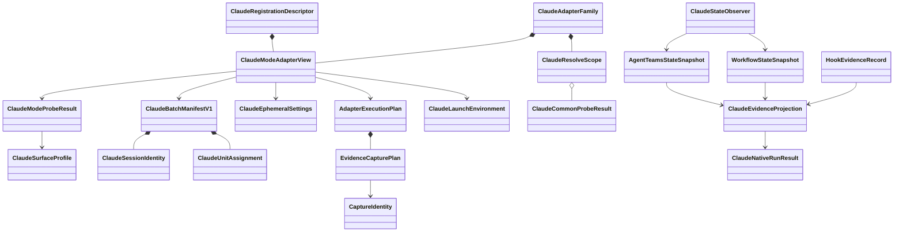

# Claude Native Driver ドメインエンティティ

## モデリング方針と上流参照

U-03はprovider adapterのimmutable value、versioned parser、短命observerを定義する。attempt/checkpoint/refereeのpersistent aggregateはU-02/C-11が所有するため、新しいdomain storeやdaemonは作らない。

| 上流成果物 | entityへの反映 |
|---|---|
| `unit-of-work.md` | C-05、2 mode、Claude slot、他provider非所有 |
| `unit-of-work-story-map.md` | Teams/Ultra/unknown/legacy/resume scenario |
| `requirements.md` | native proof、confidentiality、live acceptance |
| `components.md` | adapterとevidence verifierの責務分離 |
| `component-methods.md` | `DriverAdapter`、`ProbeResult`、`LaunchSpec`、event v1 |
| `services.md` | one process、exact provider state、cleanup/resume |

U-03固有entityは生provider payloadを保持しない。parse中のraw bytesはadapter stack内のephemeral bufferだけであり、domain constructorへ渡す前にallowlist projectionする。

## Claude production descriptor

driver-keyed set、cardinality、slot、production mappingはU-01/U-02が所有する。U-03はgeneric entityを訂正せず、次のClaude固有descriptorだけを構築する。

```text
ClaudeRegistrationDescriptor
  provider = claude
  adapters:
    claude-agent-teams -> immutable Agent Teams view
    claude-ultracode -> immutable Ultra Code view
  descriptorDigest
```

U-02のfactoryがdescriptorを既存Claude slotへ投影し、全provider cardinalityを検証する。U-03 constructorはClaude以外のdriver、重複、欠落、mutable viewを拒否するが、generic registration typeやcomposition rootを生成しない。

smart constructorはdeclared driver setとmap keyの完全一致、adapter.driverとkey一致、重複/余分/欠落0件、Claude=2、Codex/Kiro=1のcardinalityを検証する。U-03はClaude setへ2 mode viewを格納し、他provider mapping/literalを変更しない。runtimeでadapter.driverを書き換えない。

## ClaudeAdapterFamily

`ClaudeAdapterFamily`はC-05の1 provider moduleを表し、2つのmode-bound viewとresolve-scope probeを束ねる。

```text
ClaudeAdapterFamily
  scope: ClaudeResolveScope
  commonProbe: SharedProbePromise
  agentTeams: ClaudeModeAdapterView
  ultraCode: ClaudeModeAdapterView
```

`ClaudeModeAdapterView`だけが共通`DriverAdapter`を実装する。

```text
ClaudeModeAdapterView
  driver: claude-agent-teams | claude-ultracode
  mode: agent-teams | dynamic-workflow
  familyId: opaque in-memory identity
  supports(harness)
  probe(input)
  prepareResources(input): AdapterResourcePreparation
  buildExecution(input, resources: MaterializedAuxiliaryResourceSet): AdapterExecutionPlan
  normalize(inputs: EvidenceInputs, context)
```

viewは構築後immutableであり、呼出し中に`driver`を切り替えない。familyは同じ共通probe promiseを使うが、mode-specific result/normalizer/state observerを共有しない。production registry外へfamily typeを公開せず、他providerがClaude branchをimportしない。

## ClaudeResolveScope

```text
ClaudeResolveScope
  scopeId: ephemeral opaque value
  batch: integer
  projectIdentityDigest: sha256
  createdAtMonotonic: number
  commonProbeState: idle | running | completed
  disposed: boolean
```

scopeは`probing` attemptのin-memory lifetimeだけを持つ。attempt IDやnonceの正本はU-02 checkpointであり、scopeをresumeへserializeしない。batch/project identityをglobal cache keyにせず、dispose後のprobe/readを拒否する。これにより同じbatchを新attemptで再開した場合もfresh probeになる。

## ClaudeDriverModeとmode identifier

```text
ClaudeDriverMode =
  agent-teams:
    driver = claude-agent-teams
    modeIdentifier = claude-agent-teams-v1
  dynamic-workflow:
    driver = claude-ultracode
    modeIdentifier = claude-dynamic-workflow-v1
```

driver IDは公開selection、mode identifierはprovider behavior schemaを示す。`claude-dynamic-workflow`は0.1.x legacy execution IDであり、`claude-dynamic-workflow-v1` mode identifierや`claude-ultracode` driver IDと混同しない。

## ClaudeCommonProbeResult

```text
ClaudeCommonProbeResult
  status: available | unavailable | error
  cliVersion: semver
  authTransport: oauth-keychain | api-key | bedrock | vertex | foundry
  streamSchemaProfile: profile ID
  hookSentinelVerified: boolean
  checks: cli/auth/handshake records
  reason: closed FallbackReason
```

`authTransport`は必要env allowlist選択のenumであり、credential value、account、email、organizationを持たない。availableはCLI、auth、stream init、terminal event、hook sentinelのANDである。

## ClaudeModeProbeResult

```text
ClaudeModeProbeResult
  driver: Claude native driver
  modeIdentifier: fixed ID
  status: available | unavailable | error
  surfaceProfileId: ClaudeSurfaceProfile ID
  checks: mode/evidence-surface/handshake records
  reason: closed FallbackReason
```

commonとmode resultを結合して上流`ProbeResult`へ投影する。common failure時もmode IDを偽ってavailableにせず、mode固有probeは実行しない。

## ClaudeSurfaceProfile

external CLI schemaをclosed parserへ変換するversioned valueである。

```text
ClaudeSurfaceProfile
  schemaVersion: 1
  profileId: claude-2.1.205-v1 等
  cliVersionRange: inclusive semver range
  mode: agent-teams | dynamic-workflow
  requiredCapabilities: sorted literal set
  streamPaths: allowlisted JSON paths
  providerStatePaths: allowlisted JSON paths
  hookPaths: allowlisted JSON paths
  stateLocationRule: exact derivation rule
  fixtureDigest: sha256
```

profileはfield pathと型だけを保持する。sample prompt、result、credential、absolute home、transcript、scriptを含むfixtureはconstructorで拒否する。unknown CLI version/capability/pathは近似profileへfallbackしない。

Agent Teams profileは公式hook schemaとsession-derived team layoutを扱う。Dynamic Workflow profileはcredentialed discoveryで確定したrun/task/agent pathを扱い、未確定profileは`available`にできない。

## ClaudeSessionIdentity

```text
ClaudeSessionIdentity
  sessionId: UUID
  sessionIdHash: sha256
  expectedTeamName: session-<first 8 hex>
  prefixCounter: 0..255
  prefixReservation: ClaudePrefixReservationProjection
  executionId: bound external ID
  attemptId: bound external ID
  waveDigest: bound external digest
```

session UUIDは固定namespaceに対するUUIDv5で`executionId + attemptId + waveDigest + prefixCounter`から導出する。同一attempt/wave/counterでは決定的、別attemptでは異なる。UUIDそのものはprovider launch/correlationに使い、共有auditにはhashだけを出す。

`expectedTeamName`は公式layoutから導出する値であり、providerへ任意team名として指定しない。U-03はcounter順のreservation/guarded path候補をpureに構築し、U-02がatomic reservationとdirect `lstat`を行って両pathが不存在の候補だけをmaterializeする。counter、full UUID hash、prefix、path digest、reservation receiptをdispatch前checkpointへ束縛する。既存pathは削除・再利用せず、256候補枯渇はhard errorである。

`ClaudePrefixReservationProjection`はU-02の`MaterializedAuxiliaryResourceSet`からだけ構築し、prefix、selected candidate index、lock path digest、owner process identity hash、lease/fencing、team/task path digestを持つ。U-03自身はroot directory scan、reservation、stale lock回収を行わない。Amadeus外raceはU-02のarm直前再検査とfull session/token相関でfail-closedにする。

```text
ClaudePrefixReservationProjection
  resourceId
  selectedCandidateIndex: 0..255
  prefix
  lockPathDigest
  ownerProcessIdentityHash
  leaseId / fencingToken
  teamPathDigest / taskPathDigest
  resourceReceiptDigest
```

## ClaudeBatchManifestV1

```text
ClaudeBatchManifestV1
  v: 1
  driver/modeIdentifier
  executionId/attemptId/attemptNonceHash/planDigest
  waveIndex/waveDigest/sessionId
  units: ClaudeUnitAssignment[]
  convergenceCommand
  protectedSpecPath?: path
```

`ClaudeUnitAssignment`は次を持つ。

```text
ClaudeUnitAssignment
  unit: canonical Unit slug
  assignmentToken: short base32 digest
  worktreePath: prepared realpath
  dependencyUnits: canonical sorted Unit slugs
```

manifest constructorはexpected Unitsとの全単射、2 Unit以上、重複path/token 0件、worktree ownership/base bindingを検証する。convergence commandとpathはClaude provider入力には必要だが、normalized evidence/auditへ投影しない。

## ClaudeLaunchEnvironment

```text
ClaudeLaunchEnvironment
  runtimeKeys: fixed key/value map
  correlationKeys: fixed key/value map
  modeKeys: fixed key/value map
  authKeys: transport-specific fixed key/value map
```

domain valueはkey集合を検証するが、`toRedactedJSON()`はkey name classとcountだけを返し、valueを返さない。未知key、全env spread、別provider keyを拒否する。

auth transport別allowlistはversioned constantである。OAuth/keychain、API key、Bedrock、Vertex、Foundryを別variantにし、variant間のkey unionを一括継承しない。credential値はchild spawnまでin-memoryにだけ存在する。

## ClaudeEphemeralSettings

```text
ClaudeEphemeralSettings
  v: 1
  mode: ClaudeDriverMode
  evidenceHookPath: confined framework path
  evidenceDir: attempt-owned confined path
  enabledHookEvents: exact enum set
  fileMode: 0600
  contentDigest: sha256
```

設定にはmodel/provider/credential/promptを置かない。Agent TeamsはTaskCreated、TaskCompleted、TeammateIdle、UltraはSubagentStart、SubagentStop、Stopを配線する。mode別handshakeでhook sentinelを確認し、Agent TeamsのPTY bytesやUltraのassistant resultをhookの代替にしない。

これはfilesystem entityではなく、`attempt-owned-file(mode=0600)`へ渡すimmutable content valueである。path選択、file作成、owner marker、cleanupはU-02の`AuxiliaryResourceSupervisor`だけが行う。

## AdapterExecutionPlanとEvidenceCapturePlan

```text
AdapterResourcePreparation
  resources: AuxiliaryResourcePlan[]
  preparationDigest: sha256

AdapterExecutionPlan = U-01-owned / U-02-consumed common contract
  launch: LaunchSpec
  capture: EvidenceCapturePlan
  captureIdentity: executionId / attemptId / planDigest / waveIndex / waveDigest
  resources: AuxiliaryResourcePlan[]

EvidenceCapturePlan
  fixed-provider-path(initialBinding, hookDir)
  | event-bound-provider-path(hookDir)
  | hook-only(hookDir)
```

adapterはpure `prepareResources`でprefix reservation、settings file、evidence/hook/snapshot directoryを宣言する。U-02が返す`MaterializedAuxiliaryResourceSet`を受けたpure `buildExecution`だけが具体的launch/capture planを構築し、polling、reservation、file write、cleanupを開始しない。`AdapterExecutionPlan.resources`はpreparationと同じ集合/digestである。U-02 `EvidenceCaptureSupervisor`がresource receipt、plan digest、capture IDをcheckpointへ束縛し、resource materialize → capture start → CaptureIdentity checkpoint → provider arm → provider group terminal → capture stopAndWait → owned cleanupを強制する。

Agent TeamsはU-02がmaterializeしたselected candidateのteam/task pathとsource plan digestから、`fixed-provider-path.initialBinding`をarm前に純粋構築する。Ultraは`event-bound-provider-path`でcaptureを未bound開始し、allowlisted workflow-created eventからrun IDを得た後だけ`EventBoundCaptureBinding`を作る。U-03はU-02のvariant、checkpoint、resource lifecycle、self-edgeを変更しない。

```text
EventBoundCaptureBinding
  captureId / profileId
  sessionIdHash / nativeRunId
  resolvedStatePathDigest
  bindingEventDigest
  confinementRootDigest
```

U-02はresolver/profile/confinementを再検証し、bindingをaudit-first checkpointへ保存してからexact state pathのpollingを有効にする。binding前のdirectory scan/read、binding欠落時の最新run推測は禁止する。

```text
CaptureIdentity
  captureId
  ownerProcessIdentityHash
  planDigest
  fencingToken
  startedAtMonotonic

EvidenceInputs
  processStream
  providerStateStream
  hookRecordStream
  providerTerminalIdentity
  captureTerminalIdentity
```

3 streamは別sourceであり、同じraw payloadから複製しない。observer停止不能、capture terminal不一致、snapshot欠落ではnormalizerへsuccessful inputを渡せない。

## AgentTeamsStateSnapshot

```text
AgentTeamsStateSnapshot
  v: 1
  sessionIdHash
  teamIdentityDigest
  members: TeamMember[]
  tasks: TeamTask[]
  observedAtMonotonic
  snapshotDigest
```

`TeamMember`:

```text
TeamMember
  teammateName: safe provider identifier
  agentId: safe provider identifier
  agentType: allowlisted identifier
```

`TeamTask`:

```text
TeamTask
  taskId: safe provider identifier
  unit: Unit slug derived from assignment token
  assignmentToken
  ownerTeammateName
  status: pending | in-progress | completed
  dependencyTaskIds: sorted identifiers
```

safe provider identifierは長さ・文字classを制限し、生textやpath separatorを拒否する。snapshotはraw config/task JSONを保持しない。tasksにunknown subjectが存在してもexpected Unit bindingへ混入させず、extra native taskとしてevidence failureにする。

## AgentTeamsHookObservation

```text
AgentTeamsHookObservation =
  task-created(sessionIdHash, taskId, assignmentToken, teammateName?)
  task-completed(sessionIdHash, taskId, assignmentToken, teammateName?)
  teammate-idle(sessionIdHash, teammateName)
```

hook payloadの`team_name`はdeprecatedなのでidentityに使わない。task descriptionとlast messageを型に含めない。hook observationとprovider snapshotのtask/member joinが成立しない場合、eventを推測補完しない。

## WorkflowStateSnapshot

```text
WorkflowStateSnapshot
  v: 1
  sessionIdHash
  runId: safe provider identifier
  tasks: WorkflowTask[]
  status: running | completed | failed
  stateLocationDigest
  observedAtMonotonic
  snapshotDigest
```

`WorkflowTask`:

```text
WorkflowTask
  taskId: safe provider identifier
  agentId: safe provider identifier
  assignmentToken
  unit: Unit slug
  status: pending | running | completed | failed
```

generated workflow script、agent prompt/result、token usageは型外である。state locationはstream-derived run/sessionに対するprofile ruleから一意に得たpathだけを許し、directory scan結果をconstructorへ渡せない。

## WorkflowHookObservation

```text
WorkflowHookObservation =
  workflow-created(sessionIdHash, runId)
  subagent-started(sessionIdHash, agentId, agentType)
  subagent-stopped(sessionIdHash, agentId, agentType)
  coordinator-stop(sessionIdHash, inFlightWorkflowIds, exitCode)
```

SubagentStopの`last_assistant_message`とtranscript pathは入力parserが読み捨て、entityへ存在しない。`coordinator-stop`はin-flight workflowが0件の場合だけcompleted coordinator eventへ投影できる。

## ClaudeEvidenceProjection

U-03固有stateをC-08の共通`NormalizedDriverEvent`へ変換するpure projectorである。

| U-03 source | 共通event |
|---|---|
| common/mode handshake | `mode-confirmed` |
| stream `system/init` | `coordinator-started` |
| AgentTeams snapshot | `native-state-observed(source=provider-state)` |
| member/task初観測 | `native-child-started(source=provider-state)` |
| TaskCompleted + TeammateIdle | `native-child-stopped(source=stream, completed)` |
| Teams state/stream join | `native-coordination(claude-team-membership / claude-shared-task)` |
| Workflow snapshot | `native-state-observed(source=provider-state)` |
| SubagentStart/Stop | `native-child-started/stopped(source=stream)` |
| workflow run join | `native-coordination(claude-workflow)` |
| terminal stream | `coordinator-stopped` |

全eventへNormalizeContextのdriver、execution/attempt、nonce hash、plan/wave digestをコピーし、source dataから上書きさせない。native run IDはTeamsではsession ID hash、Ultraではworkflow run IDを使う。

## ClaudeStateObserver

短命I/O portでありdomain aggregateではない。C-05はprofile/parserを提供し、start/stop順序とidentity/fencingはU-02 `EvidenceCaptureSupervisor`が所有する。

```text
ClaudeStateObserver
  start(expected identity, profile, evidence dir)
  observeUntil(provider group terminal)
  lastValidSnapshot()
  stopAndWait()
```

observerは次を保証する。

- arm前に開始し、exact pathだけをpollする。
- symlink拒否、realpath confinement、current-user ownership、size上限。
- partial writeはretryし、schema valid snapshotだけをatomic replace。
- provider group terminalとobserver stopをjoinしてからsnapshotを返す。
- raw bytesはparse後zero/reference releaseし、scratchへ書かない。

observer停止不能、cleanup前snapshot欠落、path confinement failureはevidence failureであり、empty snapshotへ変換しない。

## HookEvidenceRecord

```text
HookEvidenceRecord
  v: 1
  eventId: UUID/digest
  sessionIdHash
  attemptNonceHash
  event: closed AgentTeams/Workflow hook variant
  observedAtMonotonic
```

hookは`<evidenceDir>/hook/<eventId>.json`をexclusive createし、既存fileを上書きしない。event ID衝突でpayloadが同一ならduplicate、異なればtamperとして拒否する。shared append fileを使わない。

## ClaudeNativeRunResult

```text
ClaudeNativeRunResult
  driver/modeIdentifier
  sessionIdHash
  nativeRunId
  profileId/fixtureDigest
  normalizedEvents
  unknownEventCount
  coordinatorExitCode
  cleanupStatus: clean | quarantined
```

resultはC-08 verifier入力でありsuccess verdictではない。`cleanupStatus=quarantined`、unknown required event、non-zero exitは`ok`へ投影できない。Unit成果やmerge verdictはC-08/C-11側の別entityである。

## Error model

| Error code | Timing | 意味 |
|---|---|---|
| `CLAUDE_CLI_UNAVAILABLE` | probe | executable/version不成立 |
| `CLAUDE_AUTH_UNAVAILABLE` | probe | logged-in transportを確認不能 |
| `CLAUDE_STREAM_HANDSHAKE_FAILED` | probe | init/terminal schema不成立 |
| `CLAUDE_HOOK_CAPTURE_UNAVAILABLE` | probe | sentinel hook不成立 |
| `CLAUDE_AGENT_TEAMS_SURFACE_UNAVAILABLE` | probe | experimental/in-process/team state surface不成立 |
| `CLAUDE_ULTRACODE_SURFACE_UNAVAILABLE` | probe | ultracode/workflow surface不成立 |
| `CLAUDE_SURFACE_PROFILE_UNKNOWN` | probe/dispatch | CLI/schema profileなし |
| `CLAUDE_STATE_PATH_REJECTED` | dispatch | exact path/confinement/ownership違反 |
| `CLAUDE_STATE_SNAPSHOT_MISSING` | dispatch | cleanup前valid snapshotなし |
| `CLAUDE_UNIT_BINDING_MISMATCH` | verify | Unit-child/task全単射不成立 |
| `CLAUDE_NATIVE_CHILD_INCOMPLETE` | verify | start/completed stop欠落 |
| `CLAUDE_UNKNOWN_NATIVE_EVENT` | dispatch | allowlist外schema。件数だけ保持 |
| `CLAUDE_EVIDENCE_CLEANUP_FAILED` | cleanup | raw/scratch残存を否定不能 |

error detailはdriver、mode、CLI/profile version、expected/actual count、列挙codeだけを持つ。env値、argv全体、prompt、raw JSON、path、stack、provider messageを持たない。pre-dispatch errorだけがU-01 fallback reasonへ写像でき、dispatch後errorはU-02 `ExecutionFailureCode`へ写像する。

## Entity関係



テキスト代替: adapter familyはresolve scopeと2 mode viewを所有し、viewがprobe profile、manifest、settings、envを構築する。state observerとhook recordはmode固有snapshotを生成し、pure evidence projectorが共通event/resultへ変換する。共通verifier/checkpoint/refereeはU-03 entityの外側にある。

## Ownership境界

| 所有物 | U-03 | 他Unit |
|---|---|---|
| generic driver-keyed adapter set | 変更しない | U-01 type、U-02 assembly/cardinality |
| Claude registration descriptor／adapter family／mode view／profile/parser | 実装・test | generic adapter contractを消費 |
| Claude production slot | unavailableから2-adapter available setへ置換 | U-02 assembly、U-06 completeness検査 |
| session/team/workflow observer parserとhook | 実装・projection | U-02 capture supervisor/checkpoint/start-stop |
| normalized Claude event | 生成 | C-08がAND verdict |
| selector/topology/fallback | 所有しない | U-01/U-02 |
| process identity/arm/fencing/resume | 所有しない | U-02 |
| check/finalize/merge | 所有しない | C-11/U-02 |
| Codex/Kiro adapter/slot | 変更しない | U-04/U-05 |
