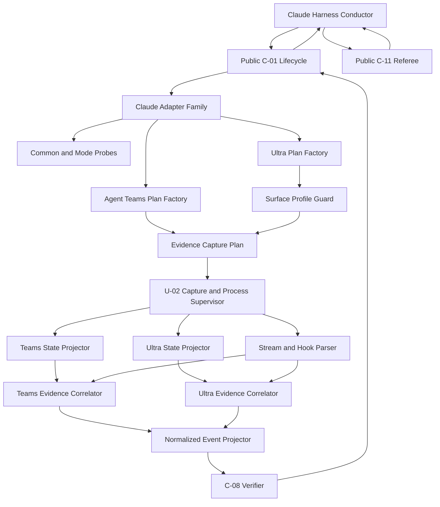

# Claude Native Driver Logical Components

## 入力契約とcomponent boundary

本設計は`performance-requirements.md`、`security-requirements.md`、`scalability-requirements.md`、`reliability-requirements.md`、`tech-stack-decisions.md`、`business-logic-model.md`を消費し、U-03のNFRをC-05 adapter/profile/parser/hookとClaude harness projectionへ割り当てる。C-05はpure execution/capture planとnormalized evidenceを提供し、selector、attempt store、process/capture supervisor、C-08 verdict、C-11 referee、mergeを所有しない。

## Component inventory

| Component | Responsibility | State/I/O | Primary NFR |
|---|---|---|---|
| `ClaudeAdapterFamilyFactory` |共通familyと2 immutable mode viewをfresh scopeへ構築 | scope-local | registration/reliability |
| `ClaudeDriverAdapterSetAssembler` | Claude driver exactly 2、duplicate/missing拒否 | static composition | reliability/scale |
| `ClaudeResolveScope` | CLI/auth common probe Promiseをscope内だけ共有 | short-lived process port | performance |
| `ClaudeModeProbe` | Teams/Ultra flag、hook/profile capabilityを別々に判定 | probe port | reliability |
| `ClaudeAuthTransportProjector` | closed transport別child env allowlist | raw auth statusは即時破棄 | security |
| `ClaudeSessionPrefixAllocator` | 256候補lock、team/task exact path reservation | lock/path port | security/scale |
| `ClaudeBatchManifestProjector` | Unit manifest、assignment token、stdin bytes | pure value | security/performance |
| `ClaudeEphemeralSettingsFactory` | attempt-owned 0600 settingsとhook配線 | attempt scratch | security |
| `AgentTeamsExecutionPlanFactory` | in-process/session/env/Teams fixed-path capture plan | pure plan | native proof |
| `UltraExecutionPlanFactory` | ultracode/profile/stream-bound capture plan | pure plan | native proof |
| `ClaudeSurfaceProfileGuard` | version/event/path/typeのclosed profile検証 | immutable fixture | security/reliability |
| `AgentTeamsStateProjector` | exact team/task snapshotをmember/task allowlistへ変換 | provider-state input | security |
| `UltraStateProjector` | bound run stateをtask/worker allowlistへ変換 | provider-state input | security |
| `ClaudeStreamEventParser` | stream-json/hookをmode別closed eventへ変換 | streaming input | performance/security |
| `ClaudeHookRecordGuard` | session/nonce/ownership/replayを検証 | exclusive event files | security |
| `AgentTeamsEvidenceCorrelator` | Unit-task-memberとcreated/completed/idleをAND結合 | call-local index | reliability/scale |
| `UltraEvidenceCorrelator` | Unit-task-agentとworkflow/start/stopをAND結合 | call-local index | reliability/scale |
| `ClaudeNormalizedEventProjector` | C-08向けversioned redacted eventを生成 | pure output | observability/security |
| `ClaudeHarnessConductorProjection` | public C-01/C-11のJSON二相順序を記述 | harness prose/generated projection | boundary/reliability |

## Interaction and dependency direction

テキスト代替: Claude conductorはpublic C-01を通じてC-05 familyを利用する。mode planはU-02 supervisorへpure capture/launch contractを渡し、supervisorが集めた独立provider-stateとstream/hookをmode projector/correlatorがAND結合してC-08へ渡す。conductorだけがpublic C-11を呼び、C-01とC-11のrequest/result JSONを媒介する。

C-05からU-02/C-08/C-11への直接process/state ownershipはない。C-05はplan/parser/valueをexportし、U-02がcapture/process lifecycle、C-08がverdictを所有する。C-01とC-11のsource import/invoke edgeは両方向0件であり、conductorだけがversioned JSONで双方のpublic commandを順序付ける。

## Failure domains and blast radius

| Failure domain | Containment owner | Blast radius | Forbidden success |
|---|---|---|---|
| common/mode probe | resolve scope | selected resolve | version/flagだけのavailable |
| prefix/path collision | prefix allocator | Agent Teams wave |既存team/task adoption |
| settings/hook spoof | settings factory/record guard | attempt capture | raw/replayed event採用 |
| Teams state/stream mismatch | Teams correlator | Agent Teams attempt |片系/部分Unit success |
| Ultra profile/path drift | profile guard | Ultra attempt/profile | xhigh/floor/latest-path代替 |
| capture stop/snapshot failure | U-02 supervisor | provider run | terminal evidence生成 |
| unknown/extra child | mode correlator/C-08 | provider run | partial native success |
| referee failure | conductor/C-11 | batch | native evidence単独success |

2 mode viewはcommon probe Promise以外のmutable stateを共有しない。session/run、prefix lock、evidence directory、settings、hook record、capture bindingはattempt/waveごとに隔離する。

## Ownership and verification seams

| Concern | Sole owner | Architecture/contract verification |
|---|---|---|
| driver selection/checkpoint | C-01/U-02 | C-05からstore write/import 0 |
| Claude argv/env/capture plan/profile/parser | C-05 | mode-bound snapshot/property test |
| capture start/arm/stop/join | U-02 supervisor | lifecycle trace、hidden polling closure 0 |
| native evidence verdict | C-08 | C-05はclosed eventだけを返す |
| prepare/check/finalize/merge | C-11 | C-05/C-01からdirect call 0 |
| C-01/C-11二相transport | Claude conductor | request/finalize/result order test |

production registry testはClaude setの2 adapterとCodex/Kiro各1 cardinality、両Claude driverのpublic C-01 probe/runを検証する。source graph testはC-01↔C-11 direct edge、C-05内process supervisor/worker pool、global settings mutation、dynamic plugin/SDK dependencyを各0件にする。

## Implementation placement and infrastructure bridge

authored adapter/profile/parser/hookは`packages/framework/core/`の既存tool/harness構造、conductor projectionはClaude skill sourceへ置き、`scripts/package.ts`でdist/self-installへ生成する。generated treeを正本にしない。testsは`bun:test`、fast-check、fake CLI/temp HOME、macOS opt-in live fixtureを既存`tests/`へ配置する。

Infrastructure Designへ渡すprovisioning componentは0件である。

| Infrastructure concern | Decision |
|---|---|
| compute | Agent Teamsはinteractive `claude`、Ultra Codeはheadless `claude -p` coordinatorとnative child。専用serviceなし |
| network/API/SDK |既存CLI transportのみ。direct API/SDKなし |
| database/cache/queue |非適用。attempt-owned local scratchのみ |
| IAM/KMS/secret store |非適用。既存CLI authをenv allowlistで利用 |
| autoscaling/load balancer |非適用。provider native schedulerの所有外 |
| monitoring resource |非適用。redacted audit/live evidence indexへhandoff |
| cloud cost |新規resource 0、増分固定費0 |

AWS Well-Architectedの適用結果は、managed resourceを新設せず、least-data child boundary、attempt isolation、fail-closed profile、waste 0である。架空のIaCを追加しない。

## Review

必須のarchitecture reviewerが本節へ結果を追記する。

### Iteration 1

- Verdict: **READY**
- Blocking findings: **0**

実装を阻害するarchitecture findingはない。`ClaudeAdapterFamilyFactory`と`ClaudeDriverAdapterSetAssembler`は、driver-keyedなClaude exactly 2件のimmutable mode viewをfresh resolve scopeへ構築し、共有mutable stateをcommon probe Promiseだけに限定している。production registry testもClaude 2件、Codex/Kiro各1件のcardinality、duplicate/missing拒否、両Claude driverのpublic C-01 probe/runを固定している。

C-05はmode-bound execution/capture plan、surface profile、state/stream/hook parser、normalized event projectionを所有し、capture start/arm/stop/joinとprocess groupはU-02、native verdictはC-08が所有する。capture planとidentityをcheckpointへ束縛してからproviderをarmし、group terminal後にcaptureをjoinしてからnormalize/verdictへ進む順序がperformance/reliability設計にも一致する。

Agent Teamsは予約済みsession由来のteam/task exact pathとassignment tokenを使い、provider-stateのUnit-task-member全単射とstream/hookのcreated/completed/idleをIDでAND結合する。Ultraはversion-bound profileとstream-bound run exact pathを使い、provider-stateのUnit-task-agent全単射とworkflow marker／SubagentStart／SubagentStopをAND結合する。片系、missing/extra/duplicate child、xhigh、floor、通常Agent tool、自己申告はnative successへ代替されない。path/profileを確定できないUltraはparkし、root scan、mtime newest、permissive parserで補完しない。

Claude conductorだけがpublic C-01とpublic C-11をversioned request/result JSONで順序付け、両者のsource import/invoke edgeは双方向0件である。C-05からC-11へのmerge/referee ownershipもなく、architecture testと二相order contract testが境界の再侵入を検出する。新規service、database、queue、SDK/API client、dynamic plugin、global settings mutationも導入しない。
