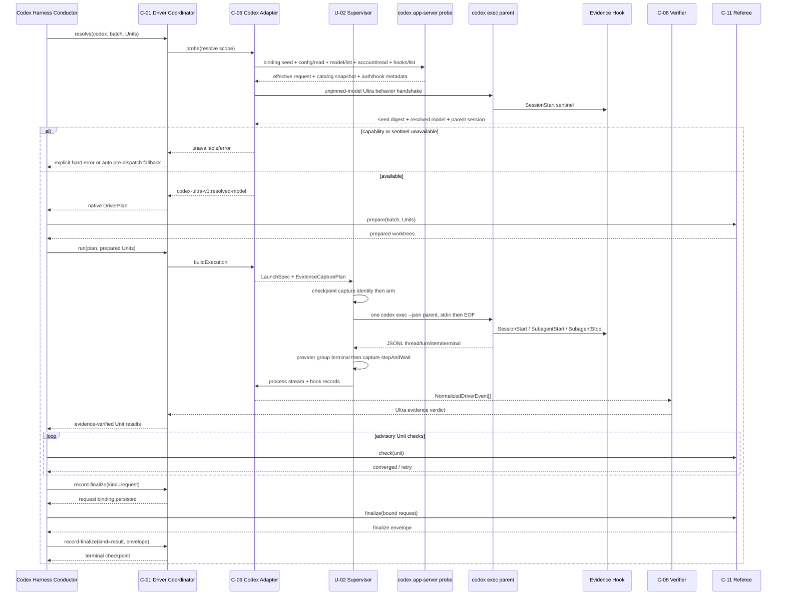

# Codex Native Driver ビジネスロジックモデル

## 上流トレーサビリティ

本成果物は`unit-of-work.md`のU-04境界、`unit-of-work-story-map.md`の4 acceptance slice、`requirements.md`のFR-05〜FR-06、FR-13、FR-15、FR-19、FR-23、NFR-02、NFR-04、NFR-11を具体化する。Application Designの`components.md`はC-06/C-08、`component-methods.md`はadapter/evidence union、`services.md`はbatch 1 processとCodex hook contractを定義している。

2026-07-13時点の公式surfaceとlocal検証から、次を設計前提とする。

- `codex exec --json`は`thread.started`、turn、item、terminal eventをJSONLで出す。
- hook共通fieldは`session_id`とactive `model`を持ち、SubagentStart/Stopは`agent_id`と`agent_type`を持つ。subagent hookの`session_id`はparent session IDである。
- app-serverの`config/read`はeffective config、`model/list`はmodelごとの`supportedReasoningEfforts`を返す。
- app-serverのauthoritative collaboration item（公式意味名`collabToolCall`、0.144 generated schemaのconcrete union名`collabAgentToolCall`）は`senderThreadId`、`receiverThreadIds`、tool call `status`、child別`agentsStates.status`を持つ。wire type/pathはcredentialed fixtureでprofile化し、名称だけから推定しない。
- `shell_environment_policy`はmodelが起動するsubprocessへ渡すenvを`inherit="none"`から構築できる。provider/hook用envをtool envと分離するため、この公式surfaceを必須にする。
- local `codex-cli 0.144.0`では`gpt-5.6-sol`が`ultra`を列挙し、Ultraをautomatic task delegationとして説明する。
- `features.multi_agent`とhooksはstableかつenabledである。ただしfeature flagだけを実行証跡にはしない。

## 責務境界

C-06はCodex固有のcapability probe、launch/capture plan、raw eventのclosed projectionだけを所有する。C-01/C-09/C-10のselection、checkpoint、audit、U-02 supervisorのprocess fencing、C-08の共通証跡判定、C-11のworktree収束／mergeを再実装しない。

U-03 reviewで精緻化したgeneric contractをそのまま使う。

```text
DriverAdapterSet(provider=codex)
  adaptersByDriver = { codex-ultra -> CodexUltraAdapterView }
  cardinality = exactly 1

CodexUltraAdapterView.buildExecution(input)
  -> AdapterExecutionPlan
       launch: LaunchSpec
       capture: EvidenceCapturePlan
       planDigest
```

Codex registrationはClaudeの2-view特殊形を模倣せず、exactly 1のimmutable viewをU-02のCodex slotへ格納する。他provider slot、driver literal、selector順序を変更しない。

## End-to-end lifecycle



テキスト代替: Codex harnessはC-01とC-11を直接接続せず、conductorがresolve、prepare、run、check、record-finalize request、finalize、record-finalize resultを順に媒介する。C-06はapp-serverで能力を調べ、behavior handshakeでhookを実証する。実runではU-02がcaptureをproviderより先に開始し、1つのCodex parentと複数subagentの証跡を集め、C-08とC-11の両方がgreenになった後だけ成功する。

## Capability probeアルゴリズム

### Probe scopeとbinding

probeはbatch/attemptのresolve scope内で1回だけ実行し、結果をprocess外へcacheしない。resumeはfresh app-serverとfresh behavior handshakeを使う。

alias/default modelの循環を避け、別configの結果合成を防ぐため、`ProbeBindingV1`を二相で構築する。

```text
ProbeBindingV1.pending
  bindingId / nonceHash
  executionId / attemptId / resolveScopeId
  cliVersion / surfaceProfileId
  cwdDigest / projectIdentityDigest
  providerId / requestedModelOrDefault
  requiredOverrides = effort:ultra + multi_agent:true + hooks:true
  hookDefinitionSetDigest / catalogSnapshotDigest
  seedDigest

ProbeBindingV1.bound
  all pending fields
  resolvedModelId / catalogRowDigest
  behaviorSessionDigest
  finalDigest
```

app-server invocation前にはresolve scope、nonce、CLI/cwd/project、要求overrideを固定し、同じconnectionのconfig/hook/catalog responseだけを受け入れる。そのclosed projectionからpendingの`seedDigest`を一度だけsealし、modelをpinしないbehavior handshakeとSessionStart sentinelへseed/nonceを渡す。handshake後にresolved modelをseed済みcatalog snapshotへexact matchし、boundへ一度だけ遷移する。本runは`seedDigest`と`finalDigest`の両方を持ち、actual SessionStartも両digest、model、nonceを照合する。異なるcwd/provider/config/hook/catalogの部分結果を合成できない。

| 順 | Check | 公開surface | Timeout | 成功条件 |
|---:|---|---|---:|---|
| 1 | CLI | `codex --version` | 5秒 | executable、parse可能version、exit 0 |
| 2 | app-server initialize | JSON-RPC stdio | 5秒 | initialize/initialized完了、protocol errorなし |
| 3 | effective config | resolve scope/nonce付き`config/read(cwd)` | 5秒 | provider/model requestが取得可能、override後effort=`ultra` |
| 4 | model catalog | 同じapp-serverの`model/list(includeHidden=true)` | 10秒 | config/hook/catalog projectionからseedをsealできる |
| 5 | auth | `account/read(refreshToken=false)` | 10秒 | 選択providerでrun可能なauth state。email/tokenはprojection前に破棄 |
| 6 | feature/hook | `experimentalFeature/list`、versioned `hooks/list` profile | 10秒 | multi_agent/hooks enabled、必要3 eventのexact definition hashがtrusted/enabled |
| 7 | behavior handshake | model未pinの`codex exec --json --ephemeral` | 30秒 | seed/nonce付きUltra overrideを受理しexit 0、SessionStart sentinelがexact model/sessionを記録 |

1候補の総deadlineは既存contractどおり45秒とし、各stepは残りdeadlineを超えない。app-serverは必要responseを得たらstdinをcloseしてwaitし、daemon化しない。

### Effective model resolution

1. app-serverを`model_reasoning_effort="ultra"`、`features.multi_agent=true`、`features.hooks=true`のsession override付きで起動する。model slug自体はoverrideしない。
2. `config/read`からprovider IDとrequested model/defaultをallowlistし、CLI/cwd/override/hook definitionとともにpending bindingへ入れる。credential、endpoint header、全configは取り込まない。
3. 同じapp-server connectionの`model/list`をclosed projectionし、全candidateのallowlisted snapshot digestをpending bindingへ入れて`seedDigest`を確定する。
4. behavior handshakeは`--model`を渡さず、同じconfig layer、Ultra/multi-agent/hook override、seed digest、nonceで起動する。これによりalias/defaultをCLI自身に解決させる。
5. SessionStart hookのexact model IDをseed済みsnapshotの`id`または`model`へexact matchする。部分一致、prefix、display name一致は禁止する。
6. exact rowの`supportedReasoningEfforts[].reasoningEffort`に`ultra`が1件だけ存在することを確認し、row digestとbehavior session digestでbindingをboundへ遷移する。
7. mode identifierを`codex-ultra-v1:<resolved-model-id>`として生成する。本runだけに`--model <resolved-model-id>`を渡し、actual SessionStartのmodel/seed/final digest一致までmode-confirmedを発行しない。

catalogの説明文は人向けdiagnosticに使えるが、判定はliteral `ultra`だけで行う。CLI versionはprofile選択の診断情報であり、version番号だけでavailableにしない。

### Behavior handshake

handshakeはgit/application fileを変更せず、toolを使わない固定応答をstdinで要求する。probe専用evidence directoryを0700、owner markerを0600で作成し、nonce hashをenvへ渡す。SessionStart hookが次の最小recordをatomic生成することを要求する。

```text
probe-session-start-v1
  event = session-start
  sessionId
  resolvedModelId
  captureId
  probeBindingSeedDigest
  nonceHash
  ownerToken
```

stdoutのagent message本文は保存せず、JSONLのthread ID、terminal status、hook recordだけをprojectionする。hook未trusted、skip、capture/seed/owner/wrong model/nonce不一致、exit nonzeroはavailableにしない。owner tokenはseal時に破棄し、永続projectionにはdigestだけを残す。このhandshakeはprovider processを1つ起動するが、Unit worktree、native worker、referee prepareより前である。

## Unit role binding

### Assignment token

各Unitのassignment tokenはU-03と同じ非機密相関方式を使う。

```text
assignmentToken = base32(
  sha256(executionId, attemptId, planDigest, waveDigest, unitSlug)
)[0..19]
```

tokenはlowercase英数字へ正規化し、role名を`amadeus_u_<token>`とする。role名、Unit slug、worktree realpathの全単射を`CodexUnitRoleBinding`へ固定し、prepared checkpointへaudit-firstで束縛する。

### Dynamic role registration

全roleはframework同梱の1つのgeneric worker configを参照する。session overrideは次の形をargv要素へ分離する。

```text
-c agents.amadeus_u_<token>.config_file="<framework generic worker config>"
-c agents.amadeus_u_<token>.description="Amadeus Unit worker <token>"
```

generic configはmodel、`model_reasoning_effort`、sandbox、MCPを上書きせず、parent sessionの有効設定を継承する。Unit slug、worktree path、実promptはconfig fileへ書かない。role数はexpected Unit数と等しく、重複key、未知role、built-in roleとの衝突をconstructorで拒否する。

stdin manifestは各Unitについてrole、worktree、依存Unit、convergence commandを持つ。parentへ次を要求する。

1. expected roleを各1回だけspawnする。
2. roleへ対応Unit/worktreeを明示して実装を委譲する。
3. childが担当外worktreeを変更しないよう指示する。
4. 全childが完了してからparentを終了する。
5. expected role以外のsubagentを追加しない。

prompt上の指示は証跡ではない。hookの`agent_type`、`agent_id`、start/stopとexpected role mapの一致で初めてUnit assignmentが成立する。

## LaunchSpec構築

### CodexBatchManifestV1

```text
CodexBatchManifestV1
  executionId / attemptId / attemptNonceHash / planDigest
  batch / waveIndex / waveDigest
  resolvedModelId / modeIdentifier
  units[] = unitSlug / assignmentToken / agentRole / worktreePath / dependencySlugs
  convergenceCommand
  protectedSpecPath
```

manifestはprovider stdinだけに存在する。checkpoint/auditへはmanifest digest、Unit slug、role、worktree digestだけを保存し、convergence command、protected spec本文、prompt本文を保存しない。

### argv

```text
codex exec -
  --json
  --ephemeral
  --model <resolved-model-id>
  -c model_reasoning_effort="ultra"
  --enable multi_agent
  --sandbox workspace-write
  -c approval_policy="never"
  -c shell_environment_policy.inherit="none"
  -c shell_environment_policy.set=<safe PATH + scratch HOME + locale only>
  -c shell_environment_policy.ignore_default_excludes=false
  -c sandbox_workspace_write.exclude_tmpdir_env_var=true
  -c sandbox_workspace_write.exclude_slash_tmp=true
  --add-dir <prepared-unit-worktree-1>
  ...
  -c agents.<role>.config_file="<generic-worker-config>"
  -c agents.<role>.description="Amadeus Unit worker <token>"
```

実装はshell command文字列を作らず、executableとargvを別配列でspawnする。`--ultra`、hard-coded model slug、`xhigh`、Unit別`codex exec`はnative launchに含めない。stdin bytesを1回writeした後に必ずEOFを送り、write/close failureはprovider arm failureにする。

`--ephemeral`でCodex session rolloutの永続化を抑止する。ユーザーの通常provider/auth解決を維持するためuser configを全面無視せず、driver所有overrideだけを明示する。

### Provider envとmodel-tool envの分離

U-02はattempt lease/fencingとcapture IDから、provider arm前に`CaptureCorrelationV1`を発行する。

```text
CaptureCorrelationV1
  evidenceRoot (cwd/worktrees/sandbox tempの外)
  captureId
  bindingDigest (probeはseed、本runはfinal)
  nonceHash
  ownerToken = sha256(execution, attempt, lease, fencing, captureId)
```

C-06の`LaunchSpec.env`は通常provider/auth解決に必要な親process envに、次の5 keyだけを追加する。

```text
AMADEUS_SWARM_EVIDENCE_DIR
AMADEUS_SWARM_CAPTURE_ID
AMADEUS_SWARM_BINDING_DIGEST
AMADEUS_SWARM_NONCE_HASH
AMADEUS_SWARM_OWNER_TOKEN
```

provider parentとstatic hook commandはこれを継承する。対してCodexがmodel指示で起動するcommand/subagent subprocessは`shell_environment_policy.inherit="none"`から作り、`set`で固定したsafe `PATH`、credentialを含まないrecord-local scratch `HOME`、localeだけを受け取る。実HOME、`CODEX_HOME`、API/AWS/Azure/token、上記5 key、TMPDIRを継承させない。default secret excludesを無効化しない。

evidence rootはproject cwd、全Unit worktree、scratch HOME、全`--add-dir`の外に置き、`exclude_tmpdir_env_var=true`と`exclude_slash_tmp=true`でmodel toolのsandbox writable rootから外す。owner markerはU-02が0600で作り、hookだけがatomic recordを書けることを要求する。provider root process自体はtrusted launcherとして扱うが、model-generated toolから次が実証できなければpre-dispatch unavailableである。

1. `env`にauth/correlation/実HOMEが現れない。
2. evidence rootのread/write/listがsandboxで拒否される。
3. static SessionStart hookは同じinvocationで5 keyを受け取りsentinelを書ける。
4. SubagentStart/Stop exact definitionsが`hooks/list` profile上trusted/enabledである。

hookにも`shell_environment_policy`が適用されて5 keyを受け取れない、またはmodel toolがevidence rootへ書けるCLI profileは近似実装せずpark対象とする。全env dumpを作らない。

### Worktree boundary

parentはbatch coordinatorであり、application codeの正本ではない。全実装先はC-11がprepareしたUnit worktreeで、`--add-dir`の集合とmanifestの集合をexact matchする。main checkoutへの変更、prepared外path、symlink経由のescapeをrun前後のrealpath/digest検査で拒否する。actorごとのOS-level write isolationはCodex subagent surfaceが提供しないため、role指示、worktree別git diff、C-11 protected spec/checkでfail-closedに検証する。

## Evidence capture lifecycle

### Capture plan

Codexはprovider-state directoryを読まない。`EvidenceCapturePlan`は次の2 source channelを持つfixed-path captureである。collaboration itemはprocess JSONL内の必須projectionであり、第三のI/O channelではない。

```text
CodexEvidenceCapturePlan
  captureId
  ownerToken / nonceHash / planDigest / bindingDigest
  evidenceRoot (0700, exact path, all sandbox roots outside)
  ownerMarker (0600, all 5 correlation values)
  channels = process-jsonl (collaboration itemを含む) + hook-records
  requiredCollaborationItems = spawn + terminal child state
  requiredHookEvents = session-start + subagent-start + subagent-stop
  startBeforeProviderArm = true
  stopAfterProviderGroupTerminal = true
```

U-02はcapture rootとowner markerを作り、5 correlation keyを持つ`LaunchSpec.env`、capture identity、tool-env/sandbox policy digestをcheckpointへ保存してからproviderをarmする。provider group terminal後にhook child processが残っていないことを待ち、directoryをsealしてからnormalizerへ渡す。capture未開始、join timeout、owner/binding mismatch、symlink、unknown file、toolからのroot write可能性はsuccessを禁止する。

### Hook input projection

hook adapterはJSON stdinをparse後、event別allowlistだけを保持する。

| Hook | 使用field | 捨てるfield |
|---|---|---|
| SessionStart | `session_id`、`model`、`hook_event_name` | transcript、permission以外の全field |
| SubagentStart | `session_id`、`turn_id`、`agent_id`、`agent_type`、`model` | developer context、未知field |
| SubagentStop | `session_id`、`turn_id`、`agent_id`、`agent_type`、`model` | `agent_transcript_path`、`last_assistant_message`、未知field |

hookはeventごとに`<event>-<sha256(agent-or-session-id)>-<nonceHash>.json`へexclusive temp fileを書き、fsync後atomic renameする。同じevent/IDの重複fileは上書きせず、duplicate diagnosticを返す。path componentへraw agent IDを使わない。

hookの通常Amadeus lifecycle動作とswarm evidence captureは判別する。5 correlation keyがすべて不在ならcapture fileを作らない。一部だけ存在、owner markerのcapture/binding/nonce/ownerが不一致、realpathがroot外ならexit nonzeroとし、provider runを成功させない。

## NormalizationとUltra証跡

### Closed source profile

`CodexSurfaceProfile` v1は次だけをallowlistする。

- app-server: `config/read`のmodel/effort/provider、`model/list`のid/model/supported efforts、auth class、hook discovery status。
- JSONL: `thread.started.thread_id`、turn terminal status、top-level error、およびcredentialed profileが公式`collabToolCall`意味へ写像したcollaboration itemから`tool`、`status`、`senderThreadId`、`receiverThreadIds`、`agentsStates[*].status`、spawn時model/effortだけ。
- hooks: SessionStart/SubagentStart/SubagentStopの上表field。

collaboration itemの`prompt`、agent-state message、agent message、reasoning、command、file change、MCP、web、plan item本文はprojection時に破棄し、normalized eventへ変換しない。未知件数だけをdiagnosticにする。JSONL itemの自己申告Unit名はbinding証跡に使わない。0.144のgenerated schemaとcredentialed `codex exec --json` fixtureで公式意味へ投影できたfield pathだけをprofileへ入れる。

### Normalized event sequence

1. bound ProbeBinding、actual SessionStart model、catalog Ultra rowを照合して`mode-confirmed(source=model-handshake, modeIdentifier, resolvedModelId)`を生成する。
2. JSONL `thread.started`から`coordinator-started(source=stream, coordinatorId=threadId)`を生成する。
3. SessionStart hookのsession ID/model/seed/final binding digestをthread ID/bound modelへexact matchし、`native-state-observed(source=hook, snapshotDigest)`を生成する。
4. terminal collaboration item（`tool=spawnAgent,status=completed`）はsender=parent、receiver thread ID exactly 1、expected roleのSubagentStart `agent_id=receiver`／`agent_type=role`が揃った場合だけ`native-child-started(source=stream+hook, childId, unit)`を生成する。spawn itemのpromptは即時破棄する。
5. SubagentStopだけではoutcomeを作らない。同じchildについてSubagentStop、terminal collaboration itemの`agentsStates[child].status=completed`、tool call `status=completed`、sender=parent、receiver=childをANDし、`native-child-stopped(source=stream+hook,status=completed,childId,unit)`を生成する。`errored`、`interrupted`、`shutdown`、`notFound`、status欠落はfailureである。
6. JSONL turn terminal、process exit 0、hook capture sealを同じparentへ束縛し、`coordinator-stopped(source=stream,status=completed)`を生成する。worktree成果やC-11 verdictはこのnormalizerへ入力しない。

### C-08 verdict

native successは次の全条件を満たす。

```text
catalog supports ultra
AND effective launch effort == ultra
AND resolved model at SessionStart == catalog model
AND probe seed/final binding == actual launch/session binding
AND one JSONL parent thread per batch
AND parent thread ID == every hook session ID
AND expected Unit count >= 2
AND expected role count == child start count == child stop count == Unit count
AND Unit <-> role <-> child ID is bijective
AND every child has terminal collab status completed + agentsStates completed
AND duplicate/extra/unknown child count == 0
AND process exit == 0
AND JSONL turn completed
AND capture joined and sealed
```

`xhigh`、`max`、catalog説明文だけ、SubagentStart/Stopだけ、worktree fileの存在、parentの「完了した」というmessage、plan update、Unit別複数parent processはこの式を満たさない。C-08はnative process lifecycleとUnit-role-child mappingだけを判定し、worktree成果、protected spec、収束、mergeはevidence-verified後のC-11 `check`／`finalize`だけが判定する。

## Failure、fallback、resume

### Pre-dispatch

明示`codex-ultra`ではCLI、auth、catalog Ultra、multi-agent、hook discovery、behavior sentinelのどれかが失敗すると`EXPLICIT_DRIVER_UNAVAILABLE`で終了し、worktree/workerを0件にする。`auto`だけがU-01の固定候補順に従って`codex-exec-floor`へloud fallbackできる。

U-04 Code Generation entryのcredentialed discoveryで公式fieldを実取得できない場合は、このUnitを実装済みと見なさずparkする。利用者の必須条件がCodex Ultraであるため、同名driverをxhigh/floorで埋めずIntent scopeへ戻す。

### Post-dispatch

provider arm後は次を`failed-resumable`とし、別driver/floorへfallbackしない。

- stdin write/EOF failure、process nonzero/timeout。
- JSONL parse error、thread複数/欠落、terminal欠落。
- hook event欠落、未trusted skip、capture join failure。
- model/thread/nonce/plan/wave/probe binding相関不一致。
- child不足、余分、重複role、start/stop片側、collaboration terminal status欠落/失敗、Unit binding不成立。
- model-generated toolへauth/correlation envが見える、またはevidence rootへread/writeできる。
- main checkout／担当外worktree変更、protected spec違反。
- C-11 check/finalize/merge failure。

### Resume

1. U-02が旧owner、lease/fencing、process groupを検査する。
2. 旧provider/hook processをterminate/waitし、captureをseal不能なら旧attemptを失敗確定する。
3. 同じexecution IDへ新attempt ID、nonce、role token、capture rootを発行する。
4. app-server capability probeとbehavior handshakeをfresh実行する。
5. C-11が確定済みのconverged Unitだけを再利用し、未確定Unitを新batch manifestへ含める。
6. 旧thread ID、agent ID、hook file、raw streamは再利用しない。

## Harness conductorと互換境界

Codex harness conductorはengine directiveを受け、C-01の公開CLIとC-11の公開CLIだけを呼ぶ。C-01とC-11の直接import/callは0件である。順序はU-03で確定した二相finalizeを維持する。

```text
resolve -> prepare -> run -> check*
-> record-finalize(request)
-> finalize(bound request)
-> record-finalize(result)
```

`AMADEUS_USE_SWARM=1`の0.1.x Codex behaviorはUnit別`codex exec` floorと`SWARM_DEGRADED`を維持し、新しい`codex-ultra`へ読み替えない。新変数が未設定のlegacy pathと、新しい`auto`がpre-dispatchで選ぶfloorは同じprimitiveを使えても、execution mode/audit variantを分離する。

## Test model

### Deterministic suite

fake `codex` executableは`app-server` JSON-RPCと`exec --json`を同じproduction adapter入口で模倣する。test-only registryやverifier bypassを作らない。

| Layer | 主fixture |
|---|---|
| Unit | model exact/alias/default、pending→bound ProbeBinding、Ultra有無、role/token、hook/collab projection、bijection |
| Integration | app-server/handshake/actual launchのbinding同一性、stdin EOF、argv/env分離/cwd/add-dir、production registry、C-01 lifecycle |
| Failure injection | auth不足、xhigh-only、unknown catalog、hook untrusted、seed/final/nonce/thread/model不一致、child不足/余分、collab errored/interrupted/status欠落、stop欠落、crash境界 |
| E2E fake | resolve→prepare→run→evidence→check→二相finalize→succeeded |
| Security | credential/message/transcript/responseのstdout/stderr/audit/checkpoint/fixture混入0件 |

fake hook testは公式schemaの最小fieldだけをstdinへ渡し、`last_assistant_message`とtranscript pathをcanaryとして含め、出力へ現れないことを確認する。schema unknown field、duplicate file、symlink evidence root、wrong owner/bindingもfail-closedにする。credentialed entry fixtureはmodel-generated commandへ`env`、evidence rootのread/list/writeを試行させ、auth/correlation非表示とsandbox拒否を要求する。同じrunのstatic hookだけはsentinelを書けなければならない。

### macOS opt-in live proof

release criterionはmacOSで、production registry/C-01/Codex conductor/C-11を通す。事前にapp-server catalogでcurrent resolved modelがUltra対応であることを確認する。現環境なら期待値は`gpt-5.6-sol`だが、test codeへslugを固定しない。

2 Unit以上の非機密fixtureを1 batchで実行し、次を保存する。

- CLI version、catalog row digest、resolved model、mode identifier。
- redaction済みparent thread digest、2件以上のchild ID digest、hookとterminal collaboration itemをANDしたUnit-role-child lifecycle binding。
- 各Unitの成果digest、C-11 check/finalize envelope digest。
- prompt、agent message、credential、raw JSONL、transcriptを含まないlive evidence summary。

auth不足、Ultra非対応、hook未trusted、skip、未知event、child不足はpassにしない。GitHub Actions Linuxではcredentialed runを要求せず、fake CLI、failure injection、package/dist/self-install検査を必須にする。Windowsは対象外である。

## 設計不変条件

1. Codex registration adapterはexactly 1である。
2. native batch parent processはexactly 1である。
3. Ultraは同じProbeBindingに束縛したcatalog + effective config + actual delegationのANDである。
4. expected Unit数は2以上で、Unit-role-childは全単射である。
5. JSONL thread ID、collaboration sender/receiver、全hook session/agent IDは同一profileで相関する。
6. prompt、credential、assistant message、transcript、raw responseは永続domainへ入らない。
7. provider arm前にcapture identity、ProbeBinding、tool-env/sandbox policyがcheckpoint済みである。
8. provider group terminal後にcapture joinするまでevidence verdictを出さない。
9. post-dispatch failureはfallbackしない。
10. C-08はworktree成果を判定せず、C-11 check/finalizeなしにbatch successを出さない。

## Review

必須のarchitecture reviewerが本節へ結果を追記する。

### Iteration 1

**Verdict: NEEDS_CHANGES**

**Blocking findings: 2**

1. **alias/default時のresolved model決定が循環し、probe handshakeと本runの同一modelを機械的に確定できない。** 現設計はresolved modelをbehavior handshakeの`SessionStart.model`から得る一方、実launchの`--model <resolved-model-id>`はその値を前提にする。しかしhandshake側のlaunch条件が`codex exec --json --ephemeral`までしか閉じておらず、alias/default解決前にmodelをpinできないため、app-server capability row、handshakeで実際に選ばれたmodel、本runへpinするmodelの同一性が明示されていない。**Remediation:** alias/default時のbehavior handshakeはmodelをpinせず、同じUltra overrideとconfig layerで起動することを契約化する。そこで得た`SessionStart.model`をexact resolved IDとして`model/list`へ照合し、literal `ultra`対応を確認した後にだけprobeをavailableにする。本runはそのexact IDを`--model`へpinし、actual SessionStartでも同一IDを再確認する。handshake recordにはprobe binding digestを含め、requested alias/default、effective config、catalog row、本run launchへの連鎖を一意にする。

2. **attempt correlation envとhook trustの注入seamが閉じていない。** U-02がcapture identityをprovider arm前にcheckpointする方針はあるが、そのpreallocated相関値をC-06の`LaunchSpec.env`へどの固定keyで渡し、projectのstatic hook定義が同じ値をどう継承し、`hooks/list`のどのversioned fieldでdiscovery／enabled／trustを判定するかが契約化されていない。このままではprobe sentinelだけ成功して本runのSubagent hooksが別設定、未trusted、または相関値なしで動く構成を排除できない。**Remediation:** U-02がpreallocateしたcapture root、owner digest、attempt nonce hash、plan/wave digestをversioned `CodexHookCorrelationEnvV1`の固定keyとして定義し、`AdapterExecutionPlan.launch.env`へexact projectionする。hookは動的生成せず、trusted project layerのstatic SessionStart/SubagentStart/SubagentStop command定義を継承し、固定envが完全な場合だけattempt recordを書く。Codex 0.144の`hooks/list` responseについてversioned trust profileを定義し、source、event、command identity/hash、enabled、trust状態をallowlistして本runと同じcwd/config layerで照合する。profileに必要fieldがない、unknown、未trusted、またはbehavior sentinelと本runのbindingが一致しない場合はpre-dispatch unavailableとしてfail-closedにする。

### Iteration 2

**Verdict: READY**

**Blocking findings: 0**

Iteration 1の指摘は解消された。alias/default modelはpre-seed入力固定、同一app-server connectionのconfig/hook/catalog projection後のpending seed seal、model未pin handshakeによるbound final生成、本runのexact model pinへ一貫して束縛されている。provider/static-hook envとmodel-tool envはexact 5-key、sandbox外evidence root、悪意fixture、実証不能時parkでfail-closedに分離されている。child successはSubagentStopやUnit成果から推定せず、公式collaboration terminal itemのchild ID/statusとhook ID/roleのANDで判定し、C-08とC-11の責務も分離されている。primary、`functional-design-questions.md`、`business-rules.md`、`domain-entities.md`間にblockingな矛盾はない。
