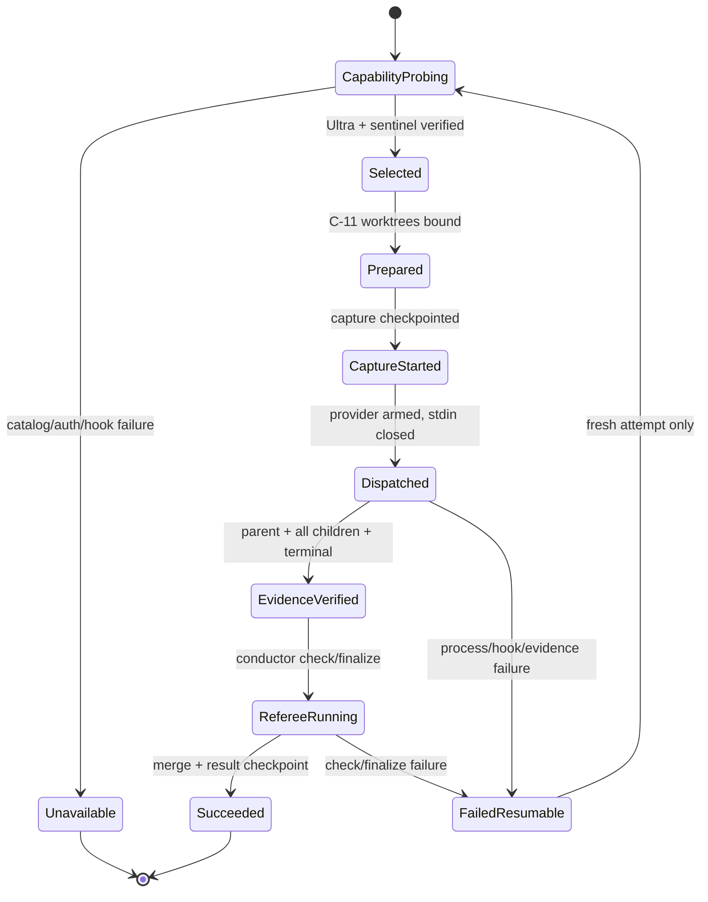

# Codex Native Driver ドメインエンティティ

## モデリング方針と上流参照

U-04はCodex provider adapterのimmutable value、app-server/JSONL/hookのversioned projection、attempt固有role bindingを定義する。attempt/checkpoint/process/refereeのpersistent aggregateはU-02/C-09/C-11が所有するため、新しいdatabase、daemon、provider session storeを作らない。

| 上流成果物 | entityへの反映 |
|---|---|
| `unit-of-work.md` | C-06、Codex slot、Ultra risk gate、他provider非所有 |
| `unit-of-work-story-map.md` | Ultra、fallback、legacy、resume slice |
| `requirements.md` | model/multi-agent native proof、機密性、live acceptance |
| `components.md` | adapterとverifier/refereeの責務分離 |
| `component-methods.md` | `DriverAdapter`、`ProbeResult`、`LaunchSpec`、event v1 |
| `services.md` | one parent process、JSONL + hooks、stdin close |

raw app-server response、JSONL bytes、hook JSONはparser stack内のephemeral bufferだけに置く。domain constructorへ渡す前にallowlist projectionし、message、prompt、credential、transcriptを型上保持できないようにする。

## CodexAdapterRegistration

U-03でgeneric slotをdriver-keyed setへ訂正済みである。Codexは単一viewを登録する。

```text
CodexAdapterRegistration
  provider = codex
  adapterSet: DriverAdapterSet
    adaptersByDriver:
      codex-ultra -> CodexUltraAdapterView
```

smart constructorはprovider=`codex`、key set=`{codex-ultra}`、cardinality=1、`adapter.driver=codex-ultra`を検証する。Claude/Kiro key、placeholder、重複viewを拒否する。registration構築後はimmutableで、runtimeにplaceholderから差し替えない。

## CodexUltraAdapterView

```text
CodexUltraAdapterView
  driver = codex-ultra
  provider = codex
  surfaceProfiles: immutable supported profile set
  probe(input): CodexProbeResult
  buildExecution(input): AdapterExecutionPlan
  normalize(inputs, context): NormalizedDriverEvent stream
```

viewはC-06の公開`DriverAdapter`を満たす。checkpoint/audit write、process spawn、referee callをmethod内部で行わず、pure planとclosed projectionを返す。

## CodexResolveScope

```text
CodexResolveScope
  scopeId: ephemeral opaque identity
  projectIdentityDigest: sha256
  batch: positive integer
  deadlineMonotonic: number
  probeState: idle | running | completed | disposed
```

scopeは1 resolve attemptのin-memory lifetimeだけを持つ。serialize/cacheせず、resumeはfresh scopeを作る。同一scope内のapp-server resultとbehavior handshakeだけを共有し、別batch/attemptへ流用しない。

## CodexSurfaceProfile

```text
CodexSurfaceProfile
  schemaVersion: 1
  profileId: codex-0.144-appserver-hooks-v1 等
  cliVersionRange: inclusive semver range
  appServerMethods:
    config/read
    model/list
    account/read
    experimentalFeature/list
    hooks/list
  jsonlPaths:
    thread.started.thread_id
    turn.completed
    turn.failed
    error
    collaboration-item.type
    collaboration-item.senderThreadId
    collaboration-item.receiverThreadIds
    collaboration-item.tool
    collaboration-item.status
    collaboration-item.agentsStates[*].status
  hookFields:
    common = session_id / model / hook_event_name
    subagent = turn_id / agent_id / agent_type
  hookDefinitions:
    event / source / commandIdentityDigest / enabled / trustState
  toolEnvironmentSurface:
    shell_environment_policy inherit/set/default-excludes
  sandboxSurface:
    workspace-write temp exclusions / add-dir boundary
  fixtureDigest: sha256
```

collaboration itemの公式意味名は`collabToolCall`、Codex 0.144 generated schemaのconcrete union名は`collabAgentToolCall`である。profileはcredentialed `codex exec --json`で実際に観測したtype/pathを内部`collaboration-item`へ明示的に写像し、名称だけで互換と推定しない。agent statusは`pendingInit | running | interrupted | completed | errored | shutdown | notFound`、tool call statusは`inProgress | completed | failed`のclosed unionとして検証する。

profileはfield path、type、cardinality、hook definition identityだけを持つ。sample message、email、token、absolute home、transcript、raw responseを含まない。hookのsource/event/command digest/enabled/trustをexact照合できないprofileは選択不能である。unknown CLI versionは近いprofileへfallbackせず、live discovery fixtureがexact compatibilityを証明した範囲だけを選ぶ。

## EffectiveCodexConfig

app-server `config/read`からallowlistするvalue objectである。

```text
EffectiveCodexConfig
  requestedModel: string | default
  providerId: string
  reasoningEffort: ultra
  multiAgentEnabled: true
  hooksEnabled: true
  configDigest: sha256(allowlisted fields)
```

constructorはeffort=`ultra`以外、multi-agent/hooks false、空providerを拒否する。provider config本文、endpoint、credential、全feature setを持たない。requested modelはaliasまたはdefaultの可能性があり、native証跡のresolved IDには使わない。

## ProbeBindingV1

capability catalog、model未pinのbehavior handshake、本runを別probeから合成しないための二段階bindingである。

```text
ProbeBindingPreSeedInput(
  resolveScopeId,
  nonceHash,
  cliVersion,
  canonicalCwdDigest,
  projectIdentityDigest,
  requiredOverridesDigest
)

ProbeBindingV1 =
  PendingProbeBinding(
    preSeedInputDigest,
    cliVersion,
    canonicalCwdDigest,
    projectIdentityDigest,
    providerId,
    requestedModel,
    effectiveOverrideDigest,
    hookDefinitionsDigest,
    catalogSnapshotDigest,
    captureId,
    nonceHash,
    seedDigest
  )
  | BoundProbeBinding(
    seedDigest,
    resolvedModelId,
    catalogEntryDigest,
    behaviorSessionDigest,
    finalDigest
  )
```

`ProbeBindingPreSeedInput`だけをapp-server invocation前に固定する。同じresolve scope/nonceのapp-server connectionで得たeffective config、hook definition、catalog snapshotをallowlist projectionした後にpendingとseedを一度だけsealする。そのseed/nonce/config layerで`--model`なしのhandshakeを実行し、SessionStartのexact modelをseed済みcatalogへ照合したときだけboundへ遷移する。本runはexact modelをpinし、SessionStartのmodel、seed/final digest、nonceが一致した場合だけこのbindingを消費できる。

## CodexModelCapability

```text
CodexModelCapability
  modelId: exact catalog id
  modelSlug: exact catalog model
  supportedReasoningEfforts: frozen literal set
  defaultReasoningEffort: literal | absent
  hidden: boolean
  catalogEntryDigest: sha256(allowlisted fields)
```

`supportsUltra()`はsetにexact `ultra`がある場合だけtrueを返す。display name、description、`max`、`xhigh`、model prefixを判定に使わない。catalog内でid/modelが曖昧に重複する場合はconstructorを失敗させる。

## ResolvedCodexModel

```text
ResolvedCodexModel
  modelId: exact SessionStart model
  capability: CodexModelCapability
  source = session-start-hook
  sessionId: CodexParentThreadId
  bindingFinalDigest: sha256
```

model未pinのbehavior handshakeのSessionStartが返したmodelをseed済みcatalogへexact matchして生成する。requested config alias/defaultをそのままresolved valueへ昇格しない。local 0.144.0では`gpt-5.6-sol`となるが、constructorへslug定数を埋め込まない。本runのSessionStartが別modelまたは別bindingを示した場合、このvalueは実行証跡として無効である。

## CodexProbeResult

```text
CodexProbeResult
  status: available | unavailable | error
  reason: closed FallbackReason
  cliVersion: semver
  surfaceProfileId: string
  modeIdentifier: codex-ultra-v1:<resolved-model-id> | absent
  effectiveConfigDigest: sha256 | absent
  modelCapabilityDigest: sha256 | absent
  behaviorSessionDigest: sha256 | absent
  probeBindingSeedDigest: sha256 | absent
  probeBindingFinalDigest: sha256 | absent
  authClass: chatgpt | api-key | external-provider | no-auth-required
  checks: ordered immutable ProbeCheck[]
```

available constructorは全check成功、Ultra capability、effective effort、model未pinのbehavior SessionStart、hook sentinel、bound ProbeBindingを要求する。auth classはprovider process env allowlist選択用で、account metadataを含まない。

## CodexUnitAssignmentToken

```text
CodexUnitAssignmentToken
  value: 20-char lowercase base32
  digest: sha256
  boundExecutionId
  boundAttemptId
  boundPlanDigest
  boundWaveDigest
  boundUnitSlug
```

tokenはsecretではないが、別attemptのhookを排除するcorrelation valueである。同じbindingでは決定的、attemptが変われば異なる。tokenだけからUnit slugを逆算できない。

## CodexAgentRole

```text
CodexAgentRole
  name: amadeus_u_<assignment-token>
  configFile: framework generic worker config path
  description: fixed prefix + token
  inheritsParentModel: true
  inheritsParentReasoning: true
```

nameはASCII lowercase/number/underscoreのclosed regexへ一致させる。built-in `default`/`worker`/`explorer`、他attempt role、重複nameを拒否する。generic config pathはframework root内のregular fileへrealpath confinementし、symlinkを拒否する。

## CodexUnitRoleBinding

```text
CodexUnitRoleBinding
  unitSlug: string
  assignmentToken: CodexUnitAssignmentToken
  role: CodexAgentRole
  preparedWorktree: CanonicalPreparedWorktree
  dependencyUnits: frozen ordered set
```

batch-level constructorはUnit、token、role、worktreeの各集合を全単射にする。入力順を保存し、duplicate Unit、同じworktree、依存外Unit、main checkoutを拒否する。

## CodexBatchManifest

```text
CodexBatchManifestV1
  executionId / attemptId / nonceHash / planDigest
  batch / waveIndex / waveDigest
  resolvedModelId / modeIdentifier
  bindings: ordered readonly CodexUnitRoleBinding[]
  convergenceCommand: provider-only sensitive input
  protectedSpecPath: provider-only path
```

manifestはstdin bytesへserializeする短命valueで、永続checkpointへ保存しない。`toAuditProjection()`はcommand、protected spec、worktree raw pathを落とし、manifest digest、Unit、role、path digestだけを返す。

## CodexLaunchConfig

```text
CodexLaunchConfig
  executable: codex
  argv: immutable separated args
  cwd: canonical project root
  providerEnv: AllowlistedProviderEnvironment
  toolEnvPolicy: CodexToolEnvironmentPolicy
  sandboxPolicy: CodexSandboxPolicy
  stdin: Uint8Array(CodexBatchManifestV1 + instructions)
  stdinCloseRequired: true
  timeoutMs: fixed policy
```

argv constructorは`exec`、`-`、`--json`、`--ephemeral`、bound ProbeBindingのexact `--model`、Ultra config、multi-agent enable、sandbox、prepared worktree add-dir、role overridesを要求する。`--ultra`、xhigh、shell metacharacter command、prompt argumentを拒否する。

```text
CodexToolEnvironmentPolicy
  inherit = none
  set = safe PATH / record-local scratch HOME / locale only
  ignoreDefaultExcludes = false
  forbiddenNames = correlation keys / auth names / CODEX_HOME / real HOME / TMPDIR

CodexSandboxPolicy
  evidenceRoot: deny read/list/write
  writableRoots: prepared Unit worktrees / tool scratch only
  excludeTmpdirEnvVar = true
  excludeSlashTmp = true
```

`providerEnv`はcodex parentとstatic hook commandだけの入力であり、model-generated toolやsubagent shellへ投影しない。`toolEnvPolicy`と`sandboxPolicy`の分離をcredentialed malicious fixtureで実証できないsurface profileはunsupportedである。evidence rootはcwd、全Unit worktree、scratch HOME、`--add-dir`、sandbox tempの外に置く。

## CaptureCorrelationV1

```text
CaptureCorrelationV1
  AMADEUS_SWARM_EVIDENCE_DIR: canonical exact path
  AMADEUS_SWARM_CAPTURE_ID: opaque capture id
  AMADEUS_SWARM_BINDING_DIGEST: ProbeBinding final digest
  AMADEUS_SWARM_NONCE_HASH: sha256
  AMADEUS_SWARM_OWNER_TOKEN: attempt lease/fencing token
```

key setはexact 5件であり、欠落、追加、空valueを拒否する。owner tokenはprovider/hook間の短命なwrite capabilityで、audit/checkpointへ生値を保存しない。static hookは全5件一致時だけatomic recordを書き、model-tool envには5件すべて存在してはならない。

## CodexEvidenceCapturePlan

```text
CodexEvidenceCapturePlan
  captureId
  evidenceRoot: canonical exact path
  ownerMarkerDigest / ownerTokenDigest
  nonceHash / planDigest / probeBindingFinalDigest
  hookDefinitionsDigest
  toolEnvironmentPolicyDigest / sandboxPolicyDigest
  requiredEvents: session-start / subagent-start / subagent-stop
  channels: process-jsonl (collaboration itemsを含む) / hook-records
  startBeforeProviderArm: true
  stopAfterProviderGroupTerminal: true
```

provider-stateは持たない。U-03のgeneric fixed-path capture variantを使い、evidence rootだけをobserver対象にする。capture plan自身はI/Oを行わず、U-02 supervisorがmaterialize/start/sealする。materialize時にevidence rootが全sandbox readable/writable rootと交差しないことをrealpathで検証する。

## CodexHookRecord

```text
CodexHookRecord =
  SessionStartRecord(
    sessionId, resolvedModelId,
    captureId, probeBindingDigest, nonceHash, ownerToken
  )
  | SubagentStartRecord(
    sessionId, turnId, agentId, agentType, resolvedModelId,
    captureId, probeBindingDigest, nonceHash, ownerToken
  )
  | SubagentStopRecord(
    sessionId, turnId, agentId, agentType, resolvedModelId,
    captureId, probeBindingDigest, nonceHash, ownerToken
  )
```

recordは`agent_transcript_path`、`last_assistant_message`、permission text、prompt、resultをfieldとして持てない。event filenameはID hashを使い、record本文のIDはschema validation後のopaque stringである。capture seal時にowner tokenを照合して破棄し、永続projectionにはdigestだけを残す。

## CodexCollabLifecycleRecord

公式collaboration itemからallowlist projectionした短命recordである。

```text
CodexCollabLifecycleRecord
  observedWireType: collabToolCall | collabAgentToolCall
  senderThreadId
  receiverThreadIds: non-empty ordered set
  tool: spawnAgent | sendInput | resumeAgent | wait | closeAgent
  toolCallStatus: inProgress | completed | failed
  agentsStates: closed map<childThreadId, agentStatus>
  spawnedModel: string | absent
  spawnedReasoningEffort: string | absent
```

`prompt`、agent-state message、assistant message、reasoning本文、tool input、transcriptはparse直後に破棄し、entityへ渡さない。native lifecycle proofにはterminal `status=completed`だけを使い、child successは同じrecordの`agentsStates[child].status=completed`とhook IDをANDする。field pathまたはID相関をlive fixtureで取得できなければU-04をparkする。

## CodexParentThreadIdentity

```text
CodexParentThreadIdentity
  threadId: JSONL thread.started id
  sessionId: SessionStart hook id
  turnId: hook turn id | absent until first child
  resolvedModelId
```

constructorはthread ID=session IDを要求する。Subagent hookの全session IDも同じ値でなければならない。audit projectionはID digestだけを返す。

## CodexChildLifecycle

```text
CodexChildLifecycle
  unitSlug
  role: CodexAgentRole
  childId: opaque agent id
  parent: CodexParentThreadIdentity
  startTurnId
  stopTurnId
  spawnRecordDigest
  terminalRecordDigest
  state: expected | started | stopped | completed | invalid
```

許可transitionは`expected -> started -> stopped -> completed`だけである。`expected -> started`にはparent sender、receiver child、expected roleのSubagentStart、completed spawn collaboration itemの一致が必要である。`stopped -> completed`には同じchildのSubagentStop、terminal collaboration item `status=completed`、`agentsStates[child].status=completed`が必要である。同じchild IDの二重start、stop先行、role変更、parent変更、別Unit再割当をinvalidにする。worktree成果、protected spec、収束結果からchild completedを推定しない。

## CodexNativeEvidenceAggregate

```text
CodexNativeEvidenceAggregate
  modeProof: CodexUltraModeProof
  parent: CodexParentThreadIdentity
  childrenByRole: immutable closed map
  collaborationRecords: immutable allowlisted records
  expectedUnitSet
  coordinatorTerminal: completed | failed
  captureState: joined-and-sealed | invalid
```

`CodexUltraModeProof`は次をまとめる。

```text
CodexUltraModeProof
  effectiveConfigDigest
  modelCapabilityDigest
  resolvedModelId
  probeBindingSeedDigest
  probeBindingFinalDigest
  modeIdentifier
  catalogSupportsUltra = true
  effectiveEffort = ultra
```

aggregateの`verify()`はUnit-role-childの全単射、2件以上、全child collaboration+hook completed、parent/nonce/plan/wave/binding一致、process/turn/capture terminalを確認し、共通`EvidenceVerdict`へprojectする。worktree成果、protected spec、convergenceは受け取らず、C-11だけが後続で検証する。messageやprovider raw itemはaggregateへ入らない。

## CodexFailure

```text
CodexFailure =
  CODEX_CLI_UNAVAILABLE
  | CODEX_APP_SERVER_PROTOCOL_INVALID
  | CODEX_AUTH_UNAVAILABLE
  | CODEX_MODEL_UNRESOLVED
  | CODEX_PROBE_BINDING_MISMATCH
  | CODEX_ULTRA_UNSUPPORTED
  | CODEX_ULTRA_OVERRIDE_REJECTED
  | CODEX_MULTI_AGENT_UNAVAILABLE
  | CODEX_HOOK_UNTRUSTED
  | CODEX_HOOK_SENTINEL_MISSING
  | CODEX_TOOL_ENVIRONMENT_LEAK
  | CODEX_EVIDENCE_ROOT_EXPOSED
  | CODEX_PARENT_THREAD_INVALID
  | CODEX_MODEL_CORRELATION_FAILED
  | CODEX_CHILD_COUNT_MISMATCH
  | CODEX_CHILD_BINDING_MISMATCH
  | CODEX_CHILD_LIFECYCLE_INVALID
  | CODEX_COLLABORATION_STATUS_MISSING
  | CODEX_CAPTURE_FAILED
  | CODEX_COORDINATOR_FAILED
```

各failureはphase=`pre-dispatch | post-dispatch`、redaction済みdiagnostic code、retryabilityだけを持つ。raw exception、command line全文、env、provider responseを持たない。pre-dispatch failureだけがU-01のfallback reasonへ投影可能で、post-dispatch failureは`ExecutionFailureCode`へ投影する。

## Lifecycleと所有権



テキスト代替: capability probeでUltraとhookを確認し、C-11 prepare後にcaptureを先行開始する。providerをarmして全child証跡を得た後だけrefereeへ進む。dispatch後またはreferee failureは再開可能で、新attemptは必ずprobeから始める。

| Data | Owner | Lifetime | 永続projection |
|---|---|---|---|
| raw app-server/JSONL/hook JSON | C-06 parser | parse中だけ | なし |
| probe binding / model capability / mode proof | C-06 → C-08 | attempt | seed/final digest + resolved model ID |
| role binding | C-06/U-02 | attempt | Unit/role/path digest |
| process/capture identity | U-02 | attempt/checkpoint | fenced identity |
| hook/collaboration lifecycle | C-08 | attempt | allowlist record digest |
| native evidence verdict | C-08/C-09 | attempt/checkpoint | redaction済みsummary |
| Unit convergence/merge | C-11 | workflow | 既存referee envelope |

## Confidentiality invariants

1. domain entityにcredential value、email、account、endpoint headerを置かない。
2. manifest以外にprompt/convergence command本文を置かず、manifestを永続化しない。
3. hook recordにassistant message、transcript path、raw tool outputを置かない。
4. audit/checkpointはopaque IDの必要最小値またはdigestだけを使う。
5. unknown provider fieldをcatch-all mapへ保存しない。
6. crash diagnosticへstdout/stderr全文を埋め込まない。
7. model-generated tool/subagent shellへauth、実HOME/CODEX_HOME、attempt相関5 key、evidence rootを渡さない。
8. evidence rootはmodel toolのread/list/writeをすべて拒否し、static hookだけがowner token付きで書ける。
