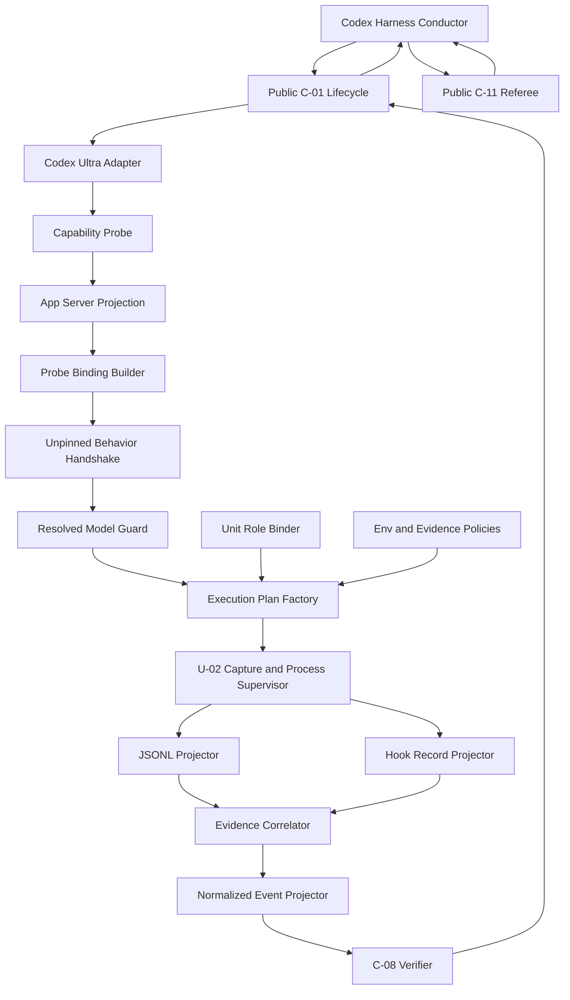

# Codex Native Driver Logical Components

## 入力契約とcomponent boundary

本設計は`performance-requirements.md`、`security-requirements.md`、`scalability-requirements.md`、`reliability-requirements.md`、`tech-stack-decisions.md`、`business-logic-model.md`を消費し、U-04のNFRをC-06 adapter、ProbeBinding/profile、role/launch builder、hook/JSONL projection、Codex harness projectionへ割り当てる。C-06はselector/checkpoint、process/capture supervisor、C-08 verdict、C-11 referee/mergeを所有しない。

## Component inventory

| Component | Responsibility | State/I/O | Primary NFR |
|---|---|---|---|
| `CodexUltraAdapterView` | exactly 1 immutable Codex driver adapter | scope-local | registration/reliability |
| `CodexCapabilityProbe` | CLI/app-server/handshakeを総45秒内で順序実行 | short-lived process ports | performance |
| `CodexAppServerProjection` | config/catalog/auth/hookをclosed allowlist化 | same stdio connection | security/reliability |
| `ProbeBindingBuilder` | pending seedからbound exact modelへ一度だけ遷移 | immutable value | reliability |
| `CodexBehaviorHandshake` | unpinned Ultra runとSessionStart sentinelを実証 | probe process/hook | reliability |
| `CodexResolvedModelGuard` | catalog literal Ultraと本run actual modelをexact照合 | pure value | native proof |
| `CodexHookTrustProfileGuard` | static event/command hash/source/enabled/trustを検証 | immutable profile | security |
| `CodexCorrelationEnvProjector` | provider/hookへ固定5 keyをexact projection | pure launch env | security |
| `CodexToolEnvironmentPolicy` | model tool envをinherit noneから構築 | pure config | security |
| `CodexEvidenceRootPolicy` | sandbox外root/owner marker条件を定義 | pure capture plan | security |
| `CodexUnitRoleBinder` | Unit-token-role-worktree全単射 | pure map | scale/reliability |
| `CodexDynamicRoleProjector` | generic config 1件へのrole argv metadata | pure argv | scale |
| `CodexBatchManifestProjector` | assignmentをstdin-only manifestへ変換 | pure bytes | security |
| `CodexExecutionPlanFactory` | exact model/Ultra/roles/add-dir/captureを1 planへ束縛 | pure plan | reliability |
| `CodexHookRecordProjector` | Session/Subagent recordのowner/schema/duplicate検証 | sealed hook input | security |
| `CodexJsonlProjector` | thread/terminal/collaboration itemをallowlist化 | streaming input | performance/security |
| `CodexEvidenceCorrelator` | model/thread/role/child/collab/hookをAND結合 | call-local index | reliability/scale |
| `CodexNormalizedEventProjector` | C-08向けclosed redacted eventを生成 | pure output | observability |
| `CodexHarnessConductorProjection` | C-01/C-11 public JSON二相順序を記述 | harness source/generated | boundary |

## Interaction and dependency direction

テキスト代替: Codex conductorはpublic C-01からC-06を利用する。C-06はsame-connection probeをpending/bound bindingへ変換し、runtime exact model・role・env/evidence policyをpure execution planへ固定する。U-02がcapture/processを実行し、C-06はsealed JSONLとhookを相関してC-08へ渡す。conductorだけがpublic C-11を呼び、C-01/C-11のrequest/result JSONを媒介する。

C-06からU-02/C-08/C-11へのprocess/state ownershipはない。C-01とC-11のsource import/invoke edgeは双方向0件であり、conductor以外がfinalize順序を再実装しない。

## Failure domains and blast radius

| Failure domain | Containment owner | Blast radius | Forbidden success |
|---|---|---|---|
| app-server/config/catalog drift | probe/binding | resolve scope |別connection結果合成 |
| unpinned/actual model mismatch | model guard | attempt | alias/display name推測 |
| hook trust/correlation不一致 | profile/env/hook guard | capture | untrusted record採用 |
| model-tool env/root exposure | policy + U-02 sentinel | provider run | native success |
| role/add-dir/manifest不一致 | role/plan builder | pre-dispatch | wrong worktree/child |
| JSONL/hook片系・child不一致 | evidence correlator | provider run | partial native success |
| capture join/seal failure | U-02 supervisor | provider run | terminal event生成 |
| referee failure | conductor/C-11 | batch | native evidence単独success |

probe binding、role token、thread/agent、capture root、hook recordはattemptごとに隔離し、cross-attempt cacheを持たない。

## Ownership and verification seams

| Concern | Sole owner | Verification |
|---|---|---|
| selection/checkpoint/audit | C-01/U-02 | C-06 store write/import 0 |
| Codex probe/model/profile/role/plan/projection | C-06 | fake app-server/exec/hook contract |
| capture/process/identity/arm/seal | U-02 supervisor | lifecycle trace、C-06 supervisor 0 |
| native lifecycle verdict | C-08 | C-06はclosed eventだけを返す |
| worktree成果/protected spec/merge | C-11 | C-06/C-01 direct call 0 |
| C-01/C-11二相transport | Codex conductor | resolve→prepare→run→check→request→finalize→result |

architecture testはCodex adapter exactly 1、batch parent exactly 1、C-01↔C-11 direct edge 0、C-06内daemon/queue/worker pool/SDK 0、hard-coded model slug 0、generic config複製0を検証する。contract testはpending seed→handshake→bound exact model→actual SessionStart、provider/hook 5-key envとmodel-tool inherit-none env、Unit-role-child terminal correlationを検証する。

## Implementation placement and infrastructure bridge

authored C-06 adapter/profile/role/launch/hook projectionは`packages/framework/core/`、static hook/generic worker config/Codex skill/config exampleはframework正本へ置き、package scriptでdist/self-installへ生成する。testsは`bun:test`、fast-check、fake app-server/exec/hook、macOS opt-in live fixtureを既存`tests/`へ置く。

Infrastructure Designへ渡すprovisioning componentは0件である。

| Infrastructure concern | Decision |
|---|---|
| compute |短命app-server probe + batch `codex exec` parent。daemon/serviceなし |
| API/SDK | installed CLI stdio/JSONLのみ。SDK/Responses APIなし |
| database/cache/queue |非適用。attempt-owned evidence filesのみ |
| IAM/KMS/secret store |非適用。既存provider authをtool envから隔離 |
| autoscaling/load balancer |非適用。Codex schedulerの所有外 |
| monitoring resource |非適用。redacted audit/live summaryへhandoff |
| cloud cost |新規resource 0、増分固定費0 |

AWS Well-Architectedの適用結果は、resource新設なし、provider/tool least privilege、sandbox isolation、fail-closed profile、waste 0である。架空のIaCを追加しない。

## Review

必須のarchitecture reviewerが本節へ結果を追記する。

### Iteration 1

- Verdict: **READY**
- Blocking findings: **0**

実装を阻害するarchitecture findingはない。`CodexUltraAdapterView`はdriver-keyed Codex slotのexactly 1 immutable adapterとして閉じ、architecture testもadapter 1件、native batch parent 1件、generic worker config 1件を固定する。`CodexUnitRoleBinder`、dynamic role、JSONL/hook correlationはexpected UnitごとのUnit-role-child exactly 1:1:1を要求し、missing/extra/duplicateをdropまたは部分成功へ変換しない。

model bindingはsame-connectionのconfig/catalog/hook projectionからpending seedをsealし、model未pinのUltra behavior handshakeとSessionStart sentinelでruntime exact modelを解決した後、catalog literal `ultra`を照合してbound bindingへ一度だけ遷移する。本runはそのexact modelをpinし、actual SessionStartでmodel、seed/final digest、nonceを再検証する。hard-coded slug、alias/display name、xhigh、max、feature flag、自己申告による代替経路はない。

provider parentとtrusted static hookへ渡す相関envは固定5 keyに閉じ、model tool/subagent shellは`inherit="none"`からsafe PATH、credentialを含まないscratch HOME、localeだけを受け取る。evidence rootはcwd、prepared worktree、全`--add-dir`、scratch HOME、sandbox tempの外に置き、model toolのread/write/listを拒否する。U-02はcapture identity、ProbeBinding、tool-env/sandbox digestをcheckpointした後だけproviderをarmし、group terminalとhook wait後にjoin/sealする。

C-06はCodex固有probe、model/profile、role/launch plan、sealed JSONL/hook projectionだけを所有する。process/capture/identity/arm/sealはU-02、terminal collaborationとSubagentStart/StopをANDしたnative lifecycle verdictはC-08、worktree成果・protected spec・check/finalize/mergeはC-11が所有する。Codex conductorだけがC-01/C-11のversioned request/resultを二相順序で媒介し、両者のsource import/invoke edgeは双方向0件である。
