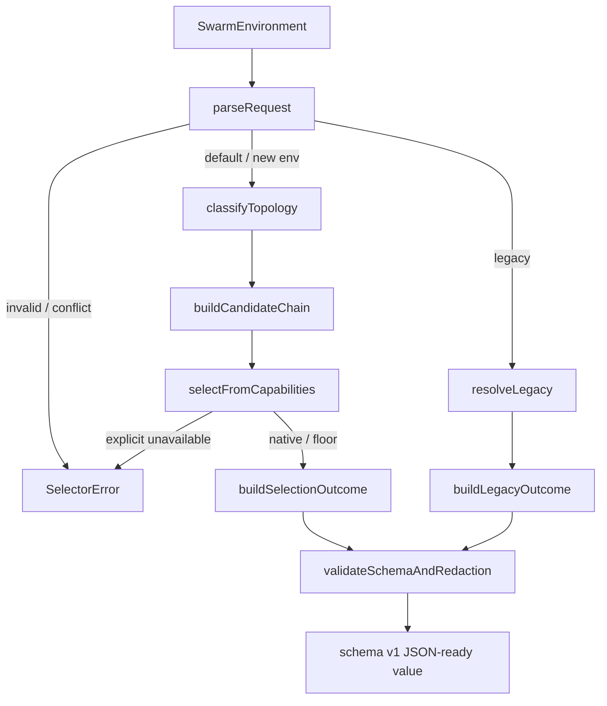

# Driver Contract & Selection Policy ビジネスロジックモデル

## 目的と境界

U-01は、Construction の multi-Unit `invoke-swarm`に対して、環境変数、検出 harness、task topology、能力検査結果という値だけから決定的な selection outcome を返す純粋 policy である。時刻、乱数、process、filesystem、network、audit、checkpointへアクセスしない。同じ正規化入力には、同じ outcome、reason、diagnostic code、JSON表現を返す。

上流トレーサビリティは次のとおりである。

| 上流成果物 | U-01で使用する契約 |
|---|---|
| `unit-of-work.md` | U-01の責務、非責務、FR/NFR、完了条件 |
| `unit-of-work-story-map.md` | USR-01〜USR-09のselection sliceと順序 |
| `requirements.md` | 公開5値、`auto`表、legacy表、fallback reason、受入条件 |
| `components.md` | C-02 `DriverContract`、C-03 `DriverSelector`、C-04 `DriverAdapterRegistry` |
| `component-methods.md` | closed union、selector/error contract、registration seam |
| `services.md` | driver coordinationへの入力・出力、process前境界、CLI feedback contract |

## 処理パイプライン

テキスト代替: 最初に新旧環境変数の存在と値をparseする。不正・競合なら副作用前にerrorを返す。legacyなら0.1.x表で独立planを返す。新契約ならtopologyを分類し、harness別の候補列を作り、既に取得された能力結果だけでnativeまたはfloorを選ぶ。最後にversioned schemaとredaction allowlistを検証して返す。

### Step 1: 環境変数を存在ベースでparseする

1. `Object.hasOwn(env, "AMADEUS_SWARM_DRIVER")` と `Object.hasOwn(env, "AMADEUS_USE_SWARM")` に相当する存在情報を受け取る。truthy判定は使わない。
2. 両方が存在すれば、値を読んで優先順位を決めず `CONFLICTING_ENV` を返す。
3. 新変数だけが存在すれば、case-sensitiveな5値へ完全一致でparseする。空文字、floor ID、大小文字違い、未知値は `INVALID_DRIVER` とする。
4. 旧変数だけが存在すれば、値が厳密に`"1"`なら`enabled`、それ以外は空文字を含めて`other`へ分類する。生値は outcome へ保持しない。
5. どちらも存在しなければ`{ source: "default", requested: "auto" }`とする。

### Step 2: topologyを正規化・分類する

selectionへ渡す前に、各信号を`unit`と固定kind順で安定sortし、完全重複だけを除く。未知kind、空Unit、manifest外Unitは入力contract違反としてplanを作らない。分類は存在判定だけで行う。

wire/schema上のdriver IDはclosed literal unionのまま維持し、domain内部ではそのIDを包むfrozen `NativeDriverValue`だけが`supports(harness)`などのinstance methodを持つ。parse/build/全値collectionはcompanion namespace、harness対応判定は値自身へ作用するinstance methodへ分離する。

| coordination信号 | independent信号 | topology | reason |
|---|---|---|---|
| あり | なし | `coordinated` | `coordination-signal` |
| なし | あり | `independent` | `independent-signal` |
| あり | あり | `coordinated` | `coordination-precedence` |
| なし | なし | `unknown` | `no-signal` |

coordination信号は`shared-task`、`direct-message`、`mutual-coordination`、independent信号は`independent-fanout`、`iterative-convergence`である。分類結果に自然言語推測を混ぜない。

### Step 3: harnessとtopologyから候補列を作る

| Harness | topology | 候補列 |
|---|---|---|
| Claude | `coordinated` | `claude-agent-teams` → `claude-ultracode` → `claude-task-floor` |
| Claude | `independent` | `claude-ultracode` → `claude-task-floor` |
| Claude | `unknown` | `claude-ultracode` → `claude-task-floor` |
| Codex | 任意 | `codex-ultra` → `codex-exec-floor` |
| Kiro / Kiro IDE | 任意 | `kiro-subagent` → `kiro-subagent-floor` |

明示値では候補列を作らず、harness対応を検証した単一native driverだけを評価する。Claudeは2つのClaude driver、Codexは`codex-ultra`、Kiro/Kiro IDEは`kiro-subagent`だけを受理する。

### Step 4: 能力結果からselectionを解決する

- `ProbeResult.status=available`の最初のnative候補を`mode=native`として選ぶ。
- `auto`で先行候補が利用不能なら次候補へ進める。native候補が尽きたときだけ対応floorを`mode=floor`として選ぶ。
- 明示driverが`unavailable`または`error`なら`EXPLICIT_DRIVER_UNAVAILABLE`を返し、floorや別native driverを返さない。
- 評価に必要なdriverの`ProbeResult`が欠落している、`status=available`なのに`reason!=none`、または非availableなのに列挙済みreasonがない入力はcontract不成立であり、planを作らない。
- `fallbackReason`は、先行して利用不能だった候補がなければ`none`。1件以上あれば、全原因を既定優先順で安定sortし、最上位を主理由、残りの`diagnosticCode`を`capabilityDetails`へ安定順で保持する。

優先順は`cli-unavailable`、`authentication-unavailable`、`native-surface-unavailable`、`native-evidence-unavailable`、`trust-unavailable`、`capability-probe-failed`である。入力mapの反復順には依存しない。

### Step 5: legacyを独立planとして解決する

旧変数は新driverのaliasにしない。`LegacySelectionInput`は`harness`、`rawValueClass`、Claudeの既存Dynamic Workflow surface結果だけを受け取る。

| Harness | `enabled` | `other` |
|---|---|---|
| Claude | surface availableなら`claude-dynamic-workflow`。dispatch前にsurface unavailableなら`claude-task-floor`かつ`degradedFrom=claude-dynamic-workflow` | `claude-task-floor` |
| Codex | `codex-exec-floor`かつ`degradedFrom=ultracode` | `codex-exec-floor` |
| Kiro / Kiro IDE | `kiro-subagent-floor`かつ`degradedFrom=ultracode` | `kiro-subagent-floor` |

全legacy outcomeはharness別の判別unionで表現し、`mode=legacy`、`source=legacy-env`、`legacyEnabled`、`warningCode=AMADEUS_USE_SWARM_DEPRECATED`を持つ。floorを使うvariantは対応する`selectedFloor`を必須とし、degradeするvariantだけが`degradedFrom`を持つ。これによりlegacy表にないharness/execution/floor/degrade理由の組合せを型で排除する。warning表示とaudit発行はU-02の副作用であり、U-01は必要なmetadataだけを返す。Claude Dynamic Workflow開始後のfailureはfloorへ再選択しない。

## Registration contract 検証

`DriverRegistrationSet`はschema version 1のfirst-class collectionとし、生成時に次を一括検証する。

1. `claude` providerは`claude-agent-teams`と`claude-ultracode`を各1回、`codex`は`codex-ultra`を1回、`kiro`は`kiro-subagent`を1回だけ宣言する。
2. 4つの`NativeDriver`は全体でちょうど1つのregistrationに属し、余分・重複・欠落を認めない。
3. harness集合はClaude=`claude`、Codex=`codex`、Kiro=`kiro|kiro-ide`に固定する。
4. slotは`available(adaptersByDriver)`または`unavailable`の判別unionとする。available setのkeyはregistrationのdeclared driver集合と完全一致し、Claude 2件、Codex/Kiro各1件、adapter.driverとの不一致0件を要求する。`unavailable`はprovider IDと列挙済み診断codeだけを持ち、未知moduleの動的loadは行わない。
5. `DriverAdapter`は`probe`、pure `prepareResources(input)`、pure `buildExecution(input, MaterializedAuxiliaryResourceSet)`、`normalize`の型境界を宣言するだけで、U-01から呼び出さない。`AdapterExecutionPlan`は`launch + capture + captureIdentity + resources`を必須とし、resource preparationとexecution planのresource集合/digestは一致しなければならない。

Kiroのbalanced wave式はU-05が所有する。U-01はregistrationとUnit順序を保持する入力contractだけを定め、provider固有のwave構築を先取りしない。

## 出力のversioningとredaction

selection outcomeは`schemaVersion: 1`と判別可能な`kind`を必須とし、JSON schemaは`additionalProperties: false`で閉じる。許可fieldはdriver/harness/topology/probeの列挙値、diagnostic code、CLI version、mode identifier、Unit slugなど非機密値だけである。

`token`、`secret`、`password`、`credential`、`authorization`、`cookie`、`prompt`、`message`、`raw`、`response`を意味するfieldはcontractに存在させない。schema検証時に未知fieldを見つけた場合は値を表示せずfield pathだけを診断し、outcomeを返さない。redaction後に消す方式ではなく、allowlist外を構築不能にする。

## エラーと副作用境界

| 条件 | 結果 | 副作用 |
|---|---|---|
| 新旧env併存 | `CONFLICTING_ENV` | 0 |
| 新env不正・空文字 | `INVALID_DRIVER` | 0 |
| 明示driverとharness不一致 | `HARNESS_DRIVER_MISMATCH` | 0 |
| 明示driver能力不足 | `EXPLICIT_DRIVER_UNAVAILABLE` | 0 |
| topology/capability/registration contract不成立 | typed contract error | 0 |
| `auto`候補利用不能 | 次候補またはfloorのloud outcome | U-01では0 |
| dispatch後failure | U-01の再選択対象外 | U-02以降でfail-closed |

## 検証への引き渡し

- table test: 未設定、5値、空文字、不正値、大小文字違い、floor ID、新旧全競合、harness不一致。
- topology fixture: coordinated、independent、both、unknown。入力順と重複を変えても同じ分類・reasonになることを確認する。
- candidate fixture: 全`auto`分岐、Claude第二候補、全floor、reason優先順、明示hard error。
- legacy fixture: 4 harness × unset/enabled/other/競合の全行とClaude surface unavailable。
- property test: `selected=auto`、未知selected、silent floor、未列挙reason、registrationの重複・欠落、secret-like fieldを生成不能またはparse errorにする。
- 決定性test: 同一正規化入力を複数回評価し、deep equalityとcanonical JSON digestが一致することを確認する。

## Review

**Iteration:** 2
**Verdict:** NOT-READY

### 解消済みfinding

- `NativeDriver` wire literalとdomainの`NativeDriverValue`は分離され、instance/companionの実装形が一意になった。
- `DriverRequest`とharness別legacy outcomeは判別unionで閉じ、不正なfield組合せを型で排除した。
- registrationの所有権はU-01のgeneric `DriverAdapterSet` contractに固定され、U-02がassembly、U-03〜U-05がdescriptorを提供する方向へ揃った。
- adapter method surfaceは`probe + prepareResources + buildExecution + normalize`へ揃い、旧`buildLaunch`契約とprovider側の追随漏れは解消した。

### 新規finding

1. **[Major / Blocking] U-01が正本とする`DriverAdapter`の境界型が未定義である。** interfaceは`DriverProbeInput`、`AdapterPreparationInput`、`AdapterResourcePreparation`、`AdapterExecutionInput`、`MaterializedAuxiliaryResourceSet`、`AdapterExecutionPlan`、`EvidenceInputs`、`NormalizeContext`、`NormalizedDriverEvent`を参照するが、本Unit内で定義も上流common contractへの明示参照もない。これらの具体型はdownstream U-02にのみ存在するため、U-01実装から参照すれば依存方向が逆転し、参照しなければgeneric registration contractを型検査できない。adapter boundary型をU-01-owned contractとして定義してU-02が消費するか、循環しない上流common moduleを明示する必要がある。

### センサー結果

- `required-sections`: 4成果物すべてPASS。
- `upstream-coverage`: 4成果物すべてPASS、未参照0件。
- `linter` / `type-check`: 対象成果物はMarkdownのため非適用。

## Iteration 2後の是正記録

- 2026-07-14T10:53:15Z — reviewer上限到達後に、唯一のblocking findingだったadapter境界型未定義を是正した。U-01の`domain-entities.md`へ`ProbeInput`、`ProbeResult`、`LaunchInput`、`AuxiliaryResourcePlan`、`AdapterResourcePreparation`、`MaterializedAuxiliaryResourceSet`、`CoordinatorTransport`、`EvidenceCapturePlan`、`AdapterExecutionPlan`、capture binding、live/retained evidence、control signal、closed `NormalizedDriverEvent`をU-01-owned contractとして定義し、U-02をconsumer/internal specializationと明記した。
- これは独立reviewerによるIteration 3判定ではないため、上記Iteration 2 verdictは監査履歴として変更しない。事後修正後の適用sensorと`git diff --check`を再実行し、ゲートではreviewerのNOT-READYと修正済み事実を分けて提示する。
