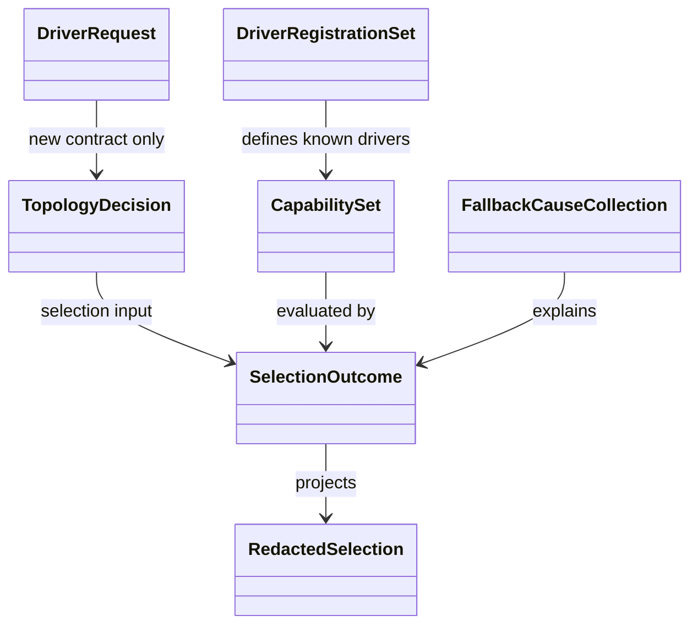

# Driver Contract & Selection Policy ドメインエンティティ

## モデリング方針

`unit-of-work.md`と`unit-of-work-story-map.md`が定めるU-01の独立境界を、`requirements.md`のclosed vocabularyへ写像する。`components.md`のC-02〜C-04、`component-methods.md`の公開型、`services.md`のdriver coordination境界を尊重し、TypeScriptのclass-free functional domain modelingを採用する。

- domain typeはreadonly dataと、その値自身へ作用するinstance methodを持つ。
- companion namespaceは`parse`、`build`、collection演算などstatic相当だけを持つ。
- factoryはinvariantを検証し、closureでmethodを実装したfrozen objectを返す。
- 失敗はexception classではなく判別unionの`Result`で返す。
- 公開語彙はliteral unionで閉じ、外部文字列はsmart constructorを通過させる。

## 値オブジェクト

### Driver vocabulary

| 型 | 値 | invariant |
|---|---|---|
| `Harness` | `claude | codex | kiro | kiro-ide` | 未知harnessを受理しない |
| `RequestedDriver` | `auto` + 4 native driver | envで受理する公開5値だけ |
| `NativeDriver` | `claude-agent-teams | claude-ultracode | codex-ultra | kiro-subagent` | schemaへserializeするclosed literal union |
| `NativeDriverValue` | `NativeDriver`を包むimmutable value object | provider対応とinstance behaviorを所有 |
| `FloorDriver` | `claude-task-floor | codex-exec-floor | kiro-subagent-floor` | env parse対象外 |
| `SelectedDriver` | `NativeDriver | FloorDriver` | `auto`を含まない |
| `ExecutionMode` | `native | floor | legacy` | outcome kindと整合する |
| `LegacyExecution` | `claude-dynamic-workflow` + 3 floor | 新driverのaliasにしない |
| `FallbackReason` | `none` + 6 failure reason | 固定優先順を持つ |

`NativeDriver`、`RequestedDriver`、`Harness`、`FallbackReason`のliteral unionは、`component-methods.md`が確定したwire/schema語彙であり、methodを持たない。内部domainでは`NativeDriverValue`がそのcanonical IDを1つだけ包み、次の実装可能なinstance methodを持つ。

```ts
type NativeDriverValue = Readonly<{
  id: NativeDriver;
  provider: "claude" | "codex" | "kiro";
  supports(harness: Harness): boolean;
  toJSON(): NativeDriver;
}>;

declare namespace NativeDriverValue {
  function parse(raw: unknown): Result<NativeDriverValue, SelectorError>;
  function from(id: NativeDriver): NativeDriverValue;
  function values(): readonly NativeDriverValue[];
}
```

`supports(harness)`は`nativeDriverValue.supports(harness)`として値自身へ作用する。companion namespaceは外部値のparse、既知IDからのfactory、全値collectionだけを所有し、receiverを第一引数に取るstatic風domain operationを置かない。`toJSON()`だけがclosed literal unionへ戻すため、domain behaviorとwire contractに二重の正本は生じない。factoryはproviderをIDから導出し、closureでmethodを実装したfrozen objectを返す。

### DriverRequest

```ts
type DriverRequestBehavior = Readonly<{
  isLegacy(): boolean;
  toRedactedJSON(): RedactedDriverRequest;
}>;

type DriverRequest =
  | (DriverRequestBehavior & Readonly<{
      source: "default";
      requested: "auto";
    }>)
  | (DriverRequestBehavior & Readonly<{
      source: "new-env";
      requested: RequestedDriver;
    }>)
  | (DriverRequestBehavior & Readonly<{
      source: "legacy-env";
      rawValueClass: "enabled" | "other";
    }>);

declare namespace DriverRequest {
  function parse(
    environment: SwarmEnvironment,
  ): Result<DriverRequest, SelectorError>;
}
```

`DriverRequest.parse(environment)`が新旧変数の存在、競合、値を一度だけ解釈する。legacyの生値は保持せず`rawValueClass`へ縮約する。各variantはfactoryだけから生成するfrozen objectで、`isLegacy()`と`toRedactedJSON()`をclosure実装する。`source="default"`にlegacy fieldを付ける、または`source="legacy-env"`に`requested`を付ける状態は判別union上で表現できない。

### TopologySignal と TopologyDecision

`TopologySignal`は`unit`と5つのkindの組である。`TopologySignalCollection.build(manifest, rawSignals)`がmanifest外Unit、空slug、未知kindを拒否し、canonical順のfrozen collectionを返す。

`TopologyDecision`は`topology`、`reason`、canonical signalsを持ち、次のinstance methodを提供する。

- `isCoordinated()` — Agent Teams候補を含めるかを答える。
- `diagnosticCodes()` — 値を含まない固定code列を返す。
- `equals(other)` — canonical value同士を比較する。

分類そのものは`TopologyDecision.classify(signals)`というcompanion operationで行う。

### ProbeResult と CapabilitySet

`ProbeResult`は`status`、`reason`、`cliVersion?`、`modeIdentifier?`、`checks`を持つfrozen valueである。instance methodは`isAvailable()`と`diagnosticCodes()`だけに限定し、process起動を持たない。

`CapabilitySet.build(candidateDrivers, probeResults)`は次を検証するfirst-class collectionである。

- 対象driverの結果が各1件存在する。
- 余分・重複・未知driverがない。
- availableと`reason=none`、non-availableと非none reasonが対になっている。
- checkは固定nameと非機密diagnostic codeだけを持つ。

### FallbackCauseCollection

失敗した候補とreasonの集合を所有し、`primary()`が固定優先順の主理由、`details()`が残りの非機密diagnostic codeをcanonical順で返す。空collectionの`primary()`は`none`である。呼出側が配列indexや`Map`順から主理由を選ばないようにする。

## Selection aggregate

### SelectionOutcome

```ts
type SelectionOutcome =
  | NativeSelection
  | FloorSelection
  | LegacySelection;

type NativeSelection = Readonly<{
  kind: "native-selection";
  schemaVersion: 1;
  requested: RequestedDriver;
  selected: NativeDriver;
  executionMode: "native";
  harness: Harness;
  topology: TopologyDecision;
  fallbackReason: FallbackReason;
  probe: ProbeResult;
  toRedactedJSON(): RedactedSelection;
}>;

type FloorSelection = Readonly<{
  kind: "floor-selection";
  schemaVersion: 1;
  requested: "auto";
  selected: FloorDriver;
  executionMode: "floor";
  harness: Harness;
  topology: TopologyDecision;
  fallbackReason: Exclude<FallbackReason, "none">;
  toRedactedJSON(): RedactedSelection;
}>;

type LegacySelectionBehavior = Readonly<{
  isDegraded(): boolean;
  toRedactedJSON(): RedactedSelection;
}>;

type LegacySelectionCommon = LegacySelectionBehavior & Readonly<{
  kind: "legacy-selection";
  schemaVersion: 1;
  source: "legacy-env";
  executionMode: "legacy";
  warningCode: "AMADEUS_USE_SWARM_DEPRECATED";
}>;

type ClaudeLegacySelection =
  | (LegacySelectionCommon & Readonly<{
      harness: "claude";
      legacyEnabled: true;
      execution: "claude-dynamic-workflow";
      selectedFloor?: never;
      degradedFrom?: never;
    }>)
  | (LegacySelectionCommon & Readonly<{
      harness: "claude";
      legacyEnabled: true;
      execution: "claude-task-floor";
      selectedFloor: "claude-task-floor";
      degradedFrom: "claude-dynamic-workflow";
    }>)
  | (LegacySelectionCommon & Readonly<{
      harness: "claude";
      legacyEnabled: false;
      execution: "claude-task-floor";
      selectedFloor: "claude-task-floor";
      degradedFrom?: never;
    }>);

type CodexLegacySelection =
  | (LegacySelectionCommon & Readonly<{
      harness: "codex";
      legacyEnabled: true;
      execution: "codex-exec-floor";
      selectedFloor: "codex-exec-floor";
      degradedFrom: "ultracode";
    }>)
  | (LegacySelectionCommon & Readonly<{
      harness: "codex";
      legacyEnabled: false;
      execution: "codex-exec-floor";
      selectedFloor: "codex-exec-floor";
      degradedFrom?: never;
    }>);

type KiroLegacySelection =
  | (LegacySelectionCommon & Readonly<{
      harness: "kiro" | "kiro-ide";
      legacyEnabled: true;
      execution: "kiro-subagent-floor";
      selectedFloor: "kiro-subagent-floor";
      degradedFrom: "ultracode";
    }>)
  | (LegacySelectionCommon & Readonly<{
      harness: "kiro" | "kiro-ide";
      legacyEnabled: false;
      execution: "kiro-subagent-floor";
      selectedFloor: "kiro-subagent-floor";
      degradedFrom?: never;
    }>);

type LegacySelection =
  | ClaudeLegacySelection
  | CodexLegacySelection
  | KiroLegacySelection;
```

`SelectionOutcome.select(input)`はcompanion operationであり、候補列と`CapabilitySet`を評価する。`LegacySelection`はharness、enabled/other、execution、floor、degrade理由の有効な組合せだけをvariantとして列挙し、KiroとClaude Dynamic Workflowなどlegacy表にない状態を構築不能にする。各factoryは`isDegraded()`と`toRedactedJSON()`をclosure実装したfrozen objectを返す。aggregateはexecution ID、attempt ID、時刻、worktreeを持たない。それらはU-02のlifecycle aggregateが追加する。

`NativeSelection.selected`はschemaへ出す`NativeDriver` literal IDである。selection計算中は`NativeDriverValue`を使い、factoryが`toJSON()`したIDだけをaggregateへ格納する。したがって、instance methodのreceiverは常にvalue objectであり、wire literalへmethodがあるようには扱わない。

### RedactedSelection

stdout、stderr表示、auditへ渡せる共有DTOである。値域はschema v1のallowlistだけに閉じ、instance method`canonicalJSON()`がkey順を固定したJSONを返す。未知fieldを保持する拡張bagは設けない。

許可する情報は、requested/selected/mode、harness、topology/reason、fallback reason、capability diagnostic code、CLI version、mode identifierである。env値、command/argv、prompt、credential、provider raw responseは構造上表現できない。

## Registration aggregate

### DriverRegistration

```ts
type DriverRegistration = Readonly<{
  schemaVersion: 1;
  provider: "claude" | "codex" | "kiro";
  drivers: readonly NativeDriver[];
  harnesses: readonly Harness[];
  slot: RegistrationSlot;
  owns(driver: NativeDriver): boolean;
  supports(harness: Harness): boolean;
}>;

type RegistrationSlot =
  | Readonly<{ kind: "available"; adapter: DriverAdapter }>
  | Readonly<{
      kind: "unavailable";
      diagnosticCode: "REGISTRATION_SLOT_UNIMPLEMENTED";
    }>;
```

`DriverRegistration.build`はproviderとdriver/harness tupleの正確な対応を検証する。`owns`と`supports`はregistration値自身のinstance methodであり、外部switchの増殖を防ぐ。slot未実装は明示的にfail-closedであり、no-op adapterを許可しない。

### DriverRegistrationSet

3 provider registrationを所有するfirst-class collectionである。`build`時に4 native driverの全単射、provider cardinality、余分なdescriptor 0件を検証する。`forDriver(driver)`は必ず1件を返し、未知driverを型外入力からparseした時点で拒否する。runtimeの静的import assemblyはU-02、slotの実装置換はU-03〜U-05、placeholder 0件のrelease検証はU-06が所有する。

## Error model

| Error variant | field | 意味 |
|---|---|---|
| `INVALID_DRIVER` | accepted値のみ | 新envが公開5値でない |
| `CONFLICTING_ENV` | 変数名tupleのみ | 新旧envが併存 |
| `HARNESS_DRIVER_MISMATCH` | harness、requested | 明示driverのprovider不一致 |
| `EXPLICIT_DRIVER_UNAVAILABLE` | requested、reason | 明示driver能力不足 |
| `INVALID_TOPOLOGY_INPUT` | diagnostic code | signal contract不成立 |
| `INVALID_CAPABILITY_INPUT` | driver、diagnostic code | probe集合の欠落・矛盾 |
| `INVALID_REGISTRATION` | provider/driver、diagnostic code | closed registry不成立 |
| `REDACTION_SCHEMA_REJECTED` | field pathのみ | allowlist外field |

すべて`Result<Success, Error>`で返し、errorに入力値、生payload、stack traceを格納しない。U-02はerror codeをCLI exit/auditへ写像するが、U-01は表示や永続化を行わない。

## Lifecycleと関係



テキスト代替: requestとtopology、capability集合がselection outcomeを構成する。registration集合は既知driverとprovider対応を閉じ、fallback原因集合が理由を決定する。selection outcomeは非機密のredacted DTOへだけ投影される。これらはすべてimmutable valueであり、U-01内に永続lifecycle stateはない。

## Unit間の所有関係

| 所有物 | U-01 | 後続Unit |
|---|---|---|
| literal union、schema v1、smart constructor | 定義・test | 消費 |
| selection/topology/legacy pure policy | 定義・test | C-01から呼出し |
| `DriverAdapter` / registration contract | 定義 | U-02がassembly、U-03〜U-05が実装 |
| process、probe実行、checkpoint、audit | 所有しない | U-02〜U-05 |
| Kiro balanced wave policy | 入力順保持contractのみ | U-05 |
| 全slot実装済み検証 | 所有しない | U-06 |
