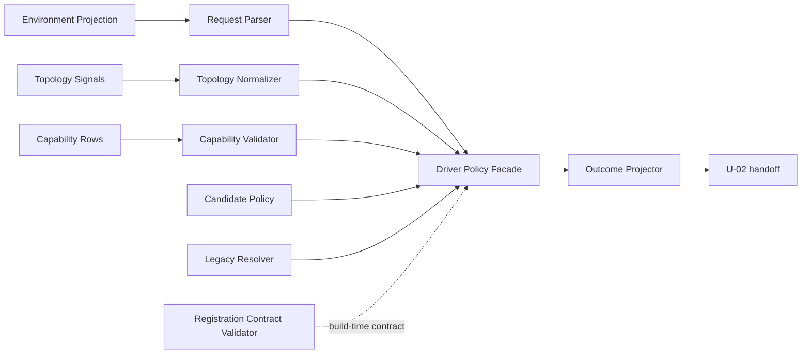

# Driver Contract & Selection Policy Logical Components

## 入力契約とcomponent boundary

本設計は`performance-requirements.md`、`security-requirements.md`、`scalability-requirements.md`、`reliability-requirements.md`、`tech-stack-decisions.md`、`business-logic-model.md`を消費し、NFR patternをU-01の実装componentへ割り当てる。全componentは同一local TypeScript module boundary内のpure value/functionであり、service/process/cloud resourceではない。

## Component inventory

| Component | Responsibility | Input | Output | State/I/O | Primary NFR |
|---|---|---|---|---|---|
| `SwarmEnvironmentProjection` | known 2 env keyのpresence/classification | env accessor | closed presence/value class | call-local / I/O 0 | security/performance |
| `DriverRequestParser` | default/new/legacy/conflictをdiscriminated unionへparse | env projection | `DriverRequest` or typed error | none | reliability/security |
| `TopologyNormalizer` | validate、stable sort、dedupe、classify | topology signals + Unit manifest | normalized topology | call-local `O(n)` | performance/scale |
| `CandidatePolicy` | harness/topologyからfixed candidate chainを返す | closed harness/topology | immutable candidate list | frozen constant | scale/reliability |
| `CapabilityContractValidator` | probe status/reason/driver correlationを検証 | normalized capability rows | validated capability index | call-local | security/reliability |
| `CapabilitySelector` | explicit/auto selectionとfallback diagnosticを決定 | request/candidates/capabilities | native/floor outcome or error | none | reliability/performance |
| `LegacyResolver` | 0.1.x harness/value-class表を独立解決 | legacy request/surface status | legacy outcome | frozen table | compatibility/reliability |
| `RegistrationContractValidator` | provider/driver/harness closed mappingを検証 | registration declaration | validated contract | none、assemblyはU-02 | security/scale |
| `OutcomeProjector` | versioned allowlist JSON/canonical digestを構築 | closed domain outcome | redacted projection | none | security/observability |
| `DriverPolicyFacade` | pipelineの唯一のpublic orchestration entry | closed input snapshot | outcome/error | none | boundary simplicity |

`DriverPolicyFacade`はprovider probe、registry composition、audit/checkpointを呼ばず、既に正規化された値をpure pipelineへ渡すだけである。

## Interaction and dependency direction

テキスト代替: env、topology、capabilityは各validatorでclosed value化され、facadeがcandidate policyまたはlegacy resolverを選ぶ。結果はoutcome projectorだけを通してU-02へ渡す。registration validatorはbuild-time contractを提供するがruntime assemblyを所有しない。

依存方向はinput boundaryからdomain policy、projector/handoffへの一方向である。component同士の循環依存は0件とする。

## Failure domains and blast radius

| Failure domain | Contained by | Blast radius | External side effect |
|---|---|---|---:|
| malformed env/request | projection/parser |当該resolve call | 0 |
| invalid/large topology | normalizer |当該resolve call | 0 |
| contradictory capability | validator |当該resolve call | 0 |
| explicit unavailable/mismatch | selector/support policy |当該resolve call | 0 |
| invalid legacy combination | legacy smart constructor | build/当該call | 0 |
| registration drift | registration validator | composition startup/build | 0 |
| schema/secret-like field | outcome projector | output生成 | 0 |

shared mutable resourceがないため、failureが他batch/caller/providerへ波及しない。frozen constantの不整合はbuild/testで全callを止め、部分的に誤selectionを返さない。

## Shared resources and isolation

共有するのはversioned immutable driver/harness/topology/reason/schema tablesだけである。次は共有しない。

- mutable singleton、memo/cache、previous outcome。
- raw env、provider payload、credential、prompt。
- filesystem path、process handle、network client、clock、random。
- attempt/lease/checkpoint/audit/referee state。

U-02〜U-06との境界はclosed TypeScript value/versioned JSONだけで、source-level selector duplicateを許さない。

## Implementation placement and infrastructure bridge

authored sourceは`packages/framework/core/tools/`のcontract/selector moduleへ置き、harness prose/generated treesへselection logicを複製しない。testは既存`tests/`のunit/property/schema/compile/architecture tierへ配置する。

Infrastructure Designへ渡すprovisioning componentは0件である。

| Infrastructure concern | Decision |
|---|---|
| compute/service | existing Bun process内のpure function。専用serviceなし |
| network/VPC/load balancer |非適用 |
| database/cache/queue/storage |非適用 |
| IAM/KMS/secret store |非適用 |
| multi-AZ/backup/failover |非適用 |
| cloud cost |新規resource 0、増分固定費0 |
| deployment/observability resource |非適用。既存test/audit handoffのみ |

AWS Well-Architectedの6 pillarsに対しては、resourceを作らないこと、least-data pure boundary、deterministic test、waste 0が適合点である。架空のAWS resourceやIaCを追加しない。

## Review

必須のarchitecture reviewerが本節へ結果を追記する。

### Iteration 1

- Verdict: **NOT-READY**
- Blocking findings: **1**

1. **[Blocking] closed-set growth表のtopology class cardinalityが上流contractと一致しない。** `scalability-design.md`は`topology class`のCurrent designを4としてcompile exhaustivenessとschema change手順を定義している。一方、`business-logic-model.md`のclosed output topologyは`coordinated`、`independent`、`unknown`の3値であり、4つなのはcoordination／independent信号の有無による入力組合せとproperty fixtureの行数である。NFR requirementsも固定setのcanonicalizationを要求するが、第四のtopology literalは定義していない。このままでは`TopologyNormalizer`、closed JSON schema、`CandidatePolicy`、compile fixtureが3値と4値のどちらをexhaustive setとして実装すべきか一意に決まらず、未知branchを追加またはsuccess化し得る。

   **必須修正:** `scalability-design.md`のgrowth表を、output topology classは3値、classification fixture／signal combinationは4行として分離すること。`TopologyNormalizer`、candidate table、schema、property／compile fixtureが3つのoutput literalと4つの入力組合せをそれぞれexactに検証する旨を明記し、第四のtopology classを導入しないこと。

### Iteration 2

- Verdict: **READY**
- Blocking findings: **0**

Iteration 1のblocking findingは解消された。`scalability-design.md`のClosed-set growth policyは、output topology classを`coordinated`／`independent`／`unknown`の3値としてnormalizer、candidate table、closed schemaの変更対象へ束縛し、classification fixtureをcoordination／independent信号の有無4組合せとprecedence reasonの4行として別dimensionへ分離している。

この区別は上流`business-logic-model.md`の3つのoutput literalと4つのdecision-table行にexact一致する。第四のtopology class、catch-all branch、unknown successを導入せず、schema／compile exhaustivenessとproperty fixtureがそれぞれ検証すべき固定集合を一意に決められる。
