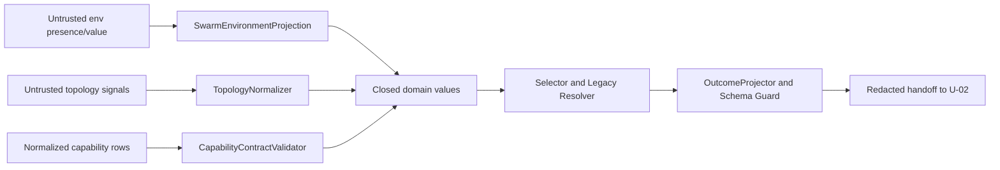

# Driver Contract & Selection Policy Security Design

## 入力契約とtrust boundary

本設計は`performance-requirements.md`、`security-requirements.md`、`scalability-requirements.md`、`reliability-requirements.md`、`tech-stack-decisions.md`、`business-logic-model.md`を消費する。trust boundaryはuntrusted env/topology/probe projectionからclosed U-01 domainへの入口である。U-01は認証・認可・network・storageを所有しない。

テキスト代替: untrusted入力は各boundary validatorでclosed valueへ変換し、selectorはclosed valueだけを処理する。出力はallowlist schema guardを通ったredacted valueだけをU-02へ渡す。

## Defense-in-depth layers

| Layer | Component | Control | Failure |
|---|---|---|---|
| 1 | `SwarmEnvironmentProjection` | known 2 keyだけ、presence優先、生値即時分類/破棄 | typed input error |
| 2 | `DriverRequestParser` | exact case-sensitive 5値、legacy 1/other、new/old conflict | side effect 0 |
| 3 | `TopologyNormalizer` | closed kind、manifest membership、stable dedupe | contract error |
| 4 | `CapabilityContractValidator` | status/reason/provider/driver相関、unknown field拒否 | plan 0 |
| 5 | `RegistrationContractValidator` | static exact provider/driver set、dynamic load禁止 | startup/build error |
| 6 | `OutcomeProjector` | versioned allowlist、`additionalProperties=false`、field pathだけのerror | output 0 |

validation後にsecretをmaskするのではなく、raw値をdomain typeへ入れない。`token`、`secret`、`password`、`credential`、`authorization`、`cookie`、`prompt`、`message`、`raw`、`response`相当fieldはschema manifestに存在させない。

## Authentication, authorization, and data protection

- authentication/authorization: U-01では非適用。provider authはU-02〜U-05のprobe/launch ownerが扱う。
- encryption at rest/in transit: U-01は永続化・通信を行わないため非適用。
- secret management: secretを受け取るportを作らず、env全体やprovider raw payloadを入力schemaにしない。
- audit logging: U-01はlog/auditを書かず、canonical redacted outcome/digestをU-02へhandoffする。
- CSRF/XSS/security headers: HTTP/UI surfaceがないため非適用。

非適用項目を将来の実装が暗黙追加できないよう、filesystem/network/process dependency 0のarchitecture testで境界を固定する。

## Threat containment

| Threat | Containment component | Blast radius |
|---|---|---|
| env injection/conflict | projection/parser |当該callだけtyped error |
| harness/driver spoof | native value + support policy | plan生成0 |
| topology tamper/DoS | normalizer + caller upper bound |当該call、`O(n log n)` |
| dynamic module/EoP | static registration validator | composition startup failure |
| secret/unknown field leakage | projector/schema guard | output生成0 |
| explicit unavailable fallback | capability selector invariant | side effect前error |

global mutable stateがないため、1 callのtainted inputは他callへ共有されない。

## Security verification

- canary proxyで既知2 key以外のread 0を検証する。
- whitespace/NUL/Unicode/shell/path/prototype-like inputをexact parserへ通し全拒否する。
- unknown/secret-like fieldをsmart constructor/schemaの両層で拒否する。
- dynamic import/path/plugin dependencyがsource graphに0件であることをstatic testする。
- success/error/canonical JSONにsecret canary 0件をsnapshot scanする。
- Critical/High相当またはcanary 1件をmerge blockerにし、waiver/skipを設けない。
