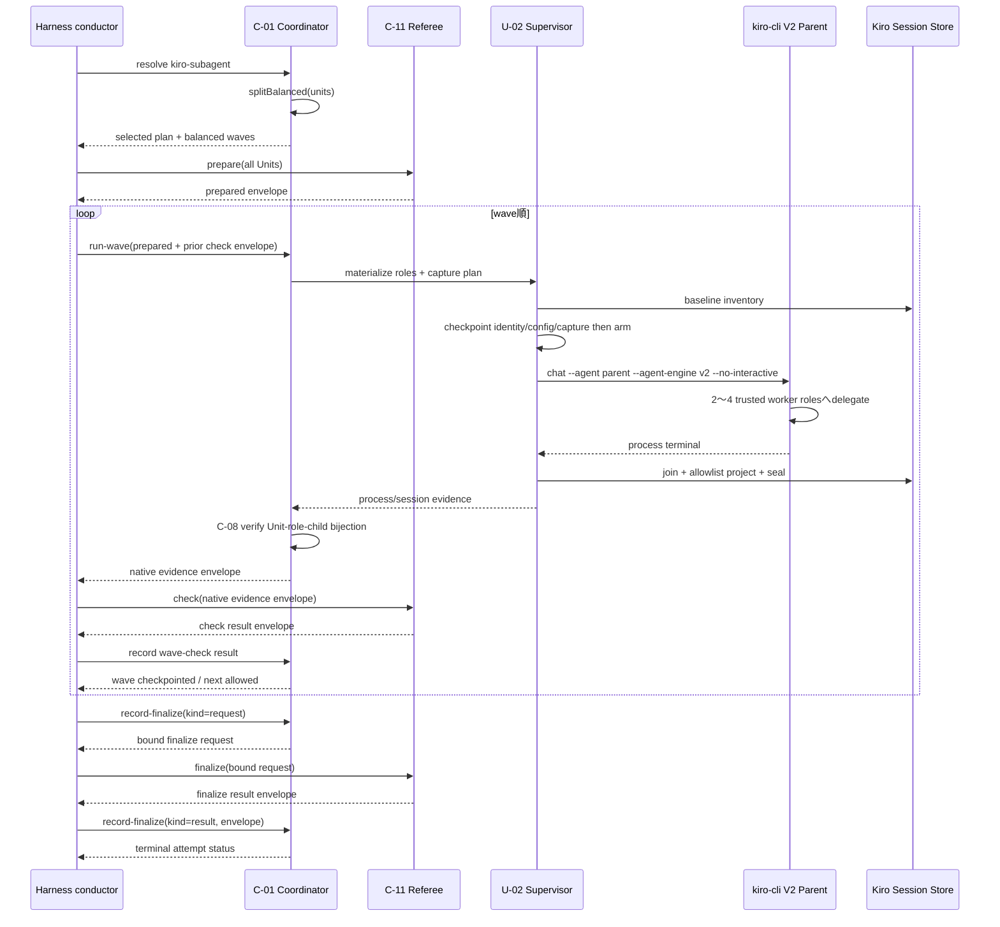
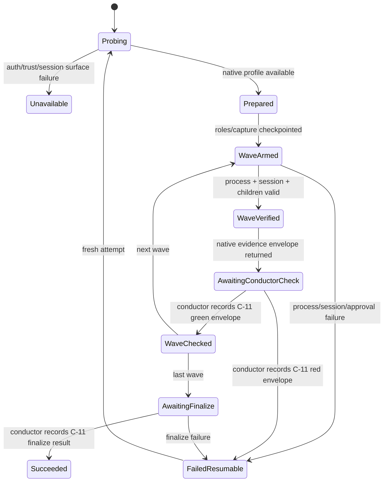

# Kiro Native Driver Business Logic Model

## 上流トレーサビリティ

本設計は`unit-of-work.md`のU-05、`unit-of-work-story-map.md`の5 slice、`requirements.md`のFR-05〜FR-06、FR-14〜FR-15、FR-19、FR-23、NFR-02、NFR-04、NFR-10〜NFR-11を具体化する。境界は`components.md`のC-07/C-08/C-11/C-12、`component-methods.md`の`DriverAdapter`/`LaunchSpec`/wave/event v1、`services.md`のKiro process/session contractに従う。

現行surfaceの根拠はKiro公式の[Subagents](https://kiro.dev/docs/cli/chat/subagents/)、[Headless mode](https://kiro.dev/docs/cli/headless/)、[Agent configuration reference](https://kiro.dev/docs/cli/custom-agents/configuration-reference/)、[ACPとsession storage](https://kiro.dev/docs/cli/acp/)、[Hooks](https://kiro.dev/docs/cli/hooks/)である。ローカルでは`kiro-cli 2.12.1`、`chat --agent-engine v2`、`--no-interactive`、agent-v1 JSON、persisted `.json`/`.jsonl` session storeを確認した。version文字列だけではavailableにしない。

## 責務境界

| Owner | 所有するもの | 所有しないもの |
|---|---|---|
| C-03 | native対象判定、generic `UnitWave`順序 | Kiro wave具象分割 |
| C-07 | Kiro probe、balanced split、runtime agent plan、launch、session projection | checkpoint write、process spawn、成果収束 |
| U-02 supervisor | runtime materialize、session observer、process identity/arm/join、checkpoint | provider schema意味、Unit success判断 |
| C-08 | normalized session/process evidenceとUnit-role-child全単射 | raw session、worktree成果 |
| C-11 | prepared worktree、protected spec、check/finalize/merge | native child判定 |
| harness conductor | C-01/C-11のversioned envelope媒介 | selector/wave/session parserの再実装 |

C-07 adapterはpure planとclosed projectionを返す。`~/.kiro`をadapter内部で直接走査せず、U-02へ`KiroSessionCapturePlan`を渡す。Kiro CLIとKiro IDEは同じcore adapterを使う。

C-01/C-07/C-08とC-11は互いをimportまたはcallしない。harness conductorだけが、C-01から返る`NativeWaveEvidenceEnvelopeV1`をC-11の`check`へ渡し、C-11から返る`RefereeCheckResultEnvelopeV1`をC-01のcheckpointへ記録する。両側は相手のdomain objectを共有せず、versioned wire envelopeだけをconductor境界で検証する。

## Balanced waveアルゴリズム

### 定義

```text
splitBalanced(units): KiroWaveSet
  require units.length >= 2
  waveCount = ceil(units.length / 4)
  base = floor(units.length / waveCount)
  remainder = units.length mod waveCount
  sizes[i] = base + (i < remainder ? 1 : 0)
  waves = input orderの連続slice(sizes)
```

`KiroWaveSet` constructorは次を同時に証明する。

- `flatten(waves) == input units`で順序・件数が一致する。
- 全wave sizeは2〜4である。
- 最大size−最小sizeは1以下である。
- Unitのdrop、duplicate、空wave、1件waveがない。
- wave indexは0から連続し、各wave digestはexecution/attempt/plan/index/ordered Unitから決定的に生成する。

### 境界例

| Unit数 | wave sizes |
|---:|---|
| 2 | 2 |
| 4 | 4 |
| 5 | 3+2 |
| 8 | 4+4 |
| 9 | 3+3+3 |
| 13 | 4+3+3+3 |

1 Unitはnative precondition違反である。明示`kiro-subagent`ならhard error、`auto`ならdispatch前に`kiro-subagent-floor`へ移れる。分割後にUnitを別waveへ移す動的rebalancingは行わない。

## Capability probe

probeはbatch/attemptのresolve scope内で1回、総deadline 45秒以内で行う。

| 順 | Check | Timeout | 成功条件 |
|---:|---|---:|---|
| 1 | `kiro-cli --version` | 5秒 | parse可能な2.x、exit 0 |
| 2 | `kiro-cli chat --help` | 5秒 | `--no-interactive`、`--agent`、`--agent-engine v2`が存在 |
| 3 | auth classification | 10秒 | redaction済み`whoami`成功またはheadless API-key class。email/tokenは破棄 |
| 4 | agent config validation | 10秒 | canonical parent/worker probe configが`kiro-cli agent validate --path <path>`で成功 |
| 5 | behavior handshake | 30秒 | V2/no-tools parent sessionが非対話でexit 0、session inventoryにexactly 1 parent metadataを生成 |
| 6 | native discovery fixture | Code Generation entry | 2 childのparent relation、agent role、terminal completed fieldをversioned profileへ固定 |

V3、browser TUI、`--trust-all-tools`、人向け文言受理はfallback probeにしない。公式Headless modeはAPI keyを標準経路とする一方、local browser loginも存在するため、credential classではなく同じlaunch shapeのbehavior handshakeを最終判定にする。auth不足をskip-as-passにしない。

## Runtime agent構成

### Wave固有role

```text
waveToken = base32(sha256(executionId, attemptId, planDigest, waveDigest))[0..19]
parentRole = amadeus_kiro_p_<waveToken>
assignmentToken = base32(sha256(executionId, attemptId, waveDigest, unitSlug))[0..19]
workerRole = amadeus_kiro_u_<assignmentToken>
```

U-02はC-07が返すprovider auxiliary materialization planに従い、provider arm前にKiroが通常のlocal agentとしてdiscoverできる既存canonical `.kiro/agents/` root配下の`.kiro/agents/amadeus_kiro_[pu]_<token>.json`だけを`attempt-owned-file`としてexclusive createする。rootはharness installの既存resourceであり、このattemptの所有物として作成・削除しない。root欠落、非directory、symlink、current project外、owner不一致はpre-dispatch unavailableにする。distributionの`.gitignore`はruntime name patternだけを除外する。既存file、global/local agent name衝突、runtime pattern外を拒否する。config digest、root identity、file realpath、owner receiptをcheckpointし、process terminal/capture seal後に当該fileだけをowner token一致でcleanupする。cleanup failureはpost-dispatch failed-resumableで、C-01はcheck可能なenvelopeを返さず、conductorはC-11 check/次waveへ進まない。hidden fileや未検証のnested agent discoveryへ依存しない。

### Parent config

parentは`read`、`thinking`、`subagent`だけを持つ。write、shell、AWS、MCP、nested external agentを持たない。`toolsSettings.subagent.availableAgents`と`trustedAgents`はexpected worker role集合とexact matchし、2〜4件である。`--trust-all-tools`は使用禁止である。

### Worker config

workerは`read`、`write`、`thinking`だけを持ち、subagent、shell、AWS、MCPを持たない。`toolsSettings.read/write.allowedPaths`は担当prepared worktreeへ限定し、main checkout、他Unit worktree、evidence root、runtime agent config、`~/.kiro/sessions`をdenyする。write path自体が非対話pre-approvalとなるため、`allowedTools: [write]`でpath制約を上書きしない。test/convergence commandはmodel childではなくC-11が実行する。

agent configの`name`、tool set、path set、hook set、model field有無をclosed schemaで生成する。worker modelはhard-codeせずparent/providerのeffective modelを継承する。roleごとに別configを作ることで、prompt本文を読まず`session_state.agent_name`からUnitを結び付ける。

## Wave実行lifecycle



テキスト代替: conductorはC-01から選択済みplanとbalanced waveを受け、C-11へ全Unitのprepareを別に依頼する。各waveでC-01はruntime agentとsession captureをarm前に固定し、Kiro parent 1 processが2〜4 childへdelegateする。C-08の検証済みnative evidence envelopeをC-01がconductorへ返し、conductorがC-11へcheckを依頼して、そのresult envelopeをC-01のcheckpointへ反映する。C-08とC-11がgreenのときだけconductorが次waveを開始する。最後はconductorがC-01のbound finalize requestをC-11へ渡し、そのresult envelopeをC-01へ記録する二相finalizeを行う。C-01とC-11は直接呼び合わない。

### LaunchSpec

```text
executable = kiro-cli
argv = [
  chat,
  --agent, <parent-role>,
  --agent-engine, v2,
  --no-interactive,
  --wrap, never,
  <fixed non-sensitive instruction>
]
cwd = canonical project root
transport = stdio-json(output = jsonl, stdin = manifest bytes then EOF)
stdin = KiroWaveManifestV1 bytes
stdinCloseRequired = true
```

shell文字列を組み立てずargvを分離する。`LaunchSpec.transport`はU-02の`stdio-json`に固定し、Unit slug、worktree path、convergence command、protected specはargvに置かない。manifestをstdinへ1回writeしEOFする。Kiroがpiped manifestを同一turnへ取り込むことをbehavior fixtureで検証し、stdin非対応ならprompt argumentへ機密manifestを展開せずprofile unavailableにする。

parent instructionは、manifestの各entryについて指定worker roleをexactly 1回使い、余分なchildを作らず、全summaryが戻るまでturnを終えないことを要求する。ただしinstructionやsummaryの自己申告はnative証跡ではない。

## Session captureとnormalization

### Capture-before-arm

Kiro adapterのpure `prepareResources`はruntime config fileとsession baselineの`AuxiliaryResourcePlan[]`を返す。U-02のmaterialized setを受けたpure `buildExecution`が、同じresource digestを持つ`stdio-json` launchと`event-bound-provider-path` captureを返す。provider arm前に次を固定する。

- canonical session rootと許容file suffix `.json`/`.jsonl`をevent-bound resolver profileへ束縛する。
- `pre-arm-baseline` resourceのfile identity集合、runtime parent/worker role集合、agent config digest。
- execution/attempt/nonce/plan/wave/capture/owner digest。
- observer start identity、process identity、capture deadline。

runtime agent config fileだけを`attempt-owned-file`、session baselineを`pre-arm-baseline`としてU-02がmaterialize/checkpointする。既存config rootはidentity/confined pathを検証するだけでresource ownershipへ含めない。arm後のallowlist eventからparent native run/session IDとexact pathsを解決し、U-02が`capture-bound`をaudit-first保存した後だけstateを読む。baseline以前のsessionを再利用しない。arm後に作成され、runtime parent roleを持つmetadataがexactly 1件でなければfailureである。child候補はそのparent session IDを持つ新規sessionに限定する。observerはraw bytesを共有outcomeへ保存せず、seal時にfile identity/digestとallowlist projectionだけを返す。

### Versioned session profile

profileはcredentialed macOS fixtureで次の実field path/type/cardinalityを確定する。

```text
KiroSessionSurfaceProfileV1
  metadata: session_id / cwd / created_at / updated_at / agent_name
  child relation: parent_session_id equivalent
  terminal: child turn/summary completed equivalent
  process: parent exit / turn terminal equivalent
```

実名が異なる場合は観測したschemaをversioned adapterへ写像する。未知versionへ近いprofileを流用しない。title、prompt、message、summary text、tool input/output、conversation event本文はprojection前に破棄する。parent relationまたはcompleted terminalを機械取得できなければU-05をparkする。

### Normalized event sequence

1. process identityとnew parent metadataを照合し`coordinator-started(source=session-metadata)`を生成する。
2. expected worker roleとchild metadataのparent ID/agent nameが一致したときだけ`native-child-started`を生成する。
3. 同じchildのversioned terminal statusがcompletedのときだけ`native-child-stopped(status=completed)`を生成する。session file存在やsummary本文だけではcompletedにしない。
4. expected Unit ↔ role ↔ distinct child sessionを全単射にする。extra/default child、role重複、parent違いを拒否する。
5. process exit 0、parent turn terminal、capture joined/sealedを同じwaveへ束縛し`coordinator-stopped`を生成する。
6. C-08はworktree成果を入力にせずnative lifecycleだけを判定する。conductorがそのversioned evidence envelopeをC-11へ渡し、C-11が成果、protected spec、convergenceを判定する。

## Failure、fallback、resume



テキスト代替: probe失敗はdispatch前だけunavailableとなる。role/resource/captureをcheckpointしてarmし、event-bound pathを保存した後の失敗はfallbackせず再開可能失敗である。greenのwaveだけをfenced checkpointから再利用し、fresh attemptは最初の未確定waveを新role/sessionで処理する。旧runtime configはU-02が旧process group停止、capture join、owner/fencing一致を証明した後だけreconcile cleanupし、新attempt名で再利用しない。

明示`kiro-subagent`のpre-dispatch failureはhard errorである。`auto`だけが`kiro-subagent-floor`へfallbackできる。`AMADEUS_USE_SWARM`の0.1.x経路は既存floor/legacyとして記録し、native証跡へ読み替えない。

## Kiro CLI / Kiro IDE統合

両harnessはC-01の同じJSON contractを呼ぶ。Kiro CLIのagent JSON hookとKiro IDEの`.kiro.hook`は既存human-turn/audit projectionに限定し、C-07 session parserへselection ruleを持ち込まない。Kiro IDEからnative driverを選んだ場合も外部`kiro-cli` V2 processをwaveごとに起動する。CLI不在なら明示driverはhard error、`auto`はdispatch前floorである。

Kiro IDEの`invoke_sub_agent`とCLI conductorの既存`subagent` fan-outはfloor/legacy contractとして残る。native pathはC-01 execution/attempt、balanced wave、session profile、C-08 verdictを通ったものだけである。

## Test model

### Deterministic

- property test: 許容batch範囲の全`n >= 2`で2〜4、差1以下、flatten exact、決定性を検証する。
- fixture: 2/4/5/8/9/13件、duplicate Unit、1件、順序変更、wave digest改ざん。
- fake CLI/session: auth不足、V3-only、agent validation失敗、approval要求、stdin未close、exit nonzero、parent 0/2件、parent mismatch、child不足/余分/default agent、terminal欠落/failed、unknown schema。
- trust/security: parent write/shellなし、worker nested delegationなし、担当外write/session root/evidence/config access拒否、`--trust-all-tools`不在、raw prompt/message/summary/credentialのaudit/checkpoint 0件。
- resume: wave 1 green/wave 2 failure、旧process生存、session reuse、runtime config collision、cleanup failure、finalize partial failure。
- dependency boundary: C-01/C-07/C-08からC-11へのimport/call、およびC-11からdriverへのimport/callが0件であることをstatic testで検証し、conductor transcriptだけが`prepare → run-wave → check → record result`と二相finalizeの順序を持つことをspyで検証する。

### Opt-in live macOS

production registryとKiro CLI/Kiro IDE conductorから、2 Unitと5 Unitの非機密fixtureをそれぞれ実行する。2 Unitは1 parent/2 child、5 Unitは3+2の2 parent/5 child、全child parent relation/role/completed、conductor-mediated前wave gate、各Unit check、二相finalizeを保存する。保存物はversion/profile、ID digest、role/Unit、status、file digestだけで、raw sessionを含まない。browser loginまたはAPI key classがあってもbehaviorが成立しなければpassにしない。Linux CIはfake/profile/package検査、Windowsは対象外である。

## 設計不変条件

1. Codex/Claude slotやregistry mappingをU-05で変更しない。
2. `flatten(splitBalanced(units))`は入力とexact一致する。
3. 各waveは2〜4 Unit、parent process/sessionはexactly 1である。
4. Unit-role-child sessionは全単射で、全childにcompleted terminalがある。
5. 前waveのC-08 evidenceとconductorが記録したC-11 resultの両方がgreenになる前に次waveをarmしない。
6. `--trust-all-tools`、V3 silent retry、default child agentをnative successに使わない。
7. raw session/prompt/message/summary/credentialをAmadeus永続成果へ入れない。
8. dispatch後failureはfloorへfallbackしない。
9. C-08はnative lifecycle、C-11はworktree成果と収束を所有する。
10. C-01/C-07/C-08とC-11は直接import/callせず、conductorがversioned envelopeを介してcheckと二相finalizeを進める。

## Review

**Iteration:** 2
**Verdict:** READY

### 解消済みfinding

- conductorがC-01/C-11を媒介する責務境界と二相finalizeは、logic、rule、domain、test modelで整合した。
- captureは`event-bound-provider-path`、runtime config fileとsession baselineは`AuxiliaryResourcePlan[]`で宣言され、旧hidden-I/O findingは解消した。
- 既存canonical `.kiro/agents/` rootはidentity、directory種別、symlink不在、project confinement、ownerだけを検証し、attempt ownership/cleanup対象にしない。runtime JSONだけを`attempt-owned-file`でexclusive createし、owner receipt一致fileだけをcleanupするため、共有rootや既存agentを巻き込まない。

### 新規finding

- Blocking findingなし。

### センサー結果

- `required-sections`: 4成果物すべてPASS。
- `upstream-coverage`: 4成果物すべてPASS、未参照0件。
- `linter` / `type-check`: 対象成果物はMarkdownのため非適用。
