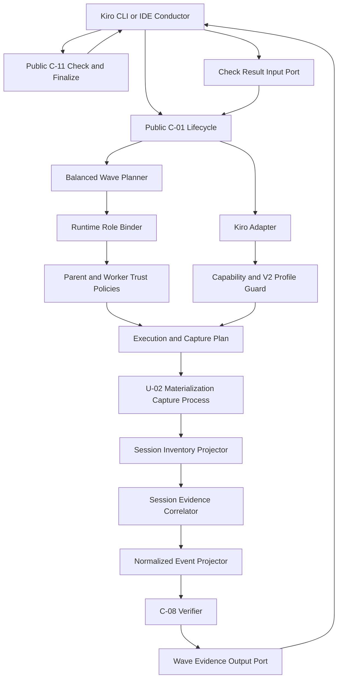

# Kiro Native Driver Logical Components

## 入力契約とcomponent boundary

本設計は`performance-requirements.md`、`security-requirements.md`、`scalability-requirements.md`、`reliability-requirements.md`、`tech-stack-decisions.md`、`business-logic-model.md`を消費し、U-05のNFRをC-07 adapter、balanced split、runtime agent config/profile/session projection、Kiro CLI/IDE conductor projectionへ割り当てる。C-07はpure plan/projectionを提供し、checkpoint、process/capture supervisor、C-08 verdict、C-11 referee/mergeを所有しない。

## Component inventory

| Component | Responsibility | State/I/O | Primary NFR |
|---|---|---|---|
| `KiroSubagentAdapterView` | exactly 1 immutable Kiro driver adapter | scope-local | registration |
| `KiroBalancedWavePlanner` | 2〜4 balanced continuous partitionとdigest | pure value | scale/reliability |
| `KiroCapabilityProbe` | CLI/help/auth/config/behaviorを45秒内で検証 | short-lived process ports | performance |
| `KiroSessionProfileGuard` | V2 metadata/parent/terminal/stdin fieldをclosed検証 | immutable profile | reliability |
| `KiroRuntimeRoleBinder` | wave/Unit tokenからparent/worker role全単射 | pure map | reliability |
| `KiroParentTrustPolicy` | parent toolとexpected trusted role exact set | pure config | security |
| `KiroWorkerTrustPolicy` | worker toolと担当worktree path制約 | pure config | security |
| `KiroRuntimeAgentPlanFactory` | reserved config path/content/owner cleanup plan | pure materialization plan | security |
| `KiroWaveManifestProjector` | Unit assignmentをstdin-only bytesへ変換 | pure bytes | security |
| `KiroExecutionPlanFactory` | V2 argv、manifest、aux material、captureを束縛 | pure plan | reliability |
| `KiroSessionCapturePlanFactory` | baseline root/suffix/role/digest/identityを定義 | pure plan | reliability |
| `KiroSessionInventoryProjector` | baseline後new sessionをallowlist rowへ変換 | sealed provider-state input | security/performance |
| `KiroSessionEvidenceCorrelator` | parent/role/child/terminal/processをAND結合 | call-local index | reliability/scale |
| `KiroNormalizedEventProjector` | C-08向けclosed redacted eventを生成 | pure output | observability |
| `KiroWaveEvidenceOutputPort` | versioned native wave envelopeをconductorへ返す | pure JSON output | boundary |
| `KiroCheckResultInputPort` | conductor経由C-11 resultをbinding検証 | pure JSON input | wave gate |
| `KiroHarnessConductorProjection` | CLI/IDE共通wave/check/finalize順序を記述 | harness source/generated | boundary |

## Interaction and dependency direction

テキスト代替: CLI/IDE conductorはpublic C-01からbalanced waveとC-07 planを取得する。U-02がrole config/capture/processを実行し、C-07がsealed sessionをproject/correlateしてC-08へ渡す。C-08 wave envelopeをconductorがpublic C-11 checkへ渡し、そのresultをC-01 input portへ戻す。両green後だけ次waveを開始し、最後もconductorが二相finalizeを媒介する。

C-01/C-07/C-08とC-11のsource import/invoke edgeは双方向0件である。C-07からU-02/C-08/C-11へのprocess/state ownershipはなく、conductorだけがversioned wire envelopeを順序付ける。

## Failure domains and blast radius

| Failure domain | Containment owner | Blast radius | Forbidden success |
|---|---|---|---|
| invalid Unit/wave set | wave planner | batch plan | drop/1件wave/reorder |
| known capability unavailable | probe | resolve | explicit native launch |
| unknown/unprofileable surface | profile guard | U-05 | floor alias/near profile |
| config trust/path/collision | policies + U-02 | wave pre-dispatch | provider process |
| session parent/terminal mismatch | projector/correlator | wave | file/summary-only success |
| cleanup/capture failure | U-02 | wave | C-11 check/next wave |
| C-11 check red | conductor/input port | wave/batch | next wave arm |

role/config/session/captureはwave/attemptごとに隔離し、旧config/sessionやcross-attempt cacheを共有しない。

## Ownership and verification seams

| Concern | Sole owner | Verification |
|---|---|---|
| selection/wave checkpoint/audit | C-01/U-02 | C-07 store write/import 0 |
| wave split/config/profile/launch/projection | C-07 | pure property/fake session contract |
| config materialize/process/capture/cleanup | U-02 | lifecycle trace、C-07 I/O closure 0 |
| native lifecycle verdict | C-08 | C-07はclosed eventだけを返す |
| worktree成果/check/finalize/merge | C-11 | C-01/C-07/C-08 direct call 0 |
| wave/finalize transport | CLI/IDE conductor | prepare→run-wave→evidence→check→record、二相finalize |

architecture testはKiro adapter exactly 1、C-01/C-07/C-08↔C-11 direct edge 0、C-07内supervisor/daemon/queue/SDK 0、CLI/IDE wave/profile logic duplicate 0、global agent mutation/`--trust-all-tools` 0を検証する。contract testはknown-unavailable、unknown-profile park、post-dispatch failureを別々に検証する。

## Implementation placement and infrastructure bridge

authored C-07 adapter/wave/config/profile/session projectionは`packages/framework/core/`、CLI/IDE conductor projectionはframework harness sourceへ置き、package scriptでdistributionへ生成する。runtime path patternだけを`.gitignore`へ同期する。testsは`bun:test`、fast-check、fake CLI/session、macOS CLI/IDE opt-in live fixtureを既存`tests/`へ置く。

Infrastructure Designへ渡すprovisioning componentは0件である。

| Infrastructure concern | Decision |
|---|---|
| compute | waveごとの短命`kiro-cli` parent/native child。serviceなし |
| API/SDK | installed CLIのみ。SDK/direct APIなし |
| database/cache/queue |非適用。local attempt config/session observerのみ |
| IAM/KMS/secret store |非適用。既存auth classを利用しdetail非保存 |
| autoscaling/load balancer |非適用。balanced serial waveはlocal plan |
| monitoring resource |非適用。redacted wave/session envelopeへhandoff |
| cloud cost |新規resource 0、増分固定費0 |

AWS Well-Architectedの適用結果は、resource新設なし、least-tool/path isolation、bounded waves、fail-closed profile、waste 0である。架空のIaCを追加しない。

## Review

必須のarchitecture reviewerが本節へ結果を追記する。

### Iteration 1

- Verdict: **READY**
- Blocking findings: **0**

実装を阻害するarchitecture findingはない。`KiroBalancedWavePlanner`は全`n>=2`について`waveCount=ceil(n/4)`、2〜4件、最大差1以下、入力順の連続sliceをconstructor invariantにし、`flatten(waves)`を順序・集合・件数で入力とexact一致させる。waveごとのparentはexactly 1、worker role／distinct childはUnitごとexactly 1で、active waveを1件へ閉じるため、Unit drop、duplicate、1件／5件wave、parallel waveを許さない。

parentはread／thinking／subagentとexpected trusted worker role集合だけ、workerはread／write／thinkingと担当prepared worktreeだけに閉じる。shell、AWS、MCP、nested delegation、担当外／main／session／evidence／runtime config path、`--trust-all-tools`を拒否する。C-07は予約config、capture、launchをpure planとして返し、exclusive materialize、baseline inventory、capture/process identity、arm、join/seal、owner/fencing一致cleanupはU-02だけが実行する。

session evidenceはarm前baseline以後のallowlist `.json`／`.jsonl`だけを対象にし、V2 profileへ束縛したparent metadata exactly 1、expected parent ID、runtime worker role、versioned completed terminalをUnit-role-distinct childへ全単射でAND結合する。session file、summary、default agent、instruction自己申告、V3近似はsuccess evidenceにならず、raw session、prompt、message、summary、tool I/O、credentialも永続化しない。

C-08のwave evidence envelopeとconductor-recorded C-11 check resultが両方greenになるまで次waveをmaterialize／armせず、最後もconductorがrecord-finalize request、C-11 finalize、record-finalize resultを二相で媒介する。既知V2 profile上のCLI／auth／trust／materialization unavailableだけが明示hard errorまたは`auto`のpre-dispatch floor、unprofileable parent／terminal／stdin surface・V3-only・unknown schemaはpark、provider arm後のprocess／session／child／cleanup／check failureはfailed-resumableへ分離される。C-01/C-07/C-08とC-11のsource import/invoke edgeは双方向0件である。
