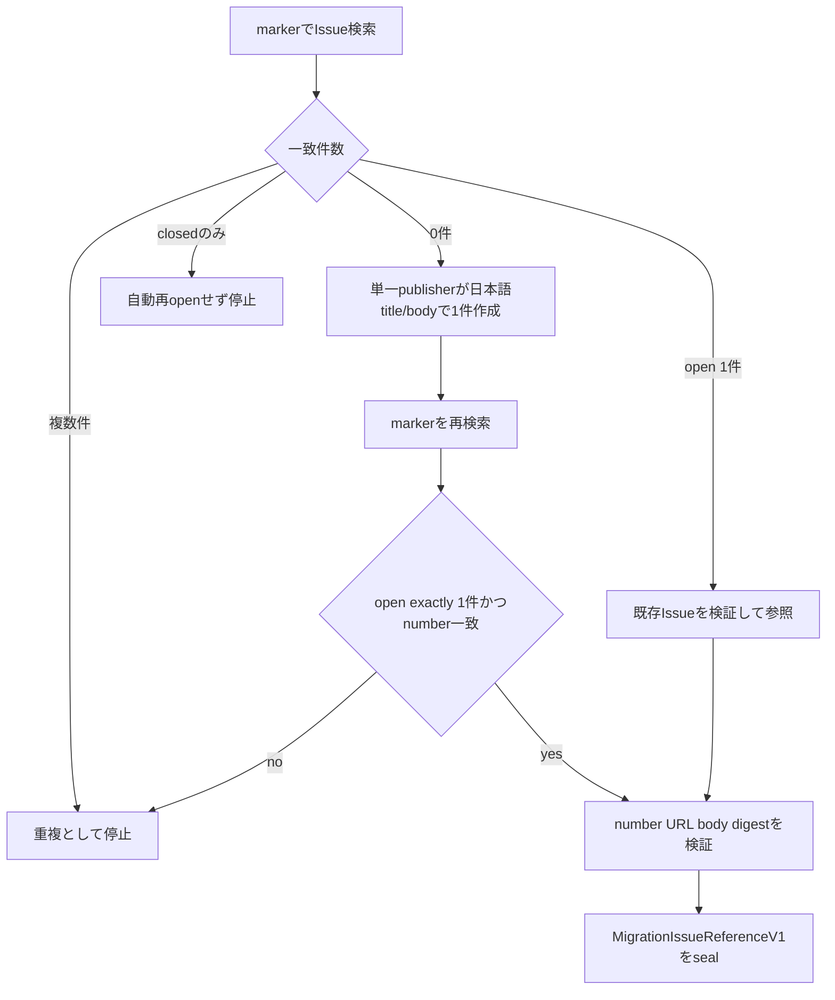
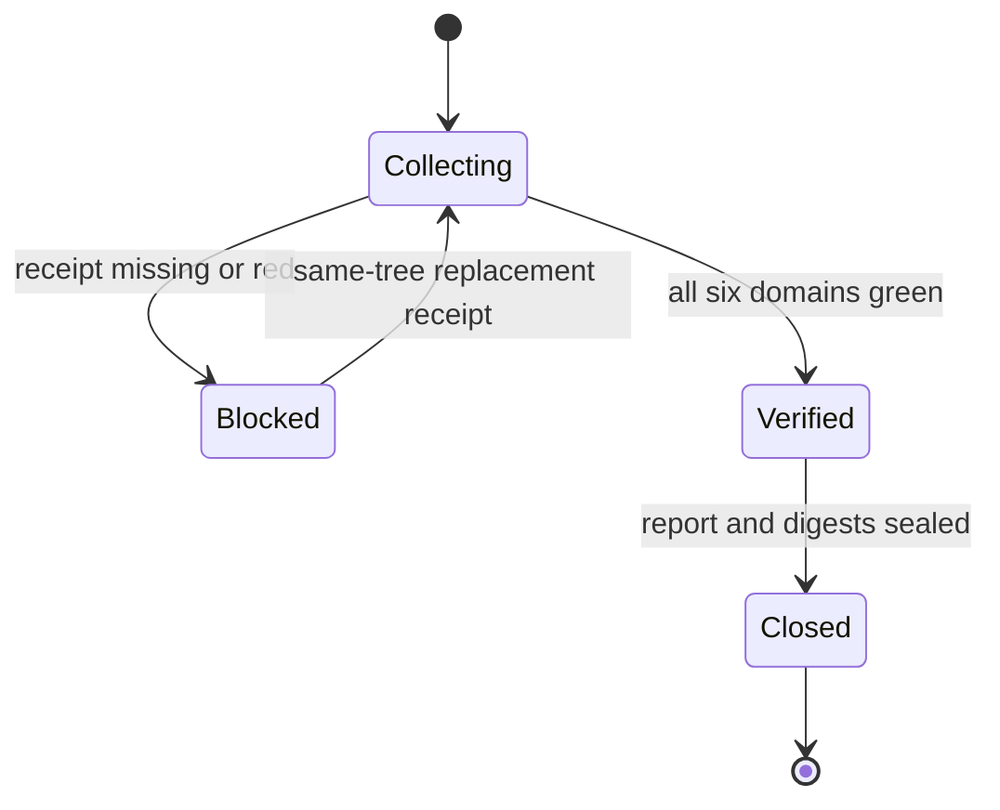

# Release & Migration Closure Business Logic Model

## 目的と上流トレーサビリティ

U-06は`unit-of-work.md`のRelease & Migration Closure、`unit-of-work-story-map.md`のREL-01/REL-02、`requirements.md`のFR-22〜FR-26とNFR-06/NFR-08/NFR-09/NFR-11/NFR-12を、単一のfail-closed release invariantへ変換する。`components.md`のC-04/C-12、`component-methods.md`のclosed registration/legacy表、`services.md`のmacOS live・Linux deterministic・Windows対象外を消費する。

U-06は新しいdriver behavior、provider parser、selector、checkpoint、referee、network serviceを所有しない。provider固有の失敗をrelease層で修正せず、所有Unitへ返す。

## Release closureの入力境界

| 入力 | 正本 | U-06の判定 |
|---|---|---|
| production registry | U-02 composition root + U-03の`DriverAdapterSet`訂正 | 3 provider、4 driver、2/1/1、availableのみ |
| deterministic test | same treeのcommand receipt | unit/integration/E2E/failure/securityが全green |
| distribution | `packages/framework` + C-12 | 4 dist treeとself-installのdrift 0 |
| docs | source docs manifest | 5値、選択、error、fallback、legacy、platformのsemantic coverage |
| live evidence | U-03〜U-05 redacted summary | macOSで4 driver、C-08とC-11がgreen |
| migration tracking | GitHub Issue reference | 日本語Issue、marker一意、required checklist |

すべてのreceiptは同じrepository、release input tree digest、contract versionへ束縛する。input treeは固定manifestに列挙したauthored sourceとgenerated targetから計算し、provider live summaryを含む全receipt/reportとmachine-local runtimeを除外して自己参照を防ぐ。古いcommit、別worktree、raw provider payload、CI URLだけの自己申告は入力として拒否する。

## Release closureアルゴリズム

```text
checkReleaseClosure(input): ReleaseClosureReportV1
  validate schema/repository/tree/contract binding
  registry = inspectProductionRegistry(input.productionRegistry)
  projection = verifyProjection(input.projectionReceipt)
  docs = verifyDocsContract(input.docsReceipt)
  deterministic = verifyPlatformReceipts(input.platformReceipts)
  coverage = verifyRequirementCoverage(input.requirementCoverageMap)
  live = verifyNativeLiveIndex(input.liveEvidenceIndex)
  issue = verifyMigrationIssueReference(input.issueReference)
  findings = canonicalSort(all non-green results, including coverage)
  if findings is not empty:
    return blocked(reportDigest, findings, no success claim)
  return closed(reportDigest, immutable receipt digests)
```

検査は順序に依存せず全findingを集約するが、副作用を伴う実行順は次へ固定する。

1. production registry contractをpure testで検証する。
2. markerで0.2.0 Issueを一意にensureし、reference URLを確定する。
3. source docsへ検証済みIssue URLを含むcontractを反映する。
4. 正本を編集後、`package.ts`で4 harnessを生成し、Claude/Codex self-installも同期する。
5. 最終release input tree digestを固定し、docs/package/self-install/setupのread-only checkを実行する。
6. typecheck/lint/unit/integration/deterministic E2Eを同じinput treeでmacOSとLinuxから実行する。
7. provider UnitのmacOS opt-in live journeyを同じinput treeに対して実行し、candidate IDへ束縛したredaction済みevidence indexをsealする。
8. 同じ最終input treeのreceiptだけを集約し、release closure reportを生成する。

write commandの成功だけではreceiptにしない。直後のread-only checkが同じtree digestでgreenの場合だけ受理する。

## Production registry完全性

U-03 architecture reviewで訂正された最終contractを使う。

```text
RegistrationSlot =
  available(adapterSet: DriverAdapterSet)
  | unavailable(diagnosticCode)

expected = {
  claude: [claude-agent-teams, claude-ultracode],
  codex: [codex-ultra],
  kiro: [kiro-subagent]
}
```

production composition rootをbuildし、public `forDriver`から4 driverを各1回解決する。次をすべてANDする。

- provider keyはClaude/Codex/Kiroの3件、driver keyは上記4件とexact一致する。
- Claude setは2 immutable adapter、Codex/Kiro setは各1 adapterである。
- map key、declared driver、`adapter.driver`、provider ownershipが一致する。
- 全slotが`available`であり、`REGISTRATION_SLOT_UNIMPLEMENTED`が0件である。
- fake/no-op/test adapter、dynamic import、unknown/extra descriptorが0件である。
- 4 driverをproduction registry経由でprobe/buildできるfixtureを持つ。

source regexやfile存在だけから完全性を推定しない。generic contract correctionはU-01/U-02 Code Generationへ適用するが、provider mappingと公開literalは変えない。

## Distribution projectionとdrift guard

C-12は既存manifest discoveryを正本とする。

| 層 | 対象 | 検証 |
|---|---|---|
| authored core | `packages/framework/core` | runtime/tool/schema/docs共通source |
| authored harness | `harness/{claude,codex,kiro,kiro-ide}` | 4 manifest、projectionだけ |
| generated dist | `dist/{claude,codex,kiro,kiro-ide}` | `package.ts --check` byte parity、orphan 0 |
| dogfood self-install | `.claude`、`.codex`、`.agents`、`CLAUDE.md`、`AGENTS.md` | `promote-self.ts --check` |
| setup artifact | offline install/upgrade fixture | generated payloadからinstall/verify成功 |

Kiro/Kiro IDEに存在しないself-install targetを追加しない。`dist/**`とdogfood targetを先に編集せず、常にauthored sourceから再生成する。manifest discoveryの4 harness setとrelease reportのtarget setが一致しなければfailする。

## Documentation contract

`SwarmDriverDocsContractV1`はsource docs pathとrequired semantic IDを固定する。文書表現そのものを1文字単位で固定せず、次の事実を各読者surfaceで検査する。

1. 公開値は`auto`、`claude-agent-teams`、`claude-ultracode`、`codex-ultra`、`kiro-subagent`のexact 5値。
2. harness別許容値と`auto`決定表。
3. 明示driverのharness不一致/能力不足はside effect前hard error。
4. fallbackは`auto`のdispatch前だけで、requested/selected/reasonをloud表示・監査する。
5. `AMADEUS_USE_SWARM`は0.1.xのharness別意味を維持し、毎attempt warning、新旧併存は`CONFLICTING_ENV`。
6. macOSとGitHub Actions Linuxがrelease criterion、Windowsは未保証。
7. 0.2.0で旧変数を削除する追跡Issueへのlink。

対象はUser Guide、Claude/Codex/Kiro/Kiro IDE harness guide、developer reference、migration guide、環境変数exampleである。既存の英日pairは両方更新する。generated skillはpackage parityで同期し、docs scanの正本へしない。

## Platformとtest matrix

| Layer | macOS local | GitHub Actions Linux | Windows |
|---|---|---|---|
| typecheck/lint/complexity | 必須 | 必須 | 対象外 |
| unit/integration/failure/security | 必須 | 必須 | 対象外 |
| deterministic driver E2E | 必須 | 必須 | 対象外 |
| package/dist/self-install/setup | 必須 | 必須 | 対象外 |
| credentialed native live | 4 driver必須 | 実行しない | 対象外 |

Linuxでは既存`test:ci`に加え、非credentialのswarm-driver release E2Eを明示実行する。live testがself-skipしてもdeterministic suiteの結果にすぎず、`NativeLiveEvidenceIndexV1`を満たさない。macOS receiptはlocal command、Linux receiptはGitHub Actions run ID/SHA/job conclusionを同じtreeへ束縛する。

FR-22/NFR-11のcoverage mapはFR-01〜FR-26を最低1つのunit/integration/E2E/failure/live IDへ逆引きする。`not applicable`は根拠を持つが、未実装やskipをcoverageに数えない。

## macOS native live evidence index

| Driver | 必須journey | 最低条件 |
|---|---|---|
| `claude-agent-teams` | Claude Code | 2 Unit以上、Team native child、C-08/C-11 green |
| `claude-ultracode` | Claude Code | 2 Unit以上、Ultra Code workflow、C-08/C-11 green |
| `codex-ultra` | Codex | 2 Unit以上、runtime-resolved Ultra、native collaboration、C-08/C-11 green |
| `kiro-subagent` | Kiro CLI + Kiro IDE | 両harnessで2 Unit/5 Unit、5件は3+2、全child、C-08/C-11 green |

各provider Unitがownerであり、U-06はsummaryを再parseしない。indexはdriver/harness/platform、CLI/profile version、execution/attempt/run digest、Unit/child/wave count、C-08 verdict、C-11 check/finalize、evidence file digestだけを保持する。prompt、summary text、raw JSONL/session/provider state、credential、absolute homeを拒否する。

auth不足、unknown schema、park、skip、floor、legacy、Claude xhigh、Codex xhigh-only、Kiro default childをgreenへ変換しない。4 driver中1つでも欠ければrelease全体をblockedとする。

## 0.2.0 migration Issue workflow

Issue markerは`<!-- amadeus:remove-amadeus-use-swarm:0.2.0 -->`、repositoryは`amadeus-dlc/amadeus`へ固定する。



テキスト代替: marker一致のopen Issueが1件なら再利用し、0件なら単一publisher invocationが日本語Issueを1件作る。create後にmarkerを再検索し、open exactly 1件かつ作成number一致を確認する。複数、closedだけ、create後競合なら自動変更せず停止する。Issue内容とURLを検証してからlocal referenceをsealする。

Issue checklistは旧env read、compatibility branch、deprecation warning、legacy-only test、暫定docs/example、generated artifactの除去、およびClaude/Codex/Kiro CLI/Kiro IDEのselection/legacy/distribution testを含む。0.2.0削除そのものは今回の変更へ含めない。

## Closure lifecycle



テキスト代替: registry、distribution、docs、platform tests、native live、migration Issueの6 domainを収集する。不足またはredがあればblockedで、同一treeのreplacement receiptを得た場合だけ再収集できる。全domain green後にreport digestをsealしてclosedにする。

`Closed` reportはimmutableである。release input manifest内のtreeが変わったら既存reportを更新せず新しいcandidate IDで全receiptを再評価する。provider summary、receipt、report出力だけの更新はinput digestを変えない。

## Failure model

| Code | 意味 | Ownerへの戻し先 |
|---|---|---|
| `REGISTRY_INCOMPLETE` | unavailable/欠落/余分/重複/fake slot | U-01〜U-05の該当contract |
| `PROJECTION_DRIFT` | dist/self-install/setup parity不成立 | C-12/U-06 |
| `DOCS_CONTRACT_INCOMPLETE` | required semantic ID欠落 | U-06 |
| `PLATFORM_RECEIPT_MISSING` | macOSまたはLinux deterministic不足 | U-06/CI |
| `LIVE_EVIDENCE_MISSING` | 4 driverのmacOS native proof不足 | U-03〜U-05 |
| `LIVE_EVIDENCE_REDACTION_FAILED` | raw/secret-like field混入 | evidence producer |
| `MIGRATION_ISSUE_INVALID` | marker/checklist/URL/status不成立 | U-06 |
| `RELEASE_TREE_MISMATCH` | receiptが別tree/contract | receipt再実行 |

すべてblockingであり、warningへdowngradeしない。reportはcode、subject ID、expected/observed digestだけを持ち、provider payloadやcredentialを持たない。

## Test model

### Deterministic

- registry: 3 provider/4 driver happy path、Claude 1/3件、Codex/Kiro 0/2件、key mismatch、unavailable、fake、dynamic load、unknown descriptor。
- projection: 4 manifest discovery、missing/orphan/hand-edited dist、self-install drift、setup offline install/upgrade。
- docs: 5値の欠落/余分、harness表不一致、silent fallback表現、legacy競合欠落、Windows supportの誤表明、Issue link欠落。
- receipts: tree mismatch、duplicate ID、red/skip/unknown、stale commit、Linux liveをmacOSへ偽装、raw/secret-like field。
- issue: 0/open1/open2/closed1、create後open2競合、create戻りnumber不一致、marker違い、日本語title/body/checklist欠落、別repository URL。
- report: finding順の決定性、全domain AND、closed immutable、tree変更で新candidate。

### Platform integration

- macOSとLinuxでtypecheck、lint、unit、integration、非credential driver E2E、distribution/self-install/setupを実行する。
- Linux CIはproduction registry completenessとdocs contract scanを直接実行する。
- macOS liveはprovider Unitのproduction journeyを実行し、U-06 checkerがindexを閉じる。
- Windows jobや成功表現を追加せず、既存Windows専用codeを変更しない。

## 設計不変条件

1. 正本は`packages/framework`で、generated treeの直接編集は0件である。
2. production registryは3 provider/4 native driver、cardinality 2/1/1、unavailable/fake 0件である。
3. 4 dist treeとClaude/Codex self-installは同じsource treeからdrift 0である。
4. docsは5値、selection、hard error、loud fallback、legacy、platform、0.2.0 Issueを同じcontractで説明する。
5. macOS/Linux deterministicは両方必須、native liveはmacOS 4 driver必須、Windowsは対象外である。
6. skip、auth不足、unknown profile、floor/legacyをnative live passへ読み替えない。
7. Issueはmarker一致のopen 1件だけを参照し、今回0.2.0削除を実行しない。
8. 全receiptは同一tree/contractへ束縛し、1件でも不足ならreleaseをclosedにしない。
9. raw provider data、prompt、credential、session本文をreport/indexへ入れない。
10. U-06はprovider behavior、selector、refereeを再実装しない。

## Review

必須のarchitecture reviewerが本節へ結果を追記する。

### Iteration 1

- Verdict: **READY**
- Blocking findings: **0**

指定されたrelease closure境界は実装可能なfail-closed contractとして一貫している。

- production registryはU-03で訂正されたdriver-keyed `DriverAdapterSet`を採用し、Claude/Codex/Kiroの3 provider、4 driver、cardinality 2/1/1、全slot `available`、key/declared driver/`adapter.driver`一致をproduction composition rootから検証する。
- C-12は`packages/framework`のauthored coreと4 harness manifestを正本とし、4つの`dist`を`package.ts --check`、既存するClaude/Codex dogfood self-installだけを`promote-self.ts --check`で検証する。Kiro/Kiro IDE用self-installを新設せず、generated targetを直接編集しない。
- docsは固定source manifestとsemantic IDで、公開5値、harness別selection、明示hard error、dispatch前だけのloud fallback、0.1.x legacy/conflict、platform、0.2.0 Issue linkをsection単位で検証する。generated docsを正本へ読み替えない。
- macOSとGitHub Actions Linuxのdeterministic suiteを両方必須とし、credentialed native liveはローカルmacOSの4 driverへ限定する。Linuxのskip/fake testをlive proofへ昇格せず、Windowsを未保証のまま分離する。
- release input treeは固定manifestのauthored source/generated targetから計算し、provider summaryを含むreceipt/reportとmachine-local runtimeを除外するため自己参照しない。全receiptとFR-01〜FR-26の非空`RequirementCoverageMap`を同じcandidateへ束縛し、不足時は`closed`を構築できない。
- 0.2.0 Issue ensureはmarker検索でopen 1件を再利用し、0件時だけ単一publisherが作成する。create後に再検索してopen exactly 1件かつ作成number一致を確認し、重複・closed-only・競合では外部状態を追加変更せずblockする。今回のscopeでは旧変数を削除しない。
- U-06はprovider Unitのsealed/redaction済みsummaryだけをindex化し、provider probe/parser/selector/checkpoint/refereeやsuccess判定を再実装しない。不足はU-03〜U-05へ戻し、skip・floor・legacy・自己申告で補完しない。
