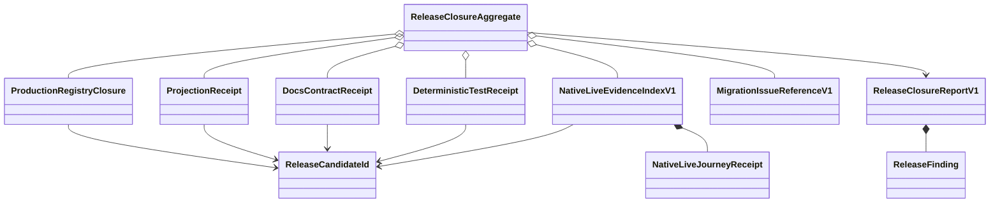

# Release & Migration Closure Domain Entities

## モデリング方針と上流参照

U-06はrelease時のimmutable receiptとclosure aggregateだけを定義する。`unit-of-work.md`、`unit-of-work-story-map.md`、`requirements.md`、`components.md`、`component-methods.md`、`services.md`を消費し、provider execution entity、database、daemon、registry pluginを新設しない。

raw provider payloadとGitHub credentialはdomain constructorへ渡さない。entityは同一repository/tree/contractへのbindingとredaction済みdigestだけを保持する。

## ReleaseCandidateId

```text
ReleaseCandidateId
  repository = amadeus-dlc/amadeus
  inputManifestVersion = 1
  inputTreeDigest: sha256(fixed release input paths)
  contractVersion = 1
  candidateDigest: sha256(repository, inputManifestVersion, inputTreeDigest, contractVersion)
```

input manifestはauthored sourceとgenerated targetを含み、provider live summaryを含む全receipt/reportとmachine-local runtimeを除外する。manifest内のtreeが変われば別candidateとなる。branch名、worktree path、local usernameはidentityに含めない。

## ProductionRegistryClosure

```text
ProductionRegistryClosure
  candidateId
  providers: exact set<claude, codex, kiro>
  adaptersByDriver:
    claude-agent-teams -> claude available adapter digest
    claude-ultracode -> claude available adapter digest
    codex-ultra -> codex available adapter digest
    kiro-subagent -> kiro available adapter digest
  cardinality: claude=2 / codex=1 / kiro=1
  productionAssemblyDigest
  status: green
```

factoryはproduction composition rootからのみ生成する。`unavailable`、fake/no-op、duplicate/extra/missing、keyと`adapter.driver`不一致、dynamic moduleを受け取るconstructorは存在しない。

## ProjectionReceipt

```text
ProjectionReceipt
  candidateId
  authoredSourceDigest
  discoveredHarnesses: exact ordered [claude, codex, kiro, kiro-ide]
  distTreeDigests: closed map<harness, sha256>
  selfInstallDigest
  setupOfflineReceiptDigest
  packageCheck = green
  promoteSelfCheck = green
  setupCheck = green
```

write commandのstdoutではなくread-only check結果から生成する。Kiro/Kiro IDE self-installをfieldへ追加しない。targetの欠落・orphan・unreferenced sourceはgreen receiptを構築不能にする。

## DocsContractReceipt

```text
DocsContractReceipt
  candidateId
  manifestVersion = 1
  sourceFiles: ordered unique relative paths
  semanticCoverage:
    public-five-values
    harness-selection-table
    explicit-hard-error
    pre-dispatch-loud-fallback
    legacy-0.1x-and-conflict
    macos-linux-windows-unsupported
    migration-issue-link
  englishJapanesePairCoverage
  receiptDigest
  status: green
```

semantic IDごとにexpected source file集合を持つ。generated `dist` pathはsourceFilesへ入らず、C-12 parityで間接検証する。文章全文や任意regex captureをreceiptへ保存しない。

## DeterministicTestReceipt

```text
DeterministicTestReceipt
  candidateId
  platform: macos | github-actions-linux
  suiteId:
    typecheck-lint-complexity
    unit-integration-failure-security
    deterministic-driver-e2e
    distribution-self-install-setup
  commandDigest
  testManifestDigest
  passed / failed / skipped counts
  ciRunIdDigest: required only for linux
  conclusion = green
```

`green`はfailed=0かつrequired testのskipped=0を要求する。provider live testのintentional skipはこのreceiptの外にあり、live proofへ昇格しない。Windows variantは型に含めない。

## RequirementCoverageMap

```text
RequirementCoverageMap
  candidateId
  entries: exact map<FR-01..FR-26, non-empty EvidenceId[]>
  evidenceCatalogDigest
```

Evidence IDはunit/integration/E2E/failure/liveのclosed prefixを持つ。`skip`、`todo`、存在しないtest pathを参照できない。NFRはrelease ruleへ逆引きし、FR coverageの空集合を許さない。

## NativeLiveJourneyReceipt

```text
NativeLiveJourneyReceipt
  candidateId
  driver: NativeDriver
  harnessJourney: claude | codex | kiro-cli | kiro-ide
  platform = macos
  cliVersion / profileVersion
  executionDigest / attemptDigest / nativeRunDigest
  unitCount / childCount / waveSizes
  nativeEvidence = green
  unitResults = green
  refereeCheck = green
  refereeFinalize = green
  summaryFileDigest
```

`driver`とjourneyの許可組合せはClaude 2 driver→Claude、Codex→Codex、Kiro→Kiro CLI/Kiro IDEに閉じる。Kiroは各harnessの2 Unitと5 Unit receiptを必要とし、5 UnitのwaveSizesは3+2である。

raw stream、prompt、assistant summary、session/provider state、credential、absolute home、tokenをfieldとして表現できない。

## NativeLiveEvidenceIndexV1

```text
NativeLiveEvidenceIndexV1
  candidateId
  journeys: ordered unique NativeLiveJourneyReceipt[]
  coveredDrivers: exact set<4 NativeDriver>
  indexDigest
  status: complete
```

smart constructorは必須journey matrix、driver全件、production path、C-08/C-11のAND、candidate一致、receipt重複0件を検証する。auth不足、skip、unknown profile、park、floor/legacyはjourney entityを生成できない。

## MigrationIssueReferenceV1

```text
MigrationIssueReferenceV1
  repository = amadeus-dlc/amadeus
  targetVersion = 0.2.0
  markerDigest
  issueNumber: positive integer
  issueUrl: canonical https GitHub issue URL
  state = open
  language = ja
  checklistIds: exact required set
  titleDigest / bodyDigest
```

marker raw textはlocal fixture側の定数で、entityはdigestを保持する。open一致0件のときだけ単一publisher invocationが作成し、create後の再検索でopen exactly 1件かつ返されたnumber一致を確認する。初回または再検索で複数、closedだけ、number不一致ならreferenceを生成せず、人間による重複解消まで停止する。GitHub tokenやAPI response bodyを保持しない。

## ReleaseFinding

```text
ReleaseFinding
  domain: registry | projection | docs | platform | live | migration
  code: closed ReleaseFailureCode
  subjectId
  expectedDigest | absent
  observedDigest | absent
  rerunCommandId | absent
```

findingはdomain/code/subjectIdでcanonical sortする。raw command、environment、stack、provider payloadを含まない。

## ReleaseClosureReportV1

```text
ReleaseClosureReportV1
  candidateId
  state: blocked | closed
  registryReceiptDigest | absent
  projectionReceiptDigest | absent
  docsReceiptDigest | absent
  platformReceiptDigests
  requirementCoverageDigest | absent
  liveEvidenceIndexDigest | absent
  migrationIssueReferenceDigest | absent
  findings: ordered ReleaseFinding[]
  reportDigest
```

`blocked`はfindingsが1件以上、`closed`はfindings=0かつ全required receiptとFR-01〜FR-26の非空`RequirementCoverageMap`が存在する場合だけ構築できる。`closed`はterminal immutableである。candidate変更時は既存reportをmutateせず新規生成する。

## ReleaseClosureAggregate

```text
ReleaseClosureAggregate
  state: collecting | blocked | verified | closed
  candidateId
  receiptSet

  collect(receipt)
  evaluate(): blocked | verified
  seal(): closed report
```

許可transitionは`collecting -> blocked|verified`、`blocked -> collecting`、`verified -> closed`だけである。blockedからcollectingへ戻るreplacement receiptは同じcandidate、同じreceipt kind/subjectを置換する。closedにoutgoing transitionはない。

## Entity relationships



テキスト代替: 全receiptは同じReleaseCandidateIdを持つ。live indexはprovider journey receiptを所有し、ReleaseClosureAggregateがregistry、projection、docs、platform、live、Issue referenceを集約してreportを生成する。blocked reportはfindingを所有する。

## Ownershipと永続化

| Data | Owner | 永続先 | 禁止事項 |
|---|---|---|---|
| production registry | U-02 + U-03 correction | source/test | U-06でprovider実装変更 |
| distribution receipt | C-12/U-06 | code-generation release report | generated targetを正本化 |
| docs receipt | U-06 | code-generation release report | raw docs全文の複製 |
| deterministic receipt | local/CI runner | code-generation release report | 別tree結果の再利用 |
| live journey summary | U-03〜U-05 | provider Unit output | raw provider data保存 |
| live index | U-06 | code-generation release report | skip/floorの昇格 |
| Issue reference | U-06 | migration reference artifact | credential/API body保存 |
| closure report | U-06 | U-06 code-generation output | closed reportのmutation |

## Confidentiality invariants

1. credential、token、email、account、prompt、assistant responseをentityへ置かない。
2. raw JSONL/session/provider state/tool payloadをlive index/reportへ置かない。
3. absolute home/worktree pathをdigest前のfieldとして永続化しない。
4. test receiptはcommand/env全文ではなくmanifest/command digestを使う。
5. GitHub Issueは公開のtitle/body digestとcanonical URLだけをlocal referenceへ持ち、API credentialを持たない。
6. unknown fieldをcatch-all mapとして保存しない。
