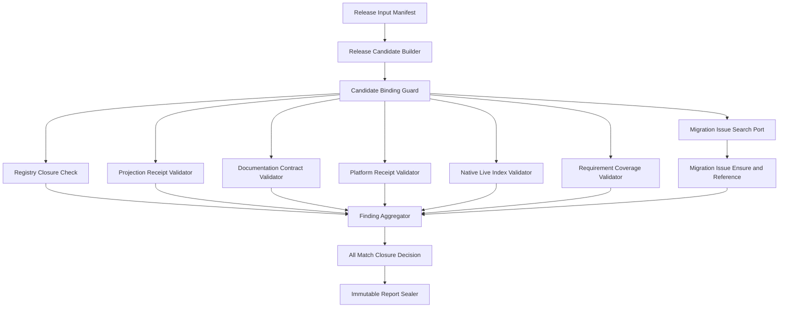

# Release & Migration Closure Logical Components

## 入力契約とcomponent boundary

本設計は`performance-requirements.md`、`security-requirements.md`、`scalability-requirements.md`、`reliability-requirements.md`、`tech-stack-decisions.md`、`business-logic-model.md`を消費し、U-06のNFRをrelease checker、manifest/schema、receipt/live/coverage validator、Issue ensure、report sealへ割り当てる。U-06はprovider probe/parser/selector/checkpoint、C-08/C-11判定、package generator、test runner、GitHub認証を再実装しない。

## Component inventory

| Component | Responsibility | State/I/O | Primary NFR |
|---|---|---|---|
| `ReleaseInputManifestGuard` | authored/generated inputと除外output/runtimeをclosed定義 | immutable manifest | security |
| `ReleaseCandidateBuilder` | repository/tree/contractからcandidate IDを生成 | file read/hash | reliability |
| `CandidateBindingGuard` | receipt/index/referenceのsame-candidate exact match | pure validation | security |
| `ProductionRegistryClosureCheck` | production rootから3 provider/4 driver/2-1-1を検証 | public registry calls | reliability |
| `ProjectionReceiptValidator` | package/self-install/setupのwrite→read-only parityを検証 | sealed receipt | reliability |
| `DocumentationContractValidator` | source docs manifestとsemantic contract IDを検証 | source docs read | correctness |
| `PlatformReceiptValidator` | macOS/Linux run SHA/conclusion/test matrixを検証 | sealed receipt | reliability |
| `NativeLiveIndexValidator` | macOS 4 driver sealed summaryとredactionを検証 | sealed index only | security |
| `RequirementCoverageValidator` | FR-01〜FR-26をvalid evidenceへ逆引き | coverage map | completeness |
| `MigrationIssueSearchPort` | fixed repo/markerのopen/closed stateを取得 | read-only network | security |
| `MigrationIssuePublisherPort` | open 0件時にfixed日本語Issueを最大1件作成 | network mutation | reliability |
| `MigrationIssueReferenceValidator` | re-search結果のnumber/URL/body/statusを照合 | pure validation | security |
| `FindingAggregator` |全domain/coverage findingをdedupe/canonical sort | call-local | performance |
| `ClosureDecision` | six-domain AND + coverageをclosed/blockedへ投影 | pure value | reliability |
| `ClosureReportSealer` | candidate-bound immutable JSON/report digestを生成 | atomic output write | durability |

## Interaction and dependency direction

テキスト代替: fixed manifestからcandidateを作り、binding guardを通ったregistry/projection/docs/platform/live/coverage/Issue evidenceだけを各validatorへ渡す。全findingを集約し、6 domainとcoverageがall-matchの場合だけclosure decisionをclosedにしてimmutable reportをsealする。

依存方向はcandidate bindingから各独立validator、aggregator、decision、sealerへの一方向である。validatorは互いのgreenを推測せず、Issue publisher以外はread-onlyである。

## Failure domains and blast radius

| Failure domain | Containment owner | Blast radius | Forbidden closure |
|---|---|---|---|
| manifest/tree/contract mismatch | candidate builder/guard | candidate全体 | stale receipt再利用 |
| registry fake/incomplete | registry check | registry domain | source regex green |
| generated/docs drift | projection/docs validator |各domain | hand edit/write-only green |
| platform receipt mismatch | platform validator | platform domain | Linux/macOS代替 |
| live missing/raw field | live validator | live domain | fake/skip/floor補完 |
| coverage missing | coverage validator | closure invariant | row数で未実装隠蔽 |
| Issue duplicate/closed/race | Issue state machine | Issue domain |追加mutation/誤reference |

domain failureは他domainの検査を止めず、aggregatorが全findingを返す。provider behaviorの修正やexternal Issue競合の自動解決をU-06へ波及させない。

## Ownership and verification seams

| Concern | Sole owner | Verification |
|---|---|---|
| authored source/generation | existing package/promote/setup tools | write後same-tree read-only receipt |
| provider native evidence | U-03〜U-05 | U-06 raw input port 0、sealed summary only |
| C-08/C-11 success semantics | existing owners | U-06 reparse/reimplementation 0 |
| platform test execution | existing test/CI runners | run SHA/tree/conclusion receipt |
| Issue state mutation | single publisher port | state/mutation spy、re-search |
| release closure/report | U-06 decision/sealer | all-match/immutability property |

architecture testはnew runtime dependency/service/database/cache/queue/GitHub SDK/dynamic plugin 0、provider parser/referee duplicate 0、generated target direct ownership 0を検証する。contract testはsame-tree binding、3/4/2-1-1 registry、4 dist/2 self-install、2 platform/4 live/26 FR/6 domain exact setを検証する。

## Implementation placement and infrastructure bridge

authored checker/manifest/docs/coverage schemaは`packages/framework/core/`または既存release tool配置、harness sourceは`packages/framework/harness/`へ置く。既存Bun/TypeScript ESM、Git/GitHub Actions、package/self-install scripts、`bun:test`、Node標準APIを使う。

Infrastructure Designへ渡すprovisioning componentは0件である。

| Infrastructure concern | Decision |
|---|---|
| compute/service | local/CI Bun checker。常駐serviceなし |
| database/cache/queue |非適用。immutable receipt/report filesのみ |
| cloud IAM/KMS |非適用。既存GitHub/provider authをpublisher/process内だけで使用 |
| network |既存GitHub Issue publisherのみ。新SDK/serviceなし |
| multi-region/backup |非適用。Git/repository receiptがprovenance正本 |
| observability resource |非適用。canonical findings/reportを既存CIへ出力 |
| cloud cost |新規resource 0、増分固定費0 |

AWS Well-Architectedの適用結果は、resource新設なし、supply-chain provenance、least-data evidence、single mutation owner、waste 0である。架空のIaCを追加しない。

## Review

必須のarchitecture reviewerが本節へ結果を追記する。

### Iteration 1

- Verdict: **READY**
- Blocking findings: **0**

実装を阻害するarchitecture findingはない。`ReleaseInputManifestGuard`はauthored/generated inputをfixed pathへ閉じ、receipt、report、provider summary、machine-local runtimeをcandidate inputから除外する。`ReleaseCandidateBuilder`と`CandidateBindingGuard`はrepository、release input tree、contract、candidate IDを全receipt/index/referenceへexact bindし、stale SHA、別worktree、duplicate ID、旧candidateの部分receipt再利用を拒否する。

production composition rootはClaude/Codex/Kiroの3 provider、4 native driver、cardinality 2/1/1をpublic `forDriver`からexact検証し、fake/no-op/test/unavailable/dynamic/unknown adapterをgreenにしない。projectionは`packages/framework`と4 harness manifestを正本に4つのdistを生成・read-only検証し、self-installは既存Claude/Codex targetだけをsame-treeで照合する。Kiro/Kiro IDE self-installの新設やgenerated targetの直接所有を許さない。

platform receiptはmacOS localとGitHub Actions Linux deterministic suiteを同じtree/SHAへ束縛し、credentialed liveはmacOSの4 driver exact setをsealed summaryで要求する。Windowsは対象外で、Linux fake/skip、floor、legacy、auth不足、unknown profileをlive proofへ昇格しない。`NativeLiveIndexValidator`はprovider Unitのredacted sealed indexだけを読み、raw stream/session/state、provider parser、C-08/C-11 success semanticsを再解析・再実装しない。

closureはregistry、projection、docs、platform、live、Issueの6 domainがall-matchし、FR-01〜FR-26を各1件以上のvalid evidenceへ逆引きできる場合だけ`closed`を構築する。Issueはfixed repository/markerのsingle publisherがopen 0件時に最大1件作成し、create後のre-searchでopen exactly 1、number/URL/body/status一致を確認する。重複、closed-only、raceでは追加create/reopen/deleteを行わない。sealed reportはimmutableで、input tree/contract変更時は上書きせずnew candidateを全再評価する。
