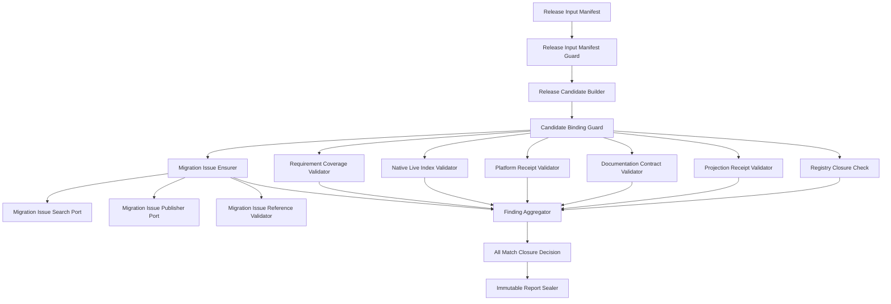

# Release & Migration Closure Logical Components

## 入力契約とcomponent boundary

本設計は`performance-requirements.md`、`security-requirements.md`、`scalability-requirements.md`、`reliability-requirements.md`、`tech-stack-decisions.md`、`business-logic-model.md`を消費し、U-06のNFRをrelease checker、manifest/schema、receipt/live/coverage validator、Issue ensure、report sealへ割り当てる。U-06はprovider probe/parser/selector/checkpoint、C-08/C-11判定、package generator、test runner、GitHub認証を再実装しない。

## Component inventory

| Component | Responsibility | State/I/O | Primary NFR |
|---|---|---|---|
| `ReleaseInputManifestGuard` | authored/generated inputと除外output/runtimeをclosed定義 | immutable manifest | security |
| `ReleaseCandidateBuilder` | repository/tree/contractからcandidate IDを生成 | 1-pass streaming file hash | reliability |
| `CandidateBindingGuard` | receipt/index/referenceのsame-candidate exact match | pure validation | security |
| `ProductionRegistryClosureCheck` | production rootから3 provider/4 driver/2-1-1を検証 | public registry calls | reliability |
| `ProjectionReceiptValidator` | package/self-install/setupのwrite→read-only parityを検証 | sealed receipt | reliability |
| `DocumentationContractValidator` | source docs manifestとsemantic contract IDを検証 | source docs read | correctness |
| `PlatformReceiptValidator` | macOS/Linux run SHA/conclusion/test matrixを検証 | sealed receipt | reliability |
| `NativeLiveIndexValidator` | macOS 4 driverのtransport/capture/resource closed variant、versioned invocation contract/canonical argv digest、process terminal後のsealed summary、redactionを検証 | sealed index only | security |
| `RequirementCoverageValidator` | FR-01〜FR-26をvalid evidenceへ逆引き | coverage map | completeness |
| `MigrationIssueSearchPort` | fixed repo/markerをpagination終端まで列挙し、任意のauthoritative total countと照合 | read-only network | security |
| `MigrationIssuePublisherPort` | open 0件時にfixed日本語Issueを最大1件作成 | network mutation | reliability |
| `MigrationIssueReferenceValidator` |完全なre-search集合の件数/digest/number/URL/body/statusを照合 | pure validation | security |
| `MigrationIssueEnsurer` |完全検索→0/1/multi/closed分類→必要時最大1 publish→完全再検索→reference sealを順序制御 | ports + call-local state | reliability |
| `FindingAggregator` |全domain/coverage findingをdedupe/canonical sort | call-local | performance |
| `ClosureDecision` | six-domain AND + coverageをclosed/blockedへ投影 | pure value | reliability |
| `ClosureReportSealer` | candidate-bound immutable JSON/report digestを生成 | atomic output write | durability |

## Interaction and dependency direction

テキスト代替: manifest guardがfixed manifestの入力/除外集合を検証してからcandidateを作る。binding guardを通ったregistry/projection/docs/platform/live/coverage evidenceだけを各validatorへ渡す。Issue ensurerはsearch/publisher/reference portsを従え、完全検索後の0件時だけ最大1 publishし、完全再検索とreference validationが終わるまでIssue domainをgreenにしない。全findingを集約し、6 domainとcoverageがall-matchの場合だけclosure decisionをclosedにしてimmutable reportをsealする。

依存方向はmanifest guard、candidate builder、candidate binding、各独立validator／Issue ensurer、aggregator、decision、sealerへの一方向である。validatorは互いのgreenを推測せず、Issue ensurer配下のpublisher port以外はread-onlyである。

## Failure domains and blast radius

| Failure domain | Containment owner | Blast radius | Forbidden closure |
|---|---|---|---|
| manifest/tree/contract mismatch | candidate builder/guard | candidate全体 | stale receipt再利用 |
| registry fake/incomplete | registry check | registry domain | source regex green |
| generated/docs drift | projection/docs validator |各domain | hand edit/write-only green |
| platform receipt mismatch | platform validator | platform domain | Linux/macOS代替 |
| live missing/raw field/variant不一致 | live validator | live domain | fake/skip/floor/ready-only補完 |
| coverage missing | coverage validator | closure invariant | row数で未実装隠蔽 |
| Issue incomplete search/duplicate/closed/race | Issue state machine | Issue domain | page打切り、追加mutation、誤reference |

domain failureは他domainの検査を止めず、aggregatorが全findingを返す。provider behaviorの修正やexternal Issue競合の自動解決をU-06へ波及させない。

## Ownership and verification seams

| Concern | Sole owner | Verification |
|---|---|---|
| authored source/generation | existing package/promote/setup tools | write後same-tree read-only receipt |
| provider native evidence | U-03〜U-05 | U-06 raw input port 0、driver別closed variant + invocation contract + sealed summary only |
| C-08/C-11 success semantics | existing owners | U-06 reparse/reimplementation 0 |
| platform test execution | existing test/CI runners | run SHA/tree/conclusion receipt |
| Issue state mutation | `MigrationIssueEnsurer` | page/total-count/state/mutation spy、完全検索前publish 0、complete re-search後seal |
| release closure/report | U-06 decision/sealer | all-match/immutability property |

architecture testはnew runtime dependency/service/database/cache/queue/GitHub SDK/dynamic plugin 0、provider parser/referee duplicate 0、generated target direct ownership 0、inventory/graph orphan 0を検証する。contract testはsame-tree binding、3/4/2-1-1 registry、4 dist/2 self-install、2 platform/4 live/26 FR/6 domain exact set、driver別transport/capture/resource variant、Ultra exact invocation contract、Issue検索完全性とensurer順序を検証する。

## Implementation placement and infrastructure bridge

authored checker/manifest/docs/coverage schemaは`packages/framework/core/`または既存release tool配置、harness sourceは`packages/framework/harness/`へ置く。既存Bun/TypeScript ESM、Git/GitHub Actions、package/self-install scripts、`bun:test`、Node標準APIを使う。

Infrastructure Designへ渡すprovisioning componentは0件である。

| Infrastructure concern | Decision |
|---|---|
| compute/service | local/CI Bun checker。常駐serviceなし |
| database/cache/queue |非適用。immutable receipt/report filesのみ |
| cloud IAM/KMS |非適用。既存GitHub/provider authをpublisher/process内だけで使用 |
| network |既存GitHub Issue publisherのみ。新SDK/serviceなし |
| multi-region/backup |非適用。Git/repository receiptがprovenance正本 |
| observability resource |非適用。canonical findings/reportを既存CIへ出力 |
| cloud cost |新規resource 0、増分固定費0 |

AWS Well-Architectedの適用結果は、resource新設なし、supply-chain provenance、least-data evidence、single mutation owner、waste 0である。架空のIaCを追加しない。

## Review

**Verdict:** READY
**Reviewer:** amadeus-architecture-reviewer-agent
**Date:** 2026-07-14T11:20:59Z
**Iteration:** 2

### Findings

| # | Severity | Location | Finding | Recommendation |
|---|---|---|---|---|
| 1 | Major | `security-design.md` 「Data minimization and Issue safety」、`reliability-design.md` 「Closure conjunction」、`logical-components.md` `NativeLiveIndexValidator` | 上流`business-logic-model.md`のUltra Codeはexact headless invocationを要求するが、NFR Designでは`stdio-json` + `event-bound-provider-path`と「headless」までに弱化され、`--verbose --effort ultracode --output-format stream-json --include-hook-events`のexact照合をどのallowlist field/componentが証明するかがない。variantを自己申告する汎用`claude -p`が通る余地がある。 | sealed summaryにraw prompt/pathではなくclosed `invocation_contract_id`またはcanonical argv contract digestを含め、`NativeLiveIndexValidator`がexact Ultra command contract、`stdio-json`、`event-bound-provider-path`をANDで検証する。欠落・不一致はready signalやprofile名で補完せずblockedにする。 |
| 2 | Major | `logical-components.md` 「Component inventory」、「Interaction and dependency direction」、「Ownership and verification seams」 | component inventoryとinteraction graphが実行責務で一致していない。`ReleaseInputManifestGuard`は一覧にあるがgraph上でorphanとなり、builderが未検証manifestを直接受ける。一方、graphの`Migration Issue Ensure and Reference`は一覧に存在せず、全page検索完了の証明、件数照合、open 0/1/multi/closed分類、最大1回publish、完全再re-searchの順序を所有するapplication componentが不明である。 | `ReleaseInputManifestGuard → ReleaseCandidateBuilder`をdependency graphに明記する。また、search/publisher/reference-validatorのportsを従える`MigrationIssueEnsurer`をinventoryに追加し、完全検索証明の後だけpublisherを呼び、create後の完全再検索が終わるまでreferenceをsealしないfail-closed state machineの単一ownerとする。 |

### Validation Tool Results

| Tool | Result | Interpretation |
|---|---|---|
| `required-sections` | PASS（5/5成果物） | performance、security、scalability、reliability、logical-componentsがすべて必須H2構造を満たす。 |
| `upstream-coverage` | PASS（5/5成果物） | 5成果物すべてが6つの必須上流成果物を参照する。 |
| `linter` / `type-check` | N/A | 対象はMarkdownのみで、TypeScript/JavaScript成果物・snippetはない。 |

### Summary

Critical 0件、Major 2件、Minor 0件のためreviewer基準ではREADYとする。`O(b + f log f)`のstreaming hash、Issueのpagination終端・件数照合・不完全時mutation 0、6 domain + FR-01〜FR-26 coverageのall-match、same-tree/immutable candidate、macOS native/Linux deterministic/Windows対象外は上流と整合する。Agent Teamsのinteractive PTY・fixed path・process terminal・terminal後retained evidence、Codexのhook-only、Kiroのevent-bound、ready signal単独成功禁止、raw/credential非永続化、新規cloud/IaC 0件も保持されている。実装前に、Ultraのexact invocation proofとmanifest/Issue orchestrationのcomponent ownerを設計契約へ反映すること。

### Post-review remediation

- Major 1: sealed live indexへversioned `invocationContractId`とcanonical argv digestを追加し、`NativeLiveIndexValidator`がUltraのexact headless command、`stdio-json`、`event-bound-provider-path`をAND検証する責務を明記した。
- Major 2: graphを`ReleaseInputManifestGuard → ReleaseCandidateBuilder`へ修正し、search/publisher/reference portsを従える`MigrationIssueEnsurer`をinventoryとgraphへ追加した。完全検索前publish 0、create後完全再検索前seal 0を単一ownerの順序契約とした。
- Iteration 2の上限到達後の是正であり、追加review iterationは実施しない。最終センサーは是正後の成果物へ再実行する。
