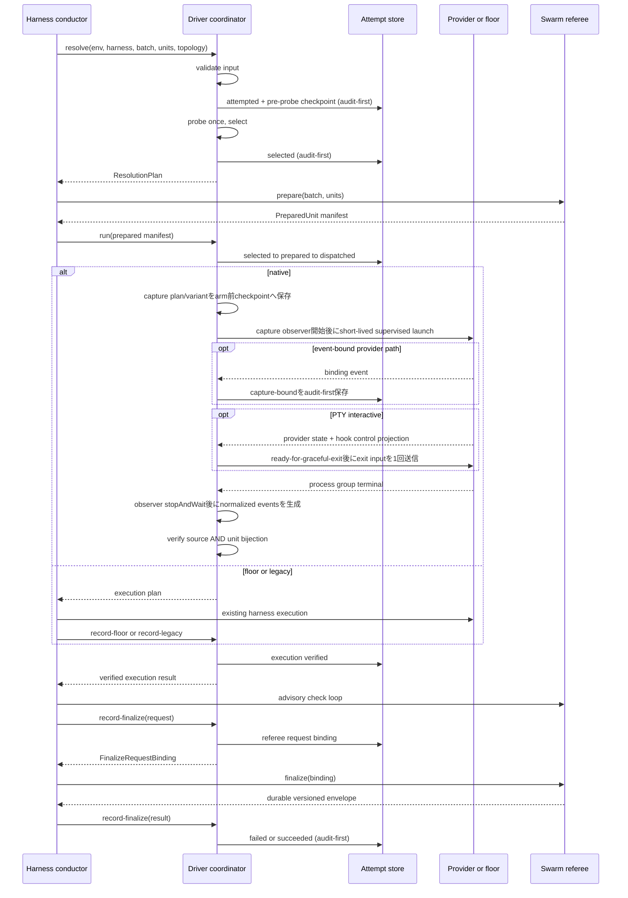

# Swarm Execution Lifecycle ビジネスロジックモデル

## 目的と上流境界

U-02は、U-01のselection planを既存referee worktreeへ束縛し、native/floor/legacy実行結果、normalized evidence、referee finalize、crash resumeを1つのattempt lifecycleとして順序制御する。driver自己申告では成功せず、nativeまたは既存floorの実行結果、referee再検証、merge-back、driver checkpointが揃ったときだけbatchを`succeeded`にする。

| 上流成果物 | U-02で使用する契約 |
|---|---|
| `unit-of-work.md` | U-02のC-01/C-04/C-08〜C-11境界、failure injection、完了条件 |
| `unit-of-work-story-map.md` | USR-01〜USR-10のlifecycle sliceとcross-cutting owner |
| `requirements.md` | FR-05〜FR-06、FR-15、FR-18〜FR-22、NFR-02〜NFR-05・NFR-11 |
| `components.md` | coordinator、registry assembly、verifier、store、audit、refereeの責務 |
| `component-methods.md` | 公開method、checkpoint、transition、evidence、referee envelopeのclosed contract |
| `services.md` | orchestration順序、process contract、lease/recovery、communication channel |

## Compositionと副作用port

`amadeus-swarm-driver-runtime.ts`は次のdependencyを明示注入するcomposition rootである。

- U-01の`DriverSelector`とschema/parser。
- production `DriverRegistrationSet`。Claude/Codex/Kiro moduleをstatic importし、4 native driverをexhaustive mappingする。
- `DriverAttemptStore`、`DriverAuditEmitter`、`NativeEvidenceVerifier`。
- `ProcessSupervisor`、`EvidenceCaptureSupervisor`、`AuxiliaryResourceSupervisor`、PTY/stdio transport port、clock、ID/nonce generator、process liveness probe、filesystem/git read port。

production registryはU-02時点で3 providerの型付き`unavailable` slotを許す。unit testだけは`createCoordinator({ registry })`へfake registrationを注入できる。runtimeでmodule名を受け取るdynamic discovery、custom driver、plugin SDKは作らない。

## End-to-end workflow



テキスト代替: coordinatorが入力を閉じ、probe未実行のattemptをaudit-first保存してからprobeとselectionを行う。refereeが作ったworktreeをexact bindingした後、nativeなら短命supervisor経由でproviderを1つ起動し、floor/legacyなら既存harnessへplanを返す。実行結果を検証し、conductorのadvisory check loop後に同じ`record-finalize` subcommandのrequest相でfinalize要求全体を固定する。既存refereeのfinalizeとmerge envelopeを、同subcommandのresult相で取り込んでterminal stateを保存する。

## `resolve`アルゴリズム

1. batchが正、Unitが2件以上、slug重複なし、topology signalのUnit集合がmanifest内であることを検証する。不正ならID、checkpoint、audit、probe、worktreeを作らない。
2. U-01の`DriverRequest.parse`とtopology分類を行う。明示driverとharness不一致、新旧env競合はここで終了する。
3. execution/attempt/lease/nonce/begin IDを採番し、requested/source/harness/topology/expected Unitsだけを持つimmutable `SelectionInputSnapshot`と、probe結果・selection・plan digestを持たない`probing` checkpointを純粋計算する。
4. audit lock内で既存batch checkpointと同batchの未解決beginを再読する。active/terminal checkpointがあれば上書きを拒否する。checkpointがなく、以前の`SWARM_DRIVER_ATTEMPTED`だけが残る場合は後述のbegin reconciliationを先に完了する。
5. `SWARM_DRIVER_ATTEMPTED`を`preDigest=ABSENT`、intended post digest、begin ID、redacted selection input、`probeStatus=pending`を持つbegin intentとしてappendし、`probing` checkpointをatomic writeする。同一begin/event keyはaudit lock内でdedupeする。
6. checkpoint materialization後だけ、関連native候補を固定順で1回ずつbehavior probeする。versionだけでavailableにせず、CLI/auth/mode/trust/handshakeの全checkを閉じた`ProbeResult`へする。batch外cacheは使わない。
7. U-01 selectorでnative/floor/legacy planを確定する。明示probe failureはworker/worktree/floorを作らず`failed-terminal`へ進み、`auto`だけがdispatch前fallbackできる。
8. `probe-selected` transition intentと、同じtransition ID・completed probe summaryを持つ`SWARM_DRIVER_SELECTED`をdedupe appendし、probe/selection/plan digestを初めて持つ`selected` checkpointをatomic replaceする。
9. いずれかのwrite/auditが失敗したら成功応答を返さない。probe中断またはprobe後のwrite失敗はmaterialized `probing`から通常のactive-attempt recovery対象になる。

`probing`は初回とresumeのどちらでも「このattemptではprobe未実行」を意味する。初回は`origin=initial`、resumeは`origin=resumed`と必須`previousAttemptId`を持つが、どちらも旧probe、旧selection、旧plan digestを持たない。

## `run`とexecution結果の検証

### Prepared manifest binding

checkpointが`selected`で現行lease/fencing tokenと一致する場合だけrunできる。`PreparedUnit`はplanの全Unitと順序非依存の全単射であり、重複・欠落・余分が0件、worktree pathとbranchが既存referee `prepare`結果、repo、ownership marker、base commitに一致しなければならない。canonical manifest digestを作り、`selected-prepared`をaudit-first適用する。

### Dispatch前登録、closed transport/capture、短命supervisor

adapterは最初にpure `prepareResources(input)`でprovider-neutralな`AuxiliaryResourcePlan[]`を返す。U-02がそれをmaterializeした後、adapterはpure `buildExecution(input, materializedResources)`で、shell文字列ではない`LaunchSpec`、`EvidenceCapturePlan`、capture identity、同じresource planを持つ`AdapterExecutionPlan`を返す。resource不要adapterは空集合を返す。`LaunchSpec.transport`は`stdio-json | pty-interactive`、captureは`fixed-provider-path | event-bound-provider-path | hook-only`のclosed unionであり、runtimeはprovider名で分岐しない。fixed variantはmaterialized resourceを入力にadapterが作るarm前`initialBinding`を必須とし、event-boundはarm時点では未bound、hook-onlyはbinding field自体を持たない。

native run ID、wave digest、identity-file path、one-time arm path、capture identity/plan digestをspawn前に採番し、`prepared` checkpointへplanned runを保存する。各waveはruntime内部の短命`EvidenceCaptureSupervisor`と`ProcessSupervisor`を次のhandshakeで起動する。

1. `AuxiliaryResourceSupervisor`がadapterのpreparationにあるexclusive reservation、attempt-owned file/directory、pre-arm baselineをmaterializeし、選択されたcandidate、owner/content/baseline digestを`MaterializedAuxiliaryResourceSet`として返す。adapter自身のfilesystem writeやprivate cleanup closureは禁止する。
2. adapterの`buildExecution`へmaterialized setとpreallocated native run/capture identityを渡し、返されたresource集合・preparation digestの同一性を検証する。fixed variantはadapterが選択candidateのexact pathsから作った`initialBinding`のnative run ID、path digest、source plan digestを検証する。その後capture observerを開始し、capture identity、plan digest、transport kindを取得する。event-boundはbindingなし、hook-onlyはbinding fieldなしである。
3. coordinatorはprovider wrapperを専用process groupとしてspawnする。wrapperはproviderを起動せず、自分のPID、PGID、process start token hash、native run ID、arm digestをidentity fileへatomic writeする。
4. wrapperはidentity確立後もone-time arm fileを待つ。armが届かなければ固定30秒のattempt lease期限までに自分のgroupを終了し、provider起動数を0件に保つ。
5. coordinatorはwrapper identityをOS観測と照合し、variant付き`CaptureCheckpoint`、resource receipt digest、実identity、arm digestを含む`prepared-dispatched` transitionをaudit-firstで保存する。capture未開始、resource未materialize、fixed initial binding欠落／resource receipt不一致、event-boundの早期binding、hook-onlyのbinding存在は保存前に拒否する。
6. checkpoint materialization後だけ、coordinatorはexecution/attempt/run/plan/wave/fencingへ束縛したone-time arm fileをatomic writeする。wrapperはexact matchするarmを1回だけconsumeし、`stdio-json`ならpipe、`pty-interactive`ならPTY上でadapterのexecutable/argvを起動する。
7. event-bound variantはallowlist済みnative eventをadapter resolverへ渡し、最初の有効bindingだけを`capture-bound` self-edgeとしてaudit-first保存する。保存前のprovider-state read、異なる2件目のbinding、fixed/hook-onlyでのself-edgeを禁止する。
8. PTY transportではlive projectionの全Unit完了を示す`ready-for-graceful-exit`だけを相関・digest検証し、`gracefulExitInput`を1回送る。このsignalは終了制御でありsuccess evidenceではない。stdio transportはcontrol signalを要求しない。
9. process group terminal後にobserverを`stopAndWait`でjoinし、process stream、provider state、hookを独立channelとしてadapter normalizerへ渡す。その後にresource supervisorがowned resourceだけをcleanupする。join失敗、snapshot欠落、cleanup所有権不明、control/graceful-exit timeoutを空evidenceへ変換しない。

親がwrapper spawn直後・identity保存前に停止しても、armがないためproviderは起動せず、wrapperはlease期限で自己終了する。identity保存後・arm前に停止した場合はcheckpointの有無にかかわらずidentity/arm pathを突き合わせ、同じgroupの終了を確認する。identity未作成を即座に「processなし」と推測せず、identity出現またはwrapper期限終了を証明するまでfail-closedにする。常駐daemon、port、queueは追加しない。

### Native evidence

C-08はterminal後にretainされたversion 1の`NormalizedDriverEvent`だけを読み、waveごとに次のANDを要求する。

- 全eventのdriver、execution/attempt、nonce hash、plan/wave digestが一致する。
- source集合がClaude Agent Teams=`provider-state + Task/Teammate hook`、Claude Ultra=`provider-state/journal + stream + hook`、Codex=`model-handshake + stream + hook`、Kiro=`session-metadata + stream`を満たす。PTY bytesをTeam構造のsourceにしない。
- coordinator start/exit 0、mode confirmation、driver markerが同じnative runへ相関する。
- state snapshotのUnit-child bindingが期待Unitと全単射である。
- 全childにstartとcompleted stopがあり、failed/欠落/余分/重複childが0件である。

不一致は`failed-resumable`で、別driverやfloorへpost-dispatch fallbackしない。verdictとredacted countを`SWARM_NATIVE_EVIDENCE`へ出し、`dispatch-evidence-verified`を保存する。

### Floor / legacy result

`run`は`selected`とprepared manifestへ束縛した`FloorExecutionPlan`または`LegacyHarnessExecutionPlan`を返し、stateを`dispatched`にする。`recordFloor`/`recordLegacy`はexpected Unitと結果の全単射、plan digest、selected/execution一致を検証する。native markerは要求せず、result digestを保存して共通の`evidence-verified` stateへ進めるが、execution modeをnativeへ変換しない。

## Referee phaseとatomic success

native verifierまたはfloor/legacy result検証が成功するとcheckpointは`evidence-verified`になり、conductorが既存refereeのadvisory `check` loopを実行する。claimed/declined集合とreasonが確定した後、conductorはC-01の既存`record-finalize` subcommandを`kind=request`で呼ぶ。新subcommandは追加しない。

request相は`finalizeInvocationId`と`FinalizeRequestBinding`を構築する。bindingはexecution/attempt/batch、plan/worktree digest、canonical expected/claimed Unit、declined Unitごとのclosed reason、check command digest、protected testのconfined relative path、prepared manifestが持つ作業前base commitとそのblob digest、repo identity、base/target branchとtarget commit、既存branching practiceで解決済みの`squash | merge | rebase` strategyとcommit message digest、Unitごとのworktree path digest・base commit・head commit、attempt-local request/claim/progress/result pathを固定し、全fieldから`finalizeRequestDigest`を計算する。main checkoutがbound targetをcheckoutしていない場合はcheckpointを変えず拒否する。`evidence-referee-running`は`claimedUnits`とrequest digestを含めてaudit-first保存し、その後だけbindingをconductorへ返す。request相の再呼出しは同じcheckpoint/bindingなら同じ結果を返し、別requestならrefereeを呼ぶ前に拒否する。

protected specはworker実行後の各worktree HEAD同士をbaselineにしない。C-01はprepared manifestの全Unitが同じbase commitを持つことを検証し、そのbase objectの`<path>` blob digestを保存する。request相とC-11のcheck/finalizeは、bound target-beforeのblob、各Unitの`HEAD:<path>`、working-tree `<path>`がすべてbase blob digestと一致することを要求する。全workerが同じ変更をcommitした場合や、prepare後にtarget側だけがprotected specを変更した場合も`PROTECTED_SPEC_BINDING_INVALID`でmergeを0件にする。

既存`amadeus-swarm.ts finalize`はbindingを受け、次をversion 1 envelopeへ含める。

- execution/attempt/finalize invocation ID、batch、plan/worktree digest、finalize request digest。
- 全Unitのre-verify結果、AIDLC state/audit/runtime merge digest、strategy別code merge outcome、cleanup/Unit audit成否。
- failed Unitとclosed `RefereeFailureCode`、canonical result digest。

refereeの`finalize`は`RefereeFinalizeInvocation`としてbindingに加え、生check command、protected-spec path、merge target/strategy/messageをephemeral inputで受け、全digestを再計算する。生値は子process argvに必要な間だけ保持しrequest/progress/result/auditへ保存しない。checkまたはmergeより前に既存audit lock内でattempt-local request recordをcreate-if-absentでatomic保存し、既存recordとinvocation/request digestのどちらかが違えば副作用0で拒否する。

同じcritical sectionで`FinalizeClaim`をCAS取得する。claimはinvocation/request digest、ownerのPID/start token hash、lease ID、fencing token、heartbeat/expiryを持つ。live ownerのclaimは同一requestでも拒否する。progress/result writeと各不可逆primitive substepの直前は、audit lock内でclaimのlease/token/ownerを再読して一致を要求するため、同じinvocationの2 processが同時にmerge/result pathへ進めない。finalize中は短いaudit lockでheartbeatし、check/merge process wait中にaudit lockを保持しない。

merge primitiveは直接spawnしない。operation ID、identity/arm path、arm deadlineをprogressへ保存し、native providerと同じarmed `MergeOperationSupervisor`を使う。wrapperは専用process group identityをatomic保存後も待機し、coordinatorがactual identityをfenced progressへ保存して現claimをCAS再検証した後のone-time armだけで`amadeus-bolt`または`amadeus-worktree`を起動する。primitive内部もoperation ID、claim path、lease/tokenを受け、`BOLT_COMPLETED` append、state/audit/runtime各merge、`WORKTREE_MERGED` append、git mutation、cleanupの各直前にclaimをCAS再検証する。

claim takeoverはownerの非生存だけでは許可しない。expired ownerが非生存なら、進行中operationのwrapper/child PID・PGID・start tokenを照合し、専用groupを終了してexitを確認する。identity未出現ならarm deadlineとarm不在を確認してtool起動0件を証明する。既に終了していればoperation markerとfilesystem/git postconditionをreconcileする。旧group停止または未起動を証明した後だけ、audit lock内でfencing tokenを1増加してclaimを回収する。

成功時はmergeと監査の結果をresult pathへatomic writeしてからstdoutへ同じenvelopeを返す。既存の`SWARM_UNIT_*`、`SWARM_BATON_RETURNED`、`SWARM_COMPLETED`にはfinalize invocation IDを相関fieldとして追加し、同じinvocation/event/Unit keyが監査に存在する場合は二重appendしない。

同じ`finalizeInvocationId`の再実行はclaim回収後、request record、checkpoint binding、worktree/head/base identity、既存progress/envelopeのrequest digestをexact matchしてから処理する。Unitはslug順に次のstepを進む。

1. 全claimed Unitを既存`check`で再検証し、lying-conductorまたはprotected-spec failureが1件でもあればmerge stepを0件にする。
2. `release-merge`を呼ぶ。既にreleasedでも成功する。
3. `amadeus-bolt complete --merge`でAIDLC state、fork audit、runtime fragmentを先に統合する。既存toolの規定順序を変えない。
4. `amadeus-worktree merge --target <bound> --strategy <bound>`で実codeを統合する。C-11はgit mergeを再実装しない。
5. 2 primitiveの成功digestをprogressへ保存した後だけ`SWARM_UNIT_CONVERGED`をdedupe appendする。

各stepはrequest digest、Unit、operation ID、fencing token、wrapper/child identity、pre/post digestを持つaudit-first progress transitionである。`amadeus-bolt complete --merge`にはoperation IDとclaim guardを渡し、`BOLT_COMPLETED → STATE_MERGED → AUDIT_MERGED → RUNTIME_GRAPH_MERGED`の既存順序を各marker/digestから再調停して、operation ID単位で完了済みsubstepとそのauditを二重実行しない。`amadeus-worktree merge`にもoperation ID、claim guard、expected target head、expected source headを渡し、`WORKTREE_MERGED`を同IDでdedupeする。既存primitive自身が各不可逆substep前にclaimを検証し、strategy別postconditionから`not-started | code-landed-cleanup-pending | completed | conflict`を返す。C-11はそのclosed resultだけを記録する。

targetは初回ならbound `targetBeforeCommit`と一致し、再実行なら完了済みUnitのstrategy別outcomeから得るcanonical prefixと一致しなければならない。`merge`はparent/head、`squash`はparent/result tree、`rebase`はoperationに記録したrebased headとpatch identity/fast-forwardを既存worktree primitiveが検証する。codeがland済みでcleanupだけ失敗した場合は再mergeせずcleanupを再開する。AIDLC統合済み/code未統合ならstep 3を再実行せずstep 4から再開する。prefix外commit、部分marker矛盾、別bindingで同じpathを使う、既存結果とgitが矛盾する場合はfail-closedにする。

既存refereeの`prepare`はworktree生成、`check`はadvisoryなUnit判定、`finalize`はlying-conductor re-verify・2 primitiveのserial merge-back・監査のauthoritative gateという責務を維持し、driver coordinatorはconvergence判定もmerge mechanicsも再実装しない。

`recordFinalize(kind=result)`はcheckpoint binding、request record、envelopeの`finalizeRequestDigest`をexact matchし、result digestを再計算する。全expected UnitでAIDLC state/audit/runtime統合、code merge、cleanup、Unit auditが完了し、failure 0、`mergeCompleted=true`、commit binding一致の場合だけ`referee-succeeded`へ遷移する。merge/check/process/audit failureは`failed-resumable`、protected spec、lying conductor、batch/request binding、schema違反は`failed-terminal`、未知codeはparse errorである。C-01とC-11は互いをimport/invokeせず、二相の間をconductorがversioned JSONで媒介する。

## Audit-first storeとreconciliation

通常transitionは次の同期critical sectionだけで行う。

```text
withAuditLock(projectDir, intent, space):
  checkpointを再読
  lease/fencing/preDigest/edgeを検証
  next checkpointとpostDigestを純粋計算
  appendAuditEntryUnlocked(SWARM_DRIVER_TRANSITION, transition intent)
  writeFileAtomic(batch checkpoint, canonical JSON)
```

`withAuditLock`はsync callbackだけを受け、process waitやprobe中は保持しない。`writeFileAtomic`の固定`.tmp`名は同じaudit lockでwriterを直列化する。heartbeatも5秒ごとに短いlockを取り、lease ID/fencing tokenのcompare-and-set後にmetadataだけを更新する。

通常transitionのaudit append後にcheckpoint writeが失敗した場合、resumeはtransition ID、pre/post digest、closed detailsを監査から読む。`SWARM_DRIVER_SELECTED`を含む独立eventは`(executionId, attemptId, eventType, transitionId)`で同じaudit lock内にdedupeし、reapplyで二重appendしない。

| 状態 | reconciliation |
|---|---|
| checkpoint digest = pre、純粋再計算 = post | transitionを再適用し`reapplied` |
| checkpoint digest = post、lastMutation ID一致 | `already-materialized` |
| 別の正当な後続stateが同transitionを包含 | `already-materialized` |
| digest/edge/detailsが矛盾 | `marked-failed`または停止。成功へ推測しない |

結果は`SWARM_DRIVER_RECONCILED`へ記録する。transition intent自体はterminal success eventではなく、checkpoint materializationまでCLIは成功を返さない。

最初のcheckpointだけはpre imageが存在しないため、`SWARM_DRIVER_ATTEMPTED`を専用の`AttemptBeginIntent`として扱う。begin intentは`preDigest=ABSENT`、intended post digest、begin ID、redacted selection input、probe pendingを持つ。次回resolveでbeginだけが存在しcheckpointがない場合、同じlock内でcheckpoint/後続transition/worker/provider side effectがすべて不在であることを検証し、`SWARM_DRIVER_RECONCILED(action=abandoned-unmaterialized-begin)`をbegin ID単位で1回だけ記録して新executionを開始する。checkpointがintended postと一致すればmaterialized、checkpointまたは後続状態が矛盾すれば停止する。不存在を通常のpre digest再適用へ偽装しない。

## Lease、fencing、resume

- leaseは固定30秒、heartbeatは固定5秒。利用者設定にしない。
- semantic `stateDigest`はstate、selection input、存在する場合だけselected context、Unit、transition、binding、fencingを含み、`heartbeatAt`/`expiresAt`だけを除外する。
- 通常writeは現在のlease IDとfencing token一致を要求する。stale writerは拒否する。
- `failed-resumable`は同じexecution ID、新attempt ID、新nonce、新lease、token+1、`origin=resumed`と必須`previousAttemptId`でprobe前の`probing`へ再開する。selection inputだけを引き継ぎ、旧probe/selection/plan digestは引き継がない。
- active stateはlease期限切れだけでは奪取しない。host、PID、process start tokenでowner非生存を証明する。
- native run identityが残る場合はPID/start token一致を確認して専用process groupだけを終了し、exitを確認する。identity不明、owner生存、group停止失敗はfail-closedにする。
- `referee-converged` Unitだけを既存refereeで再検証して再利用する。それ以外のprobe/provider session/未完了child/自己申告は再利用しない。
- `succeeded`と`failed-terminal`はresumeしない。

macOSは`ps`由来、Linuxは`/proc`由来のprocess start identityをhash化する。生hostnameやcommand lineを保存しない。Windowsは対象外で、livenessを推測しない。

## Failure injectionと完了検証

| 注入点 | 必須観測 |
|---|---|
| explicit probe failure | worktree/worker/floor 0件、hard error |
| initial ATTEMPTED成功→最初のcheckpoint失敗 | provider/worker/worktree 0件、beginを1回だけabandon、新execution |
| SELECTED/transition audit成功→checkpoint失敗 | event重複0、次resumeで同transitionを1回だけreapply |
| wrapper spawn成功→identity write前に親crash | provider起動0、wrapper期限終了を証明後だけ新attempt |
| identity write成功→dispatch checkpoint/arm前に親crash | provider起動0、exact groupだけ回収、重複attempt 0 |
| capture開始前にarm要求 | provider起動0、transition拒否 |
| resource materialize前にcapture/arm要求／owned cleanup失敗 | provider起動0またはsuccess 0、他attempt resource削除0 |
| fixed initial binding欠落／event-bound早期binding／hook-only bindingあり | provider起動0、capture contract failure |
| event-bound binding保存前にstate read／異なる2件目binding | evidence read 0またはattempt失敗、binding上書き0 |
| PTY control timeout／partial state／graceful exit失敗 | exit successへ推定せずgroup停止、`failed-resumable` |
| process terminal前のobserver join／join失敗 | success 0、retained evidenceへ空集合を渡さない |
| arm後/child途中crash | checkpoint identityで対象process groupだけ回収、新attempt |
| failed-resumable→probing | 新attemptに旧probe/selection/plan digest 0、behavior probeを再実行 |
| nonce/plan/wave/Unit binding不一致 | evidence failure、post-dispatch fallback 0件 |
| native child partial failure | batch success 0件、failed Unit保持 |
| stale fencing writer | checkpoint/audit更新0件 |
| referee check/finalize/merge failure | terminal success 0、resumable failure |
| request相audit成功→checkpoint失敗 | finalize呼出し0、同じbinding transitionだけreapply |
| request checkpoint後→referee request record前crash | 同じbindingだけ再送、check/merge/audit副作用0 |
| referee request record後→merge前crash | request digest exact match時だけ再開、別requestの副作用0 |
| 同一invocationを2 processで同時実行 | live claim owner 1件、check/merge/result writer 1件、loser副作用0 |
| finalize owner死亡・operation identity前/arm前 | primitive起動0、arm deadline確認後だけclaim takeover |
| finalize owner死亡・primitive途中 | exact operation group停止とexit後に部分効果をreconcileし、その後だけtoken+1 |
| stale primitiveが不可逆substepへ到達 | claim CAS拒否、追加audit/state/git mutation 0件 |
| Bolt state/audit/runtime統合の各substep後crash | marker/digest一致済みsubstepをskipし、次の未完了substepから再開 |
| AIDLC統合後→code merge前crash | Bolt complete再実行0、bound target/strategyでworktree mergeから再開 |
| code land後→cleanup/Unit audit前crash | strategy別postconditionからland済みを復元し、再merge0、cleanup/欠落auditだけ実行 |
| 全Unitが同じprotected spec変更をcommit | base blob mismatch、merge 0、failed-terminal |
| prepare後にtargetのprotected specだけ変更 | target-before blob mismatch、merge 0、failed-terminal |
| finalize後record前crash | 同一request/invocation envelopeを再検証し、二重merge/成功event 0件 |
| planted secret field | schema/audit拒否、値を診断へ出さない |

fake adapterの2 Unit以上fixtureをproductionと同じcoordinator/store/verifier/referee bindingへ通す。U-02のproduction registry slotが未実装であることをpassへ読み替えず、fake injectionはunit/integration testだけに限定する。

## Review

**Iteration:** 2
**Verdict:** READY

### 解消済みfinding

- `FinalizeRequestBinding`、request record、claim/fencing、merge progressがfinalizeの意味入力と部分成功を一意に束縛する。
- identity-first/one-time-armによりspawn直後、identity前、arm前のcrash windowを閉じ、resumeはfresh `probing`から再probeする。
- `AttemptBeginIntent`と独立eventのdedupeで最初のcheckpoint前後を再調停する。
- 共通runtimeはtransport、capture variant、binding self-edge、PTY control、terminal join、`AuxiliaryResourcePlan[]`をprovider-neutralなclosed unionとして所有する。
- 旧U-02 contractの未定義型は`FixedCaptureBinding`、`EventBoundCaptureBinding`、`AdapterExecutionPlan`として定義され、PTY rows/columnsも閉じた。

### 新規finding

- U-02固有のBlocking findingなし。provider側がこのclosed runtimeを正確に消費するかは各Unit Reviewで判定する。

### センサー結果

- `required-sections`: 4成果物すべてPASS。
- `upstream-coverage`: 4成果物すべてPASS、未参照0件。
- `linter` / `type-check`: 対象成果物はMarkdownのため非適用。
