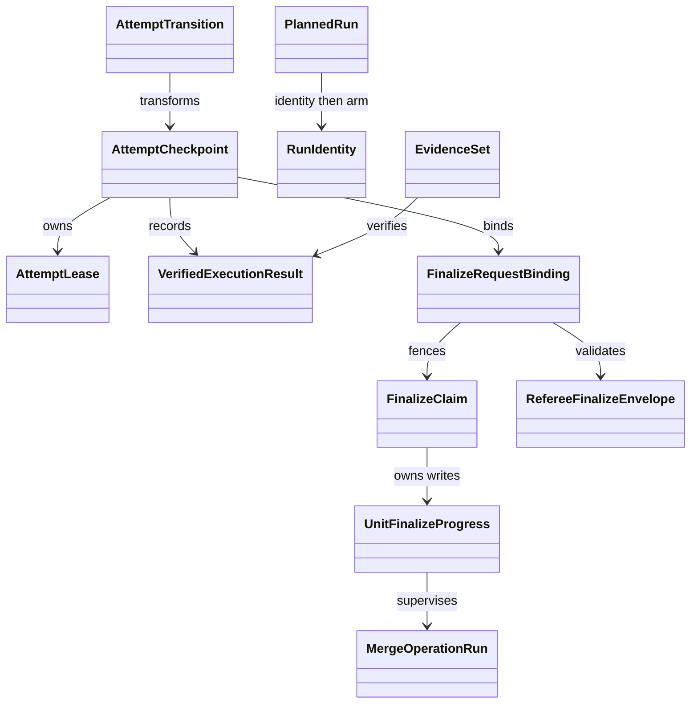

# Swarm Execution Lifecycle ドメインエンティティ

## モデリング方針

`unit-of-work.md`と`unit-of-work-story-map.md`のU-02 lifecycleを、`requirements.md`のcrash/atomicity契約、`components.md`のC-01/C-04/C-08〜C-11、`component-methods.md`のclosed state/event型、`services.md`のorchestrationへ写像する。class-free functional domain modelingを使い、stateごとの有効fieldを判別unionで閉じる。

- ID/digestはbranded scalarとsmart constructorで外部文字列をparseする。
- domain aggregateはreadonly dataと値自身に作用するinstance methodを持つfrozen objectである。
- companion namespaceはparse/build/reconcile/collection操作だけを持つ。
- portは副作用interface、domain transitionは純関数として分離する。
- failureはclosed `Result` unionで返し、exception class hierarchyを作らない。

## Identityとbinding value

| 型 | 意味 | invariant |
|---|---|---|
| `BatchNumber` | 正のbatch番号 | 1以上の整数 |
| `ExecutionId` | batch lifecycle全体 | resume間で不変 |
| `AttemptId` | 1回のprobe〜terminal試行 | resumeごとに新規 |
| `AttemptNonceHash` | event相関 | nonce生値を保存しない |
| `LeaseId` | attempt owner lease | attemptごとに新規 |
| `FencingToken` | writer世代 | 単調増加整数 |
| `AttemptBeginId` | checkpoint不存在からのbegin intent | batch内一意 |
| `TransitionId` | audit/state transition | execution内一意 |
| `NativeRunId` | provider coordinator/wave | attempt内一意 |
| `FinalizeInvocationId` | referee finalize試行 | record前crashでも再利用 |
| `FinalizeOperationId` | Unitごとのmerge primitive step | invocation内一意 |
| `PlanDigest` | canonical selection plan | immutable |
| `WorktreeManifestDigest` | exact prepared Unit集合 | immutable |
| `FinalizeRequestDigest` | referee finalizeの全意味入力 | immutable |
| `StateDigest` | semantic checkpoint | heartbeat時刻を除外 |

各companionの`parse`/`mint`だけがbranded scalarを生成する。digest companionはcanonical JSONの固定key順、UTF-8、末尾改行なしから計算する。

### ProcessIdentity と RunIdentity

`ProcessIdentity`はclone ID、host hash、PID、process start token hashを持ち、instance method`sameProcess(observed)`でPID再利用を区別する。`RunIdentity`はnative run ID、supervisor PID/PGID/start token、identity-file path、one-time arm path/digest、`identity-established | armed | provider-running | terminal`のstatusを持ち、`canTerminate(observed)`で同じattemptの専用groupだけかを判断する。companion `ProcessIdentity.observe(pid)`がmacOS/LinuxのOS portから観測し、証明不能ならtyped errorを返す。

`PlannedRun`はspawn前に確定するrun ID、wave digest、identity/arm pathとarm digestだけを持つ。`DispatchReadyRun`はwrapper自身が書いた`RunIdentity(status="identity-established")`を加えた別型であり、`prepared-dispatched` materialization後だけ`arm()`できる。wrapperはarmなしではproviderを起動せず、attempt lease期限までに自己終了する。

## AttemptCheckpoint aggregate

```ts
type CheckpointBehavior = Readonly<{
  isTerminal(): boolean;
  owns(leaseId: LeaseId, token: FencingToken): boolean;
  canTransition(edge: TransitionEdge): boolean;
  canonicalDigest(): StateDigest;
}>;

type CheckpointBase = CheckpointBehavior & Readonly<{
  schemaVersion: 1;
  executionId: ExecutionId;
  attemptId: AttemptId;
  batch: BatchNumber;
  lease: AttemptLease;
  attemptNonceHash: AttemptNonceHash;
  origin: AttemptOrigin;
  selectionInput: SelectionInputSnapshot;
  unitStates: UnitStateMap;
  lastMutationId: AttemptBeginId | TransitionId;
  stateDigest: StateDigest;
}>;

type AttemptOrigin =
  | Readonly<{ kind: "initial"; beginId: AttemptBeginId }>
  | Readonly<{
      kind: "resumed";
      previousAttemptId: AttemptId;
      resumeTransitionId: TransitionId;
    }>;

type SelectionInputSnapshot = Readonly<{
  requested: RedactedDriverRequest;
  source: DriverRequestSource;
  harness: HarnessKind;
  topology: TopologySignal;
  expectedUnits: readonly string[];
}>;

type SelectedContext = Readonly<{
  probeDigest: string;
  planDigest: PlanDigest;
  selection: RedactedSelection;
}>;

type SelectedCheckpointBase = CheckpointBase & Readonly<{
  selectedContext: SelectedContext;
}>;

type DispatchPreparation =
  | Readonly<{ kind: "native"; plannedRuns: readonly PlannedRun[] }>
  | Readonly<{ kind: "floor"; plan: FloorExecutionPlan }>
  | Readonly<{ kind: "legacy"; plan: LegacyHarnessExecutionPlan }>;

type DispatchRecord =
  | Readonly<{ kind: "native"; runs: readonly DispatchReadyRun[] }>
  | Readonly<{ kind: "floor"; planDigest: string }>
  | Readonly<{ kind: "legacy"; planDigest: string }>;

type AttemptCheckpoint =
  | (CheckpointBase & Readonly<{
      state: "probing";
    }>)
  | (SelectedCheckpointBase & Readonly<{
      state: "selected";
    }>)
  | (SelectedCheckpointBase & Readonly<{
      state: "prepared";
      worktreeManifestDigest: WorktreeManifestDigest;
      dispatchPreparation: DispatchPreparation;
    }>)
  | (SelectedCheckpointBase & Readonly<{
      state: "dispatched";
      worktreeManifestDigest: WorktreeManifestDigest;
      dispatchRecord: DispatchRecord;
    }>)
  | (SelectedCheckpointBase & Readonly<{
      state: "evidence-verified";
      worktreeManifestDigest: WorktreeManifestDigest;
      executionResult: VerifiedExecutionResult;
    }>)
  | (SelectedCheckpointBase & Readonly<{
      state: "referee-running";
      worktreeManifestDigest: WorktreeManifestDigest;
      executionResult: VerifiedExecutionResult;
      refereeBinding: FinalizeRequestBinding;
    }>)
  | (SelectedCheckpointBase & Readonly<{
      state: "succeeded";
      worktreeManifestDigest: WorktreeManifestDigest;
      executionResult: VerifiedExecutionResult;
      refereeBinding: FinalizeRequestBinding;
      refereeResultDigest: string;
      unitMergesDigest: string;
    }>)
  | (CheckpointBase & Readonly<{
      state: "failed-resumable" | "failed-terminal";
      failure: AttemptFailure;
      recoveryContext: FailureRecoveryContext;
    }>);
```

factoryは各variantに`isTerminal`、`owns`、`canTransition`、`canonicalDigest`をclosure実装してfreezeする。`AttemptCheckpoint.parse`はschemaとdigestを検証し、stateにないfieldや未知stateを拒否する。`probing`は常に当該attemptのprobe前であり、`SelectedContext`の3 fieldを持てない。`selected`以後だけが同じattemptで新しく得たprobe/plan/selectionを必須にする。

`AttemptOrigin`は初回とresumeを判別し、`previousAttemptId`は`kind="resumed"`でのみ必須、初回では型として禁止する。resumeはimmutable `SelectionInputSnapshot`だけを引き継ぎ、旧attemptの`SelectedContext`を構築材料にできない。

失敗variantの`recoveryContext`も前state別の判別unionである。

```ts
type FailureRecoveryContext =
  | Readonly<{ from: "probing" }>
  | Readonly<{
      from: "selected";
      selectedContext: SelectedContext;
    }>
  | Readonly<{
      from: "prepared";
      selectedContext: SelectedContext;
      worktreeManifestDigest: WorktreeManifestDigest;
      dispatchPreparation: DispatchPreparation;
    }>
  | Readonly<{
      from: "dispatched";
      selectedContext: SelectedContext;
      worktreeManifestDigest: WorktreeManifestDigest;
      dispatchRecord: DispatchRecord;
    }>
  | Readonly<{
      from: "evidence-verified";
      selectedContext: SelectedContext;
      worktreeManifestDigest: WorktreeManifestDigest;
      executionResult: VerifiedExecutionResult;
    }>
  | Readonly<{
      from: "referee-running";
      selectedContext: SelectedContext;
      worktreeManifestDigest: WorktreeManifestDigest;
      executionResult: VerifiedExecutionResult;
      refereeBinding: FinalizeRequestBinding;
    }>;
```

これによりresumeに必要なworktree、run identity、execution result、referee bindingを保持しつつ、前stateに存在しないfieldの組合せを許さない。

`UnitStateMap`はplanの全Unitを各1回所有するfirst-class collectionで、値は`pending | dispatched | evidence-seen | referee-converged | failed`に閉じる。呼出側が任意keyを追加できない。

## AttemptTransition aggregate

`AttemptTransition`はbatch/execution/attempt/lease/fencing/transition ID、pre/post digestと次のedgeを持つ。checkpoint不存在から始める初回だけは後述の`AttemptBeginIntent`を使う。

| Edge | From → To | 必須details |
|---|---|---|
| `probe-selected` | probing → selected | probe/plan digest、selection |
| `selected-prepared` | selected → prepared | worktree manifest digest、Unit集合、planned run/identity/arm path |
| `prepared-dispatched` | prepared → dispatched | wrapper実identity、arm digest。provider起動前 |
| `dispatch-evidence-verified` | dispatched → evidence-verified | native evidenceまたはfloor/legacy result digest |
| `evidence-referee-running` | evidence-verified → referee-running | finalize invocation、claimed Units、request digest/path、result path |
| `referee-succeeded` | referee-running → succeeded | referee result/unit merges digest |
| `attempt-failed` | active → failed-* | typed failure、affected Units |
| `active-attempt-recovered` | active → failed-resumable | expired lease、liveness、orphan action |
| `attempt-resumed` | failed-resumable → probing | old/new attempt、reused converged Units |

`AttemptTransition.apply(checkpoint)`はinstance methodとしてlease/fencing/preDigest/edgeを検証し、新しいfrozen checkpointを返す。companion `AttemptTransition.build`はclosed detailsを構築し、`reconcile(auditIntent, checkpoint)`はpre/post digestから`reapplied | already-materialized | marked-failed`を返す。`probe-selected`だけがfresh `SelectedContext`を作り、`attempt-resumed`は旧checkpointから`SelectionInputSnapshot`と再検証済みUnitだけを取り出して`SelectedContext`のない`probing`を作る。

### AttemptBeginIntent

```ts
type AttemptBeginIntent = Readonly<{
  beginId: AttemptBeginId;
  executionId: ExecutionId;
  attemptId: AttemptId;
  batch: BatchNumber;
  preDigest: "ABSENT";
  intendedPostDigest: StateDigest;
  selectionInput: SelectionInputSnapshot;
  selectionInputDigest: string;
  probeStatus: "pending";
}>;
```

これは`SWARM_DRIVER_ATTEMPTED`のclosed detailsであり、通常transitionではない。`DriverAttemptStore.begin`は同じaudit lock内で`(executionId, attemptId, SWARM_DRIVER_ATTEMPTED, beginId)`をdedupe appendしてからcheckpointを書く。reconciliationは、checkpointがpost digestなら`materialized`、checkpointも後続transitionもなくlifecycle順序上worker/provider side effectが不可能なら`abandoned-unmaterialized-begin`、それ以外なら`marked-failed`に閉じる。abandon監査もbegin ID単位でdedupeし、通常のpre/post transitionとして再適用しない。

## Leaseとownership

```ts
type AttemptLease = Readonly<{
  leaseId: LeaseId;
  fencingToken: FencingToken;
  owner: ProcessIdentity;
  heartbeatAt: string;
  expiresAt: string;
  isExpired(now: Instant): boolean;
  isOwnedBy(identity: ProcessIdentity): boolean;
}>;
```

`AttemptLease.renew(now, expectedLease, expectedToken)`はcompanion operationではなく、構築済みlease自身のinstance methodとして新しいfrozen leaseを返す。storeがaudit lock内のCASで使用する。recovery用`RecoveryClaim.build`はexpired、owner非生存、orphan処理結果を全部受け取った場合だけtoken+1のclaimを作る。

## Execution resultとevidence

`VerifiedExecutionResult`はnative/floor/legacyを混同しない判別unionである。

```ts
type VerifiedExecutionResult =
  | Readonly<{
      kind: "native";
      driver: NativeDriver;
      evidenceDigest: string;
      verdict: EvidenceVerdict;
    }>
  | Readonly<{
      kind: "floor";
      driver: FloorDriver;
      resultDigest: string;
      completedUnits: readonly string[];
    }>
  | Readonly<{
      kind: "legacy";
      execution: LegacyExecution;
      resultDigest: string;
      completedUnits: readonly string[];
    }>;
```

`EvidenceSet`はexpected wavesとnormalized eventsを所有するfirst-class collectionで、instance method`verifyCorrelation()`と`unitBijection()`を持つ。companion `EvidenceSet.build`は未知event、重複run、manifest外Unitを拒否する。driver別source/marker policyはclosed tableとしてC-08内の1箇所に置く。

## FinalizeRequestBindingとFinalizeEnvelope

```ts
type ExpectedUnitGitBinding = Readonly<{
  unit: string;
  worktreePathDigest: string;
  baseCommit: string;
  headCommit: string;
}>;

type DeclinedUnit = Readonly<{
  unit: string;
  reason: "unsatisfiable" | "budget-exhausted" | "cap-exhausted";
}>;

type ProtectedSpecBinding =
  | Readonly<{ kind: "none" }>
  | Readonly<{
      kind: "file";
      confinedRelativePath: string;
      baselineCommit: string;
      targetAtFinalizeCommit: string;
      baselineBlobDigest: string;
    }>;

type UnboundRefereeFinalizeRequest = Readonly<{
  claimedUnits: readonly string[];
  declinedUnits: readonly DeclinedUnit[];
  checkCommand: string;
  protectedSpecRelativePath?: string;
  mergeTargetBranch: string;
  mergeStrategy: "squash" | "merge" | "rebase";
  mergeMessage: string;
}>;

type FinalizeRequestBinding = Readonly<{
  schemaVersion: 1;
  executionId: ExecutionId;
  attemptId: AttemptId;
  finalizeInvocationId: FinalizeInvocationId;
  batch: BatchNumber;
  planDigest: PlanDigest;
  worktreeManifestDigest: WorktreeManifestDigest;
  expectedUnits: readonly ExpectedUnitGitBinding[];
  claimedUnits: readonly string[];
  declinedUnits: readonly DeclinedUnit[];
  checkCommandDigest: string;
  protectedSpec: ProtectedSpecBinding;
  repoIdentityDigest: string;
  mergeTargetBranch: string;
  targetBeforeCommit: string;
  mergeStrategy: "squash" | "merge" | "rebase";
  mergeMessageDigest: string;
  requestPath: string;
  claimPath: string;
  progressPath: string;
  resultPath: string;
  finalizeRequestDigest: FinalizeRequestDigest;
  matchesInvocation(input: RefereeFinalizeInvocation): boolean;
  matches(envelope: RefereeFinalizeEnvelope): boolean;
}>;
```

expected/claimed/declinedはUnit slug順にcanonicalizeし、claimedとdeclinedはexpectedを重複なく完全分割する。declined reasonはclosed enumで、claimed Unitにreasonを付けられない。check commandとmerge messageは生文字列を保存せずdigestだけを束縛する。protected specはworker後のHEADをbaselineにせず、prepared manifestで全Unitに束縛済みの共通base commitと、そのgit object内のblob digestを固定する。expected Unitごとのworktree path、base、head、repo identity、merge target/strategy/target-beforeまで含めて`finalizeRequestDigest`を計算する。

`UnboundRefereeFinalizeRequest`でconductorが判断するのはclaimed/declinedとclosed reason、既存check/protected-spec input、および既存branching practiceで解決したmerge target/strategy/messageである。C-01はexpected Units、worktree/base/head、repo/target-beforeを現checkpointとfilesystem/gitから導出し、conductor値として受け取らない。生check commandとmerge messageはdigest計算後に破棄し、checkpoint、request record、auditには保存しない。

`requestPath`、`claimPath`、`progressPath`、`resultPath`はrecord内のattempt専用directoryにconfineし、絶対path escapeを拒否する。`matchesInvocation`/`matches`はbinding値自身へ作用し、companion `FinalizeRequestBinding.build`がID採番、canonicalization、confine済みpath、digestを組み立てる。refereeは既存audit lock内でcheck/merge/audit前にrequest recordをcreate-if-absentし、既存recordが同じinvocationでもrequest digest不一致なら副作用0で拒否する。

### Ephemeral invocationとFinalizeClaim

```ts
type RefereeFinalizeInvocation = Readonly<{
  binding: FinalizeRequestBinding;
  checkCommand: string;
  protectedSpecRelativePath?: string;
  mergeTargetBranch: string;
  mergeStrategy: "squash" | "merge" | "rebase";
  mergeMessage: string;
}>;

type FinalizeClaim = Readonly<{
  finalizeInvocationId: FinalizeInvocationId;
  finalizeRequestDigest: FinalizeRequestDigest;
  owner: ProcessIdentity;
  leaseId: LeaseId;
  fencingToken: FencingToken;
  heartbeatAt: string;
  expiresAt: string;
}>;
```

`RefereeFinalizeInvocation`の生check command/messageはbindingとのdigest照合と既存primitiveのargv構築だけに使い、durable recordへ渡さない。`FinalizeClaim.acquire`はaudit lock内のCASである。同じrequestでもlive ownerがいれば拒否し、期限切れかつowner非生存をPID/start tokenで証明した場合だけfencingを1増加して回収する。progress/result writeはlease/fencing一致を必須とし、heartbeatだけではsemantic digestを変えない。

protected specがある場合、`FinalizeRequestBinding.build`と`matchesInvocation`は全Unitの`baseCommit`一致、`<baseCommit>:<path>`のblob digest、`<targetAtFinalizeCommit>:<path>`のblob digest、各`HEAD:<path>`のblob digest、working-tree file digestの一致をANDで要求する。HEAD同士が同じでもbase/target blobと異なれば拒否し、未tracked/path escape/read errorも`PROTECTED_SPEC_BINDING_INVALID`である。

### UnitFinalizeProgress

```ts
type UnitFinalizeProgress =
  | Readonly<{ state: "reverified"; unit: string }>
  | Readonly<{
      state: "amadeus-merge-running";
      unit: string;
      operationId: FinalizeOperationId;
      preDigest: string;
      operationRun: MergeOperationRun;
    }>
  | Readonly<{
      state: "amadeus-merged";
      unit: string;
      operationId: FinalizeOperationId;
      stateMergeDigest: string;
      auditMergeDigest: string;
      runtimeFragmentMergeDigest: string;
    }>
  | Readonly<{
      state: "code-merge-running";
      unit: string;
      operationId: FinalizeOperationId;
      targetBeforeCommit: string;
      sourceHeadCommit: string;
      strategy: "squash" | "merge" | "rebase";
      operationRun: MergeOperationRun;
    }>
  | Readonly<{
      state: "code-merged";
      unit: string;
      operationId: FinalizeOperationId;
      outcome: CodeMergeOutcome;
      cleanup: "completed" | "pending";
    }>
  | Readonly<{
      state: "unit-audited";
      unit: string;
      operationId: FinalizeOperationId;
      unitResultDigest: string;
    }>;

type CodeMergeOutcome =
  | Readonly<{
      strategy: "squash";
      targetBeforeCommit: string;
      targetAfterCommit: string;
      resultTreeDigest: string;
    }>
  | Readonly<{
      strategy: "merge";
      targetBeforeCommit: string;
      targetAfterCommit: string;
      sourceHeadCommit: string;
    }>
  | Readonly<{
      strategy: "rebase";
      targetBeforeCommit: string;
      targetAfterCommit: string;
      rebasedHeadCommit: string;
      patchIdentityDigest: string;
    }>;

type MergeOperationRunBase = Readonly<{
  operationId: FinalizeOperationId;
  identityPath: string;
  armPath: string;
  armDeadline: string;
  armDigest: string;
}>;

type MergeOperationRun =
  | (MergeOperationRunBase & Readonly<{ status: "planned" }>)
  | (MergeOperationRunBase & Readonly<{
      status: "identity-established";
      supervisorIdentity: RunIdentity;
    }>)
  | (MergeOperationRunBase & Readonly<{
      status: "armed";
      supervisorIdentity: RunIdentity;
    }>)
  | (MergeOperationRunBase & Readonly<{
      status: "child-running";
      supervisorIdentity: RunIdentity;
      childIdentity: ProcessIdentity;
    }>)
  | (MergeOperationRunBase & Readonly<{
      status: "child-terminal";
      supervisorIdentity: RunIdentity;
      childIdentity: ProcessIdentity;
      exitCode: number;
    }>);
```

progressはUnit slug順のfirst-class collectionで、各stepがrequest digest、operation ID、claim fencing、armed wrapper/child identity、pre/post digestを持つ。AIDLC mergeは既存`amadeus-bolt complete --merge`へoperation IDとclaim guardを渡し、そのdeep moduleが各不可逆substep直前にcurrent claimをCAS検証し、`BOLT_COMPLETED → STATE_MERGED → AUDIT_MERGED → RUNTIME_GRAPH_MERGED`のmarker/digestから部分成功を再調停する。code mergeは既存`amadeus-worktree merge`へoperation ID、claim guard、expected target/sourceを渡し、同じCAS検証後にstrategy別postconditionとcleanupを再調停する。C-11は両primitiveのclosed outcomeを合成するだけで、state/audit/runtime統合またはgit merge mechanicsを複製しない。

`MergeOperationSupervisor`はprovider用armed wrapperと同じidentity-first protocolを再利用する。wrapperはidentity確立後もarmを待ち、C-11がactual identityをfenced progressへ保存して現claimを再検証した後だけtoolを起動する。takeoverは旧owner非生存に加え、進行中wrapper/child groupのidentity照合、terminate/wait、またはarmなしdeadline終了を要求し、その後だけclaim fencingを1増加する。

同一invocationのrecoveryでは初回targetを`targetBeforeCommit`へexact matchし、その後は完了済みUnitの`CodeMergeOutcome`が作るcanonical prefixへexact matchする。`amadeus-merged`かつcode未完了ならcode stepから、`code-merged`かつcleanup pendingならcleanupから、両方完了かつaudit未完了ならUnit auditだけを再開する。prefix外commit、operation marker/digest不一致、旧operation group未停止、fencing不一致はfail-closedである。

C-01の既存subcommandを増やさずreferee開始前のbindingを保存するため、`recordFinalize`のinput/outputをclosed二相へ精緻化する。

```ts
type RecordFinalizeInput =
  | Readonly<{
      kind: "request";
      executionId: ExecutionId;
      attemptId: AttemptId;
      request: UnboundRefereeFinalizeRequest;
    }>
  | Readonly<{
      kind: "result";
      executionId: ExecutionId;
      attemptId: AttemptId;
      refereeResult: RefereeFinalizeEnvelope;
    }>;

type RecordFinalizeOutput =
  | Readonly<{ kind: "referee-ready"; binding: FinalizeRequestBinding }>
  | Readonly<{ kind: "attempt-recorded"; summary: AttemptSummary }>;
```

nativeの`run`、`recordFloor`、`recordLegacy`は実行結果を`evidence-verified`へ保存するだけで、まだ未確定のclaimed/reasonsを推測しない。conductorは既存`check` loop後に`record-finalize --kind request`を呼び、request相がbindingをcheckpointへ保存して`referee-ready`を返してからC-11 `finalize`を呼ぶ。envelope取得後は`record-finalize --kind result`を呼ぶ。request/resultは同じversioned CLI subcommandの排他的inputであり、別の`record-referee-start` subcommandは追加しない。C-01とC-11は互いをimport/invokeしない。

```ts
type UnitMergeResult = Readonly<{
  unit: string;
  aidlcMerge: Readonly<{
    stateMergeDigest: string;
    auditMergeDigest: string;
    runtimeFragmentMergeDigest: string;
  }>;
  codeMerge: CodeMergeOutcome;
  cleanup: "completed";
  unitAuditDigest: string;
}>;
```

`RefereeFinalizeEnvelope`はcomponent-methodsのversion 1 contractを保持し、`finalizeRequestDigest`をechoし、各`UnitMergeResult`にAIDLC merge、code merge、cleanup、Unit auditを持つ。instance method`verifyDigest()`、`matchesRequest(binding)`、`allExpectedUnitsMerged(expected)`、`classifyTerminality()`を持ち、companion `parse`が未知field/codeを拒否する。

`UnitMergeResult`は単一の曖昧なmerge commitではなく、AIDLC state/audit/runtimeの3 digestと`CodeMergeOutcome`を持つ。これにより`amadeus-bolt complete --merge`だけの成功をcode merge成功へ読み替えず、両方、cleanup、Unit auditが揃った場合だけmerged Unitとして数える。

## Store、audit、runtime port

| Port | 責務 | 禁止 |
|---|---|---|
| `DriverAttemptStore` | read、begin、transition、heartbeat、beginResume、reconcileBegin | lock外write、lost update |
| `DriverAuditEmitter` | attempted、selected、transition、reconciled、evidence、degraded | raw payload、unknown field |
| `ProcessSupervisor` | wrapper identity、durable arm、stream、group terminate/wait | arm前provider起動、long-lived daemon、shell string |
| `RefereeResultStore` | request create-if-absent、claim CAS/heartbeat、fenced progress/result write | selector、convergence判断、merge mechanics |
| `MergeOperationSupervisor` | identity-first wrapper、fenced arm、tool group terminate/wait | merge semantics、arm前tool起動 |
| `BoltMergePort` | operation ID付きAIDLC state/audit/runtime統合と部分成功reconcile | git code merge |
| `WorktreeMergePort` | operation ID付きtarget/strategy別code mergeとcleanup reconcile | AIDLC data merge |
| `DriverAdapterRegistry` | static known driver lookup | dynamic discovery、floor lookup |

store実装は`withAuditLock`と`appendAuditEntryUnlocked`、`writeFileAtomic`を組み合わせる。domain aggregateはこれらportをimportせず、transition計算とdigest検証をpureに保つ。

## Error model

| 分類 | 代表code | Terminality |
|---|---|---|
| Input/selection | `INPUT_INVALID`、`EXPLICIT_DRIVER_UNAVAILABLE` | resolve hard error、checkpoint前またはterminal |
| Dispatch/evidence | `COORDINATOR_FAILED`、`NATIVE_EVIDENCE_*`、`NATIVE_CHILD_FAILED` | resumable |
| Ownership | `ATTEMPT_LEASE_ACTIVE`、`ATTEMPT_LIVENESS_UNKNOWN`、`ORPHAN_PROCESS_GROUP_ACTIVE` | 操作停止。証明後のみresumable |
| Persistence | `PERSISTENCE_FAILED` | success不可、reconciliation対象 |
| Referee resumable | check/process/finalize/claim/amadeus-merge/code-merge/audit failure | resumable |
| Referee terminal | base-bound protected spec、lying conductor、binding/schema/progress mismatch | terminal |

error valueはcode、execution/attempt、affected Unit、非機密diagnostic codeだけを持つ。provider stderr、prompt、credential、command全文を保持しない。

## Entity関係



テキスト代替: checkpointがlease、execution result、finalize request bindingを状態別に所有し、transitionだけがcheckpointを更新する。planned runは短命supervisorのidentityを確立し、durable checkpoint後のarmでproviderを起動する。finalize bindingはephemeral invocationとenvelopeを照合し、claimが単一writerをfencingし、Unit progressがAIDLC統合とcode統合を別stepとして記録する。
