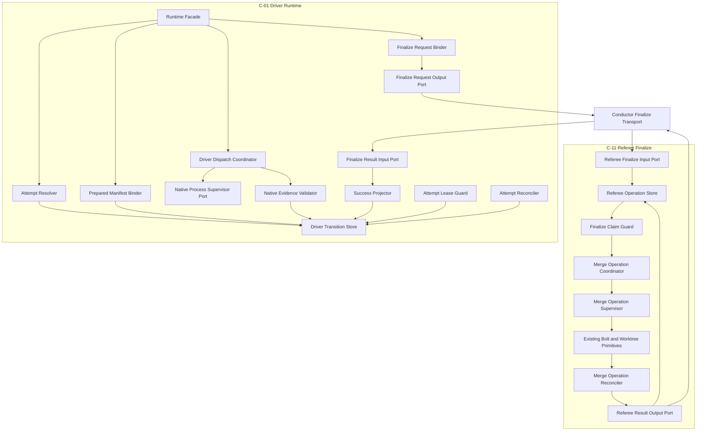

# Swarm Execution Lifecycle Logical Components

## 入力契約とcomponent boundary

本設計は`performance-requirements.md`、`security-requirements.md`、`scalability-requirements.md`、`reliability-requirements.md`、`tech-stack-decisions.md`、`business-logic-model.md`を消費し、U-02のNFRをlocal TypeScript/Bun lifecycle componentへ割り当てる。U-02はprovider固有probe/parser/wave/model指定、refereeのconvergence判定、Bolt/worktree/Git mechanicsを実装しない。closed portを通じてそれらを束縛・supervise・記録する。

## Component inventory

| Component | Responsibility | State/I/O ownership | Primary NFR |
|---|---|---|---|
| `SwarmDriverRuntimeFacade`（C-01） | resolve/run/resumeと`record-finalize` request/result相のpublic sequence | orchestrationのみ | boundary/reliability |
| `AttemptResolver` | immutable selection input、attempt begin、attempt-local probe | probe port、ID source | performance/reliability |
| `PreparedManifestBinder` | prepared Unit、repo、ownership、base/head、planのcanonical全単射 | filesystem/git read port | security/scale |
| `AttemptLeaseGuard` | active attempt lease、heartbeat、fencing、takeover条件 | checkpoint CAS | reliability/security |
| `DriverTransitionStore`（C-01） | driver audit-first transition、closed schema、atomic checkpoint |既存driver audit lock/file primitives | durability/performance |
| `AttemptReconciler` | begin/transition/event/native runのcrash分類 | audit/checkpoint read | reliability |
| `NativeProcessSupervisorPort`（C-01） | native wrapper identity、one-time arm、exact group termination | short-lived process/files | security/reliability |
| `DriverDispatchCoordinator` | selected adapter planを変更せずwave dispatch | adapter/supervisor ports | scale/performance |
| `NativeEvidenceValidator` | versioned normalized eventとchild/Unit全単射 | attempt-local event read | reliability/security |
| `FinalizeRequestBinder`（C-01） | finalize意味入力とGit/protected-spec identityをcanonical固定 | git/filesystem read | security/reliability |
| `FinalizeRequestOutputPort`（C-01） | versioned request JSONをstdoutへ出力し、C-11を呼ばない | driver checkpoint read | isolation/security |
| `ConductorFinalizeTransport` | requestをC-11へ、resultをC-01へ媒介し、意味を再解釈しない | ephemeral command I/O | isolation/reliability |
| `RefereeFinalizeInputPort`（C-11） | request bindingとephemeral生入力のdigestを再計算・検証 | request input | security/reliability |
| `RefereeOperationStore`（C-11） | request create-if-absent、claim/progress/resultのatomic正本 |既存referee audit lock/file primitives | durability/reliability |
| `FinalizeClaimGuard`（C-11） | single owner、lease/fencing、各substep guard | `RefereeOperationStore` | reliability/security |
| `MergeOperationSupervisor`（C-11） | merge wrapper identity、one-time arm、exact group termination | short-lived process/files | security/reliability |
| `MergeOperationCoordinator`（C-11） |既存Bolt/worktree primitiveをslug順にarmed起動 | supervisor/primitive ports | reliability/scale |
| `MergeOperationReconciler`（C-11） | markerとpostconditionからpartial successをclosed分類 | git/filesystem/audit read | reliability |
| `RefereeResultOutputPort`（C-11） | durable result envelopeとstdout JSONを同一digestで出力 | `RefereeOperationStore` | durability/isolation |
| `FinalizeResultInputPort`（C-01） | conductorから受けたresultのrequest/result exact bindingを検証 | referee result JSON | security/reliability |
| `SuccessProjector`（C-01） |全expected UnitのANDをterminal driver checkpoint/auditへ投影 | `DriverTransitionStore` | correctness/observability |

## Interaction and dependency direction

テキスト代替: C-01 facadeはattempt resolveとprepared bindingをdriver storeへmaterializeし、native supervisor経由のevidence検証後にrequest bindingをversioned JSONとして出力する。conductorだけがrequestをC-11へ運び、C-11は独立したoperation store、claim guard、merge supervisor、既存primitive、reconcilerを通してdurable result envelopeを出力する。conductorがresult JSONをC-01へ戻し、C-01のresult input portとsuccess projectorだけがdriver terminal stateを更新する。

依存方向は各failure domain内でpublic portからstore/primitiveへの一方向である。C-01とC-11の間にsource-level importまたはruntime invokeはなく、両者はconductorが媒介するversioned JSONだけを共有する。`DriverTransitionStore`はreferee claim/progress/resultを書かず、`RefereeOperationStore`はdriver checkpointを書かない。conductor transportはどちらの正本も永続化せず、request/resultの意味を再解釈しない。

## Failure domains and blast radius

| Failure domain | Containment owner | Blast radius | Forbidden effect |
|---|---|---|---|
| malformed manifest/repo/path | `PreparedManifestBinder` |当該attempt | worktree/provider起動 |
| audit/checkpoint partial write | `TransitionStore` + reconciler |当該transition | duplicate event/success |
| wrapper/identity/arm crash | `ArmedProcessSupervisor` |当該run/operation group | unbound child、新attemptとの重複 |
| stale attempt owner | C-01 lease guard |当該batch |追加driver audit/checkpoint mutation |
| malformed/raw native event | evidence validator |当該attempt | referee request |
| transport/request/spec/target drift | C-01 binder + C-11 input port |当該invocation | claim/check/merge |
| stale finalize owner | C-11 claim guard |当該invocation |追加referee audit/state/git mutation |
| primitive partial success | C-11 operation reconciler | canonical Unit prefix |二重Bolt/worktree/Git substep |
| unknown referee result | C-01 result input port |当該invocation | terminal success |

別batchは別checkpoint/attempt-local pathとprocess groupへ隔離する。同一batchではactive attempt、finalize claim、target writerを各1件に閉じる。

## Shared resources and isolation

共有resourceは既存audit lock、batch checkpoint path、repository/Git target、immutable schema/driver registryである。ownershipは次のように一意にする。

- driver audit/checkpoint writeはC-01の`DriverTransitionStore`だけが行う。referee request/claim/progress/result writeはC-11の`RefereeOperationStore`だけが行い、互いのpathを書かない。
- attempt lease/fencing判定はC-01の`AttemptLeaseGuard`、finalize claim判定はC-11の`FinalizeClaimGuard`だけが行う。
- native process group/armはC-01の`NativeProcessSupervisorPort`、merge process group/armはC-11の`MergeOperationSupervisor`が別々に所有する。共通にできるのはidentity/arm value protocolであり、C-01からC-11を呼ぶ実装ではない。
- driver concurrency/waveはU-03〜U-05 adapter plan、convergenceは既存referee、merge mechanicsは既存Bolt/worktree primitiveが所有する。
- 生credential、prompt、provider stream、check command、commit messageはshared stateへ置かない。

architecture testは、C-01 module graphからC-11/referee finalize moduleへのimport/invoke、およびC-11 module graphからC-01 driver runtimeへのimport/invokeが各0件であることを検証する。contract testはC-01 request JSON → conductor → C-11 inputと、C-11 durable result JSON → conductor → C-01 result inputのschema/digest一致を検証する。

## Implementation placement and infrastructure bridge

authored sourceは既存`packages/framework/core/tools/`のswarm runtime/state/supervisor/referee integration seamへ置き、harness prose/generated treeへlifecycle logicを複製しない。testsは既存`tests/`へunit、property、schema、failure injection、macOS/Linux process fixtureとして配置する。

Infrastructure Designへ渡すprovisioning componentは0件である。

| Infrastructure concern | Decision |
|---|---|
| compute/service |利用者が起動する既存Bun processと短命child。常駐serviceなし |
| network/VPC/load balancer |非適用 |
| database/cache/queue/object storage |非適用。既存versioned local file/auditのみ |
| IAM/KMS/secret store |非適用。既存CLI認証をephemeral allowlist projection |
| multi-AZ/backup/remote failover |非適用 |
| monitoring resource |非適用。既存CLI exit/audit/checkpointへhandoff |
| cloud cost |新規resource 0、増分固定費0 |

AWS Well-Architectedの適用結果は、resourceを新設しないこと、least-data process boundary、deterministic recovery、bounded local state、waste 0である。架空のAWS resourceやIaCを追加しない。

## Review

必須のarchitecture reviewerが本節へ結果を追記する。

### Iteration 1

- Verdict: **NOT-READY**
- Blocking findings: **1**

1. **[Critical] C-01とC-11のconductor媒介境界が論理依存へ反映されていない。** `Interaction and dependency direction`は`Runtime Facade → Finalize Request Binder → Finalize Claim Guard → Merge Operation Coordinator → Existing Bolt and Worktree Primitives → Referee Envelope Validator → Success Projector`を一続きの直接依存として示している。しかし上流`business-logic-model.md`と`tech-stack-decisions.md`は、C-01がrequest bindingをversioned JSONとしてconductorへ返し、conductorがC-11を呼び、C-11のdurable result envelopeをconductorがC-01へ戻す二相境界を必須とし、C-01とC-11の直接import/invokeを禁止している。現図のままではdriver runtimeがfinalize claim、merge primitive、referee result生成まで所有する実装を許し、checkpoint writer、authoritative referee、merge mechanicsの独立したfailure/security domainを維持できない。C-01の`request binding出力`、conductor transport、C-11の`request受入 → claim/merge/reconciliation → durable envelope出力`、conductor transport、C-01の`result検証 → success projection`を別portとして分割し、両側の依存方向と永続化ownerを明示すること。direct import/invokeが0件であるarchitecture testもverification seamへ追加すること。

### Iteration 2

- Verdict: **READY**
- Blocking findings: **0**

Iteration 1のblocking findingは解消された。C-01は`FinalizeRequestOutputPort`でversioned request JSONを出力した時点で責務を閉じ、`ConductorFinalizeTransport`だけがC-11の`RefereeFinalizeInputPort`へ運ぶ。C-11は独立した`RefereeOperationStore`、claim guard、merge supervisor、既存primitive、reconcilerでdurable result envelopeを生成し、conductor経由で戻されたresultだけをC-01の`FinalizeResultInputPort`と`SuccessProjector`がdriver terminal stateへ投影する。

driver checkpointとreferee request/claim/progress/resultのstore ownership、native process groupとmerge process groupのsupervisor ownership、request/result transportの非永続・非再解釈責務が分離されている。さらにC-01/C-11間のsource-level import/runtime invoke各0件をarchitecture testで、両方向JSONのschema/digest一致をcontract testで検証するため、禁止された直接依存が再導入される経路も閉じている。前回finding以外にも実装を阻害する新たなarchitecture blocking findingはない。
