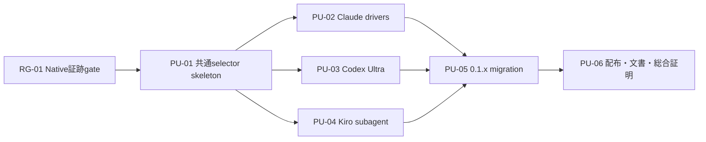

# Intent Backlog

## 優先付け方法

MoSCoWで今回の出荷境界を定め、その中の順序はrisk-firstで決める。固定の納期・予算・相対工数が未確定なため、根拠のないWSJF数値は置かない。後続のDelivery Planningで規模を見積もった時点で、同じ優先順位をWSJFで再評価できる。

本backlogのMustは、すべて承認済み成功条件へ直接traceする。Should / Couldを水増しせず、非必須の拡張はWon't Haveへ明示する。ここでのproto-Unitは価値境界であり、Units Generationが依存関係と実装可能サイズを確定する。

## Risk Gate

### RG-01 Native実行証跡の成立確認

- **Priority:** Must / 最優先gate
- **Outcome:** Agent TeamsのTeam実起動とCodex Ultraの実委譲を、非対話実行から機械判定できる証跡契約が確定する。
- **Dependencies:** なし
- **完了条件:**
  - 認証済みの現行Claude Codeで、`claude -p`からAgent Teams固有の起動証跡を取得できる。
  - 認証済みの現行Codex CLIで、`ultra`によるsubagent委譲を通常実行と区別できる。
  - success、unavailable、unsupported、authentication / network failureを別々に分類できる。
  - 証跡を取得できないdriverは、実装済み・成功として後続へ渡さない。

RG-01は不確実性を除去するgateであり、最終的なConstruction Unitへ独立採番するか、最初のwalking skeletonのentry criteriaにするかはUnits Generationで決める。

## Must Have proto-Units

### PU-01 共通selectorのend-to-end skeleton

- **Priority:** Must / 1
- **Outcome:** 公開値の解決から能力検査、1つの検証済みnative driver、Unit収束、監査までが最小の縦切りで動く。
- **Dependencies:** RG-01
- **Coverage:** S-01、S-02、S-03、S-04、S-08
- **完了条件:**
  - 既知の5値、不正値、ハーネス不一致、旧・新設定競合を一意に分類する。
  - 明示指定は利用不能時に実行前hard errorとなる。
  - `auto`は同じ能力・topologyから同じdriverを選ぶ。
  - requested、selected、reason、実行結果を同じ監査相関で追跡できる。

### PU-02 Claude native drivers

- **Priority:** Must / 2
- **Outcome:** Claude CodeでAgent TeamsとUltra Codeが名前どおりに動き、`auto`がtask topologyから両者を決定的に選び分ける。
- **Dependencies:** RG-01、PU-01
- **Coverage:** S-05、S-03、S-04、S-08
- **完了条件:**
  - `claude-agent-teams`は実Team起動を証明し、通常subagentへの置換を成功扱いしない。
  - `claude-ultracode`はUltra Code workflowの実起動を証明する。
  - 相互調整型topologyはAgent Teams、独立並列・反復収束型はUltra Codeを選ぶ。
  - 明示指定はfallbackせず、`auto`のfallbackだけがloudに記録される。

### PU-03 Codex Ultra driver

- **Priority:** Must / 3
- **Outcome:** Codexのmulti-Unit ConstructionがローカルCodex Ultraを使い、従来のexec-worker floorや`xhigh`と区別できる。
- **Dependencies:** RG-01、PU-01
- **Coverage:** S-06、S-03、S-04、S-08
- **完了条件:**
  - driverが対象modelの`ultra`能力を事前検査する。
  - 実行証跡からUltraのsubagent委譲を確認できる。
  - 利用不能な明示指定は実行前hard errorとなる。
  - `auto`のfallback時だけ、要求・floor・理由が監査される。

### PU-04 Kiro subagent driver

- **Priority:** Must / 4
- **Outcome:** Kiroのsubagent fan-outが共通driver契約、Unit隔離、収束監査の下で再現可能に動く。
- **Dependencies:** PU-01
- **Coverage:** S-07、S-03、S-04、S-08
- **完了条件:**
  - 最大並列度と非対話trustをpreflightで扱う。
  - batchが上限を超える場合も、Unitを失わず決定的にwave化できる。
  - Kiroに存在しないUltra能力を成功したように表示しない。
  - 2 Unit以上のfixtureがKiro subagentで収束する。

### PU-05 0.1.x migration bridge

- **Priority:** Must / 5
- **Outcome:** 既存利用者が旧設定の意味を変えずに0.1.xへ更新でき、新selectorへ移行できる。
- **Dependencies:** PU-01、PU-02、PU-03、PU-04
- **Coverage:** S-09、S-13
- **完了条件:**
  - `AMADEUS_USE_SWARM`の現行ハーネス別挙動を再現する。
  - 旧変数を受理した全ケースでdeprecation warningを表示・監査する。
  - 旧・新変数の同時指定はerrorになる。
  - 新旧の設定例と0.2.0削除予定をmigration guideへ記載する。
  - 0.2.0完全削除の後続Issueを、削除対象と受入条件付きで起票する。

### PU-06 配布・文書・総合証明

- **Priority:** Must / 6
- **Outcome:** 全ハーネスと配布形態で同じdriver契約が利用でき、将来のCLI更新でも4driverを再検証できる。
- **Dependencies:** PU-02、PU-03、PU-04、PU-05
- **Coverage:** S-10、S-11、S-12
- **完了条件:**
  - 選択表、hard error、fallback、監査、旧互換の決定的suiteが通る。
  - 非機密の2 Unit以上のfixtureと、4driver用のopt-in live runnerが存在する。
  - 4driverすべてのlive実行・収束証跡をIntent recordへ残す。
  - 正本、各ハーネス、`dist`、self-installのdrift guardが通る。
  - user guide、harness engineering、reference、設定例が同じ5値と移行契約を説明する。

## Dependency Map

<!-- Text fallback: RG-01のnative証跡gate後にPU-01の共通selector skeletonを作る。PU-02 Claude、PU-03 Codex、PU-04 KiroはPU-01後に並行可能で、3つの完了後にPU-05移行bridge、最後にPU-06配布・文書・総合証明を行う。 -->

## Should Have

今回の承認済み成功条件へ直接traceしないShould Haveは追加しない。診断品質、文書、再実行可能な検証は「あると便利」ではなく、明示driver保証と移行安全性に必要なMustへ含めている。

## Could Have

なし。token効率・速度比較は情報として計測できるが、今回の完了条件にはしない。

## Won't Have This Time

| ID | 項目 | 将来の再検討条件 |
|---|---|---|
| WH-01 | 0.2.0での`AMADEUS_USE_SWARM`削除実装 | 後続Issueで0.2.0リリースを対象にする |
| WH-02 | Responses API Multi-agent | ローカルCLIとは別の認証・SDK driverを求める利用要件が承認される |
| WH-03 | custom driver / plugin SDK | 既知5値では満たせない実driver需要と互換性方針が得られる |
| WH-04 | 通常stage / conductorのdriver選択 | Construction swarm以外にも共通selectorが必要な独立Intentが承認される |
| WH-05 | credentialed GitHub Actions live matrix | 組織のsecret・費用・外部provider障害ポリシーが合意される |
| WH-06 | driver UI / dashboard / cost optimizer | CLI表示と監査では不足する利用者課題が観測される |

## Backlog Exit Criteria

- RG-01が成立し、PU-01からPU-06までの受入条件がすべて満たされる。
- Mustの未完了をShould / Couldへの再分類で隠さない。
- live suiteのskip、credential不足、未認識eventをpassへ変換しない。
- 0.2.0削除Issueが起票され、今回の0.1.x互換と混同されない。
- Units Generationで分割を細分化しても、In Scopeを広げず各Unitがend-to-endの検証可能成果を持つ。
