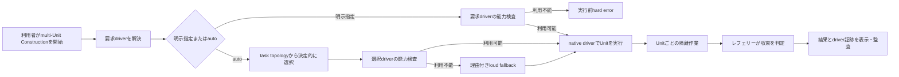

# スコープ定義

## 概要

本 Intent は、Construction の multi-Unit swarm における driver 選択を、予測可能・検証可能・監査可能な共通契約へ移行する。利用者は通常時に `auto` で最適な利用可能方式を使い、検証や組織ポリシーのために driver を明示した場合は、その方式が実際に使われたことを保証できる。

今回の出荷境界は0.1.xの移行ブリッジである。新しい `AMADEUS_SWARM_DRIVER`、4つのネイティブ driver、決定的な `auto`、明示指定の hard error、loud fallback、旧変数の警告付き互換、配布・文書・検証を完成させる。`AMADEUS_USE_SWARM` の完全削除は0.2.0の後続 Issue に分離する。

## 上流根拠

- [`intent-statement`](../intent-capture/intent-statement.md) は、boolean では「最良の利用可能方式」と「指定方式の保証」を区別できないことを中心課題としている。
- [`feasibility-assessment`](../feasibility/feasibility-assessment.md) は、Claude Agent Teams、Claude Ultra Code、Codex Ultra、Kiro subagent を条件付きで実現可能と判定し、能力検査とlive収束証跡を完了条件にしている。
- [`constraint-register`](../feasibility/constraint-register.md) は、明示指定のfallback禁止、`auto`のloud fallback、credential非保存、配布物同期、0.1.x互換と0.2.0削除境界を制約としている。

これらの根拠を変更せず、今回の scope は利用者可視の契約と、その契約を証明する最小の成果へ限定する。

## 対象利用者と価値

| 利用者 | 現在の困りごと | 今回届ける価値 |
|---|---|---|
| 複数ハーネスを使う Amadeus 利用者 | 同じ boolean から実 driver とfallbackを予測できない | 一意なdriver名、決定的な`auto`、実行前診断 |
| 特定のnative能力を要求する利用者 | 要求が別方式へ置換されても成功に見える | 明示指定のhard errorと実起動証跡 |
| Amadeus保守者 | driver分岐がハーネス固有proseと配布物へ分散する | 共通語彙、監査契約、drift検査、再実行可能な検証 |

## In Scope

| ID | 能力 | 完了境界 |
|---|---|---|
| S-01 | `AMADEUS_SWARM_DRIVER` の公開契約 | `auto`、`claude-agent-teams`、`claude-ultracode`、`codex-ultra`、`kiro-subagent` だけを受理し、不正値とハーネス不一致を診断する |
| S-02 | 適用境界 | engine が許可した Construction の multi-Unit `invoke-swarm` だけを制御する。通常のstage subagentと対話conductorは変更しない |
| S-03 | 決定的な `auto` | ハーネス能力とtask topologyから同じdriverを選び、requested / selected / reasonを利用者表示と監査へ残す |
| S-04 | 明示driver保証 | 実行開始前の能力検査に失敗したらhard errorとし、別driverによる成功扱いを禁止する |
| S-05 | Claude native drivers | Agent TeamsとUltra Codeを別々に実起動でき、相互調整型と独立並列・反復収束型を`auto`で使い分ける |
| S-06 | Codex native driver | ローカルCodex Ultraを明示して実委譲を検出し、通常の`xhigh`実行と区別する |
| S-07 | Kiro native driver | Kiro subagentを並列上限と非対話trust制約の範囲で実行し、収束結果を共通契約で扱う |
| S-08 | `auto` fallback | 能力不足時のみ利用可能なfloorへloud fallbackし、要求・選択・理由を監査する |
| S-09 | 0.1.x互換 | `AMADEUS_USE_SWARM` の現行ハーネス別意味を保持し、全利用でdeprecation warningを出す。旧・新同時指定はerrorにする |
| S-10 | 決定的検証 | 選択表、競合、hard error、fallback、監査、旧互換をunit / integration testで網羅する |
| S-11 | live検証 | 非機密の2 Unit以上のfixtureを使うopt-in suiteで4driverの実起動と収束を証明する |
| S-12 | 配布と文書 | 正本、各ハーネス展開先、`dist`、self-install、ユーザーガイド、ハーネス技術資料、reference、移行案内を同じ契約へ同期する |
| S-13 | 0.2.0削除の追跡 | 旧変数と0.1.x互換処理を削除する後続Issueを、受入条件付きで起票する |

## Out of Scope

| ID | 対象外 | 理由・扱い |
|---|---|---|
| O-01 | Responses API Multi-agent driver | ベータAPI、SDK、API key管理はローカルCLI契約と異なる。別Intentで評価する |
| O-02 | custom driver / plugin SDK | 実需要と互換ABIが未確定。既知の5値に閉じる |
| O-03 | 通常stageのsubagent選択 | Reverse Engineering等のpersona / stage topology契約を変更しない |
| O-04 | 対話conductorや支援agentの起動制御 | Constructionのmulti-Unit swarmとは別のライフサイクル責務である |
| O-05 | driver UI、dashboard、cost optimizer | 中心課題の解決に不要。選択結果のCLI表示と監査に限定する |
| O-06 | credentialed GitHub Actions live matrix | secret管理と外部provider障害を通常PR gateへ持ち込まない。opt-in live suiteを採用する |
| O-07 | 0.2.0の旧変数削除実装 | 今回は0.1.x互換を出荷するため同時実装できない。後続Issueへ分離する |
| O-08 | token・速度の最適化保証 | 測定は可能だが第一の成功指標ではない。決定性と実driver保証を優先する |

## リリース境界

| 時点 | `AMADEUS_SWARM_DRIVER` | `AMADEUS_USE_SWARM` |
|---|---|---|
| 今回の0.1.x | 正本。未設定時は`auto` | 警告付き互換。明示時は現行意味を保持 |
| 0.2.0 | 正本 | 削除し、設定されていれば未対応設定としてerror |

0.2.0削除Issueの受入条件は、旧変数の読取・互換分岐・警告・旧専用テスト・移行文書の暫定記述を削除し、新selectorだけで全ハーネスの検証が通ることである。

## 価値ストリーム

<!-- Text fallback: 利用者のmulti-Unit要求を明示指定またはautoとして解決し、能力検査後にnative driverを実行する。明示指定が利用不能なら実行前error、autoが利用不能なら理由付きfallbackとなる。Unitごとの隔離作業をレフェリーが収束判定し、結果とdriver証跡を表示・監査する。 -->

価値到達時間を最短にするため、最初に Agent Teams と Codex Ultra のnative証跡をrisk gateで実証する。証跡が成立しない方式は、名前だけのdriverとして後続実装へ進めない。

## 優先順位と分割原則

- 優先基準は**リスク優先**とする。native実起動・委譲証跡を共通基盤より先に確認する。
- proto-Unitは**検証可能な縦切り**とする。技術レイヤー単位ではなく、選択から実行、収束、監査まで単独で完了判定できる成果へ切る。
- 最小skeletonは、risk gateを通過した最初のdriverで公開selectorから監査までをend-to-endに通す。
- 後続driverは共通契約を再利用しつつ、各ハーネス固有の実起動証明を独立に満たす。
- 全driverと移行契約が揃った後に、配布同期とlive suiteの総合証明を完了する。

## 成功条件

| 条件 | 判定方法 |
|---|---|
| 4driverが名前どおりに実行される | 各driverで2 Unit以上のlive fixtureを収束させ、native証跡を確認 |
| 同じ入力から同じdriverが選ばれる | ハーネス・能力・topologyの選択表を決定的テストで全網羅 |
| 明示指定が代替されない | 全利用不能ケースが実行前hard errorになり、fallback件数が0 |
| `auto` fallbackが隠れない | 利用者表示と監査のrequested / selected / reasonを照合 |
| 0.1.x移行で挙動が壊れない | 旧値のハーネス別互換表、警告、同時指定errorを自動テスト |
| 配布物がdriftしない | package、`dist`、self-installの既存同期検査を通過 |
| 0.2.0削除が追跡される | 受入条件付き後続Issueが存在し、今回の成果物から参照可能 |

## 変更管理

In Scopeへの追加は、中心課題であるdriver選択保証または必須検証へ直接traceできる場合だけ認める。Responses API、plugin化、UI、cost最適化、通常stageのagent orchestrationを含める要求は、今回のrisk gateと完了条件を広げるため、別Intentまたは明示的なscope再承認を必要とする。
