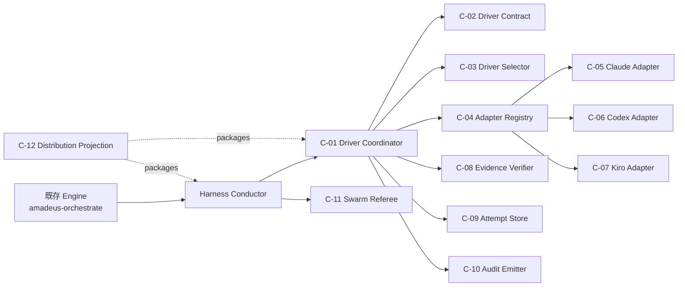
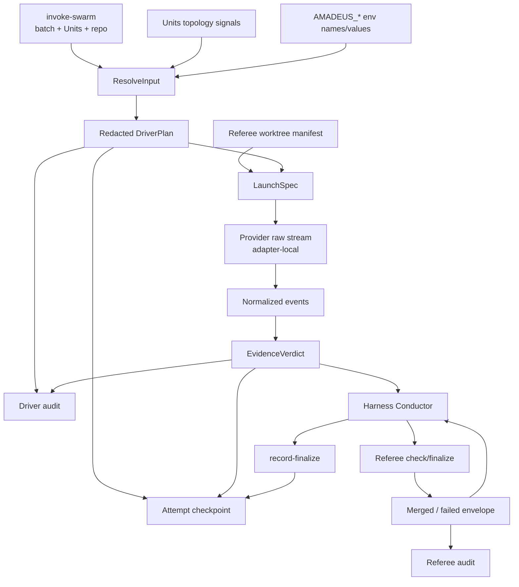

# Swarm Driver コンポーネント依存設計

## 上流コンテキスト

`requirements`の決定性・native証跡・再開要求、既存`architecture`と`component-inventory`のengine / conductor / referee分離、`team-practices`のnarrow API・非循環方針を依存制約へ変換した。`stories`はSKIP済みであり、USR-01〜USR-10をdata flow確認に用いる。

## 静的依存DAG



テキスト代替: engineはconductorだけにdirectiveを渡す。conductorはdriver coordinatorと既存refereeを呼ぶ。driver coordinatorは共通contract、純粋selector、閉じたadapter registry、evidence verifier、attempt store、audit emitterへ一方向に依存する。provider adapterからcoordinator、engine、refereeへの逆依存はない。

## 依存matrix

`D`はcompile-time dependency、`R`はruntime invocation、`W`は所有データへのwriteを表す。空欄は依存なし。

| From ＼ To | C-01 | C-02 | C-03 | C-04 | C-05 | C-06 | C-07 | C-08 | C-09 | C-10 | C-11 | C-12 |
|---|---:|---:|---:|---:|---:|---:|---:|---:|---:|---:|---:|---:|
| Harness Conductor | R |  |  |  |  |  |  |  |  |  | R |  |
| C-01 Coordinator |  | D | D | D |  |  |  | D | D | D |  |  |
| C-03 Selector |  | D |  |  |  |  |  |  |  |  |  |  |
| C-04 Registry |  | D |  |  | D | D | D |  |  |  |  |  |
| C-05 Claude Adapter |  | D |  |  |  |  |  |  |  |  |  |  |
| C-06 Codex Adapter |  | D |  |  |  |  |  |  |  |  |  |  |
| C-07 Kiro Adapter |  | D |  |  |  |  |  |  |  |  |  |  |
| C-08 Verifier |  | D |  |  |  |  |  |  |  |  |  |  |
| C-09 Attempt Store |  | D |  |  |  |  |  |  |  | R |  |  |
| C-10 Audit Emitter |  | D |  |  |  |  |  |  |  |  |  |  |
| C-11 Referee |  |  |  |  |  |  |  |  |  |  |  |  |
| C-12 Distribution |  |  |  |  |  |  |  |  |  |  |  |  |

C-11はC-10へ依存せず、既存referee audit emitterを介して既存の収束taxonomyだけを書く。driver lifecycle eventはC-10だけが書く。C-09は同一lock transaction内でC-10を呼ぶが、C-10からC-09へ戻らない。

## Runtime呼出し順

| Order | Caller | Callee | Pattern | Result |
|---:|---|---|---|---|
| 1 | engine | conductor | in-process directive | driver-neutral batch |
| 2 | conductor | C-01 `resolve` | sync subprocess | `DriverPlan`またはhard error |
| 3 | C-01 | C-03 + selected adapters | pure + bounded subprocess | topology、probe、selection |
| 4 | conductor | C-11 `prepare` | sync subprocess | Unit worktree manifest |
| 5 | conductor | C-01 `run` | sync long-running subprocess | native Unit result、またはfloor execution plan |
| 6 | C-01 | C-05/C-06/C-07 | one child process per batch/wave | raw provider stream |
| 7 | adapter | C-08 | in-process stream | evidence verdict |
| 7a | conductor | 既存harness floor + C-01 `record-floor` | harness tool/process + sync subprocess | floor Unit result |
| 8 | conductor | C-11 `check` | sync subprocess、反復可 | Unit convergence advice |
| 9 | conductor | C-11 `finalize` | sync subprocess | merge/verdict envelope |
| 10 | conductor | C-01 `record-finalize` | sync subprocess | terminal checkpoint |

`resolve`完了前に`prepare`を呼ばないため、入力不正または明示probe failureではworktreeを0件にできる。`run`後のfallbackは禁止し、evidence failureはorder 8へ進めずhalt-and-askへ返す。

## Data flow



テキスト代替: directive、topology、envをredacted planへ変換しcheckpoint/auditへ書く。worktree manifestとplanからproviderを起動し、生streamはadapter内でnormalized eventへ落とす。evidence verdictはconductorへ返り、conductorだけがrefereeを呼ぶ。versioned referee envelopeはconductorから`record-finalize`へ渡され、provider raw streamは境界外へ出ない。

## データ所有権

| Data | Owner | Storage | Reader | 禁止事項 |
|---|---|---|---|---|
| Stage graph / batch eligibility | engine | runtime graph/state | conductor | driver toolによる再判定 |
| Driver contract enums | C-02 | source TypeScript | selector/adapters/tests/docs generator | harness proseへの複製logic |
| Selection decision | C-01/C-03 | checkpoint + audit | conductor/runtime summary | `selected=auto` |
| Provider raw event | C-05/C-06/C-07 | memory/attempt temp only | same adapter | audit/checkpoint/fixtureへ生保存 |
| Normalized evidence | C-08 | attempt temp +要約checkpoint | C-01/test | message本文、credential field |
| Unit worktree | C-11 | `.amadeus/worktrees` | native coordinator/referee | providerによるmain checkout直接編集 |
| Convergence verdict | C-11 | git +既存audit | conductor/C-01 | native自己申告による上書き |
| Attempt lifecycle | C-09 | gitignored record checkpoint | C-01/resume | provider sessionを成功正本にすること。audit-first transition ID/digestで再適用する |
| Driver audit | C-10 | per-clone audit shard | runtime/replay | prose/conductorから直接append |

## Shared resources

| Resource | Access pattern | Coordination |
|---|---|---|
| audit shard | append | 既存audit lock |
| batch checkpoint | replace + heartbeat | 同じaudit lock下のatomic temp+rename、期限付きlease、process identity、fencing token |
| Unit worktrees | Unitごとにwrite | C-11 ownership marker、1 Unit 1 writer |
| main branch / merge target | serialized write | C-11 finalizeのみ |
| Claude team/task state | execution由来team名だけread | adapter scope、cleanup前snapshot |
| Codex hook evidence dir | attemptごとappend | nonce + atomic append、driver process終了時close |
| Kiro session metadata | attempt session IDsだけread | parent-child correlation |
| provider credentials | provider CLIだけread | child env allowlist、Amadeusは値を保存しない |

## 循環依存防止規則

1. C-02はNode標準型以外へ依存しない。
2. C-03とC-08はC-02だけへ依存し、filesystem、process、auditをimportしない。
3. adaptersはC-01をimportせず、`DriverAdapter`契約を実装する。
4. C-01とC-11は互いをimport・invokeしない。conductorが両者を順序制御し、versioned JSON envelopeをC-01の`record-finalize`へ渡す。
5. engine directiveへdriver fieldを追加しない。driver選択はeligibility後に限定する。
6. docs/package生成はruntime codeから呼ばれない。

## Failure propagation

| Failure source | Propagation target | State | Fallback |
|---|---|---|---|
| env validation | conductor | attempt未作成またはfailed-terminal | なし |
| explicit probe | conductor | failed-terminal | なし |
| `auto` candidate probe | C-03 | selected/fallback plan | dispatch前のみ可 |
| checkpoint/audit write | conductor | success未確定 | なし |
| native process | conductor | failed-resumable、またはactive checkpointをstale-owner recovery | なし |
| native evidence | conductor | failed-resumable | なし |
| referee check | conductor retry/halt | retry中はreferee-running、未収束/実行失敗で終了時はfailed-resumable | driver変更なし |
| referee finalize/merge | conductor halt | failed-resumable | driver変更なし |
| referee binding/security policy | conductor halt | failed-terminal | なし |

## Distribution dependency

正本から生成物への依存は一方向とする。

```text
packages/framework/core + packages/framework/harness/*
    -> scripts/package.ts
    -> dist/{claude,codex,kiro,kiro-ide}
    -> scripts/promote-self.ts (Claude/Codex project-local)
```

新tool、Codex evidence hook、SKILL呼出し、onboarding、docs、testsは同じ変更単位でmanifestへ登録する。`dist`またはself-install先を直接編集せず、package driftとself-promotion checkをmacOSとGitHub Actions Linuxで通す。Windowsの新driver依存は追加しない。
