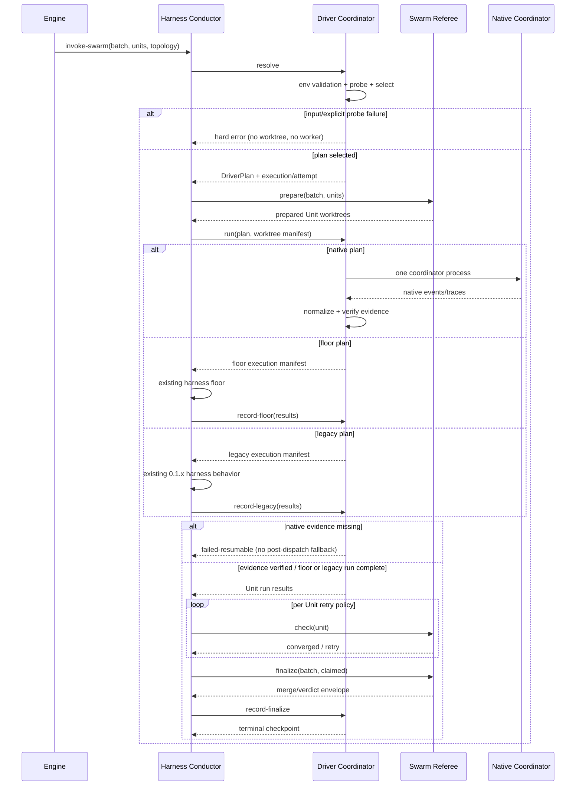
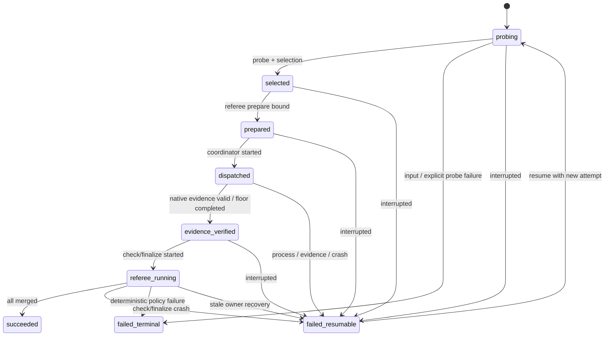

# Swarm Driver 実行サービス設計

## 上流コンテキスト

本書は`requirements`、`architecture`、`component-inventory`、`team-practices`を統合した実行時設計である。`stories`はSKIP済みのため、USR-01〜USR-10を利用者フローとして採用する。新しい常駐service、AWS resource、HTTP API、GUIは作らない。ここでいうserviceは、既存conductorから呼ばれる短命なlocal process orchestrationを指す。

公式surfaceの根拠は、Claude Codeの[Agent Teams](https://code.claude.com/docs/en/agent-teams)、Codexの[非対話JSONL](https://learn.chatgpt.com/docs/non-interactive-mode#make-output-machine-readable)とConfiguration Reference、Kiro CLIの[Subagents](https://kiro.dev/docs/cli/chat/subagents/)である。外部CLIは変化するため、version pinだけでなくbatchごとのbehavior probeを必須にする。

## Service定義

| Service | 実体 | Lifecycle | 状態 | Scale単位 |
|---|---|---|---|---|
| Driver Coordination Service | `amadeus-swarm-driver.ts` 1 process | `invoke-swarm`からreferee完了まで | record-local checkpoint | batch |
| Native Coordinator | Claude/Codex/Kiro CLI child process | driver `run`中だけ | provider session + normalized evidence | Claude/Codexはbatch、Kiroはwave |
| Evidence Capture | adapter parser +必要時hook process | coordinatorと同時 | attempt temp dir | native event |
| Swarm Referee | 既存`amadeus-swarm.ts` invocation | prepare/check/finalizeごと | stateless、git/worktreeを観測 | Unit/batch |

中央のDriver Coordination Serviceが順序を所有するorchestration方式を採用する。provider event同士のchoreographyにはしない。外部CLIが終了してもrefereeが収束を確認するまでbatch successを確定しない。

## End-to-end orchestration



テキスト代替: engineがdriver-neutralなbatchを渡し、driver toolが選択する。refereeがworktreeを準備した後、nativeならcoordinatorを1つ起動して証跡を検証し、floorならconductorへ既存floorの実行manifestを返して結果を記録する。その後だけ既存refereeのcheck/finalizeへ進み、merge結果をdriver checkpointへ取り込む。

## Driver別process contract

### Claude Agent Teams

| 項目 | 契約 |
|---|---|
| Process | batchごとに`claude -p` 1 process |
| Mode | `CLAUDE_CODE_EXPERIMENTAL_AGENT_TEAMS=1`、`teammateMode=in-process`、stream-json + hook events |
| Input | 一意team名、Unit slug、worktree path、依存、convergence commandを構造化promptへ渡す |
| Native evidence | team configの同一team `members` 2件以上、共有task listの各Unit task、stream上のTeam/task marker |
| Isolation | teammate自身の自動worktreeに依存せず、各Unitへreferee作成済みworktreeを明示割当 |
| Failure | Team未作成、member<2、Unit未割当、cleanup前消失、process非0はdispatch failure |

Agent Teamsは独立したClaude session、共有task list、direct messagingを提供する。team stateは`~/.claude/teams/{team-name}/config.json`、task stateは`~/.claude/tasks/{team-name}/`にあるため、adapterはexecution/attemptから導出したteam名だけを読み、他teamをscanしない。cleanup前に必要fieldを正規化し、raw fileはcheckpoint/auditへ複製しない。

### Claude Ultra Code

| 項目 | 契約 |
|---|---|
| Process | batchごとに`claude -p` 1 process |
| Mode | ephemeral settingsでUltra CodeとDynamic Workflowsを明示、xhigh-capable model、stream-json + hook events |
| Input | batchを1つのdynamic workflowとして実行し、各Unitを別native workflow task/agentへ割り当てる |
| Native evidence | workflow run ID、workflow marker、2件以上のnative task/agent ID、全Unit対応 |
| Floorとの差 | `claude-task-floor`のUnit別Task呼出しではなく、1 process内のstanding workflowがbatchを調整する |
| Failure | xhighだけ、keyword受理だけ、自己申告だけ、workflow markerなしはsuccessにしない |

Ultra Codeの公開CLI surfaceがversion間で変わる可能性があるため、adapterは固定の表示文言をparseしない。opt-in live fixtureで捕捉したversioned event pathだけをallowlistし、未知schemaでは`native-surface-unavailable`または`native-evidence-unavailable`として停止する。

### Codex Ultra

| 項目 | 契約 |
|---|---|
| Process | batchごとに`codex exec --json` 1 process、stdinは必ずclose |
| Mode | `model_reasoning_effort="ultra"`と`features.multi_agent=true`を明示し、batch coordinator promptを使用。利用者の解決modelがUltra対応であることをprobeする |
| Input | Unit manifestとworktreeを渡し、coordinatorに2件以上のchild agent委譲を必須化 |
| Native evidence | 初期handshakeのresolved model ID + Ultra受理、JSONL `thread.started`のthread ID、attempt専用`SubagentStart`/`SubagentStop` hookのchild ID、Unit対応 |
| Floorとの差 | floorはUnitごとの独立`codex exec`。nativeはbatch 1 processからchild agentを起動する |
| Failure | Ultra非対応またはxhigh downgrade、単一thread成功、plan updateだけ、child agent<2はsuccessにしない |

Codex公式JSONLはthread/turn/item/errorを機械可読化するが、公開item一覧だけではchild agent証明が十分でない。そのため、frameworkのCodex設定へSubagentStart/Stop capture hookを追加し、`AMADEUS_SWARM_EVIDENCE_DIR`とattempt nonceが設定されたprocessだけで動作させる。hookは`agent_id`、`agent_type`、event種別、相関IDだけをatomic appendし、assistant messageを記録しない。hook無効・未trustedならpreflight failureとする。

`codex-ultra`はAmadeus内のdriver名であり、CLIに存在しない`--ultra`を装わない。Codex 0.144.0のlocal model catalogで確認できるUltra reasoning effortをconfig overrideで要求し、resolved modelが受理したこととnative multi-agent delegationの両方をUltra契約の意味とする。特定model slugはhard-codeせず、現在の解決modelがUltra非対応なら明示driverはhard error、`auto`はdispatch前fallbackとする。

### Kiro subagent

| 項目 | 契約 |
|---|---|
| Process | 2〜4 Unitのbalanced waveごとに`kiro-cli chat --no-interactive` 1 process |
| Mode | V2/V3の選択をlive fixtureで固定し、custom coordinator agentで`subagent` toolを使用 |
| Trust | coordinator agentをworkspace-localに生成し、`availableAgents`と`trustedAgents`を必要最小集合へ限定 |
| Native evidence | parent session ID、2件以上のchild session ID、parent relation、全Unit対応 |
| Wave | manifest順を維持し、各waveが2〜4 Unitになるよう均等分割する。5件は3+2、9件は3+3+3、13件は4+3+3+3 |
| Failure | trust不足、non-interactive approval要求、parent relation欠落、予定waveとchild sessionの全単射不成立、完了stop不足はfailure |

Kiroは最大4 subagent同時実行とpersisted child sessionのparent IDを提供する。wave数を`ceil(Unit数 / 4)`、基本件数を`floor(Unit数 / wave数)`とし、余りを先頭waveから1件ずつ配るため、native対象batchでは1件だけの末尾waveを作らない。CLIの人向け出力文言だけへ依存せず、session metadataのparent-child relationとcoordinator streamの両方をnative証跡とする。安定fieldはmacOS live fixtureでschema versionを固定し、未認識schemaをpassへ読み替えない。

## Floor service contract

floorは新しいenv値ではなく、新selectorの`auto`だけが選べる内部execution modeである。legacy互換が同じ基盤のfloorを使う場合も、driver lifecycle上はfloorへ読み替えず独立した`legacy` execution modeとして記録する。

| Floor | Process topology | Evidence contract | 既存挙動 |
|---|---|---|---|
| `claude-task-floor` | conductorからUnitごとのTask | native evidence不要、loud fallback audit必須 | 維持 |
| `codex-exec-floor` | Unitごとの`codex exec`、stdin close | native evidence不要、loud fallback audit必須 | 維持 |
| `kiro-subagent-floor` | conductorからUnitごとのKiro subagent | native driver evidenceとは区別、loud fallback audit必須 | 維持 |

floorでもworktree、check、finalizeは共通である。Claude TaskとKiro subagentは共通tool processから直接呼べないため、C-01が`FloorExecutionPlan`を返し、live harness conductorが既存surfaceで実行後に`record-floor`する。Codex floorも同じcontrol flowへ揃え、ハーネス別の二重経路を作らない。明示native driverのfailureからfloorへ移らない。

旧変数だけが設定された0.1.x互換実行では、C-01が`LegacyExecutionPlan`を返し、conductorが現行ハーネス挙動をそのまま実行して`record-legacy`する。legacyは新driverへのaliasではなく、warningとauditを伴う独立execution modeである。

## Probe service

probeはnative worker/worktree作成前にbatchごと1回実行し、次の順序で短絡する。

1. executable存在とversion取得。
2. 非対話auth statusまたはcredentialを露出しない最小handshake。
3. mode surfaceと必要flag/settingsの受理。
4. hooks、team state、subagent trust等のnative evidence capture surface。
5. temp directoryでの非破壊handshake。application codeとgit stateを変更しない。

結果cacheのkeyはattempt内だけであり、次batchやresume attemptでは再利用しない。versionは診断fieldで、capability判定は各checkの振る舞いで行う。probe timeoutは共通定数とし、timeout自体を`capability-probe-failed`として扱う。

## Attempt lifecycleとcrash recovery



テキスト代替: 1 attemptはprobe、selected、prepared、dispatched、evidence-verified、referee-runningを順に進み、succeeded、failed-resumable、failed-terminalのいずれかで終わる。crash、外部process中断、check/finalize/merge失敗はfailed-resumable、入力不正や再試行しても同一になるpolicy違反はfailed-terminalである。hard crashでactive checkpointが残った場合は、新processが期限切れleaseと旧owner非生存を証明し、recovery transitionでfailed-resumableへ移してから、同じexecution IDの新attemptをprobeから開始する。succeededとfailed-terminalは再開不可である。

再開時のsplit-brain防止と再利用規則は次のとおり。

- checkpointは固定TTLのlease、owner process start identity、process group、単調増加fencing tokenを持つ。各transitionは現行token一致を必須にする。
- active checkpointのlease期限切れだけでは奪取しない。旧owner非生存を確認し、attempt由来の旧process groupが残る場合は終了とexit確認後にrecoveryする。liveness不明は停止する。
- Unit worktreeは存在・ownership marker・base相関を再検証して再利用する。
- `referee-converged`は既存refereeの再検証でgreenの場合だけ再利用する。
- provider session、probe結果、未完了native child、自己申告のcompletedは再利用しない。
- 前attemptへterminal successを追記せず、新attemptの`previousAttemptId`で連結する。
- merge途中のcrashはgit stateとrefereeを再検証し、成功eventの二重発行を防ぐ。

永続化は既存のaudit-first規則に従う。各state transitionは閉じた`AttemptTransition` variant、transition ID、pre/post digestを持ち、同じlock内で`SWARM_DRIVER_TRANSITION` intentをappendした後にcheckpointをatomic replaceする。checkpoint replace前のcrashでauditだけが残ってもsuccessとはみなさず、resumeがdigestを照合して同じtransitionを再適用し、`SWARM_DRIVER_RECONCILED`でreapply/discard結果を記録する。terminal successはrefereeのversion、execution/attempt、finalize invocation、plan/worktree digest、Unit merge前後commit、result digestを束縛したenvelopeと対応auditが確認できた場合だけmaterializeする。

referee error codeのterminalityは閉じる。check未収束、referee process失敗、finalize失敗、merge失敗、referee audit失敗は`failed-resumable`である。protected-spec binding不正、lying-conductor検出、batch相関不一致、envelope schema不正は`failed-terminal`である。未知codeはfail-closedで拒否し、どちらかへ推測しない。

## Communication contract

| Channel | Format | 機密性 | Producer → Consumer |
|---|---|---|---|
| Engine directive | 既存JSON | driver-neutral | engine → conductor |
| Driver CLI stdout | schema v1 JSON 1件 | redacted | driver tool → conductor |
| Driver warning stderr | 列挙code +修正案 | credential/prompt禁止 | driver tool → user |
| Provider stdout/stderr | provider raw stream | adapter process内だけ | native CLI → adapter |
| Evidence capture | normalized JSONL | ID/enum/Unitのみ | adapter/hook → verifier |
| Checkpoint | schema v1 JSON atomic file | raw payload禁止 | driver tool → resume |
| Audit | Markdown taxonomy | redacted correlation | driver/referee tools → runtime summary |
| Referee envelope | versioned closed JSON | execution/attempt/finalize、plan/worktree、Unit merge commit、result digest | referee → conductor/driver tool |

## Lifecycle・scaling・platform

- 常駐daemon、port、queue、databaseは追加しない。全processはbatch/attemptに紐づけて終了する。
- concurrencyは既存swarm batchを上限とし、Kiroだけ2〜4 Unitのbalanced deterministic waveへ写像する。
- process timeout時はchild process groupを終了し、worktreeとcheckpointを残す。
- macOSでは4 driverのcredentialed opt-in live proofを各1回以上必須とする。
- GitHub Actions Linuxではfake CLI、failure injection、package/dist/self-installを必須とし、credentialed native proofは行わない。
- Windowsは対象外。既存PowerShell hook override等を不要に変更しない。

## UX feedback contract

選択結果はworker開始前に1行で表示する。

```text
Swarm driver: requested=auto selected=codex-ultra mode=native topology=independent attempt=<id>
```

fallbackはwarningとして原因と実行方式を明示する。

```text
Warning: requested=auto selected=codex-exec-floor mode=floor reason=native-surface-unavailable
```

明示driver失敗は代替を実行しないことと修正方法を示す。色だけに依存せず、stdout/stderrの責務を分ける。GUIや対話選択を追加しない。
