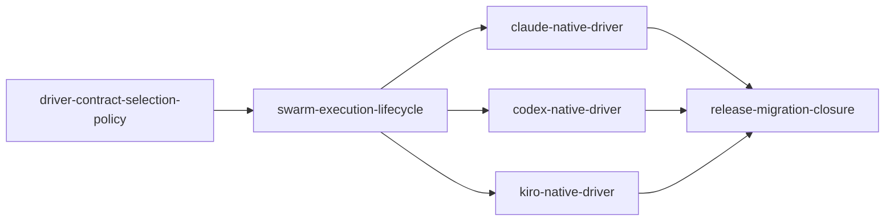

# Swarm Driver Migration Unit依存DAG

## 上流コンテキスト

本DAGは`components`のC-01〜C-12、`component-methods`のversioned interface、`services`のbatch coordinator lifecycle、`component-dependency`の一方向依存、`decisions`のADR-001〜ADR-008、`requirements`のFR-01〜FR-26をUnit topologyへ変換する。`stories`はSKIP済みのため、USR-01〜USR-10とFR-24〜FR-26由来のREL-01〜REL-02をdependency妥当性の確認に使う。

この成果物は直接依存だけを記録する。実装順、価値順、費用順、推奨topological order、critical pathは定義せず、Delivery Planningへ委ねる。

## Machine-readable edge block

以下がdownstream batch fan-outの正本である。`depends_on`は、そのUnitが利用する直接の先行contract Unitだけを列挙する。

```yaml
units:
  - name: driver-contract-selection-policy
    depends_on: []
  - name: swarm-execution-lifecycle
    depends_on: [driver-contract-selection-policy]
  - name: claude-native-driver
    depends_on: [swarm-execution-lifecycle]
  - name: codex-native-driver
    depends_on: [swarm-execution-lifecycle]
  - name: kiro-native-driver
    depends_on: [swarm-execution-lifecycle]
  - name: release-migration-closure
    depends_on: [claude-native-driver, codex-native-driver, kiro-native-driver]
```

## 依存DAG



テキスト代替: `swarm-execution-lifecycle`は`driver-contract-selection-policy`へ依存する。Claude、Codex、Kiroの各native driverはそれぞれ`swarm-execution-lifecycle`へ依存し、互いには依存しない。`release-migration-closure`は3つのprovider Unitすべてへ依存する。

## 直接依存の根拠

| Dependent Unit | Direct dependency | 必要なcontract | edgeを置く理由 |
|---|---|---|---|
| `swarm-execution-lifecycle` | `driver-contract-selection-policy` | `RequestedDriver`、`DriverPlan`、`TopologyDecision`、`SelectionDecision`、`DriverRegistration`、legacy/floor union | stateful coordinatorとproduction registry assemblyはU-01の閉じたcontractだけを実行し、selection ruleやregistration型を複製しない |
| `claude-native-driver` | `swarm-execution-lifecycle` | `DriverAdapter`、`ProbeResult`、`LaunchSpec`、`NormalizedDriverEvent`、evidence/failure contract | Claude raw surfaceを共通lifecycleへ正規化して渡し、checkpoint/refereeを所有しない |
| `codex-native-driver` | `swarm-execution-lifecycle` | 同上 + evidence hook相関contract | Codex JSONL/hookを共通evidenceへ変換し、selection/attemptを再実装しない |
| `kiro-native-driver` | `swarm-execution-lifecycle` | 同上 + `UnitWave` contract | Kiro wave/sessionを共通evidenceへ変換し、Unit dropや独自successを許さない |
| `release-migration-closure` | `claude-native-driver` | Claude実registration、Claude harness projection、Agent Teams/Ultra live evidence | registry placeholder検査、全harness package、release matrixを未完成providerなしで閉じない |
| `release-migration-closure` | `codex-native-driver` | Codex adapter export、hook/projection、Ultra live evidence | 同上 |
| `release-migration-closure` | `kiro-native-driver` | Kiro adapter export、Kiro/Kiro IDE projection、subagent live evidence | 同上 |

U-06はU-02とU-01へ推移的に依存するため、重複する直接edgeは置かない。DAGにself-loopと循環はない。

## Integration points

| Producer | Consumer | Interface / shared data / event | Ownership rule |
|---|---|---|---|
| `driver-contract-selection-policy` | `swarm-execution-lifecycle` | versioned JSON schema、closed union、`DriverAdapter`/`DriverRegistration`、pure selector result | U-01だけがdriver値、registration schema、fallback reason、legacy表を変更する |
| `swarm-execution-lifecycle` | provider 3 Unit | production registry assembly、3つの型付きfail-closed slot、attempt nonce、Unit manifest、expected wave | U-02が静的mappingとlifecycleを所有し、各providerは自分のslotだけを実registrationへ置換する |
| provider 3 Unit | `swarm-execution-lifecycle` | normalized provider events、redacted probe result、process exit | U-02がevidence verdictとterminal stateを決め、provider自己申告でsuccessにしない |
| `swarm-execution-lifecycle` | existing Swarm Referee | conductor経由のprepare manifestとversioned finalize envelope | C-01とC-11は互いをimport/invokeせず、conductorだけが順序制御する |
| Claude Unit | Claude harness | C-01 CLI result、Task/Dynamic Workflow legacy/floor execution plan | Claude SKILLはselector表を持たず、C-01結果だけへ分岐する |
| Codex Unit | Codex harness/hook | C-01 CLI result、attempt nonce付きSubagent hook events | hookはID/eventだけを書き、message本文を保存しない |
| Kiro Unit | Kiro/Kiro IDE harness | C-01 CLI result、trust declaration、parent-child session metadata | CLI/IDE固有projectionはU-05内で同じKiro contractへ収束する |
| provider 3 Unit | `release-migration-closure` | 実registration、manifest source、fake/live evidence paths | U-06は全slot実装済み・mapping exhaustiveを検査し、registryやdynamic plugin seamを追加実装しない |
| `release-migration-closure` | generated distributions | package manifests、`dist`、self-install、docs | sourceは`packages/framework`だけ。生成先の直接編集を禁止する |

## Provider Unit convergence seam

U-02はproduction composition rootと3つのprovider module pathを同時に作る。各moduleはU-01の`DriverRegistration` versionを実装し、初期状態では次の共通placeholderを返す。

```text
registration_state = unavailable-placeholder
probe status       = unavailable
worker side effect = 0
```

composition rootはClaudeの2 driver値をClaude slotへ、Codex/Kiroの各driver値を対応slotへ静的・exhaustiveに写像する。placeholderも同じproduction registryを通るが、native successを返せず、明示driverではworker作成前hard error、`auto`ではdispatch前の定義済みfallbackだけが可能である。

U-03、U-04、U-05は自分のmoduleの`registration_state`を実descriptorへ置換し、production composition root、他provider module、driver mappingを編集しない。各Unitのfake integrationとmacOS live proofは、対応harness conductorから公開`amadeus-swarm-driver.ts`、production registry、C-01 lifecycle、native coordinator、evidence verifier、refereeまでを通す。`createCoordinator({ registry: fake })`による注入はU-02自身のlifecycle unit testだけに限定し、FR-11〜FR-14/FR-23のprovider proofには使用しない。

したがって、例えばU-03のworktreeではClaude slotだけが実装済みでも、Codex/Kiro placeholderを含むproduction registry全体がcompileできる。検出harnessがClaudeならCodex/Kiro slotはselection候補にならず、Claudeのend-to-end proofを妨げない。U-06は3 provider merge後にplaceholder 0、4 driver mappingの全件性、余分なregistration 0を検査するだけで、hidden integration codeを追加しない。

## Shared resourcesと競合制御

| Resource | Owner Unit | 他Unitの扱い | 競合防止 |
|---|---|---|---|
| contract/selector files | U-01 | import only | provider Unitはdriver enumや選択表を編集しない |
| coordinator/runtime/referee envelope + production registry assembly | U-02 | provider Unitは固定slotを実装 | U-02が静的mappingとfail-closed placeholderを用意し、provider Unitはcheckpoint、audit、referee、mappingを編集しない |
| `amadeus-swarm-driver-adapters/claude.ts` | U-03 | U-02のplaceholderを実registrationへ置換、U-06が検査 | provider別1 file ownership |
| `amadeus-swarm-driver-adapters/codex.ts` + Codex evidence hook | U-04 | U-02のplaceholderを実registrationへ置換、U-06が検査 | provider別1 file/hook ownership |
| `amadeus-swarm-driver-adapters/kiro.ts` | U-05 | U-02のplaceholderを実registrationへ置換、U-06が検査 | provider別1 file ownership |
| registry completeness check、shared docs、generated dist | U-06 | provider Unitは実registration/evidenceを提供 | placeholder 0とexhaustive mappingを検証するrelease単一writer |
| audit shard/checkpoint | U-02 runtime | provider processは値を書かない | audit lock、atomic replace、lease、fencing token |
| Unit worktrees/main merge target | existing referee via U-02 envelope | provider childは割当worktreeだけを書く | 1 Unit 1 writer、finalizeだけがserialized merge |

## 並列開発可能性

`claude-native-driver`、`codex-native-driver`、`kiro-native-driver`の間にはdirect/transitive edgeがなく、互いのsource file、harness source、provider fixtureを所有しない。この3 Unitは同じready setになり得て、3!通りの有効なtopological orderingと並行実行が存在する。

```text
{claude-native-driver, codex-native-driver, kiro-native-driver}
```

engineがこの3 Unitを同時にreadyと判定した場合、その集合がmulti-Unit batch候補になる。batchは上記YAMLに保存する別nodeではなく、DAGと完了状態からruntimeで導出する一時集合である。CLI負荷、token、費用を理由にprovider間へ偽のdependency edgeを追加しない。実際の経済的なsequencingはDelivery Planningが扱う。

`driver-contract-selection-policy`、`swarm-execution-lifecycle`、`release-migration-closure`は、それぞれのreadiness layerに同格の別Unitがないため、このDAGからmulti-Unit batchにはならない。ただし、これは優先度や実施順を推奨するものではない。

## Dependency invariants

1. U-01は他Unitへ依存せず、filesystem/process/auditをimportしない。
2. U-02はprovider具象実装なしでfake adapterによりlifecycleを検証できる。
3. U-03〜U-05はU-02の公開adapter contractだけへ依存し、互いをimportしない。
4. U-02が3 provider slotを4 native driver値へ静的配線し、各slotは未実装時にfail-closedとなる。U-03〜U-05は自分のslotだけを実装し、U-06はplaceholder 0とmappingのexhaustivenessだけを検証する。
5. Provider raw payloadはprovider Unit内のmemory/attempt tempから外へ流さず、normalized eventだけをU-02へ渡す。
6. Referee successとdriver successを相互代替しない。U-02が両方のenvelopeを相関し、merge完了前にterminal successを出さない。
7. Distributionはsourceからgenerated treeへの一方向で、runtimeからpackagerを呼ばない。
8. Windows向けの新dependencyは追加しない。release criterionはmacOSとGitHub Actions Linuxに限定する。

## Topology coverage

| Upstream concern | DAG上の表現 |
|---|---|
| pure selectorとstateful runtimeの分離 | U-02 depends on U-01 |
| provider adapterの独立変更理由 | U-03、U-04、U-05間にedgeなし |
| common evidence/referee convergence | provider 3 Unit depends on U-02 |
| 全providerを揃えたclosed registry検証 | U-02の静的slot assembly + U-06 depends on U-03、U-04、U-05 |
| package/docs/migrationのrelease invariant | U-06へ凝集 |
| batchはready setでありUnit親ではない | provider 3 Unitの独立集合からruntime導出 |

FR-01〜FR-26の機能ownershipは`unit-of-work.md`、USR-01〜USR-10とREL-01〜REL-02の割当は`unit-of-work-story-map.md`で逆引きできる。
