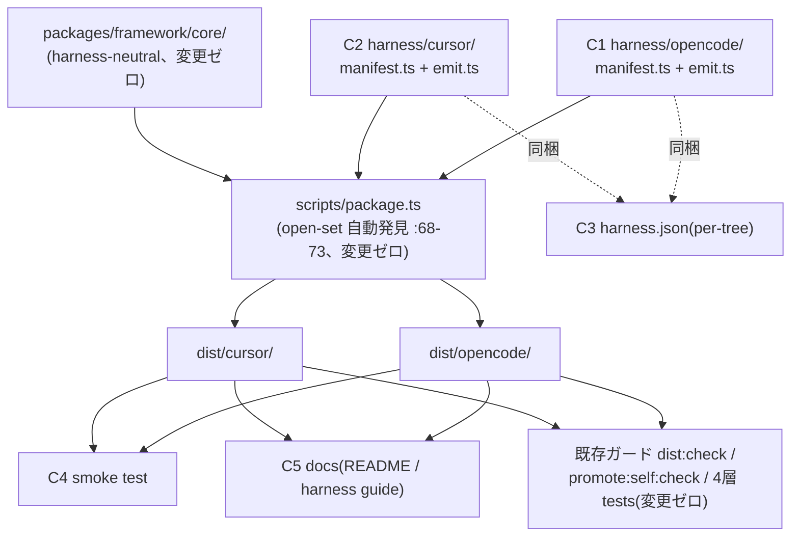

# Component Dependency — opencode / Cursor harness 対応

intent: `260715-opencode-cursor-harness`。上流: `../requirements-analysis/requirements.md`、codekb の architecture.md / component-inventory.md、`../practices-discovery/team-practices.md`。

## 依存図(Mermaid)

## テキストフォールバック(Mermaid 非対応環境向け)

- C1(opencode manifest+emit)と C2(cursor manifest+emit)は **相互に独立**。両者とも core と package.ts に読み取り専用で依存し、core / package.ts への変更はゼロ
- package.ts が C1/C2 を自動発見して dist/opencode/・dist/cursor/ を生成。各 dist は harness.json(C3)を同梱
- C4(smoke test)と C5(docs)は両 dist の生成結果に依存(実装順は dist の後)
- 既存ガード(dist:check / promote:self:check / tests)は新 dist を自動編入で検査(open-set の帰結)

## 依存の含意(delivery-planning への入力)

- C1 系(opencode)と C2 系(cursor)はファイル非交差で並行可(c6 判定は着手前に実 diff で再評価)
- C4 は C1・C2 の両成果に依存 → 統合点。C5 は最後
- walking skeleton(Bolt 1)= C1 の最小部分(manifest+dist 生成+command 導線)— scope-definition B-1 と一致
