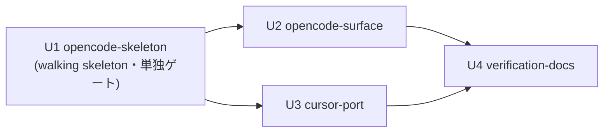

# Unit of Work Dependency — opencode / Cursor harness 対応

> 上流入力: unit-of-work.md(U1〜U4)、application-design の component-dependency.md(C1/C2 独立・C4/C5 統合点)/ components.md / component-methods.md / services.md / decisions.md(ADR-3/5)、requirements.md(AC の依存)。2026-07-16。

## エッジブロック(エンジン読み取り用 — parseBoltDag の必須入力)

```yaml
units:
  - name: opencode-skeleton
    depends_on: []
  - name: opencode-surface
    depends_on: [opencode-skeleton]
  - name: cursor-port
    depends_on: [opencode-skeleton]
  - name: verification-docs
    depends_on: [opencode-surface, cursor-port]
```

## 依存図



## テキストフォールバック

- U1 は依存なし(Bolt 1、単独ゲート — org.md walking-skeleton 規律)
- U2(opencode 完成)は U1 に直列依存: **同一ファイル(harness/opencode/emit.ts)を拡張するため**(c6 の交差判定 — 静的目録で確定、着手前に実 diff で再評価)
- U3(cursor-port)は U1 にゲート依存: ファイルは完全非交差(harness/cursor/)だが、walking-skeleton の単独ゲート通過が全 Bolt の前提。U2 と U3 は非交差につき**並行可**(batch 2)
- U4 は U2・U3 の両方に依存(両ハーネスの実測結果が smoke test / docs の入力 — 統合点)

## バッチ構成(delivery-planning への入力)

| batch | units | 並行度 | ゲート |
| --- | --- | --- | --- |
| 1 | opencode-skeleton | 1 | 単独ゲート(walking skeleton)+ 出荷後ラダープロンプト |
| 2 | opencode-surface, cursor-port | 2(非交差実測済み) | ラダー選択に従う |
| 3 | verification-docs | 1 | 同上 |
