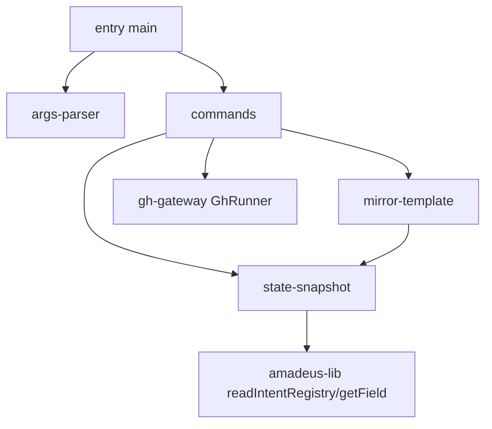

# Component Dependency — amadeus-mirror ツール

上流入力(consumes 全数): requirements.md、architecture.md、component-inventory.md、team-practices.md

## 依存グラフ(循環なし)

<!-- Text fallback: entry は args-parser と commands に依存。commands は state-snapshot / mirror-template / gh-gateway に依存。state-snapshot は amadeus-lib(readIntentRegistry, getField)を import。mirror-template は state-snapshot の型に依存。循環なし。 -->

## 依存方向の制御

- 変更理由の凝集: 表示形の変更は C3 のみ、GitHub 面の変更は C4 のみ、状態源の様式追随は C2 のみに閉じる
- C4 の GhRunner は port(依存注入)— テストダブルはテスト側ヘルパーに置き、本番コードに fixture 分岐を持たない(construction ガードレール準拠)
- amadeus-lib への依存は読み取り/純変換系の7シンボルに限定(実装実測 — ADR-5 参照。lib の書き込み系・ロック系 API には依存しない)
