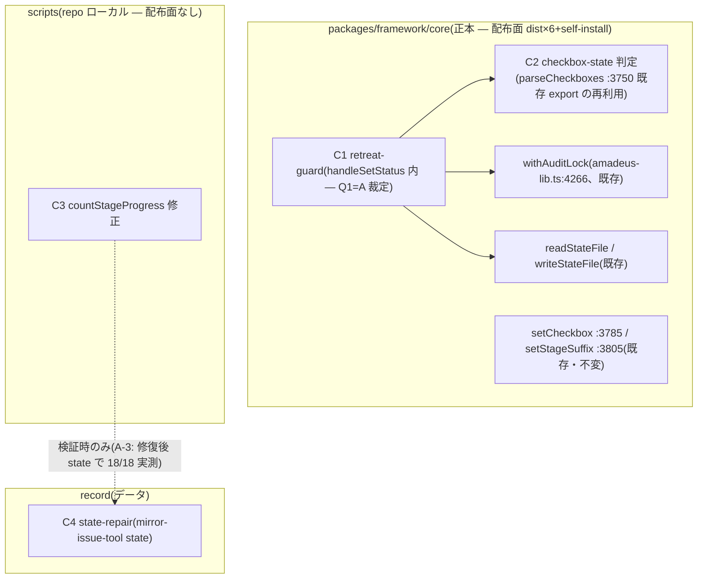

# Component Dependency — 260717-state-mirror-fixes

上流入力(consumes 全数): requirements.md、architecture.md、component-inventory.md、team-practices.md

## 依存グラフ

テキストフォールバック: C1 は C2(checkbox 読取)・withAuditLock・readStateFile/writeStateFile に依存。C2 は依存なし(純関数)。C3 は独立(scripts のみ)。C4 はデータ操作で、C3 の live 検証(A-3)のみが C4 の完了に依存する。循環依存なし。

## 変更面の非交差(並行実装判定の材料 — c6)

| 修正 | 編集ファイル | 再生成面 |
|---|---|---|
| #1170(C1+C2) | packages/framework/core/tools/amadeus-utility.ts、amadeus-lib.ts | dist 6ツリー+self-install(.claude/ ほか) |
| #1172(C3) | scripts/amadeus-mirror.ts、tests/unit/t232 | なし |
| 修復(C4) | amadeus/spaces/default/intents/260717-mirror-issue-tool/amadeus-state.md | なし |

#1170 と #1172 はファイル単位で完全非交差(scope-document の並行可判定を設計面で再確認)。ただし実装規模が小さいため、Bolt 分割・直列/並行の確定は delivery-planning(units-generation)の判断に委ねる。

## 依存方向の制御(inception ガードレール)

- C2 は既存 `parseCheckboxes`(amadeus-lib.ts:3750、export 済み)の再利用 — 新設シンボルなし、lib → utility の既存依存方向を保つ(utility → lib import のみ、逆流なし)
- C1 は engine(amadeus-state.ts)のハンドラを呼ばない(FR-1e)— ロックドメインだけを共有し、コード依存は amadeus-lib.ts に閉じる
- C3 は core に依存しない(scripts 自己完結)— gh-scripts-boundary と同型の境界維持
