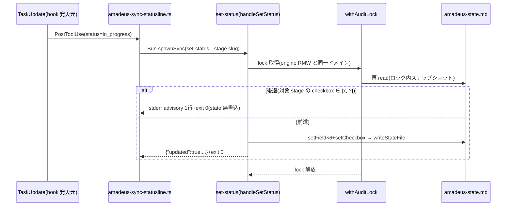
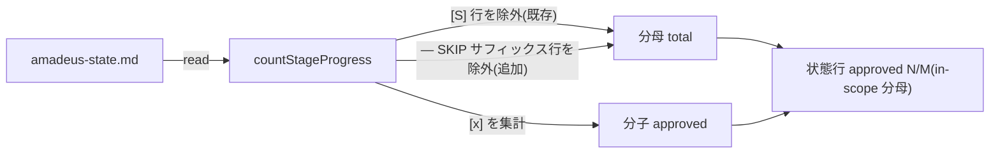

# Services — 260717-state-mirror-fixes

上流入力(consumes 全数): requirements.md、architecture.md、component-inventory.md、team-practices.md

## サービス構成

本 intent は新規サービス・常駐プロセス・外部 API を導入しない(architecture.md の CLI+hook 構成、component-inventory.md の既存ツール群のまま)。実行時の相互作用は以下の2系統。

## 相互作用 1: set-status の後退抑止フロー(#1170)

テキストフォールバック: TaskUpdate → sync-statusline hook → set-status。set-status は withAuditLock を取得し、ロック内で state を再 read。対象 stage の checkbox が `[x]` または `[?]` なら後退と判定し、一切書かずに stderr advisory+exit 0。それ以外は従来どおり全フィールドを書き込む。engine の advance/approve は同一ロックドメインのため、ロック保持者間で TOCTOU が閉じる(FR-1d)。

## 相互作用 2: mirror 状態行の分母集計(#1172)

テキストフォールバック: countStageProgress は Stage Progress 節の各行について、checkbox `[S]`(jump-skip、既存)と行末 `— SKIP`(scope-skip、追加)の両方を分母から除外し、`[x]` を分子に数える。mirror-issue-tool 相当の state で 18/18 となる。

## エラーハンドリング(construction ガードレールの写像)

- set-status: lock 取得失敗は既存 withAuditLock の throw(loud)を継承 — サイレント失敗を作らない。後退 no-op は「エラーではなく正常系の抑止」であり stderr advisory で可観測(運用可視性の拡張は Out of Scope — requirements Open Questions 4)
- countStageProgress: 純関数のため入力異常は既存の行 match 不成立(スキップ)扱いを維持 — 新たな例外経路を導入しない
