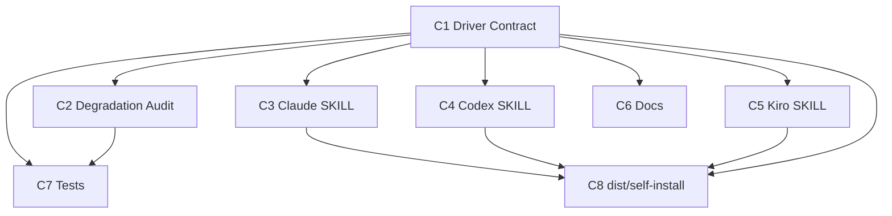

# Component Dependency — swarm-dispatch-enum(Issue #1157)

上流入力(consumes 全数): `requirements.md`、`architecture.md`、`component-inventory.md`、`team-practices.md`。

## 依存マトリクス

| 依存元 → 依存先 | C1 Driver Contract | C2 Audit | referee(既存) |
|---|---|---|---|
| C2 Degradation Audit | 型(DriverName)を消費 | — | prepare からの emit(既存) |
| C3 Claude SKILL | `resolve` を実行時消費(Q1 裁定 A) | — | prepare/finalize CLI |
| C4 Codex SKILL/emit/onboarding | 同上 | — | 同上 |
| C5 Kiro 系 | 同上(degrade/fail-closed のみ) | — | 同上 |
| C6 Docs | 語彙・表を転記 | イベント語彙を転記 | — |
| C7 Tests | 純関数を in-process 消費 | fixture で検証 | t134/t135 回帰 |
| C8 dist/self-install | 生成経路で全面を複製 | 同左 | 同左 |

- 逆流なし: C1 は他コンポーネントへ依存しない(語彙の単一始点 — C-06 の一対一を構造で担保)
- Mermaid(テキスト代替: C1 → C2/C3/C4/C5/C6/C7、C1・C3・C4・C5 → C8、C2 → C7):

## データフロー

raw env(`AMADEUS_USE_SWARM`)→ C1 解決 → {selected|degraded|rejected} → C3/C4/C5 の fan-out 判断 → degraded のみ `--degraded-from` → C2 `SWARM_DEGRADED`(Requested driver 保存)→ 監査から再現(intent 成功指標)

## 共有資源

- `DriverName`/`DRIVER_VALUES`: C1 単一定義(手書き複製禁止 — construction ガードレールの canonical 1 定義原則)
- dist ×6+self-install: C8 生成経路のみが書く(手編集 Forbidden)
