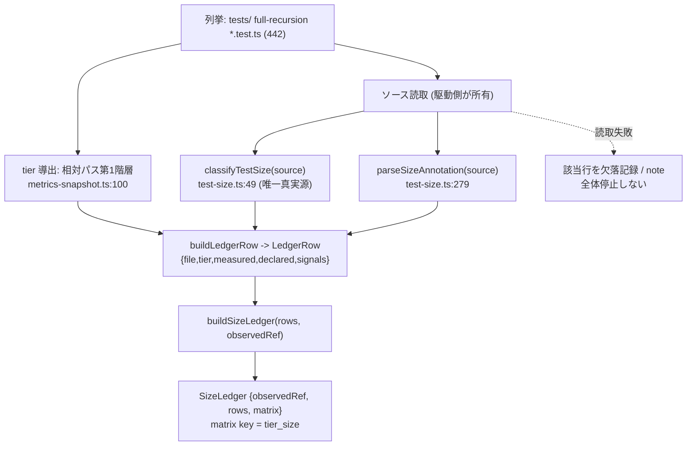

上流入力(consumes 全数): unit-of-work.md, unit-of-work-story-map.md, requirements.md, components.md, component-methods.md, services.md

本ユニット U1(台帳生成)のユーザー価値は「現状の可視化 — どのテストがどの size/tier かを計測導出で1枚に確定する」(unit-of-work-story-map.md:11,17)。以下はその台帳生成のロジックフロー設計である。

# 業務ロジックモデル — U1 サイズ分類台帳(SizeLedger)

本書は U1(C1 SizeLedger、FR-1)の **台帳生成ロジックのフロー** を設計として記す。実装(生成スクリプト・台帳ファイル永続化)は本 intent Out(unit-of-work.md:66-69、FR-1 将来条件 requirements.md:47)。本書は業務ロジックの設計までであり、実コードは code-generation / 別 intent。

**size の唯一真実源は既存純関数 `classifyTestSize`**(`tests/lib/test-size.ts:49`、verbatim: `export function classifyTestSize(source: string): SizeClassification`)。台帳はその決定的スイープ出力の機械転記であり、独自 size 判定ロジックを持たない(ADR-04、components.md:17-19)。数値ハードコードは検証劇場 Forbidden(org.md/team.md P2)。

すべての実測値は tier 開放スイープの measurement ref `3917a283a953165866170d235d3dc25ad2fd3643`(tests/ 全域再帰 442ファイル、E-TPR-NR1。RE diff-base は `d151561d8d9b7a01fa4f16d47da5434486a2e9e2`)からの転記。台帳は measurement ref を `observedRef` として保持する(measurement-ref-in-artifacts、component-methods.md:40)。

## ロジックフロー(決定的スイープ)

台帳生成は次の一方向パイプラインで表現する。各段は既存の純関数・既存キー形式の再利用に閉じ、新規ロジックは薄い組み立て純関数(`buildLedgerRow` / `buildSizeLedger`)のみ(unit-of-work.md:62-64、規模 約560〜600行の点推定)。

1. **テストファイル列挙**: `tests/` 全域再帰の `*.test.ts`(実測 442 ファイル、既存 `test_pyramid` コレクタ `scripts/metrics-snapshot.ts:34-40` walk / `:99` と同型の無制限再帰列挙、unit-of-work.md:35-42)を列挙する。列挙とソース読取は **スイープ駆動側が所有**(既存 `test_pyramid` コレクタの `env.listFiles` / `env.readFile` 注入 seam と同型、`scripts/metrics-snapshot.ts:98-102`)。`buildLedgerRow` / `buildSizeLedger` は純関数で FS を触らない(component-methods.md:36、`test-size.ts:81-82` の pure 設計踏襲)。
2. **tier 導出**: 各ファイルの repo 相対パス第1階層を tier とする(既存前提 A-2、`scripts/metrics-snapshot.ts:100`、verbatim: `const tier = relative(join(env.repoRoot, "tests"), file).split(/[\\/]/)[0];`)。新アノテーション契約は足さない(E-TPR-AD Q3=A)。
3. **size 分類(classifyTestSize 直呼び = in-process seam)**: 各ファイルのソーステキストを `classifyTestSize(source)` に渡し `SizeClassification`(`{ size, signals }`、`test-size.ts:42-45`)を得る。**台帳側で size 判定を再実装しない**(Q1 e4 二重化禁止、unit-of-work.md:60)。分類器はコメント除去後のコードに対して signal 検出する(`test-size.ts:52`、verbatim: `const code = source.replace(/\/\*[\s\S]*?\*\//g, "").replace(/(^|[^:])\/\/.*$/gm, "$1");`)。
4. **declared 抽出**: 同じソースを既存 `parseSizeAnnotation(source)`(`test-size.ts:279`)に渡し `declared: TestSize | null` を得る(component-methods.md:29)。台帳側で `// size:` パースを再実装しない。
5. **1ファイル → 1行(`buildLedgerRow`)**: 上記から `LedgerRow`(`{ file, tier, measured, declared, signals }`、component-methods.md:33-36)を組み立てる。`measured` / `declared` / `signals` はすべて既存純関数出力の **転記のみ**(numbers-from-command-output-only、AC-1b)。
6. **行配列 → tier×size マトリクス集計(`buildSizeLedger`)**: 全 `LedgerRow[]` を集計し `SizeLedger`(`{ observedRef, rows, matrix }`、component-methods.md:39-43)を構成する。First-Class Collection として集計ロジックを台帳型内へ閉じる(既存 `buildTestSizeReport` `test-size.ts:175-183` と同型 — summary math を型内に持つ)。マトリクスキーは `${tier}_${size}`(既存コレクタ `scripts/metrics-snapshot.ts:102` と exact 一致、verbatim: `values[`${tier}_${size}`] = (values[`${tier}_${size}`] ?? 0) + 1;`)。出力は file 昇順ソートで決定的(`test-size.ts:176` と同型)。

### Mermaid フロー

テキスト fallback(Mermaid 非対応環境向け): 列挙(tests/ 全域再帰 442ファイル)→ 各ファイルにつき [tier 導出(パス第1階層)] と [ソース読取] を行う → ソースを `classifyTestSize`(size 唯一真実源)と `parseSizeAnnotation`(declared)へ渡す → 3出力を `buildLedgerRow` で1行に組む → 全行を `buildSizeLedger` で集計し `SizeLedger`(observedRef + rows + tier×size マトリクス)を得る。ソース読取が失敗したファイルは該当行を欠落として記録し、スイープ全体は停止しない。

## エラーハンドリングと部分失敗の扱い

FS 境界(ソース読取)のエラーハンドリングを設計に含める(construction.md「Error Handling」統合境界)。

- **ファイル読取失敗の扱い**: 個別ファイルのソース読取失敗は **該当行を欠落として記録**(note へ理由を残す)し、**スイープ全体を停止しない**(component-methods.md:52、将来条件クラッシュ耐性 requirements.md:48)。1ファイルの I/O 例外が 442 件のスイープを巻き添えにしない設計。
- **決定性**: `buildLedgerRow` / `buildSizeLedger` は純関数で、同一入力に対し同一出力(file 昇順ソート、`test-size.ts:176` 同型)。読取順・並列 tier 実行順に依存しない。
- **サイレント失敗の禁止**: 読取失敗は欠落行 + note として **可視化** し、握りつぶさない(construction.md「エラーは呼び出し元へ伝播させるかログに記録する」)。欠落が生じた場合、台帳の行数が母数 442 を下回ることが検出可能な形にする。
- **決定的スイープであること(LLM でない)**: 分類は `classifyTestSize` の regex 純関数の全数直接適用であり、LLM fan-out を用いない(team.md deterministic-function-direct-sweep、RE scan-notes:7、`classifyTestSize` は determinism を持つ既存関数)。判定ブレ・トークンコストを持ち込まない。

## 実装スコープ境界(Out 明記)

- 本書は台帳生成の **業務ロジック設計** まで。生成スクリプトの実コード・台帳ファイルの CI 恒常生成配線は **別 intent**(unit-of-work.md:68、FR-1 将来条件 requirements.md:47)。
- 動的計測(#699 wall-clock、`test-size.ts:72-89`)への拡張は Out(unit-of-work.md:69)。本ユニットは Phase A 静的 signal 分類のスイープ台帳 materialize に閉じる。
- コレクタ現行 `scripts/metrics-snapshot.ts:101` の `classifyTestSize` 直呼びを本モジュール経由へ寄せる一方向依存化(Q1 e4)は **将来の実装 intent が消費側配線を同時に伴う**(N3、unit-of-work.md:156)。本 intent では adapter/登録スロットを着地させない。
