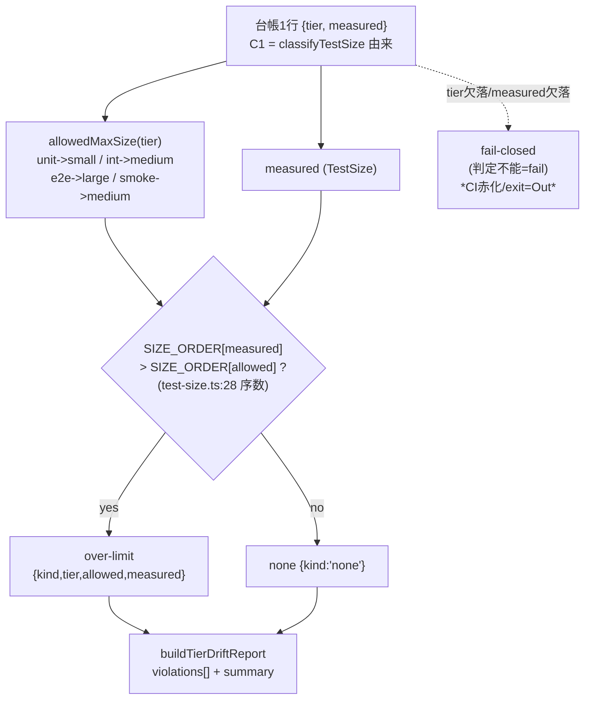

上流入力(consumes 全数): unit-of-work.md, unit-of-work-story-map.md, requirements.md, components.md, component-methods.md, services.md

本ユニット U2 のユーザー価値は「層責務の規約を確立する — どの tier がどの size まで許容かを定め、逸脱を tier-aware に検出する設計を持つ」(unit-of-work-story-map.md の U2 段)。

# 業務ロジックモデル — U2 層責務仕様 + tier-aware ドリフトゲート設計

本書は U2(C2 層責務仕様 + C3 tier-aware ドリフトゲート、FR-2/FR-3/FR-5)の **判定ロジックのフロー** を設計として記す。C2/C3 の公開 IF は component-methods.md(`allowedMaxSize` / `detectTierSizeViolation` / `buildTierDriftReport`)で、責務境界は components.md(C2「size 上限規約」・C3「非破壊追加」)、処理オーケストレーションは services.md(S2 ドリフト検査サービス)で確定済み。本書はそれらを突き合わせて判定フローに落とす。

**tier-aware ドリフトゲートの実装・CI ジョブ配線・落ちる実証・exit code 契約はすべて別 intent(Out)**(unit-of-work.md:113-116、C3 responsibility components.md、FR-3 AC-3b requirements.md)。本 intent は **判定 IF の設計とロジックフローまで**。既存 size ドリフトゲート(`declared < measured`)は **非破壊温存**(ADR-05、触らない)。#1157 未接触。

すべての実測値は tier 開放スイープの measurement ref `3917a283a953165866170d235d3dc25ad2fd3643`(tests/ 全域再帰 442ファイル、E-TPR-NR1。RE diff-base は `d151561d8d9b7a01fa4f16d47da5434486a2e9e2`)からの転記。台帳は measurement ref を保持する(measurement-ref-in-artifacts)。

## 判定ロジックフロー(tier×measured → violation)

判定は **U1 台帳(= `classifyTestSize` 由来の measured)を突き合わせるだけ** で、独自の size 判定を持たない(unit-of-work.md:99-101、ADR-04)。判定単位は台帳1行 `{ tier, measured }`(component-methods.md C3 入力、C1 由来)。

各行につき次の一方向フローで violation を導出する。既存 `detectWallClockDrift`(`tests/lib/test-size.ts:113-121`、verbatim: `if (SIZE_ORDER[dynamicFloor] > SIZE_ORDER[effectiveDeclared]) {`)と **同型の序数比較** を踏襲し、新規判定機構を発明しない(unit-of-work.md reuse inventory、components.md C3)。

1. **tier 上限取得**: 行の `tier` が 4 named tier のときのみ `allowedMaxSize(tier)` を引く(C2、component-methods.md)。写像は `unit → small` / `integration → medium` / `e2e → large` / `smoke → medium`(business-rules.md R1、E-TPR-AD Q2=B)。規約対象の `NamedTier` は閉じた判別ユニオンで網羅(component-methods.md)。**harness/lib 等の補助 tier は規約対象外**でゲート入力に含めず、常に violation なし扱い(E-TPR-NR1)。
2. **序数比較**: `SIZE_ORDER[measured] > SIZE_ORDER[allowedMaxSize(tier)]` を評価する。`SIZE_ORDER`(`tests/lib/test-size.ts:28`、verbatim: `export const SIZE_ORDER: Record<TestSize, number> = { small: 0, medium: 1, large: 2 };`)を再利用し、序数を再定義しない。
3. **violation 構成(`detectTierSizeViolation`)**: 序数超過なら `{ kind: "over-limit"; tier; allowed; measured }`、そうでなければ `{ kind: "none" }` を返す。スマートコンストラクタ経由でのみ構成し、「上限超過でないのに violation」を表現不能にする(既存 `WallClockDrift`(`tests/lib/test-size.ts:106-108`)と同型 — 不変条件を型で運ぶ)。
4. **台帳全体の集計(`buildTierDriftReport`)**: 全行に (1)〜(3) を適用し `over-limit` のみ抽出、`{ violations, summary: { total, violationCount } }` を組む(component-methods.md C3、`SizeLedger` 入力)。集計は First-Class Collection としてレポート型内に閉じる(既存 `buildTestSizeReport`(`tests/lib/test-size.ts:175-183`)と同型)。

### Mermaid フロー

テキスト fallback(Mermaid 非対応環境向け): 台帳1行 `{tier, measured}` を入力 → `tier` から `allowedMaxSize(tier)` で上限を引く(unit→small / integration→medium / e2e→large / smoke→medium)→ `SIZE_ORDER[measured] > SIZE_ORDER[allowed]` を序数比較 → 真なら `over-limit`(tier/allowed/measured を保持)、偽なら `none` → 全行を集計して `buildTierDriftReport`(violations + summary)を得る。tier/measured が欠落し判定不能なら fail-closed(ただし実 CI 赤化・exit code は移設 intent)。

## RE 台帳への適用結果(実測転記 — 判定 IF の妥当性確認)

判定 IF を RE 台帳(business-rules.md U1 マトリクス、measurement ref `3917a283a953165866170d235d3dc25ad2fd3643`、tests/ 全域再帰442)の **4 named tier 行** へ適用した **想定 violation 分布**(ハードコードでなく上記フローと実測マトリクスからの機械導出。harness/lib 等の補助 tier は規約対象外でゲートに含めない):

| tier | allowedMaxSize | over-limit となる measured | 実測件数 |
| --- | --- | --- | --- |
| unit | small | medium(162) + large(1) | **163** |
| integration | medium | large(0) | 0 |
| e2e | large | (なし) | 0 |
| smoke | medium | large(0) | 0 |
| **計** | — | — | **163** |

`violationCount = 163`(全件 unit tier)。この 163 は AC-4a の「unit 非 small 163件」(requirements.md、scan-notes:39)と exact 一致し、判定 IF が既存 RE 所見を再現することを示す。これらの是正(移設)は **別 intent**(FR-4 AC-4b、U3 選定台帳が母集団)。本 U2 は判定 IF の設計とこの適用確認まで。

## 既存ゲートとの直交(非破壊温存の設計論拠)

tier-aware ゲートは既存 size ドリフトゲートと **直交する別観点** であり、置換でも二重実装でもない(components.md C3、ADR-05、Forbidden P5「要求にない互換レイヤー/二重実装禁止」):

- **既存(declared-vs-measured、縦の整合)**: ファイルの `// size:` 宣言が measured を下回る「宣言詐称」を `detectWallClockDrift` 同系の既存ゲート(`tests/unit/t-test-size-drift.test.ts`)で検出。RE 実測で現状ドリフト **0件**(scan-notes、既存グリーン)。**本 intent は触らない**。
- **新設(tier-vs-measured、横の整合、設計のみ)**: tier が許す上限を measured が超える「配置違反」を `detectTierSizeViolation` で検出。RE 実測で 163件(上表)。**判定 IF 設計のみ**。

両者は入力軸が異なる(前者 = declared×measured、後者 = tier×measured)ため同一関数へ統合せず、`detectTierSizeViolation` を **別関数として追加** する。既存関数のシグネチャ・挙動は不変(component-methods.md「`detectWallClockDrift` には触れない」)。

## fail-closed 方針(設計レベル)

判定不能・入力欠落(tier 導出不能・measured 欠落)は **fail 扱い** とする(services.md S2「fail-closed 契約」)。方針テンプレートは `coverage-project-gate.ts` の 5値 `FailReason`(`DROP_EXCEEDED|MISSING_CURRENT|MISSING_BASELINE|MALFORMED|EMPTY_POPULATION`、`tests/coverage-project-gate.ts:64-77`、architecture.md:82「fail-closed 5値 FailReason」)に倣う — 上から順に fail を返し、ファイル欠落・不正はすべて fail。ただし **実際の CI 赤化・exit code・FailReason enum の materialize は移設 intent**(本 intent は方針参照まで、component-methods.md C3、FR-3 AC-3b)。

## 実装スコープ境界(Out 明記)

- tier-aware ドリフトゲートの **実装・CI ジョブ配線・落ちる実証・exit code 契約は移設 intent**(FR-3 AC-3b、OQ-2、unit-of-work.md:113-114)。本書は判定ロジックフローの設計まで。
- 既存 size ドリフトゲート(`declared < measured`)は **非破壊温存**(改変・置換・シム追加をしない、ADR-05、unit-of-work.md:116)。
- 比率目標(FR-2)・実行時間予算(FR-5)の **強制ゲート化は Out**(ADR-02)。本書は判定フロー設計に閉じ、比率/予算のガイドライン値は business-rules.md が扱う。
- コレクタ現行の `classifyTestSize` 直呼びを本判定経由へ寄せる配線(adapter/登録スロット)は着地させない(N3、unit-of-work.md、adapter 先行着地禁止)。
