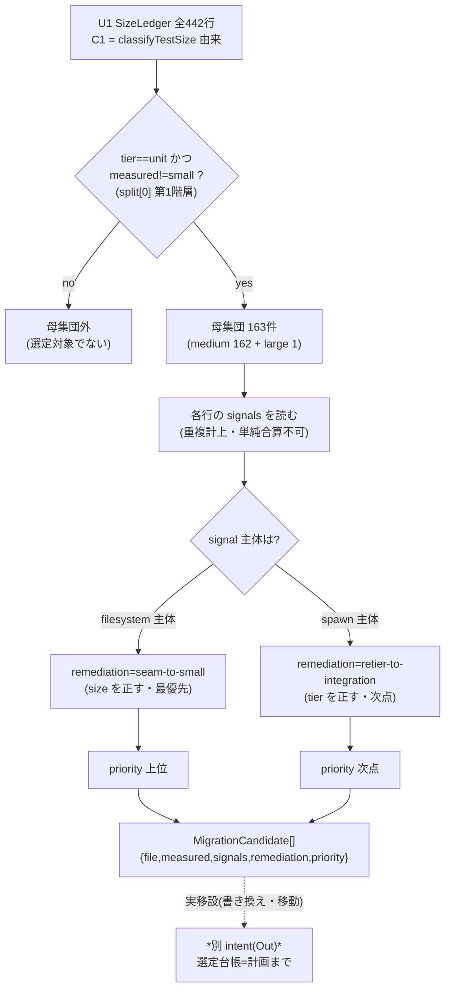
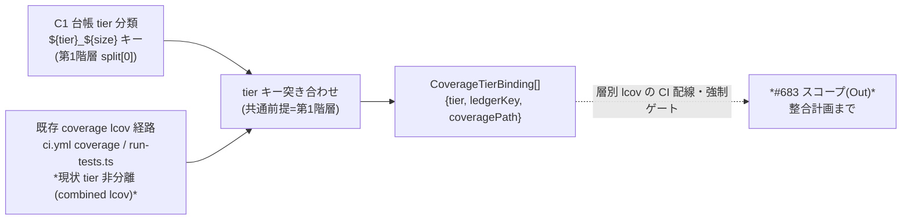

上流入力(consumes 全数): unit-of-work.md, unit-of-work-story-map.md, requirements.md, components.md, component-methods.md, services.md, scan-notes.md

本ユニット U3 のユーザー価値は「是正計画を materialize する — 何を・どの順で直すかを seam 化可能性で優先度付けし、カバレッジ経路と整合させる」(unit-of-work-story-map.md の U3 段「是正計画の materialize」)。

# 業務ロジックモデル — U3 移設選定台帳 + #683 層別カバレッジ整合計画

本書は U3(C4 移設選定台帳 + C5 #683 層別カバレッジ整合計画、FR-4/FR-6)の **選定フローと整合フロー** を設計として記す。C4/C5 の公開 IF は component-methods.md(`buildMigrationLedger` / `MigrationCandidate` / `buildCoverageIntegrationPlan` / `CoverageTierBinding`)で、責務境界は components.md(C4「seam 化可能性で優先度付け」・C5「層別カバレッジ測定経路の共有計画」)、処理オーケストレーションは services.md(S3 カバレッジ整合サービス)で確定済み。本書はそれらを突き合わせて選定・整合フローに落とす。

**実移設(テストの書き換え・移動・retier)・#683 の CI 配線・強制ゲート化はすべて別 intent(Out)**(unit-of-work.md:149-152、C4 responsibility components.md、FR-4 AC-4b requirements.md:27、FR-6 AC-6a requirements.md:38)。本 intent は **選定台帳=計画と tier キー整合計画まで**。実移設ロジックの実装・adapter/登録スロットの先行着地はしない(N3、unit-of-work.md:156)。#1157 未接触。

すべての実測値は tier 開放スイープの measurement ref `3917a283a953165866170d235d3dc25ad2fd3643`(tests/ 全域再帰 442ファイル、E-TPR-NR1、scan-notes.md:9。RE diff-base は `d151561d8d9b7a01fa4f16d47da5434486a2e9e2`)からの転記であり、独自判定・ハードコードは持たない(検証劇場 Forbidden org.md/team.md P2)。台帳は measurement ref を保持する(measurement-ref-in-artifacts)。

## 選定フロー(C4 移設選定台帳)

選定は **U1 台帳(= `classifyTestSize` 由来の SizeLedger)を母集団に取るだけ** で、独自の size 判定を持たない(unit-of-work.md:140「独自 size 判定を持たず U1 を消費」、components.md C4、ADR-04)。母集団の抽出条件・remediation 分類・優先度付けを次の一方向フローで導出する。判定は決定的関数の全数適用であり LLM fan-out ではない(team.md deterministic-function-direct-sweep、services.md S1「決定的スイープ」)。

1. **母集団抽出(unit ∧ 非 small)**: U1 SizeLedger の全 442 行(components.md C1、scan-notes.md:10)から `tier === "unit"` かつ `measured !== "small"` の行を抽出する。RE 実測でこれは **163件**(medium 162 + large 1、scan-notes.md:39「unit 211件中 163件が非 small(medium 162+large 1)」、components.md C4。harness/lib は unit tier でないため母集団に含まれず 163 は不変)。tier 導出はディレクトリ第1階層の既存前提(`scripts/metrics-snapshot.ts:100`、verbatim: `const tier = relative(join(env.repoRoot, "tests"), file).split(/[\\/]/)[0];`)を踏襲し、新アノテーション契約を足さない(components.md C4、E-TPR-AD Q3=A)。
2. **signal 内訳判定**: 各行の `signals`(`classifyTestSize` が返す `SizeClassification.signals`、`tests/lib/test-size.ts:61` verbatim: `return { size, signals };`)を読む。`classifyTestSize` は複数 signal を配列で返すため 1ファイルが FS と spawn を同時検出しうる(component-methods.md C4「signal 内訳は重複計上のため単純合算不可」、`test-size.ts:55-60` の for ループが各 signal を `signals.push(name)`)。母数は非 small ファイル数 163、signal 内訳は出現数(ファイル数ではない、business-rules.md R3)。
3. **remediation 分類(2区分)**: signal の **主体** で是正方向を分類する(components.md C4「優先度付けの設計(2区分)」、unit-of-work.md:121-125):
   - **filesystem 主体 → `seam-to-small`**: `readFileSync` 等の fixture I/O を関数直接呼び出し(in-process seam)へ置換して **size を正す**。最優先(既存 seam-export 系ノルム適用先、team.md seam-export-handler-amend / measure-before-blindspot-branch、components.md C4)。
   - **spawn 主体 → `retier-to-integration`**: CLI/hook を子プロセス起動して検証する本質的 medium は size ではなく **tier を正す**(integration へ移設)。次点(components.md C4、unit-of-work.md:124)。
4. **priority 付け(seam 化容易性)**: `seam-to-small`(size を直接正せる = 効果対費用が高い)を上位、`retier-to-integration`(配置移動)を次点とする(components.md C4「seam 化可能性が高いほど上位」、business-rules.md R4)。priority は seam 化可能性の順序であり、実移設の着手順を移設 intent へ渡す(FR-4 AC-4a)。
5. **選定台帳の出力**: `MigrationCandidate[]`(`{ file, measured, signals, remediation, priority }`、component-methods.md C4、domain-entities.md D1)を組む。**実移設はここに含めない**(選定台帳=計画まで、FR-4 AC-4b、unit-of-work.md:151)。

### Mermaid フロー(選定)

テキスト fallback(Mermaid 非対応環境向け): U1 SizeLedger 全 442 行を入力 → `tier==unit ∧ measured!=small`(tier はディレクトリ第1階層)で母集団 163件(medium 162 + large 1)を抽出 → 各行の signals を読む(重複計上・単純合算不可)→ signal 主体が filesystem なら `seam-to-small`(size を正す・最優先)、spawn なら `retier-to-integration`(tier を正す・次点)→ seam 化容易性で priority 付け → `MigrationCandidate[]` を出力。実移設(書き換え・移動・retier)は別 intent(Out)。

## #683 整合フロー(C5 層別カバレッジ整合計画)

C5 は C1 台帳の tier 分類(ディレクトリ第1階層)と既存 coverage lcov 経路の tier キーを **突き合わせる整合計画** を出力する(components.md C5、services.md S3、FR-6 AC-6a)。**CI 配線・強制ゲート化は #683 スコープ(Out)**(unit-of-work.md:152、components.md C5「実装(層別カバレッジの CI 配線)は #683 側スコープ」)。整合フローは次の一方向:

1. **C1 台帳側 tier キーの確定**: SizeLedger のマトリクスキー `${tier}_${size}`(component-methods.md C1、`scripts/metrics-snapshot.ts:102` verbatim: `values[`${tier}_${size}`] = (values[`${tier}_${size}`] ?? 0) + 1;`)の tier 部分がディレクトリ第1階層由来であることを整合の共通前提とする(components.md C5「C1 台帳の tier 分類と同じ tier 導出(ディレクトリ第1階層)」)。
2. **既存 coverage 経路の現状把握**: 既存 lcov 経路(`ci.yml` の `coverage` ジョブ、`tests/run-tests.ts` の lcov 生成、component-inventory.md:150,153)は現状 **tier 非分離** である — `combineCoverageReports`(`tests/run-tests.ts:619-635`、verbatim: `const combined = join(coverageRoot, "lcov.info");`)が全 tier の per-file lcov を単一 `lcov.info` へ結合しており、tier キーを持たない。この現状を整合計画の出発点として明記する(services.md S3、business-rules.md R5)。
3. **tier キー整合の計画化**: #683 の層別カバレッジは、C1 台帳と同じディレクトリ第1階層の tier 導出でカバレッジ経路を tier 別に束ねる `CoverageTierBinding`(`{ tier, ledgerKey, coveragePath }`、component-methods.md C5、domain-entities.md D3)を tier ごとに1つ計画する。`ledgerKey` は C1 側 `${tier}_${size}` キー、`coveragePath` は **tier からの純命名規約で導出する計画上のパス**(既存経路の読取ではない — `buildCoverageIntegrationPlan` は `ledger` のみの純関数、component-methods.md:134)。現状 tier 非分離のため既存 per-tier パスは無く、#683 が層別 lcov を出力すべき整合先を計画値として記す(components.md C5)。**この計画は「どの tier キーで両者を突き合わせるか」の記述までであり、CI 実装(層別 lcov 生成の配線)は #683 スコープ**(components.md C5、unit-of-work.md:152)。

### Mermaid フロー(#683 整合)

テキスト fallback: C1 台帳の tier 分類(`${tier}_${size}` キー、ディレクトリ第1階層 split[0])と既存 coverage lcov 経路(`ci.yml` coverage ジョブ・`run-tests.ts`、現状は tier 非分離の combined lcov)を、共通前提のディレクトリ第1階層で突き合わせて `CoverageTierBinding[]`(`{ tier, ledgerKey, coveragePath }`)を計画する。層別 lcov の CI 配線・強制ゲート化は #683 スコープ(Out)。

## RE 台帳への適用結果(実測転記 — 選定 IF の妥当性確認)

選定 IF を RE 台帳(measurement ref `3917a283a953165866170d235d3dc25ad2fd3643`、tests/ 全域再帰442)へ適用した母集団と signal 内訳(ハードコードでなく上記フローと scan-notes.md:39-40 実測からの転記):

| 項目 | 実測値 | 出典 |
| --- | --- | --- |
| 母集団(unit ∧ 非 small) | **163件**(medium 162 + large 1) | scan-notes.md:34 |
| filesystem signal 出現数 | **153** | scan-notes.md:40 |
| spawn signal 出現数 | **99** | scan-notes.md:40 |
| network signal 出現数 | **1** | scan-notes.md:40 |
| timer signal 出現数 | **1** | scan-notes.md:40 |

**単純合算不可の確認**: `153 + 99 + 1 + 1 = 254 ≠ 163`。これは 1ファイルが複数 signal を持つ重複計上によるもので、母数(ファイル数 163)と signal 出現数(254)は別軸である(business-rules.md R3、unit-of-work.md:126-128)。この 163 は AC-4a の「unit 非 small 163件」(requirements.md:26)と exact 一致し、選定 IF が既存 RE 所見の母集団を再現することを示す。これらの是正(移設)は **別 intent**(FR-4 AC-4b、requirements.md:27)であり、本 U3 は選定台帳=計画とこの適用確認まで。

## 実装スコープ境界(Out 明記)

- **実移設(テストの書き換え・移動・retier)は本 intent Out**(FR-4 AC-4b、requirements.md:27、unit-of-work.md:151)。本書は選定フローの設計と母集団適用確認まで。選定台帳=計画。
- **#683 層別カバレッジの CI 配線・層別 lcov 生成・強制ゲート化は #683 スコープ(Out)**(FR-6 AC-6a、components.md C5、unit-of-work.md:152)。本書は tier キー整合計画のフローまで。
- size 判定は `classifyTestSize` に閉じ、選定台帳は独自 size 判定を持たない(ADR-04、unit-of-work.md:140)。母集団は U1 台帳からの機械抽出。
- 後方互換レイヤー・フォールバック分岐・移行シム・二重実装を追加しない(Forbidden org.md/team.md P5、inception.md)。adapter/登録スロット(移設ロジック・層別 lcov 配線)の先行着地はしない(N3、unit-of-work.md:156)。規模記述は行数見積り(#1158 N1/N2、unit-of-work.md:17「約280〜320行」)。
