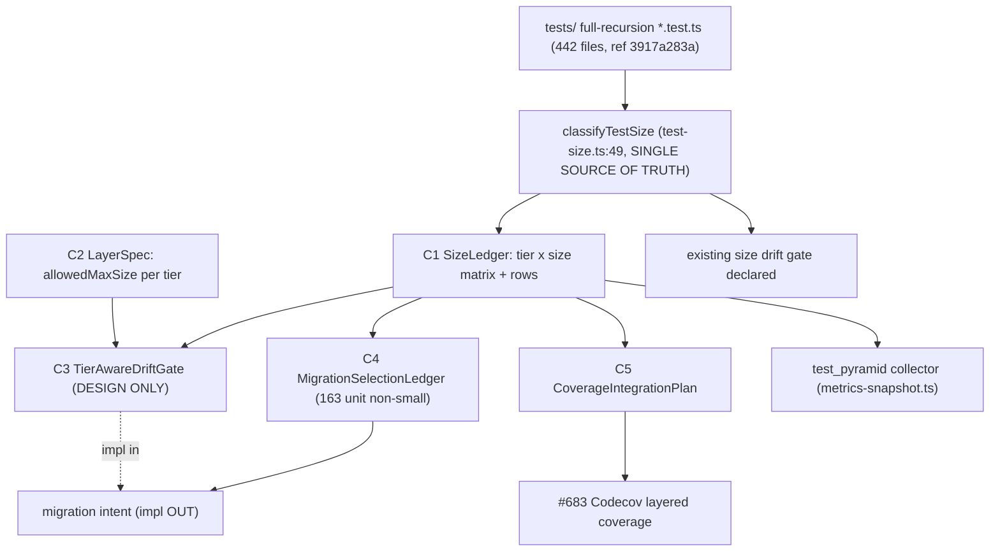

上流入力(consumes 全数): requirements.md, architecture.md, component-inventory.md, team-practices.md

# コンポーネント依存設計 — test-pyramid-rebuild(#684)

## 依存マトリクス

「→」= 行が列に依存する(データ・型・判定を得る)。すべての size 値の根源は `classifyTestSize`(唯一真実源、ADR-04)。

| 依存元 ＼ 依存先 | classifyTestSize(既存) | C1 SizeLedger | C2 LayerSpec | C3 TierGate(設計) | C4 MigrationLedger | C5 CoveragePlan |
| --- | --- | --- | --- | --- | --- | --- |
| **C1 SizeLedger** | ● 直呼び | — | — | — | — | — |
| **C2 LayerSpec** | ○ SIZE_ORDER 型のみ | — | — | — | — | — |
| **C3 TierGate(設計)** | ○ 型のみ | ● 行入力 | ● allowedMaxSize | — | — | — |
| **C4 MigrationLedger** | — | ● 行入力 | ○ 判定参考 | — | — | — |
| **C5 CoveragePlan** | — | ● tier 分類 | — | — | — | — |

- ● = 実データ/判定依存、○ = 型/参照のみ
- **循環依存なし**(package-design 原則、construction.md)。依存は C1 を根として一方向(C1 → C3/C4/C5、C2 → C3)
- `classifyTestSize` は既存・不変(RE observed `d151561d8d9b7a01fa4f16d47da5434486a2e9e2`)。全コンポーネントの size 判定はこの1点に集約

## 外部消費者(本 intent の成果物を使う側)

| 消費者 | 依存先コンポーネント | 関係 | スコープ |
| --- | --- | --- | --- |
| `test_pyramid` コレクタ(`scripts/metrics-snapshot.ts:97-104`) | C1 SizeLedger | `${tier}_${size}` キー整合 | 既存・整合維持 |
| 移設 intent(別 intent) | C4 MigrationLedger、C1 | 選定台帳を移設計画の母集団に | 別 intent(実移設) |
| #683 Codecov ゲート | C5 CoveragePlan、C1 | 層別カバレッジ tier キー整合 | #683 スコープ(CI 配線) |
| 移設 intent の CI | C3 TierGate | tier-aware ゲート実装の設計 | 移設 intent(実装) |

## データフロー

<!-- text fallback:
tests/ 全域再帰 442ファイル(measurement ref 3917a283a953165866170d235d3dc25ad2fd3643)のソースが classifyTestSize(test-size.ts:49、size の唯一真実源)へ入り、C1 SizeLedger(tier×size マトリクス+全行、tier は開いた集合で harness/lib 等の補助 tier を含む)が生成される。C1 は4方向へ分岐:
(1) C3 TierAwareDriftGate(設計のみ)へ行データを供給。C3 は C2 LayerSpec(allowedMaxSize)にも依存し、両者から tier 上限超過を判定する設計。C3 の実装は移設 intent。
(2) C4 MigrationSelectionLedger(unit 非 small 163件)へ。C4 は移設 intent の母集団になる(実移設は Out)。
(3) C5 CoverageIntegrationPlan へ。C5 は #683 Codecov 層別カバレッジと tier キーを整合(CI 配線は #683)。
(4) 既存 test_pyramid コレクタ(metrics-snapshot.ts)へ $\{tier\}_\{size\} キー整合で供給。
これと独立に、既存 size ドリフトゲート(declared<measured)は classifyTestSize から直接動き、本 intent では非破壊温存される(C3 の追加とは直交)。
循環依存なし。依存は C1 を根とする一方向。
-->

## 共有資源

| 共有資源 | 共有者 | 契約 |
| --- | --- | --- |
| `classifyTestSize`(`tests/lib/test-size.ts:49`) | C1・C2(型)・C3(型)・既存ゲート・test_pyramid コレクタ | size の唯一真実源。全消費者は計測出力を転記のみ(独自判定禁止、ADR-04) |
| `TestSize` / `SIZE_ORDER`(`:23`/`:28`) | C2・C3(序数比較) | 型・序数の共有定義。新規発明しない |
| `${tier}_${size}` キー | C1・test_pyramid コレクタ(`:102`)・C5 | メトリクス/カバレッジ整合のキー契約 |
| tier 導出(ディレクトリ第1階層) | C1・C5・既存コレクタ(`:100`) | A-2 の前提を踏襲(E-TPR-AD Q3=A、新アノテーション不追加) |

## 通信パターン

本 intent のコンポーネントはすべて **同期・純関数の直接呼び出し**(in-process)であり、async・event-driven・外部通信は存在しない(services.md の N/A 根拠)。データフローは決定的スイープの単一パスで完結する。

## 非破壊性の依存上の含意

C3(tier-aware ゲート設計)は既存 size ドリフトゲート(declared<measured)と **同じ `classifyTestSize` を根に持つが、別の判定関数**(`detectTierSizeViolation`)として追加される。既存ゲートへの依存改変・置換は発生しない(ADR-05 の非破壊温存)。これにより「要求にない二重実装/互換シム」を避けつつ(Forbidden org.md/team.md P5)、tier 観点を直交追加する。
