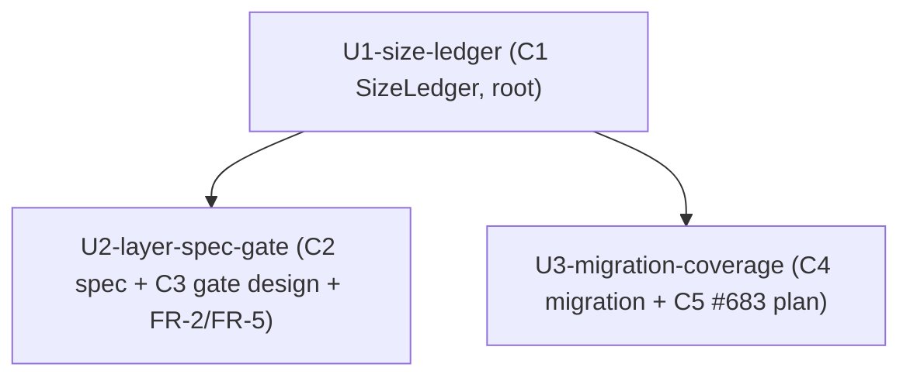

上流入力(consumes 全数): components.md, component-methods.md, services.md, component-dependency.md, decisions.md, requirements.md

# ユニット依存設計 — test-pyramid-rebuild(#684)

## 依存 edge block(parseBoltDag 用 — construction per-unit ループの起動条件)

以下の fenced YAML edge block(形式は `units` / `depends_on`)が per-unit ループの起動に必須である。これが無い / パース不能だと `runtime-graph` に `bolt_dag` が載らず `{unit-name}` directive へ degrade する(units-generation:per-unit-loop-activation、`amadeus-runtime.ts:299-313`)。

```yaml
units:
  - name: U1-size-ledger
    depends_on: []
  - name: U2-layer-spec-gate
    depends_on: [U1-size-ledger]
  - name: U3-migration-coverage
    depends_on: [U1-size-ledger]
```

## 依存関係の説明

- **U1-size-ledger は根(depends_on: [])**。C1 SizeLedger の materialize であり、`classifyTestSize`(`tests/lib/test-size.ts:49`、size 唯一真実源、ADR-04)の決定的スイープ出力を台帳データ源として成果物化する。他ユニットに依存しない。
- **U2-layer-spec-gate は U1 に依存**。層責務規約(C2 `allowedMaxSize`)・tier-aware ドリフトゲート判定 IF(C3、実装 Out)・比率/実行時間予算ガイドライン(FR-2/FR-5)は、いずれも U1 台帳の measured size を突き合わせる。tier 上限超過判定(`detectTierSizeViolation`)は台帳行の `{ tier, measured }` を入力にする(component-dependency.md:13)。
- **U3-migration-coverage は U1 に依存**。移設選定台帳(C4)は U1 台帳の unit ∧ 非 small 163件を母集団にし、#683 層別カバレッジ整合計画(C5)は U1 台帳の tier 分類を共有する(component-dependency.md:14-15)。
- **U2 と U3 は相互依存しない**。両者はともに U1 のみに依存し、construction では U1 完了後に並行実装可能(循環依存なし、component-dependency.md:18)。C4(U3)の優先度付けロジック(`buildMigrationLedger`、component-methods.md:113-118)は **remediation を signal 内訳(filesystem→seam-to-small / spawn→retier-to-integration)から導出**し、C2 の `allowedMaxSize` 値は参照しない — したがって U3→U2 の実データ依存は存在せず、DAG からの除外は正当(母集団抽出「unit ∧ 非 small」も size の序数判定=C1 台帳の measured 由来で、C2 規約値には依存しない)。component-dependency.md:14 が C4→C2 を「○ 判定参考(型/参照のみ)」に留め実データ依存(●)にしていないのはこの理由。依存 DAG 上は U1 を共通の根とする2分岐で表現する。

## 依存トポロジー(Mermaid)



<!-- text fallback:
U1-size-ledger が根。U1 から U2-layer-spec-gate へ依存辺、U1 から U3-migration-coverage へ依存辺の2分岐。
U2 と U3 の間に辺はない(相互依存なし、U1 完了後に並行可能)。循環依存なし。
size の唯一真実源 classifyTestSize は U1 台帳の生成材料であり、U2/U3 は U1 台帳経由で size を得る(独自 size 判定を持たない、ADR-04)。
-->

## 依存の根拠(唯一真実源の一方向性)

すべての size 値の根源は `classifyTestSize`(component-dependency.md:7,19)。U1 がこの決定的関数のスイープ出力を台帳化し、U2/U3 は U1 台帳を消費する。これにより size 判定経路が U1(= `classifyTestSize`)の1点に集約され、二重化しない(U1 の Q1 e4 留保、components.md:35)。依存が U1 を根とする一方向であることは、component-dependency.md の依存マトリクス(循環依存なし)と整合する。

## construction 起動前の定型確認(recompile-before-construction-bolt-dag)

units-generation approve 後・construction 進入前に `bun .claude/tools/amadeus-runtime.ts compile` を再実行し、`runtime-graph` の `bolt_dag` 非 null を確認する。上記 YAML edge block が正しくても compile 陳腐化(本成果物が compile 後生成)で per-unit ループが無音 degrade しうるため(project.md units-generation:recompile-before-construction-bolt-dag)。
