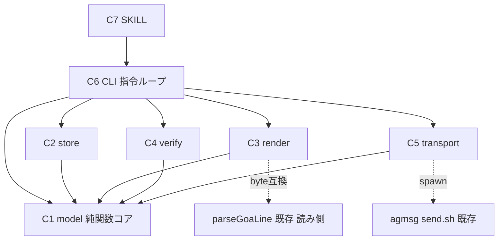

# Component Dependency — election-ts-foundation

> 上流入力(consumes 全数): requirements.md、architecture.md、component-inventory.md、team-practices.md

## 依存方向(循環なし — 内向き依存のみ)

テキスト表現: C7→C6→{C1,C2,C3,C4,C5}、C2/C3/C4/C5→C1。C1 は依存ゼロの純関数層(fs 非依存 — テストは unit 層)。C2/C5 は FS/プロセス境界を持つ(テストは integration 層 — team-practices.md live の fs-tests-integration-first)。C5→agmsg の依存境界は send.sh の spawn 実行のみとする(本設計の制約): component-inventory.md hooks/agmsg 節が実測列挙する delivery 設定系 writer(delivery.sh / hooks-json.sh — 同節「直接 writer」行)には触れない。requirements.md FR-0 の「規則正本の TS 凝集」は下記の変更理由凝集で実現し、指令ループの層構造は architecture.md:32-40 の invoke-swarm directive(swarm 実行アーキテクチャ)と同型の構造写像である — 直接の先例ではなく類推(ADR-3)。C3→parseGoaLine は実行時依存ではなく**テスト時の round-trip 検証依存**(NFR-4 — スキーマ変更を要求しない)。

## 変更理由の凝集

| 層 | 変更が起きる理由 |
|---|---|
| C1 | 選挙規則そのものの改定(GoA 集計・成立条件)— ノルム改定と1:1 |
| C2/C5 | 記録配置・輸送手段の変更(space 構造・agmsg 仕様) |
| C3/C4 | 記録様式・照合観点の変更(norm-metrics スキーマ追随) |
| C6 | プロトコル手順(状態機械)の変更 |
| C7 | ハーネス面の文言のみ |

規則の正本が C1 に凝集するため、「選挙ノルムの改定 = C1+テストの変更」に局所化される(FR-0 の構造的裏付け)。

## エラー伝播

- 全境界で判別ユニオン Result。C6 が最終的に exit code(0=成功/1=拒否・エラー)へ写像し、理由は stderr でなく指令 JSON(stdout)の error フィールドで返す(消費側 = AI が読むのは stdout)
- C5 の送信失敗は DeliveryRecord に failure として記帳(silent 失敗なし)— 未達は SV-3 の未着一覧に現れる
