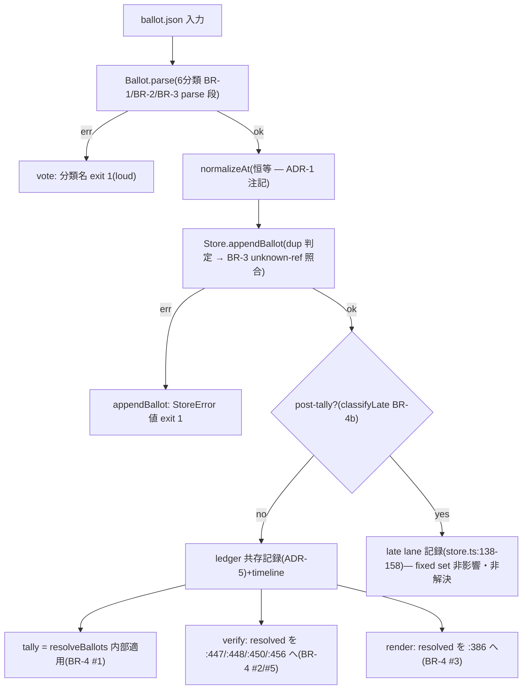

# Business Logic Model — U1 ballot-acceptance-failclosed

上流入力(consumes 全数): unit-of-work.md、unit-of-work-story-map.md、requirements.md、components.md、component-methods.md、services.md、component-dependency.md、decisions.md

## 処理フロー(受理 → 保存 → 集計)

テキストフォールバック: 入力 → parse(6分類)→ normalizeAt(恒等)→ appendBallot(dup→unknown-ref)→ post-tally なら late lane(BR-4b、fixed set 非影響・非解決)/ 通常は ledger 共存 → {tally, verify, render} は resolveBallots 済み母集団を消費(materialize のみ blind lift)。

## 関数配置(AD components.md の見積りを継承)

| 関数 | 所在 | 変更種別 |
| --- | --- | --- |
| SUBMITTED_AT_RE / isValidSubmittedAt(内部) | model.ts | 新設(module スコープ) |
| parseBallotShape | model.ts:160-178 | kind/ref 読取追加 |
| Ballot.parse | model.ts:184-204 | invalid-timestamp 分岐+AmendBallot 生成 |
| resolveBallots | model.ts(export) | 新設(純関数) |
| tally | model.ts:321 | 先頭で resolveBallots 適用 |
| appendBallot | store.ts | unknown-ref 照合(dup 判定直後) |
| handleVerify / handleRender | election.ts | resolved 導出+消費点置換(各1行+引数置換) |
