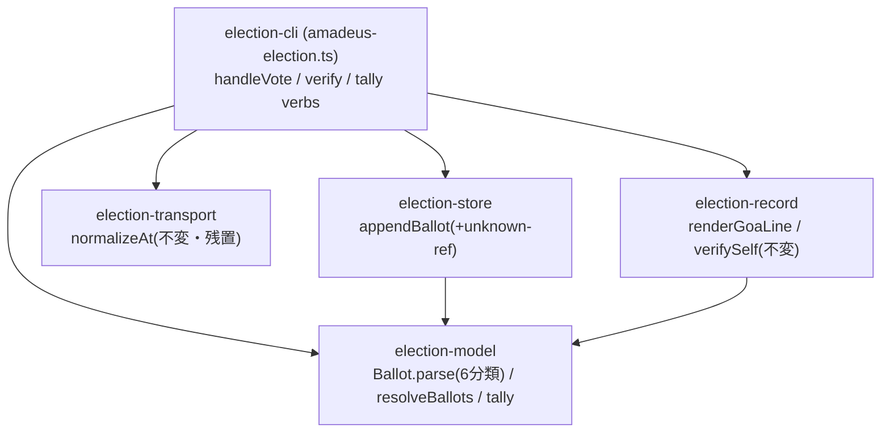

# Component Dependency — 260719-ballot-failclosed-amend

上流入力(consumes 全数): requirements.md、architecture.md、component-inventory.md、team-practices.md

## 依存図(変更後も方向不変 — 循環なし)

テキストフォールバック: CLI → {model, store, transport, record}、store → model、record → model。model は葉(他モジュールへ依存しない純関数層)。transport・record は本 intent で無変更。

## 変更が依存へ与える影響

- `resolveBallots` は model 内の新純関数で、tally が内部適用するため **tally の呼び出し元(CLI の materialize/verify 経路)はシグネチャ変更なし** — 依存辺の追加ゼロ。
- `unknown-ref` は StoreError union の値追加 — store の既存консumer(CLI の storeFail)は union を文字列表示するだけで網羅 switch を持たない(実測: storeFail は error をそのまま埋め込む)ため、破壊的変更なし。
- record(verifySelf の timeline-order / GoA 行)は無変更 — #1262(receivedAt)は本 intent スコープ外(W 系判定: 受理境界の内側でない timeline 意味論の変更)で、別 Issue の設計に委ねる。

## 並行 intent との境界

- #1261(e1): tally の outcome 導出部を変更予定 — 本 intent は tally の**入力母集団**(resolveBallots 適用)のみ触る。関数内の異なる区画だが同一関数のため textual 交差 — 直列合意(e1 先行→CG 再接地)で解消。
- #1226(e1、着地済み想定): norm-metrics 系 — 本 intent 非接触(W-3)。
