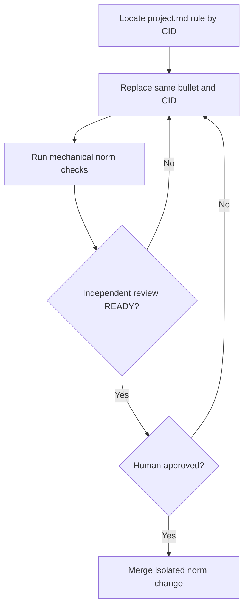

# Business Logic Model — gh-optional-runtime-norm

> 上流入力(consumes 全数): `unit-of-work.md`、`unit-of-work-story-map.md`、`requirements.md`、`components.md`、`component-methods.md`、`services.md`

## Norm Change Target

- 対象ファイル: `amadeus/spaces/default/memory/project.md`
- 対象CID: `practices-discovery:gh-scripts-boundary`
- 既存clause: 「gh CLI への依存は scripts/ 配下の repo ローカル開発支援ツールに限定して許容する」
- 変更位置: 上記CIDを持つ既存bulletを同じ位置・同じCIDのまま置換する。重複規則は追加しない。

置換後のcanonical clause:

> gh CLI は repo-local scripts に加え、mirror capability の配布framework runtimeでも optional dependencyとして許容する。利用前にrunnable/auth readinessを検査し、不在・未認証・API/rate-limit/command faultは当該mirror invocationをexit 1でloud failする。phase boundary経由の呼出しではretry/skipの選択肢を残し、workflow全体を恒久停止しない。credentialはghのcredential storeへ委譲し、tokenを保持・出力しない。起動はargument arrayのみとし、create/closeの人間承認境界は維持する。

## Ownership Boundary

U1は上記project normの改定、review、承認、merge evidenceだけを所有し、application codeを変更しない。U2はreadiness検査、argument-array subprocess、fault正規化を実装する。U4はcoordinatorでfaultを伝播・回復する。U6はphase boundaryにおけるretry/skipの提示とroute制御を実装する。

## Norm Authoring Flow

テキスト代替: CIDで既存規則を一意に特定して同位置で置換し、機械検証、独立review、人間承認を経て独立したnorm変更としてmergeする。

## Norm Change Workflow

1. `project.md`のCID `practices-discovery:gh-scripts-boundary`が1件だけ存在することを確認する。
2. 同じbulletとCIDをcanonical clauseへ置換する。
3. application codeを含まない独立norm変更として機械検証と独立reviewを行う。
4. 人間承認をaudit evidenceで確認してからmergeする。
5. merge evidenceが得られるまでU1および依存Unitをrelease-readyと判定しない。

## Failure and Recovery

- `gh`不在・未認証・API/rate-limit/command fault: direct CLI invocationは原因とremediationを出してexit 1にするという規範を定める。実装はU2/U4が担う。
- phase boundary: U6がretry/skipを提示し、workflow全体を恒久停止させない。direct CLIへ常時continue optionを要求しない。
- credential露出またはshell string実行: policy violation。実装を拒否し、norm例外では救済しない。
- norm PR未承認: U1未完了。後続調査は可能だが配布/merge gateを通さない。

## Verification Scenarios

| Scenario | Expected |
|---|---|
| CID count | `practices-discovery:gh-scripts-boundary`が1件 |
| legacy restriction | `scripts/ 配下の repo ローカル開発支援ツールに限定`が0件 |
| canonical clause | CID対象bulletをMarkdown marker/CIDを除いて空白正規化し、上記canonical clauseと全文一致 |
| isolated diff | application code変更0件 |
| norm未merge | U1 completion不可 |

## Review — Iteration 1

- **Verdict:** NOT-READY
- **Reviewer:** amadeus-architecture-reviewer-agent
- **Date:** 2026-07-23T10:53:49Z
- **Iteration:** 1
- **Scope decision:** none

規範変更の対象、canonical clause、実行fault、Unit責務境界、機械検証可能な受入条件、lifecycle evidenceが不足しているためNOT-READY。

### Findings

- HIGH: exact existing norm target not identified (rule id/path/literal clause/insertion position).
- HIGH: canonical new norm clause not fixed; BR list alone insufficient.
- HIGH: API/rate execution fault missing in CapabilityReadiness; only ready/unavailable/unauthenticated.
- HIGH: U1 norm vs U2/U4 runtime responsibilities blurry; U1 owns no app code but BR and flow look like runtime algorithm.
- MEDIUM: workflow_blocked=false / retry/skip too broad; direct CLI exit 1 vs U6 routing.
- MEDIUM: Acceptance rules not mechanically checkable.
- MEDIUM: NormChange lifecycle evidence mapping undefined.

## Review — Iteration 2

- **Verdict:** NOT-READY
- **Reviewer:** amadeus-architecture-reviewer-agent
- **Date:** 2026-07-23T10:56:32Z
- **Iteration:** 2
- **Scope decision:** none

前回の主要指摘は概ね解消したが、direct CLI継続契約、credential owner、canonical全文検証、readinessとexecution outcomeの型境界に残余不整合がある。

### Findings

- HIGH: direct CLI failure時のworkflow contractがDecision Tableのcontinue optionありと矛盾する。
- HIGH: canonical clauseのgh keyringが上流のgh credential storeより実装方式を狭めている。
- MEDIUM: AR-U1-03はキーワード包含だけでcanonical clauseとの完全一致を検証しない。
- MEDIUM: CapabilityReadiness.execution-failedはreadiness後のexecution outcomeであり評価時点が曖昧。

## Reviewer Exhaustion 後の是正

Iteration 2の上限到達後、残余4件を是正した。Decision Tableはdirect CLIとphase boundaryをcontext別に分離し、credential表現を上流どおり`ghのcredential store`へ統一した。Acceptance Ruleはキーワード包含から正規化済み全文一致へ強化し、readinessとcommand execution outcomeを別value objectへ分割した。reviewer iterationは上限到達のため再実行せず、上記Review projectionを監査証跡として保持する。
