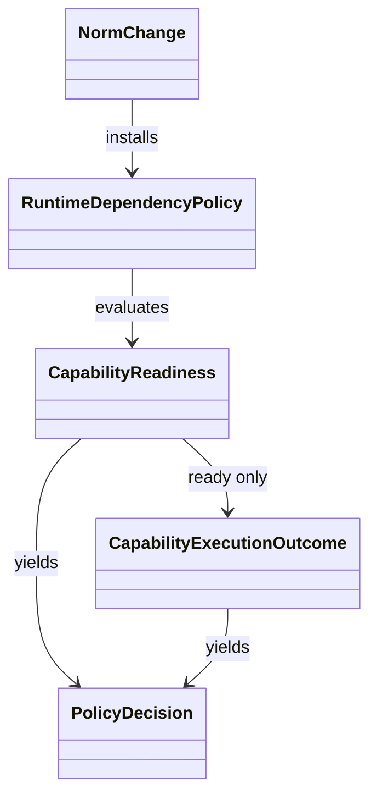

# Domain Entities — gh-optional-runtime-norm

> 上流入力(consumes 全数): `unit-of-work.md`、`unit-of-work-story-map.md`、`requirements.md`、`components.md`、`component-methods.md`、`services.md`

## Policy Value Objects

### RuntimeDependencyPolicy

| Field | Type | Constraint |
|---|---|---|
| capability | `"mirror"` | 他capabilityへ拡張しない |
| dependency | `"gh"` | executable name固定 |
| requiredAtInstall | `false` | optional runtime |
| failureScope | `"capability"` | workflow全体ではない |
| credentialOwner | `"gh-credential-store"` | Amadeus非所有、保存方式はghへ委譲 |
| invocation | `"argument-array"` | shell string禁止 |

### CapabilityReadiness

```text
CapabilityReadiness =
  | ready
  | unavailable(reason, remediation)
  | unauthenticated(reason, remediation)
```

### CapabilityExecutionOutcome

```text
CapabilityExecutionOutcome =
  | succeeded
  | execution-failed(category, reason, remediation)
```

`execution-failed.category`は`api | rate-limit | command`のいずれかである。readinessが`ready`の場合だけcommand executionへ進み、その結果を`CapabilityExecutionOutcome`で表す。両型の`reason`と`remediation`はsecret-freeな固定category/説明で、raw credentialやenvironmentを持たない。runtime実装はU2/U4が所有し、U1は規範契約だけを定義する。

### PolicyDecision

```text
PolicyDecision =
  | allowed(policyId)
  | capability-unavailable(policyId, readiness)
  | forbidden(policyId, violation)
```

## Norm Change Entity

| Field | Meaning |
|---|---|
| policyId | `gh-optional-runtime-mirror` |
| previousRuleRefs | `project.md#cid:practices-discovery:gh-scripts-boundary` |
| proposedRuleRefs | 同じCIDで置換するcanonical clause、BR-U1-01〜15 |
| scope | mirror capability only |
| reviewState | draft / independently-reviewed / user-approved / merged |
| evidence | readiness/failure/isolation scenarios |

Lifecycleは`draft → independently-reviewed → user-approved → merged`の一方向である。review rejectionはdraftへ戻し、user-approvedなしでmergedへ遷移してはならない。

| State | Required evidence |
|---|---|
| draft | `project.md`の対象CIDだけを置換したworking diffとAR-U1-01〜05の結果 |
| independently-reviewed | reviewer invocation ID、`READY` verdict、review projection |
| user-approved | 対象diffに対する`HUMAN_TURN`または承認gateのaudit event |
| merged | 独立norm変更のmerge commitまたはmerged PR state |

## Relationships



テキスト代替: NormChangeがRuntimeDependencyPolicyを規則へ導入し、policyがCapabilityReadinessを評価してPolicyDecisionを返す。

## Invariants

- policy IDとcapability/dependencyの組合せは一意。
- unavailable/unauthenticated decisionとexecution-failed outcomeは必ずloud reasonとremediationを持つ。
- allowed decisionはreadiness=readyの場合だけ成立する。
- NormChangeがmergedでなければpolicyはrelease gateの根拠にならない。
- すべてのentity/value objectはdocumentation contractであり、runtime databaseや永続serviceを新設しない。
