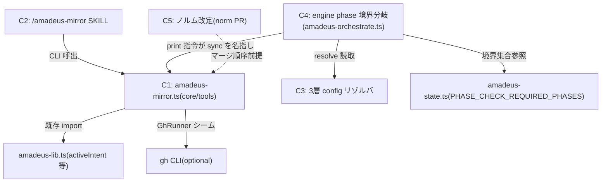

# Component Dependency — 260719-mirror-productization

上流入力(consumes 全数): requirements.md、architecture.md、component-inventory.md、team-practices.md

## 依存図(Mermaid)

テキストフォールバック: C2→C1(CLI 呼出)/ C4→C3(resolve 読取)/ C4→C1(sync print)/ C1→amadeus-lib(既存 import)/ C4→amadeus-state(境界集合参照)/ C1→gh(GhRunner シーム、optional)/ C5⇢C1(norm PR 先行のマージ順序制約 — コード依存ではない)。

## 循環なしの確認

C1→C3・C3→C1・C3→C4 の依存は存在しない(C3 は葉モジュール)。C1 は C4 を知らない(engine が一方的に CLI を名指す)。循環 0。

## Bolt 対応(D-08)

- Bolt 1(縦スライス・単独ゲート): C1+C2(+C5 は norm PR としてマージ順序先行)
- Bolt 2+: C3 → C4(C4 は C3 に依存するため順序固定)
