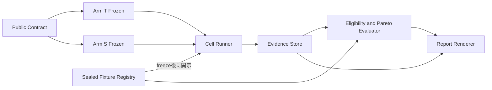

# Component Dependency — 形式検証対照実験

## 上流入力

依存方向は `requirements.md` のblind / deterministic / fail-closed要件、`architecture.md` のmodule境界、`component-inventory.md` の既存model-store-CLI分離、`team-practices.md` のtest-first / repo-local規律に基づく。循環依存、arm間依存、配布framework依存を禁止する。

## Dependency matrix

`→` はrow componentがcolumn componentを使用することを表す。

| From / To | Contract | Coordinator | Registry | Arm T | Arm S | Runner | Evidence | Evaluator | Reporter | TLC Toolchain |
| --- | --- | --- | --- | --- | --- | --- | --- | --- | --- | --- |
| Contract | — |  |  |  |  |  |  |  |  |  |
| Coordinator | → | — | → |  |  | → | → | → | → | → |
| Registry | → |  | — |  |  |  |  |  |  |  |
| Arm T | → |  |  | — |  |  |  |  |  | → |
| Arm S | → |  |  |  | — |  |  |  |  |  |
| Runner | → |  |  | → | → | — | → |  |  |  |
| Evidence | → |  |  |  |  |  | — |  |  |  |
| Evaluator | → |  | → |  |  |  | → | — |  |  |
| Reporter | → |  | → |  |  |  | → | → | — |  |
| TLC Toolchain | → |  |  |  |  |  |  |  |  | — |

Arm TとArm Sは互いへ依存しない。Evaluatorはarm implementationをimportせず、共通`CellResult`とcost evidenceだけを読む。Reporterは採否ruleを持たずEvaluator出力を表示する。

## Data flow

text fallback: 公開contractから独立に2armをfreezeし、その後sealed fixtureをRunnerへ開示する。Runnerのraw結果をEvidence Storeへ保存し、Evaluatorが適格性とParetoを決定し、Reporterがevidence link付きで表示する。

## Control flow / failure propagation

1. Coordinatorがpublic input hashを検証できなければ開始しない。
2. いずれかのarm freezeが不正なら、そのarmへfixtureを開示しない。
3. Toolchain、adapter、timeout、schemaのfailureはRunnerが`HARNESS_ERROR` cellとして保存する。
4. Matrix missing / duplicateはEvaluatorが全体をfail-closedにし、FinalDecisionを生成しない。
5. 完全matrixではarmごとにhard eligibilityを判定し、適格armだけを3軸Paretoへ送る。
6. Reporterのtrace link検証が失敗すればreport commandはnon-zeroで終了する。

walking-skeletonはArm T × #1252だけをこのflowで先行し、成功までArm S authoringと他fixtureのfan-outを開始しない。成功後、Arm SはArm T branchを含まない健全baselineからfreezeし、両freeze後にmanifestを昇格する。Arm Sのauthoring inputはskeleton evidenceから隔離する。

## Shared resources and isolation

| Resource | Shared? | Isolation rule |
| --- | --- | --- |
| Public contract / result schema | yes | 両armへbyte-identical hashを配る |
| Healthy baseline SHA | yes | read-only、同じSHA |
| Runner class / benchmark config | yes | 1 warmup + 5 runs、120秒、serial |
| Sealed defect registry | no before freeze | Coordinatorだけが読む |
| Arm implementation | no | separate author / worktree / freeze SHA |
| TLC jar cache | Arm T only | checksum verified、LOCから除外し依存として記録 |
| Evidence record | append-only shared sink | armから直接書込み不可 |
| Shared harness LOC | yes | `SHARED_LOC`へ別掲、armへ按分しない |

## Construction dependency order

Contract → Coordinator / Registry / Evidence / Toolchain → Arm T authoring freeze → walking-skeleton reveal / Runner → Arm S authoring freeze → manifest promotion / remaining full suites → Evaluator → ReporterのDAGとする。Coordinatorはcomposition rootとしてToolchain、Runner、Evidence、Evaluator、Reporterを呼ぶが、いずれもCoordinatorへ逆依存しないため循環はない。Units Generationはこのarchitecture dependencyだけを正本としてunitへ切り、delivery順の経済判断はDelivery Planningへ委ねる。
