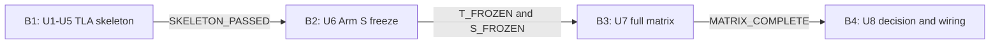

# Risk and Sequencing Rationale — 形式検証対照実験

## 上流入力と選択heuristic

本判断は `requirements.md`、`components.md`、`unit-of-work.md`、`unit-of-work-dependency.md`、`unit-of-work-story-map.md`、`team-practices.md`を入力とする。E-FVERA3R / E-FVEADS13R / E-FVEUG2 / E-FVEDP1に従い、hard risk-firstとwalking-skeleton-firstを組み合わせる。数値WSJFは使わない。

価値、時刻緊急性、risk reduction、LOCは単位が異なり、本実験ではblind freeze順序がhard constraintである。加重scoreでB2をB1より先にする、またはB3を両freeze前に始めることは許さない。DAG上の同格候補では小さいbatchとrisk reductionを優先するが、閉じた数値scoreは捏造しない。

## 4 Boltsを選ぶ理由

- B1は最も高い不確実性であるTLC acquisition、有限探索、sealed reveal、evidence保存を#1252でend-to-end実証する。
- B2を独立させることでArm S freezeとblindnessの失敗を、full-matrix integration失敗から分離できる。
- B3を独立させることでmatrix completeness / benchmark noiseを、採否ロジックから分離できる。
- B4を独立させることでhard eligibility / Pareto / report / final wiringを完成済みevidenceに対して検証できる。

3 Bolts案はArm S freezeとmatrix integrationを同じgateへ混ぜ、blindness違反とintegration failureを区別しにくい。2 Bolts案はさらに採否まで束ねてfeedbackを遅らせる。8 Bolts案はU1単独Bolt禁止とwalking-skeleton closureに反する。

## Dependencyと停止条件

<!-- Text fallback: B1のwalking-skeleton成功後にB2、両arm freeze後にB3、完全matrix後にB4を順次開始する。 -->

B1が`HARNESS_ERROR`または非決定的ならB2以降を開始しない。B2のallowlist違反やdirty freezeではB3を開始しない。B3のmissing / duplicate cell、verdict不一致、timeoutではB4が勝者を出さない。

## Risk register

| Risk | Likelihood | Impact | Earliest detector / owner | Mitigation / stop |
| --- | --- | --- | --- | --- |
| TLC jar取得不能・checksum不一致 | Medium | High | B1 U4 / Arm T toolchain | fixed URL / SHA-256、acquisitionとoffline run分離。不成立は`HARNESS_ERROR` |
| 有限探索が120秒内に固定点へ到達しない | Medium | High | B1 U4 / Arm T author | completion marker + state統計を必須化。partialを`NOT_DETECTED`へ丸めない |
| sealed fixtureまたは先行evidenceがArm Sへ漏れる | Medium | Critical | B2 / Coordinator | 別identity/session/worktree、input allowlist、path scan。違反時freeze無効 |
| D-COUNT=7の独立falling proofが成立しない | Medium | High | B1 U2 / Registry mob | 根拠ある5 clusterへ縮約し全matrixと成功指標を訂正。6禁止 |
| U1/U5/U8の意味的循環・責務重複 | Low | High | B1/B4 / Architect + quality | U1 generic dispatcher、U5 dedicated harness、U8 wiring-only root。各独立test境界を維持 |
| benchmark runner noise / verdict drift | Medium | High | B3 U7 / measurement mob | 同一runner / input、serial suite、1 warmup + 5 measured、raw sampleとverdict一致を必須化 |
| upstream branch / fixture SHA drift | Medium | High | 各Bolt / Coordinator | base SHA / input hash / freeze SHA固定。driftは新revisionで全cell再測定 |
| 他in-flight intentとの選挙CLI面交差 | Medium | High | Construction開始前 / conductor | origin/main再接地後にpath交差を再実測し、交差時は選挙へ付議 |
| #1296 sensor実装追跡の未完 | Low | Low | Inception / project tracking | 本実験設計のblockerではない。IssueをOPENのまま独立追跡 |

## Confidence ladder

| Bolt | 失敗時に否定される仮説 | 成功時に次へ進める根拠 |
| --- | --- | --- |
| B1 | TLA skeletonをblind / deterministic / auditableに結線できる | Arm Sを先行evidenceなしで起草する価値がある |
| B2 | TS oracleを独立freezeできる | 両armを比較対象として統合できる |
| B3 | 同一条件の完全matrixとraw costを再現できる | closed evaluatorへ十分な入力がある |
| B4 | 適格性とParetoを恣意性なく閉じられる | 採用候補または勝者なしをPhase後に判断可能 |

## 残余リスク

本計画は方式を実測するためのConstruction順序を閉じるが、実測結果そのものはまだ存在しない。Alloy追加、production CI required check化、注入branchのmain mergeは本intentの自動後続ではない。`team-practices.md`の過去intent固有「追加skeletonなし」は、`requirements.md`で本intent限定の後発裁定E-FVERA3Rに置換済みである。
