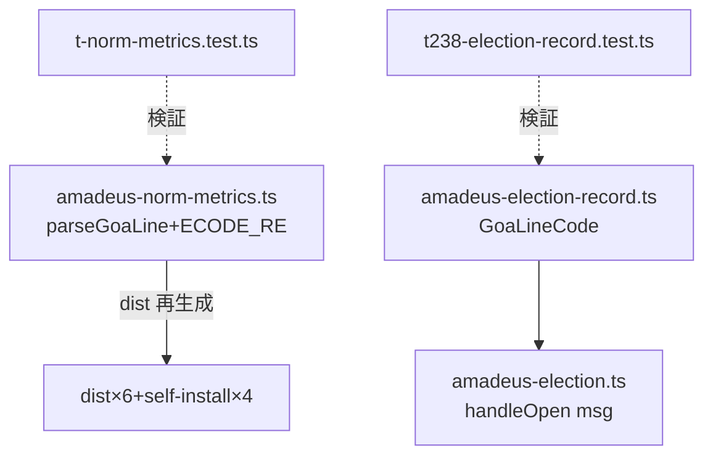

# Component Dependency — 260720-goa-sparse-family

上流入力(consumes 全数): requirements.md、architecture.md、component-inventory.md、team-practices.md

テキストフォールバック: norm-metrics(core 正本)→ dist 再生成面。record.ts(GoaLineCode)→ election.ts(handleOpen メッセージ)の1方向依存。テスト2本が各正本を検証。**norm-metrics 面と election 面は相互依存なし** — 同一 PR 同乗可(scope B-4 の独立性どおり)。外部依存: e2 #1267 面とは関数単位非交差(W-1)。

## 実装順序

B-1(裁定)済み → 本 AD → FD(スパース文法確定)→ CG 単一 Bolt(B-2/B-3/B-4 同乗)→ B&T。
