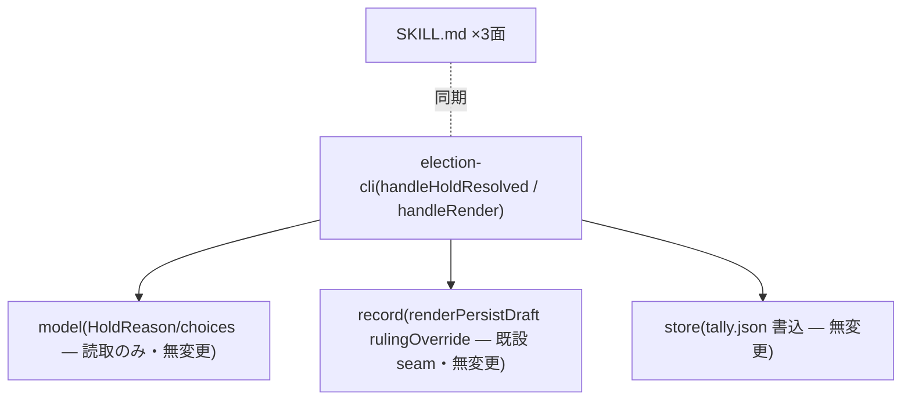

# Component Dependency — 260720-hold-choice-resolution

上流入力(consumes 全数): requirements.md、architecture.md、component-inventory.md、team-practices.md

## 依存(変更後も方向不変・循環なし)

テキストフォールバック: CLI → {model(読取), record(既設 param), store(既存書込)}。変更は CLI 単一ファイル+docs のみ — 依存辺の追加ゼロ。

## 並行 intent 境界

- e4 バッチ(record.ts GoaLineCode 面ほか): 本設計は record.ts 無変更へ設計を寄せた(rulingOverride は既設 param)— 関数どころかファイルレベルで非交差へ改善。election.ts は handleOpen(e4)と handleHoldResolved/handleRender(当方)で関数非交差維持。
- スコープ変動なし → 相互通知不要(合意条件の範囲内)。
