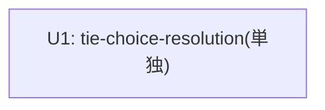

# Unit Dependency — 260720-hold-choice-resolution

上流入力(consumes 全数): requirements.md、components.md、component-methods.md、services.md、component-dependency.md、decisions.md — 依存判断は component-dependency.md の依存辺追加ゼロの実測と unit-of-work.md の単一 unit 判断から導出。

## Edge Block(parseBoltDag 用)

```yaml
units:
  - name: tie-choice-resolution
    depends_on: []
```

## 依存関係の判断

単一 unit・依存なし。並行 intent(e4 goa-sparse-family)とはファイルレベル非交差(record.ts 無変更設計 — AD ADR-2)。



テキストフォールバック: U1 のみ、辺なし。
