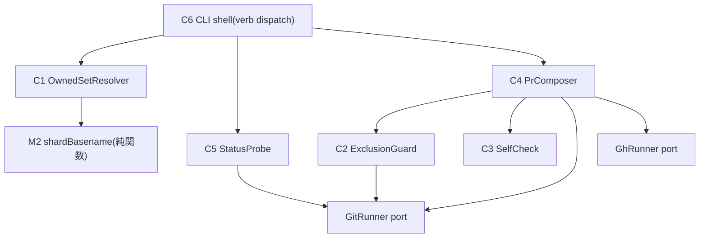

# Component Dependency — 260720-leader-store-sync

上流入力(consumes 全数): requirements, components, component-methods, architecture, component-inventory, team-practices — 依存方向は requirements.md NFR-3(fail-closed)と architecture.md 同定節、port 様式は component-inventory.md の GhRunner 台帳と team-practices.md の live 参照に依拠

## 依存グラフ

テキストフォールバック: C6→{C1,C5,C4}、C4→{C2,C3,GitRunner,GhRunner}、C1→M2、C2/C5→GitRunner。循環なし。port(GitRunner/GhRunner)は default param 注入で fake 差替(t232 帯様式)。

## 依存方向の制約

- 層別保証(モジュール別 — 一枚岩の断定を避ける): 判定純関数(M1 の列挙規則・M2・M3 の違反判定・M5 の検査述語・M7 の閾値判定)は port を保持しない。port 消費(副作用)は **C2(GIT — M4 restore)・C4(GIT+GH — branch/commit/PR)・C5(GIT — diff 計測)の3モジュール**に限定され、mermaid 図の port 向けエッジ4本(EX→GIT / PC→GIT / PC→GH / ST→GIT)と過不足なく対応する。C6(dispatch)は port を保持しない(コンポーネント呼び出しのみ)。
- packages/framework への import なし(scripts/ 自己完結 — no-canonical-direct-execution の構造回避、M2 は規則の自己完結実装+ドリフト検知テストで担保)。
